#### JVM架构

`Java`源码通过javac编译成`Java`字节码，`Java`字节码是`Java`虚拟机执行的一套代码格式，其抽象了计算机的基本操作。大多数指令只有一个字节，而有些操作符需要参数，导致多使用了一些字节。

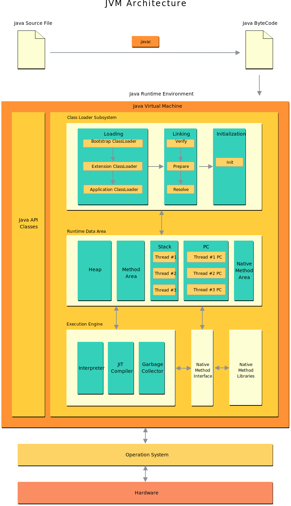

JVM 的基本架构如上图所示，其主要包含三个大块：

- **类加载器**：负责动态加载Java类到Java虚拟机的内存空间中；
- **运行时数据区**：存储JVM运行时所有数据；
- **执行引擎**：提供JVM在不同平台的运行能力。

补充：

在 JVM 中运行着许多线程，这里面有一部分是应用程序创建来执行代码逻辑的 **应用线程**，剩下的就是 JVM 创建来执行一些后台任务的 **系统线程**。

主要的系统线程有：

- **Compile Threads**：运行时将字节码编译为本地代码所使用的线程
- **GC Threads**：包含所有和 GC 有关操作
- **Periodic Task Thread**：JVM 周期性任务调度的线程，主要包含 JVM 内部的采样分析
- **Singal Dispatcher Thread**：处理 OS 发来的信号
- **VM Thread**：某些操作需要等待 JVM 到达 **安全点（Safe Point）**，即堆区没有变化。比如：GC 操作、线程 Dump、线程挂起 这些操作都在 VM Thread 中进行。

按照线程类型来分，在 JVM 内部有两种线程：

- `守护线程`：通常是由虚拟机自己使用，比如 GC 线程。但是，Java程序也可以把它自己创建的任何线程标记为守护线程（`public final void setDaemon(boolean on)`来设置，但必须在`start()`方法之前调用）。
- `非守护线程`：main方法执行的线程，我们通常也称为用户线程。

#### 运行时数据区

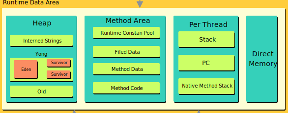

##### `PC Register`

对于每个 JVM 线程，当线程启动时，都会有一个独立的 **PC（Program Counter） 计数器**，用来保存当前执行的代码地址（方法区中的内存地址）。如果当前方法是 Native 方法，PC 的值为 NULL。一旦执行完成，PC 计数器会被更新为下一个需要执行代码的地址。

字节码解释器工作时通过改变这个计数器的值来选取下一条需要执行的字节码指令，分支、循环、跳转、异常处理、线程恢复等功能都需要依赖这个计数器来完成。

另外，**为了线程切换后能恢复到正确的执行位置，每条线程都需要有一个独立的程序计数器，各线程之间计数器互不影响，独立存储，我们称这类内存区域为"线程私有"的内存**。

程序计数器主要有两个作用：

1. 字节码解释器通过改变程序计数器来依次读取指令，从而实现代码的流程控制，如：顺序执行、选择、循环、异常处理。
2. 在多线程的情况下，程序计数器用于记录当前线程执行的位置，从而当线程被切换回来的时候能够知道该线程上次运行到哪儿了。

程序计数器是唯一一个不会出现 `OutOfMemoryError` 的内存区域，它的生命周期随着线程的创建而创建，随着线程的结束而死亡。

##### `JVM Stack`

与程序计数器一样，Java 虚拟机栈也是线程私有的，它的生命周期和线程相同。

每个 Java 方法在执行的同时会创建一个栈帧用于存储局部变量表(`Local Variable Array`)、操作数栈(Operand Stack)、常量池引用(Reference to Constant Pool)等信息。从方法调用直至执行完成的过程，对应着一个栈帧在 Java 虚拟机栈中入栈和出栈的过程。

**局部变量表主要存放了编译期可知的各种数据类型**（boolean、byte、char、short、int、float、long、double）、**对象引用**（reference 类型，它不同于对象本身，可能是一个指向对象起始地址的引用指针，也可能是指向一个代表对象的句柄或其他与此对象相关的位置）。

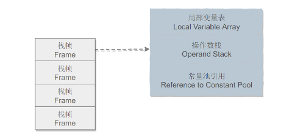

Java 虚拟机栈会出现两种错误：`StackOverFlowError` 和 `OutOfMemoryError`。

- 当线程请求的栈深度超过最大值，会抛出 StackOverflowError 异常；
- 栈进行动态扩展时如果无法申请到足够内存，会抛出 OutOfMemoryError 异常。

Java 虚拟机栈也是线程私有的，每个线程都有各自的 Java 虚拟机栈，而且随着线程的创建而创建，随着线程的死亡而死亡。

##### `Native Method Stack`

和虚拟机栈所发挥的作用非常相似，区别是： **虚拟机栈为虚拟机执行 Java 方法 （也就是字节码）服务，而本地方法栈则为虚拟机使用到的 Native 方法服务**。

本地方法被执行的时候，在本地方法栈也会创建一个栈帧，用于存放该本地方法的局部变量表、操作数栈、动态链接、出口信息。

方法执行完毕后相应的栈帧也会出栈并释放内存空间，也会出现 `StackOverFlowError` 和 `OutOfMemoryError` 两种错误。

##### `Heap`

Java 虚拟机所管理的内存中最大的一块，Java 堆是所有线程共享的一块内存区域，在虚拟机启动时创建。**此内存区域的唯一目的就是存放对象实例，几乎所有的对象实例以及数组都在这里分配内存**。但随着 JIT 编译器及逃逸分析技术的发展，**也可能会被优化为栈上分配**。

Java 堆是垃圾收集器管理的主要区域，因此也被称作**GC 堆（Garbage Collected Heap）**。从垃圾回收的角度，由于现在收集器基本都采用**分代垃圾收集算法**，所以 Java 堆还可以细分为：

- 新生代(Young Generation)：Eden空间、From Survivor、To Survivor空间。**大部分对象在Eden区中生成**。Survivor区总有一个是空的。
- 老年代(Old Generation)：老年代中保存一些生命周期较长的对象，当一个对象经过多次的 GC 后还没有被回收，那么它将被移动到老年代。

大部分情况，对象都会首先在 Eden 区域分配，在一次新生代垃圾回收后，如果对象还存活，则会进入 s0 或者 s1，并且对象的年龄还会加 1(Eden 区->Survivor 区后对象的初始年龄变为 1)，当它的年龄增加到一定程度（默认为 15 岁），就会被晋升到老年代中。

##### `Method Area`

方法区与 Java 堆一样，是各个线程共享的内存区域，它用于存储已被虚拟机加载的类信息、常量、静态变量、即时编译器编译后的代码等数据：

- ClassLoader Reference
- Runtime Constant Pool
  - 数字常量
  - 类属性引用
  - 方法引用
- Field Data：每个类属性的名称、类型等
- Methoad Data：每个方法的名称、返回值类型、参数列表等
- Methoad Code：每个方法的字节码、本地变量表等

对这块区域进行垃圾回收的主要目标是对常量池的回收和对类的卸载，但是一般比较难实现。

HotSpot 虚拟机把它当成永久代来进行垃圾回收。但很难确定永久代的大小，因为它受到很多因素影响，并且每次 Full GC 之后永久代的大小都会改变，所以经常会抛出 OutOfMemoryError 异常。**为了更容易管理方法区，从 JDK 1.8 开始，移除永久代，并把方法区移至元空间，它位于本地内存中，而不是虚拟机内存中**。

在 JDK 1.8 之后，原来永久代的数据被分到了堆和元空间中。**元空间存储类的元信息**，**静态变量和常量池等放入堆中**。

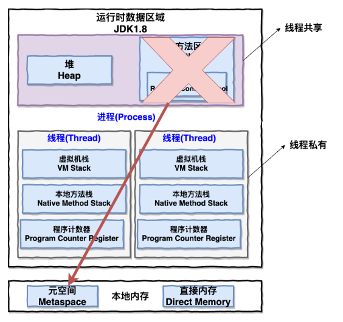

##### `Runtime Constant Pool`

运行时常量池是方法区的一部分。Class 文件中除了有类的版本、字段、方法、接口等描述信息外，还有常量池表（用于存放编译期生成的各种字面量和符号引用）。JDK1.8 hotspot移除了永久代用元空间(Metaspace)取而代之, 这时候字符串常量池还在堆, 运行时常量池还在方法区, 只不过方法区的实现从永久代变成了元空间(Metaspace)。

##### `Direct Memory`

直接内存并不是虚拟机运行时数据区的一部分，也不是虚拟机规范中定义的内存区域，但是这部分内存也被频繁地使用。而且也可能导致 OutOfMemoryError 错误出现。

JDK1.4 中新加入的 **NIO(New Input/Output) 类**，引入了一种基于**通道（Channel）** 与**缓存区（Buffer）** 的 I/O 方式，它可以直接使用 Native 函数库直接分配堆外内存，然后通过一个存储在 Java 堆中的 DirectByteBuffer 对象作为这块内存的引用进行操作。这样就能在一些场景中显著提高性能，因为**避免了在 Java 堆和 Native 堆之间来回复制数据**。

本机直接内存的分配不会受到 Java 堆的限制，但是，既然是内存就会受到本机总内存大小以及处理器寻址空间的限制。

#### 类加载机制

类是在运行期间第一次使用时动态加载的，而不是一次性加载所有类。因为如果一次性加载，那么会占用很多的内存。

##### 类的生命周期

一个类的完整生命周期如下：

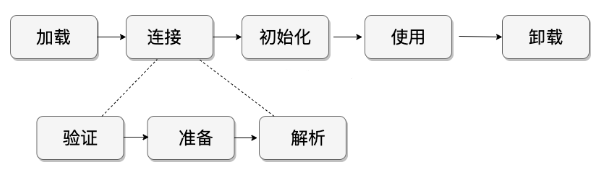

类加载器是 Java 运行时环境（Java Runtime Environment）的一部分，负责动态加载 Java 类到 Java 虚拟机的内存空间中。**类通常是按需加载，即第一次使用该类时才加载。** 由于有了类加载器，Java 运行时系统不需要知道文件与文件系统。每个 Java 类必须由某个类加载器装入到内存。


类装载器除了要定位和导入二进制 class 文件外，还必须负责验证被导入类的正确性，为变量分配初始化内存，以及帮助解析符号引用。这些动作必须严格按一下顺序完成：

1. **装载**：查找并装载类型的二进制数据。
2. **链接**：执行验证、准备、解析(可选) 
   - **验证**：确保被导入类型的正确性；
   - **准备**：为类变量分配内存，并将其初始化为默认值；
   - **解析**：把类型中的符号引用转换为直接引用。
3. **初始化**：把类变量初始化为正确的初始值。

##### 类加载过程

- **装载**：

  在Java虚拟机中存在多个类装载器，Java应用程序可以使用两种类装载器：

  - **Bootstrap ClassLoader**：此装载器是 Java 虚拟机实现的一部分。由原生代码（如C语言）编写，不继承自 `java.lang.ClassLoader` 。负责加载核心 Java 库，启动类装载器通常使用某种默认的方式从本地磁盘中加载类，包括 Java API。
  - **Extention Classloader**：用来在`<JAVA_HOME>/jre/lib/ext` ,或 `java.ext.dirs` 中指明的目录中加载 Java 的扩展库。 Java 虚拟机的实现会提供一个扩展库目录。
  - **Application Classloader**：根据 Java应用程序的类路径（ `java.class.path` 或 `CLASSPATH` 环境变量）来加载 Java 类。一般来说，Java 应用的类都是由它来完成加载的。可以通过 `ClassLoader.getSystemClassLoader()` 来获取它。
  - **自定义类加载器**：可以通过继承 `java.lang.ClassLoader` 类的方式实现自己的类加载器，以满足一些特殊的需求而不需要完全了解 Java 虚拟机的类加载的细节。

  **全盘负责双亲委托机制**：

  在一个 JVM 系统中，至少有 3 种类加载器，那么这些类加载器如何配合工作？在 JVM 种类加载器通过 全盘负责双亲委托机制来协调类加载器。

  - **全盘负责**：指当一个 `ClassLoader` 装载一个类的时，除非显式地使用另一个 `ClassLoader` ，该类所依赖及引用的类也由这个 `ClassLoader` 载入。
  - **双亲委托机制**：指先委托父装载器寻找目标类，只有在找不到的情况下才从自己的类路径中查找并装载目标类。

  **装载入口**：

  所有Java虚拟机实现必须在每个类或接口首次主动使用时初始化。以下六种情况符合主动使用的要求：

  - 当创建某个类的新实例时(new、反射、克隆、序列化)
  - 调用某个类的静态方法
  - 使用某个类或接口的静态字段，或对该字段赋值(用final修饰的静态字段除外，它被初始化为一个编译时常量表达式)
  - 当调用Java API的某些反射方法时。
  - 初始化某个类的子类时。
  - 当虚拟机启动时被标明为启动类的类。

  **父类需要在子类初始化之前被初始化**。当实现了接口的类被初始化的时候，不需要初始化父接口。然而，当实现了父接口的子类(或者是扩展了父接口的子接口)被装载时，父接口也要被装载。(只是被装载，没有初始化)

  **加载过程完成以下三件事**：

  - 通过类的完全限定名称获取定义该类的二进制字节流。
  - 将该字节流表示的静态存储结构转换为方法区的运行时存储结构。
  - 在内存中生成一个代表该类的 Class 对象，作为方法区中该类各种数据的访问入口。

- **验证**：

  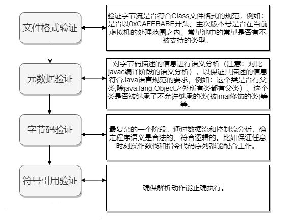

- **准备**：

  在准备阶段，Java虚拟机为类变量分配内存，**设置默认初始值**。但在到到初始化阶段之前，类变量都没有被初始化为真正的初始值，使用的是方法区的内存。

  这时候进行内存分配的仅包括类变量（static），而不包括实例变量，实例变量会在对象实例化时随着对象一块分配在 Java 堆中。

  实例变量不会在这阶段分配内存，它会在对象实例化时随着对象一起被分配在堆中。应该注意到，**实例化不是类加载的一个过程，类加载发生在所有实例化操作之前，并且类加载只进行一次，实例化可以进行多次**。

  初始值一般为 0 值，例如下面的类变量 value 被初始化为 0 而不是 123。

  ```java
  public static int value = 123;
  ```

  如果类变量是常量，那么它将初始化为表达式所定义的值而不是 0。例如下面的常量 value 被初始化为 123 而不是 0。

  ```java
  public static final int value = 123;
  ```

- **解析**：

  解析阶段是**虚拟机将常量池内的符号引用替换为直接引用的过程**。解析动作主要针对类或接口、字段、类方法、接口方法、方法类型、方法句柄和调用限定符7类符号引用进行。

  - `类或接口的解析`：判断所要转化成的直接引用是数组类型，还是普通的对象类型的引用，从而进行不同的解析。
  - `字段解析`：对字段进行解析时，会先在本类中查找是否包含有简单名称和字段描述符都与目标相匹配的字段，如果有，则查找结束；如果没有，则会按照继承关系从上往下递归搜索该类所实现的各个接口和它们的父接口，还没有，则按照继承关系从上往下递归搜索其父类，直至查找结束，

- **初始化**：

  **所有的类变量(即静态量)初始化语句和类型的静态初始化器都被Java编译器收集在一起，放到一个特殊的方法中。** 对于类来说，这个方法被称作类初始化方法；对于接口来说，它被称为接口初始化方法。在类和接口的 class 文件中，这个方法被称为`<clinit>`。

  1. 如果存在直接父类，且直接父类没有被初始化，先初始化直接父类。
  2. 如果类存在一个类初始化方法，执行此方法。

  这个步骤是递归执行的，即第一个初始化的类一定是`Object`。

  **Java虚拟机必须确保初始化过程被正确地同步。** 如果多个线程需要初始化一个类，仅仅允许一个线程来进行初始化，其他线程需等待。

  <clinit>() 是由编译器自动收集类中所有类变量的赋值动作和静态语句块中的语句合并产生的，编译器收集的顺序由语句在源文件中出现的顺序决定。特别注意的是，静态语句块只能访问到定义在它之前的类变量，定义在它之后的类变量只能赋值，不能访问。例如以下代码：

  ```java
  public class Test {
      static {
          i = 0;                // 给变量赋值可以正常编译通过
          System.out.print(i);  // 这句编译器会提示“非法向前引用”
      }
      static int i = 1;
  }
  ```

  由于父类的 <clinit>() 方法先执行，也就意味着父类中定义的静态语句块的执行要优先于子类。例如以下代码：

  ```java
  static class Parent {
      public static int A = 1;
      static {
          A = 2;
      }
  }
  
  static class Sub extends Parent {
      public static int B = A;
  }
  
  public static void main(String[] args) {
       System.out.println(Sub.B);  // 2
  }
  ```

##### 类初始化时机

虚拟机规范中并没有强制约束何时进行加载，但是规范严格规定了有且只有下列五种情况必须对类进行初始化（加载、验证、准备都会随之发生）：

- 遇到 new、getstatic、putstatic、invokestatic 这四条字节码指令时，如果类没有进行过初始化，则必须先触发其初始化。
  - 当jvm执行new指令时会初始化类。即当程序创建一个类的实例对象。
  - 当jvm执行getstatic指令时会初始化类。即程序访问类的静态变量(不是静态常量，常量会被加载到运行时常量池)。
  - 当jvm执行putstatic指令时会初始化类。即程序给类的静态变量赋值。
  - 当jvm执行invokestatic指令时会初始化类。即程序调用类的静态方法。
- 使用 java.lang.reflect 包的方法对类进行反射调用的时候，如果类没有进行初始化，则需要先触发其初始化。
- 当初始化一个类的时候，如果发现其父类还没有进行过初始化，则需要先触发其父类的初始化。
- 当虚拟机启动时，用户需要指定一个要执行的主类（包含 main() 方法的那个类），虚拟机会先初始化这个主类；
- MethodHandle和VarHandle可以看作是轻量级的反射调用机制，而要想使用这2个调用， 就必须先使用findStaticVarHandle来初始化要调用的类。

##### 类加载器

JVM 中内置了三个重要的 ClassLoader，除了 BootstrapClassLoader 其他类加载器均由 Java 实现且全部继承自`java.lang.ClassLoader`：

1. **BootstrapClassLoader(启动类加载器)** ：最顶层的加载类，由C++实现，负责加载 `%JAVA_HOME%/lib`目录下的jar包和类或者或被 `-Xbootclasspath`参数指定的路径中的所有类。
2. **ExtensionClassLoader(扩展类加载器)** ：主要负责加载目录 `%JRE_HOME%/lib/ext` 目录下的jar包和类，或被 `java.ext.dirs` 系统变量所指定的路径下的jar包。
3. **AppClassLoader(应用程序类加载器)** :面向我们用户的加载器，负责加载当前应用classpath下的所有jar包和类。由于这个类加载器是 ClassLoader 中的 getSystemClassLoader() 方法的返回值，因此一般称为系统类加载器。它负责加载用户类路径（ClassPath）上所指定的类库，开发者可以直接使用这个类加载器，如果应用程序中没有自定义过自己的类加载器，一般情况下这个就是程序中默认的类加载器。

##### 双亲委派模型

每一个类都有一个对应它的类加载器。系统中的 ClassLoder 在协同工作的时候会默认使用 **双亲委派模型** 。即在类加载的时候，系统会首先判断当前类是否被加载过。已经被加载的类会直接返回，否则才会尝试加载。加载的时候，首先会把该请求委派该父类加载器的 `loadClass()` 处理，因此所有的请求最终都应该传送到顶层的启动类加载器 `BootstrapClassLoader` 中。当父类加载器无法处理时，才由自己来处理。当父类加载器为null时，会使用启动类加载器 `BootstrapClassLoader` 作为父类加载器。


##### 双亲委派模型的好处

双亲委派模型保证了Java程序的稳定运行，可以避免类的重复加载（JVM 区分不同类的方式不仅仅根据类名，相同的类文件被不同的类加载器加载产生的是两个不同的类），也保证了 Java 的核心 API 不被篡改。如果没有使用双亲委派模型，而是每个类加载器加载自己的话就会出现一些问题，比如我们编写一个称为 `java.lang.Object` 类的话，那么程序运行的时候，系统就会出现多个不同的 `Object` 类。

##### 对象的创建

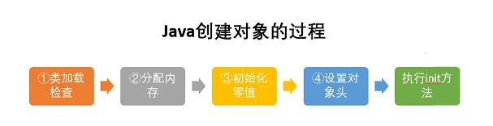

1. 类加载检查：

   虚拟机遇到一条 new 指令时，首先将去检查这个指令的参数是否能在常量池中定位到这个类的符号引用，并且检查这个符号引用代表的类是否已被加载过、解析和初始化过。如果没有，那必须先执行相应的类加载过程。

2. 分配内存

   在类加载检查通过后，接下来虚拟机将为新生对象分配内存。对象所需的内存大小在类加载完成后便可确定，为对象分配空间的认为u等同于把一块确定大小的内存从Java堆中划分出来。分配内存有`指针碰撞`和`空闲列表`两种，选择哪种分配方式由`Java`堆是否规整决定，而`Java`堆是否规整又由所采用的垃圾收集器是否带有压缩整理功能决定。

   而 Java 堆内存是否规整，取决于 GC 收集器的算法是"**标记-清除**"，还是"**标记-整理**"（也称作"标记-压缩"），值得注意的是，复制算法内存也是规整的。

   在创建对象的时候有一个很重要的问题，就是线程安全，因为在实际开发过程中，创建对象是很频繁的事情，作为虚拟机来说，必须要保证线程是安全的，通常来讲，虚拟机采用两种方式来保证线程安全：

   - **CAS+失败重试：** CAS 是乐观锁的一种实现方式。所谓乐观锁就是，每次不加锁而是假设没有冲突而去完成某项操作，如果因为冲突失败就重试，直到成功为止。**虚拟机采用 CAS 配上失败重试的方式保证更新操作的原子性。**
   - **TLAB：** 为每一个线程预先在 Eden 区分配一块儿内存，JVM 在给线程中的对象分配内存时，首先在 TLAB 分配，当对象大于 TLAB 中的剩余内存或 TLAB 的内存已用尽时，再采用上述的 CAS 进行内存分配

3. 初始化零值

   内存分配完成后，虚拟机需要将分配到的内存空间都初始化为零值（不包括对象头），这一步操作保证了对象的实例字段在 Java 代码中可以不赋初始值就直接使用，程序能访问到这些字段的数据类型所对应的零值。

4. 设置对象头

   初始化零值完成之后，**虚拟机要对对象进行必要的设置**，例如这个对象是哪个类的实例、如何才能找到类的元数据信息、对象的哈希码、对象的 GC 分代年龄等信息。 **这些信息存放在对象头中。** 另外，根据虚拟机当前运行状态的不同，如是否启用偏向锁等，对象头会有不同的设置方式。

5. 执行`init`方法

   在上面工作都完成之后，从虚拟机的视角来看，一个新的对象已经产生了，但从 Java 程序的视角来看，对象创建才刚开始，`<init>` 方法还没有执行，所有的字段都还为零。所以一般来说，执行 new 指令之后会接着执行 `<init>` 方法，把对象按照程序员的意愿进行初始化，这样一个真正可用的对象才算完全产生出来。

#### JVM垃圾回收

垃圾收集主要是针对**堆和方法区**进行。程序计数器、虚拟机栈和本地方法栈这三个区域属于线程私有的，只存在于线程的生命周期内，线程结束之后就会消失，因此不需要对这三个区域进行垃圾回收。

Java 堆是垃圾收集器管理的主要区域，因此也被称作**GC 堆（Garbage Collected Heap）**.从垃圾回收的角度，由于现在收集器基本都采用分代垃圾收集算法，所以 Java 堆还可以细分为：新生代和老年代：再细致一点有：Eden 空间、From Survivor、To Survivor 空间等。**进一步划分的目的是更好地回收内存，或者更快地分配内存**。

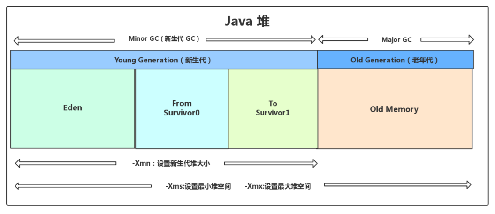

##### 对象存活检测

1. 引用计数算法

   给对象中添加一个引用计数器，每当有一个地方引用它，计数器就加 1；当引用失效，计数器就减 1；任何时候计数器为 0 的对象就是不可能再被使用的。

   **这个方法实现简单，效率高，但是目前主流的虚拟机中并没有选择这个算法来管理内存，其最主要的原因是它很难解决对象之间相互循环引用的问题。** 

   所谓对象之间的相互引用问题，如下面代码所示：除了对象 objA 和 objB 相互引用着对方之外，这两个对象之间再无任何引用。但是他们因为互相引用对方，导致它们的引用计数器都不为 0，于是引用计数算法无法通知 GC 回收器回收他们。

   ```java
   public class Test {
       public Object instance = null;
       
       public static void main(String[] args) {
           Test a = new Test();
           Test b = new Test();
           a.instance = b;
           b.instance = a;
           a = null;
           b = null;
           doSomething();
       }
   }
   ```

   在上述代码中，a 与 b 引用的对象实例互相持有了对象的引用，因此当我们把对 a 对象与 b 对象的引用去除之后，由于两个对象还存在互相之间的引用，导致两个 Test 对象无法被回收。

2. **可达性分析算法**

   以 GC Roots 为起始点进行搜索，可达的对象都是存活的，不可达的对象可被回收。

   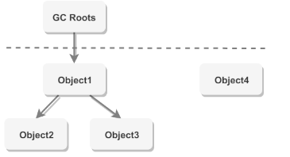

   可作为 GC Roots 的对象包括下面几种:

   - 虚拟机栈(栈帧中的本地变量表)中引用的对象
   - 本地方法栈(Native 方法)中引用的对象
   - 方法区中类静态属性引用的对象
   - 方法区中常量引用的对象
   - 所有被同步锁持有的对象

##### 引用类型

无论是通过引用计数算法判断对象的引用数量，还是通过可达性分析算法判断对象是否可达，判定对象是否可被回收都与引用有关。

Java 提供了四种强度不同的引用类型。

1. 强引用

   被强引用关联的对象不会被回收。

   使用 new 一个新对象的方式来创建强引用。

   ```java
   Object obj = new Object();
   ```

2. 软引用

   被软引用关联的对象只有在内存不够的情况下才会被回收。

   使用 SoftReference 类来创建软引用。

   ```java
   Object obj = new Object();
   SoftReference<Object> sf = new SoftReference<Object>(obj);
   obj = null;  // 使对象只被软引用关联
   ```

3. 弱引用

   被弱引用关联的对象一定会被回收，也就是说它只能存活到下一次垃圾回收发生之前。

   使用 WeakReference 类来创建弱引用。

   ```java
   Object obj = new Object();
   WeakReference<Object> wf = new WeakReference<Object>(obj);
   obj = null;
   ```

4. 虚引用

   又称为幽灵引用或者幻影引用，一个对象是否有虚引用的存在，不会对其生存时间造成影响，也无法通过虚引用得到一个对象。

   为一个对象设置虚引用的唯一目的是能在这个对象被回收时收到一个系统通知。

   使用 PhantomReference 来创建虚引用。

   ```java
   Object obj = new Object();
   PhantomReference<Object> pf = new PhantomReference<Object>(obj, null);
   obj = null;
   ```

##### 垃圾回收算法

1. 标记-清除算法

   该算法分为“标记”和“清除”阶段：首先标记出所有不需要回收的对象，在标记完成后统一回收掉所有没有被标记的对象。它是最基础的收集算法，后续的算法都是对其不足进行改进得到。这种垃圾收集算法会带来两个明显的问题：

   - 效率问题
   - 空间问题（标记清楚会产生大量不连续的碎片）

   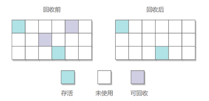

2. 标记-整理算法

   让所有存活的对象都向一端移动，然后直接清理掉端边界以外的内存。

   优点：不会产生内存碎片；

   不足：需要移动大量对象，处理效率比较低。

   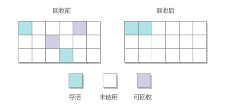

3. 复制算法

   将内存划分为大小相等的两块，每次只使用其中一块，当这一块内存用完了就将还存活的对象复制到另一块上面，然后再把使用过的内存空间进行一次清理。

   主要不足是只使用了内存的一半。

   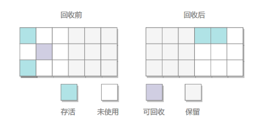

   现在的商业虚拟机都采用这种收集算法回收**新生代**，但是并不是划分为大小相等的两块，而是一块较大的 Eden 空间和两块较小的 Survivor 空间，每次使用 Eden 和其中一块 Survivor。在回收时，将 Eden 和 Survivor 中还存活着的对象全部复制到另一块 Survivor 上，最后清理 Eden 和使用过的那一块 Survivor。

   HotSpot 虚拟机的 Eden 和 Survivor 大小比例默认为 8:1，保证了内存的利用率达到 90%。如果每次回收有多于 10% 的对象存活，那么一块 Survivor 就不够用了，此时需要依赖于老年代进行空间分配担保，也就是借用老年代的空间存储放不下的对象。

4. 分代收集算法

   现在的商业虚拟机采用分代收集算法，它根据对象存活周期将内存划分为几块，不同块采用适当的收集算法。

   般将堆分为新生代和老年代。

   - 新生代使用：复制算法
   - 老年代使用：标记 - 清除 或者 标记 - 整理 算法

##### 垃圾回收器

1. Serial收集器

   Serial（串行）收集器是最基本、历史最悠久的垃圾收集器了。大家看名字就知道这个收集器是一个单线程收集器了。它的 **“单线程”** 的意义不仅仅意味着它只会使用一条垃圾收集线程去完成垃圾收集工作，更重要的是**它在进行垃圾收集工作的时候必须暂停其他所有的工作线程**（ **"Stop The World"** ），直到它收集结束。

   **新生代采用标记-复制算法，老年代采用标记-整理算法**。

   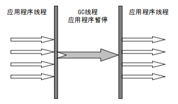

   由于`Stop The World`带来的不良用户体验，所以在后续的垃圾收集器设计中停顿时间在不断缩短。

2. ParNew收集器

   **ParNew 收集器其实就是 Serial 收集器的多线程版本，除了使用多线程进行垃圾收集外，其余行为（控制参数、收集算法、回收策略等等）和 Serial 收集器完全一样**。

   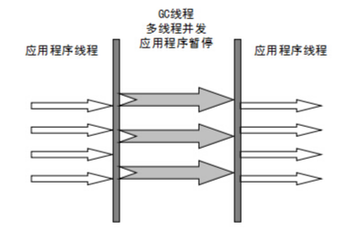

   

3. Parallel Scavenge收集器

   Parallel Scavenge 收集器也是使用标记-复制算法的多线程收集器，它看上去几乎和 ParNew 都一样。 

   其它收集器目标是尽可能缩短垃圾收集时用户线程的停顿时间，而它的目标是达到一个可控制的吞吐量，因此它被称为“吞吐量优先”收集器。这里的吞吐量指 CPU 用于运行用户程序的时间占总时间的比值。

4. Serial Old收集器

   **Serial 收集器的老年代版本**，它同样是一个单线程收集器。它主要有两大用途：一种用途是在 JDK1.5 以及以前的版本中与 Parallel Scavenge 收集器搭配使用，另一种用途是作为 CMS 收集器的后备方案。

5. Parallel Old收集器

   **Parallel Scavenge 收集器的老年代版本**。使用多线程和“标记-整理”算法。在注重吞吐量以及 CPU 资源的场合，都可以优先考虑 Parallel Scavenge 收集器和 Parallel Old 收集器。

6. CMS收集器

   CMS（Concurrent Mark Sweep），Mark Sweep 指的是标记 - 清除算法。它是一种以获**取最短回收停顿时间为目标的收集器**。它非常符合在注重用户体验的应用上使用。

   从名字中的**Mark Sweep**这两个词可以看出，CMS 收集器是一种 “**标记-清除**”算法实现的，它的运作过程相比于前面几种垃圾收集器来说更加复杂一些。整个过程分为四个步骤：

   - **初始标记：** 暂停所有的其他线程，并记录下直接与 root 相连的对象，速度很快 ；
   - **并发标记：** 同时开启 GC 和用户线程，用一个闭包结构去记录可达对象。但在这个阶段结束，这个闭包结构并不能保证包含当前所有的可达对象。因为用户线程可能会不断的更新引用域，所以 GC 线程无法保证可达性分析的实时性。所以这个算法里会跟踪记录这些发生引用更新的地方。
   - **重新标记：** 重新标记阶段就是为了修正并发标记期间因为用户程序继续运行而导致标记产生变动的那一部分对象的标记记录，这个阶段的停顿时间一般会比初始标记阶段的时间稍长，远远比并发标记阶段时间短
   - **并发清除：** 开启用户线程，同时 GC 线程开始对未标记的区域做清扫。

   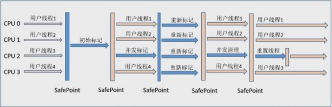

   从它的名字就可以看出它是一款优秀的垃圾收集器，主要优点：**并发收集、低停顿**。但是它有下面三个明显的缺点：

   - 对 CPU 资源敏感**；**
   - 无法处理浮动垃圾；
   - 它使用的回收算法-“标记-清除”算法会导致收集结束时会有大量空间碎片产生。

7. G1收集器

   **G1 (Garbage-First) 是一款面向服务器的垃圾收集器,主要针对配备多颗处理器及大容量内存的机器. 以极高概率满足 GC 停顿时间要求的同时,还具备高吞吐量性能特征**。

   堆被分为新生代和老年代，其它收集器进行收集的范围都是整个新生代或者老年代，而 G1 可以直接对新生代和老年代一起回收。

   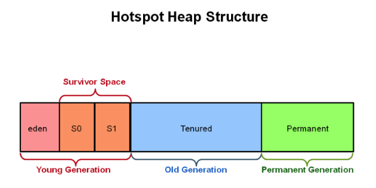

   - **并行与并发**：G1 能充分利用 CPU、多核环境下的硬件优势，使用多个 CPU（CPU 或者 CPU 核心）来缩短 Stop-The-World 停顿时间。部分其他收集器原本需要停顿 Java 线程执行的 GC 动作，G1 收集器仍然可以通过并发的方式让 java 程序继续执行。
   - **分代收集**：虽然 G1 可以不需要其他收集器配合就能独立管理整个 GC 堆，但是还是保留了分代的概念。
   - **空间整合**：与 CMS 的“标记-清理”算法不同，G1 从整体来看是基于“标记-整理”算法实现的收集器；从局部上来看是基于“标记-复制”算法实现的。
   - **可预测的停顿**：这是 G1 相对于 CMS 的另一个大优势，降低停顿时间是 G1 和 CMS 共同的关注点，但 G1 除了追求低停顿外，还能建立可预测的停顿时间模型，能让使用者明确指定在一个长度为 M 毫秒的时间片段内。

   G1 收集器的运作大致分为以下几个步骤：

   - 初始标记
   - 并发标记
   - 最终标记
   - 筛选回收

   **G1 收集器在后台维护了一个优先列表，每次根据允许的收集时间，优先选择回收价值最大的 Region(这也就是它的名字 Garbage-First 的由来)** 。这种使用 Region 划分内存空间以及有优先级的区域回收方式，保证了 G1 收集器在有限时间内可以尽可能高的收集效率（把内存化整为零）。

##### 内存分配和回收策略

`Minor GC` 和 `Full GC`：

- Minor GC：回收新生代，因为新生代对象存活时间很短，因此 Minor GC 会频繁执行，执行的速度一般也会比较快。
- Full GC：回收老年代和新生代，老年代对象其存活时间长，因此 Full GC 很少执行，执行速度会比 Minor GC 慢很多。

内存分配策略：

1. 对象优先在 Eden 分配，大多数情况下，对象在新生代 Eden 上分配，当 Eden 空间不够时，发起 Minor GC。

2. 大对象直接进入老年代，大对象是指需要连续内存空间的对象，最典型的大对象是那种很长的字符串以及数组。经常出现大对象会提前触发垃圾收集以获取足够的连续空间分配给大对象。

3. 长期存活的对象进入老年代，为对象定义年龄计数器，对象在 Eden 出生并经过 Minor GC 依然存活，将移动到 Survivor 中，年龄就增加 1 岁，增加到一定年龄则移动到老年代中。

4. 动态对象年龄判定，虚拟机并不是永远要求对象的年龄必须达到 MaxTenuringThreshold 才能晋升老年代，如果在 Survivor 中相同年龄所有对象大小的总和大于 Survivor 空间的一半，则年龄大于或等于该年龄的对象可以直接进入老年代，无需等到 MaxTenuringThreshold 中要求的年龄。

5. 空间分配担保

   在发生 Minor GC 之前，虚拟机先检查老年代最大可用的连续空间是否大于新生代所有对象总空间，如果条件成立的话，那么 Minor GC 可以确认是安全的。

   如果不成立的话虚拟机会查看 HandlePromotionFailure 的值是否允许担保失败，如果允许那么就会继续检查老年代最大可用的连续空间是否大于历次晋升到老年代对象的平均大小，如果大于，将尝试着进行一次 Minor GC；如果小于，或者 HandlePromotionFailure 的值不允许冒险，那么就要进行一次 Full GC。