#### Java线程

**线程定义**：

**线程（Thread）是操作系统能够进行运算调度的最小单位**。它被包含在进程之中，是进程中的实际运作单位。一条线程指的是进程中一个单一顺序的控制流，一个进程中可以并发多个线程，每条线程并行执行不同的任务。 

**线程是独立调度和分派的基本单位**。 

同一进程中的多条线程将**共享该进程中的全部系统资源**，如虚拟地址空间，文件描述符和信号处理等等。但同一进程中的多个线程有各自的调用栈（`call stack`），自己的寄存器环境（`register context`），自己的线程本地存储（`thread-local storage`）。 

##### 线程与进程的区别

- 进程是程序的一次执行过程，是系统运行程序的基本单位，因此进程是动态的。系统运行一个程序即是一个进程从创建，运行到消亡的过程。在 Java 中，当我们启动 main 函数时其实就是启动了一个 JVM 的进程，而 main 函数所在的线程就是这个进程中的一个线程，也称主线程。
- 线程与进程相似，但线程是一个比进程更小的执行单位。一个进程在其执行的过程中可以产生多个线程。与进程不同的是同类的多个线程共享进程的**堆**和**方法区**资源，但每个线程有自己的**程序计数器**、**虚拟机栈**和**本地方法栈**，所以系统在产生一个线程，或是在各个线程之间作切换工作时，负担要比进程小得多，也正因为如此，线程也被称为轻量级进程。 

 JVM 角度说进程和线程之间的关系：

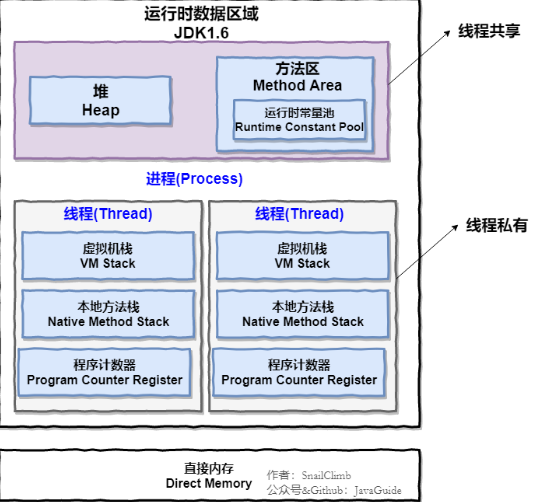

可以看出，一个进程可以有多个线程，多个线程共享进程的`堆`和`方法区`（JDK1.8之后的元空间），但是每个线程有自己的程序计数器，虚拟机栈和本地方法栈。

- 为什么程序计数器是私有的？

  程序计数器的两个作用：

  - 字节码解释器通过改变程序计数器来依次读取指令，从而实现代码的流程控制，如：顺序执行、选择、循环、异常处理等。
  - 在多线程的情况下，程序计数器用于记录当前线程执行的位置，从而当线程被切换回来的时候能够知道该线程上次运行到哪儿了。

  如果执行的是`native`方法，那么程序计数器记录的是`undefined`地址，只有执行Java代码是程序计数器记录的才是下一条指令的地址。

  所以程序计数器私有主要是为了**线程切换后能恢复到正确的执行位置**。

- 为什么虚拟机栈和本地方法栈是私有的？

  - 虚拟机栈：**每个Java方法在执行的同时会创建一个栈帧用于存储局部遍历表，操作数栈，常量池引用等信息**。从方法调用直至完成的过程，就对应者一个栈在Java虚拟机栈中入栈和出栈的过程。
  - 本地方法栈：和虚拟机栈所发挥的作用非常相似，区别是： **虚拟机栈为虚拟机执行 Java 方法 （也就是字节码）服务，而本地方法栈则为虚拟机使用到的 Native 方法服务。** 

  所以，为了**保证线程中的局部变量不被别的线程访问到，虚拟机栈和本地方法栈是私有的**。

- 为什么堆和方法区是共享的？

  堆和方法区是所有线程共享的资源，其中堆是进程中最大的一块内存，主要用于存放新创建的对象 (几乎所有对象都在这里分配内存)，方法区主要用于存放**已被加载的类信息、常量、静态变量、即时编译器编译后的代码**等数据。 

##### 线程实现

Java中的线程都是调用的原生系统的本地函数，**Java线程模型是基于操作系统原生线程模型实现的**，实现线程有三种方式：`内核线程实现`、`用户线程实现`、`混合线程实现`。 

- 内核线程实现

  直接由操作系统内核支持的线程，通过内核来完成进程切换。每个内核线程就是一个内核的分身，这样操作系统就可以同时处理多件事情，支持多线程的内核被称为多线程内核。

  程序一般不直接使用内核线程，而是使用一种高级接口——轻量级进程，轻量级进程就是我们通常意义上的线程，可以获得内核线程的支持，与内核线程构成`1:1`的线程模型。 

  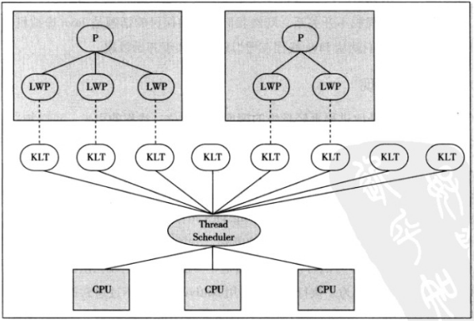

  由于得到内核线程的支持，每个轻量级进程都成为一个独立的调度单元，即时有一个轻量级进程在系统调用中阻塞，也不会影响整个进程，但也有其局限性：由于是基于内核线程实现的，各种操作，如创建、销毁及同步，都需要进行系统调用。而系统调用代价较高，需要在内核态和用户态来回切换。 

- 用户线程实现

  从广义上说，一个线程不是内核线程，就是用户线程，所以轻量级进程也属于用户线程。狭义的用户线程是指完全建立在用户空间上的，系统内核不能感知到其存在。用户线程的创建、同步、销毁和调度都是在用户空间实现的，因此相对较快，代价相对较低。这种用户线程和进程是`N:1`的线程模型。 

  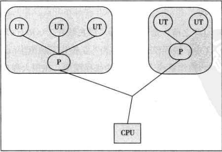

  由于用户线程没有内核的支持，线程的创建、切换和调度是需要自己实现的，而且由于操作系统只把CPU资源分配到进程，那诸如“阻塞如何处理”、“多处理器系统中如何将线程映射到其他处理器”这类问题解决起来异常复杂。 

- 混合线程实现

  这种实现模式将内核线程与用户线程一起使用，在这种方式下既存在用户线程，也存在轻量级进程。用户线程还是完全建立在用户空间，因此用户线程的创建、切换等操作依旧低廉。而操作系统提供的轻量级进程则作为用户线程和内核线程的桥梁，这样就可以使用内核提供的线程调度及处理器映射。这种实现下，用户线程和轻量级进程是`M:N`的模式。 

  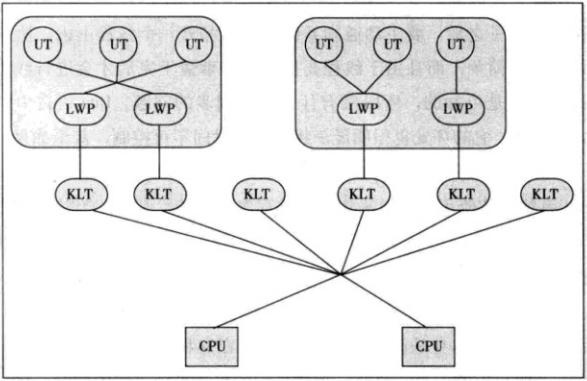

##### Java线程状态切换

Java线程模型定义了 6 种状态，在任意一个时间点，一个线程有且只有其中一个状态： 

- `新建（New）`：新建的Thread，尚未开始。
- `运行（Runable）`：包含操作系统线程状态中的Running、Ready，也就是处于正在执行或正在等待CPU分配时间的状态。
- `无限期等待（Waiting）`：处于这种状态的线程不会被分配CPU时间，等待其他线程唤醒。
- `限期等待（Timed Waiting）`：处于这种状态的线程不会被分配CPU时间，在一定时间后会由系统自动唤醒。
- `阻塞（Blocked）`：在等待获得排他锁。
- `结束（Terminated）`：已终止的线程。

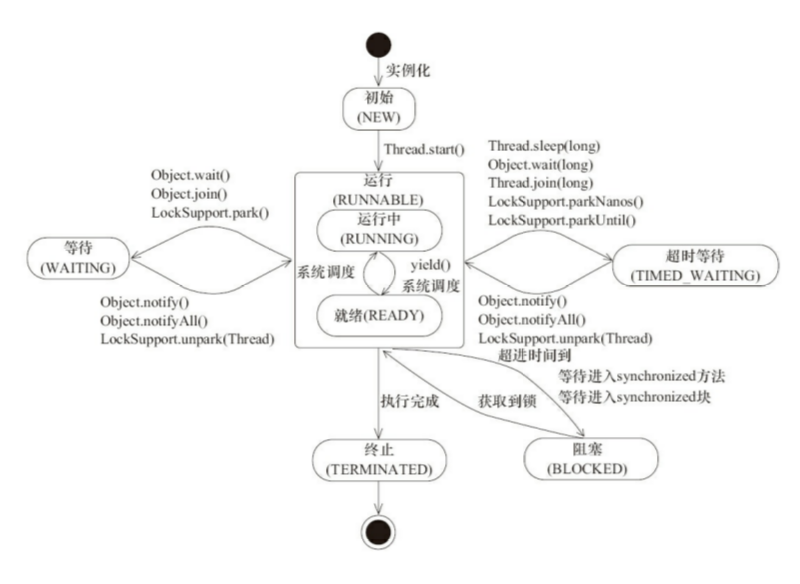

##### 使用线程

有三种使用线程的方法：

实现 Runnable 和 Callable 接口的类只能当做一个可以在线程中运行的任务，不是真正意义上的线程，因此最后还需要通过 Thread 来调用。可以理解为任务是通过线程驱动从而执行的。 

- 实现 Runnable 接口；

  需要实现接口中的 run() 方法：

  ```java
  public class MyRunnable implements Runnable {
      @Override
      public void run() {
          // ...
      }
  }
  
  public static void main(String[] args) {
      MyRunnable instance = new MyRunnable();
      Thread thread = new Thread(instance);
      thread.start();
  }
  ```

- 实现 Callable 接口：

  与`Runnable`相比，`Callable`可以有返回值，返回值通过`FutureTask`进行封装。

  ```java
  public class MyCallable implements Callable<Integer> {
      public Integer call() {
          return 123;
      }
  }
  
  public static void main(String[] args) throws ExecutionException, InterruptedException {
      MyCallable mc = new MyCallable();
      FutureTask<Integer> ft = new FutureTask<>(mc);
      Thread thread = new Thread(ft);
      thread.start();
      System.out.println(ft.get());
  }
  ```

- 继承 Thread 类：

  同样也是需要实现 run() 方法，因为 Thread 类也实现了 Runable 接口。

  当调用 start() 方法启动一个线程时，虚拟机会将该线程放入就绪队列中等待被调度，当一个线程被调度时会执行该线程的 run() 方法。

  ```java
  public class MyThread extends Thread {
      public void run() {
          // ...
      }
  }
  
  public static void main(String[] args) {
      MyThread mt = new MyThread();
      mt.start();
  }
  ```

为什么调用`start()`方法时会执行`run()`方法，为什么不直接调用`run()`方法？

- new 一个 Thread，线程进入了新建状态。调用 `start()`方法，会启动一个线程并使线程进入了就绪状态，当分配到时间片后就可以开始运行了。 `start()` 会执行线程的相应准备工作，然后自动执行 `run()` 方法的内容，这是真正的多线程工作。 
- 直接执行 `run()` 方法，会把 `run()` 方法当成一个 main 线程下的普通方法去执行，并不会在某个线程中执行它，所以这并不是多线程工作。 

`sleep()`和`wait()`方法区别和共同点：

- 区别：
  - `sleep()` 方法没有释放锁，而 `wait()` 方法释放了锁
  - `sleep() `通常被用于暂停执行，`wait()` 通常被用于线程间交互/通信。
  -  `sleep() `方法执行完成后，线程会自动苏醒。`wait()` 方法被调用后，线程不会自动苏醒，需要别的线程调用同一个对象上的 `notify() `或者 `notifyAll()` 方法，或者可以使用 `wait(long timeout)` 超时后线程会自动苏醒。 
- 相同点：
  - 两者都可以暂停线程的执行。

##### 上下文切换

多线程编程中一般线程的个数都大于 CPU 核心的个数，而一个 CPU 核心在任意时刻只能被一个线程使用，为了让这些线程都能得到有效执行，CPU 采取的策略是为每个线程分配时间片并轮转的形式。当一个线程的时间片用完的时候就会重新处于就绪状态让给其他线程使用，这个过程就属于一次上下文切换。 

概括来说就是：**当前任务在执行完 CPU 时间片切换到另一个任务之前会先保存自己的状态，以便下次再切换回这个任务时，可以再加载这个任务的状态**。**任务从保存到再加载的过程就是一次上下文切换**。 

#### 死锁

线程死锁描述的是这样一种情况：多个线程同时被阻塞，它们中的一个或者全部都在等待某个资源被释放。由于线程被无限期地阻塞，因此程序不可能正常终止。

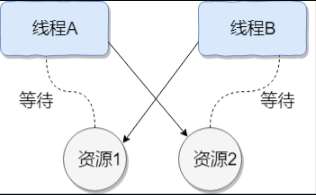

例子：

```java
public class DeadLockDemo {
    private static Object resource1 = new Object();//资源 1
    private static Object resource2 = new Object();//资源 2
    public static void main(String[] args) {
        new Thread(() -> {
            synchronized (resource1) {
                System.out.println(Thread.currentThread() + "get resource1");
                try {
                    Thread.sleep(1000);
                } catch (InterruptedException e) {
                    e.printStackTrace();
                }
                System.out.println(Thread.currentThread() + "waiting get resource2");
                synchronized (resource2) {
                    System.out.println(Thread.currentThread() + "get resource2");
                }
            }
        }, "线程 1").start();
        new Thread(() -> {
            synchronized (resource2) {
                System.out.println(Thread.currentThread() + "get resource2");
                try {
                    Thread.sleep(1000);
                } catch (InterruptedException e) {
                    e.printStackTrace();
                }
                System.out.println(Thread.currentThread() + "waiting get resource1");
                synchronized (resource1) {
                    System.out.println(Thread.currentThread() + "get resource1");
                }
            }
        }, "线程 2").start();
    }
}
```

 线程 A 通过 synchronized (resource1) 获得 resource1 的监视器锁，然后通过`Thread.sleep(1000);`让线程 A 休眠 1s 为的是让线程 B 得到执行然后获取到 resource2 的监视器锁。线程 A 和线程 B 休眠结束了都开始企图请求获取对方的资源，然后这两个线程就会陷入互相等待的状态，这也就产生了死锁。 

死锁产生的四个必要条件：

1. 互斥条件：该资源任意时刻自由一个线程占有。
2. 请求与保持条件：一个进程因请求资源而阻塞时，对已获得的资源保持不放。
3. 不剥夺条件：线程已获得的资源在未使用完之前不能被其他线程强行剥夺，只有自己使用完后才释放资源。
4. 循环等待条件：若干进程之间形成了一种首尾相接的循环等待资源关系。

如何避免死锁：

- 避免一个线程同时获取多个锁。
- 避免一个线程在锁内同时占用多个资源，尽量保证每个锁只占用一个资源。
- 尝试使用定时锁，使用lock.tryLock（timeout）来替代使用内部锁机制。
- 对于数据库锁，加锁和解锁必须在一个数据库连接里，否则会出现解锁失败的情况。

#### `Java`内存模型

- 计算机内存模型：

  计算机在执行程序时，每条指令都是在CPU中执行的，而执行指令过程中，势必涉及到数据的读取和写入。由于程序运行过程中的临时数据是存放在主存（物理内存）当中的，这时就存在一个问题，由于CPU执行速度很快，而从内存读取数据和向内存写入数据的过程跟CPU执行指令的速度比起来要慢的多，因此如果任何时候对数据的操作都要通过和内存的交互来进行，会大大降低指令执行的速度。因此在CPU里面就有了高速缓存。**当程序在运行过程中，会将运算需要的数据从主存复制一份到CPU的高速缓存当中，那么CPU进行计算时就可以直接从它的高速缓存读取数据和向其中写入数据，当运算结束之后，再将高速缓存中的数据刷新到主存当中**。 

  举例：

  ```java
  i=i+1;
  ```

  当线程执行这个语句时，会先从主存当中读取`i`的值，然后复制一份到高速缓存当中，然后 CPU 执行指令对`i`进行加1操作，然后将数据写入高速缓存，最后将高速缓存中`i`最新的值刷新到主存当中。 

  这个代码在单线程中运行是没有任何问题的，但是在多线程中运行就会有问题 ，在多核 CPU 中，每条线程可能运行于不同的 CPU 中，因此 **每个线程运行时有自己的高速缓存**。 

  初始时，**两个线程分别读取`i`的值存入各自所在的 CPU 的高速缓存当中，然后 线程1 进行加1操作，然后把`i`的最新值1写入到内存。此时线程2的高速缓存当中`i`的值还是0，进行加1操作之后，`i`的值为1，然后线程2把i的值写入内存。最终结果`i`的值是1，而不是2。这就是著名的缓存一致性问题**。通常称这种被多个线程访问的变量为**共享变量**。

  为了解决缓存不一致性问题，通常有两种解决方法：

  - 再总线上加`LOCK#`锁的方式；例如一个线程在执行`i=i+1`时，会在总线上发出`LOCK#`锁的信号，只有这段代码执行完全执行后，其他CPU才能从变量i所在的内存读取变量。但是由于**在锁住总线的期间，其他CPU无法访问内存，导致效率低下**。

  - 通过`缓存一致性协议`：**当CPU写数据时，如果发现操作的变量是共享变量，即在其他CPU中也存在该变量的副本，会发出信号通知其他CPU将该变量的缓存行置为无效状态，因此当其他CPU需要读取这个变量时，发现自己缓存中缓存该变量的缓存行是无效的，那么它就会从内存重新读取**。

    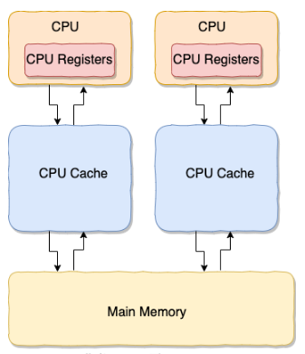

- `Java`内存模型（`JMM`）

  在Java中，所有的实例域、静态域和数组元素都存储在堆内存中，堆内存会在线程之间共享。局部变量，方法定义参数和异常处理参数不会再线程之间共享，它们不会有内存可见性问题，也不受内存模型的影响。

  Java线程之间的通信由Java内存模型（JMM）控制，JMM决定一个线程对共享变量的写入何时对另一个线程可见。从抽象的角度来看，JMM定义了线程和主内存之间的抽象关系：**线程之间的共享变量存储在主内存（Main Memory）中，每个线程都有一个私有的本地内存（LocalMemory），本地内存中存储了该线程以读/写共享变量的副本。本地内存是JMM的一个抽象概念，并不真实存在。它涵盖了缓存、写缓冲区、寄存器以及其他的硬件和编译器优化**。抽象示意如图所示：

  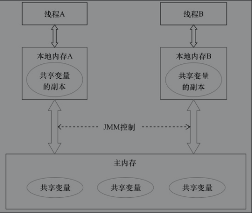

  JMM通过控制主内存与每个线程的本地内存之间的交互，来为Java程序员提供内存可见性保证。

  Java内存模型规定所有的变量都是存在主存当中（类似于前面说的物理内存），每个线程都有自己的工作内存（类似于前面的高速缓存）。线程对变量的所有操作都必须在工作内存中进行，而不能直接对主存进行操作。并且每个线程不能访问其他线程的工作内存。

#### 并发编程三个重要特性

- **原子性**：即一个操作或者多个操作 要么全部执行并且执行的过程不会被任何因素打断，要么就都不执行。 

  Java内存模型只保证了基本读取和赋值是原子性操作，如果要实现更大范围操作的原子性，可以通过`synchronized`和`Lock`来实现。**由于`synchronized`和`Lock`能够保证任一时刻只有一个线程执行该代码块，那么自然就不存在原子性问题了，从而保证了原子性**。 

- **可见性**：可见性是指当多个线程访问同一个变量时，一个线程修改了这个变量的值，其他线程能够立即看得到修改的值。 

  对于可见性，Java提供了`volatile`关键字来保证可见性。**当一个共享变量被`volatile`修饰时，它会保证修改的值会立即被更新到主存，当有其他线程需要读取时，它会去内存中读取新值**。

  通过`synchronized`和`Lock`也能够保证可见性，`synchronized`和`Lock`能保证同一时刻只有一个线程获取锁然后执行同步代码，并且在释放锁之前会将对变量的修改刷新到主存当中。因此可以保证可见性。  

- **有序性**：代码在执行的过程中的先后顺序，Java 在编译器以及运行期间的优化，代码的执行顺序未必就是编写代码时候的顺序。 

  **指令重排序**，一般来说，处理器为了提高程序运行效率，可能会对输入代码进行优化，它不保证程序中各个语句的执行先后顺序同代码中的顺序一致，但是它会保证程序最终执行结果和代码顺序执行的结果是一致的。

  在Java内存模型中，允许编译器和处理器对指令进行重排序，但是重排序过程不会影响到单线程程序的执行，却**会影响到多线程并发执行的正确性**。

  在Java里面，可以**通过`volatile`关键字来保证一定的"有序性"**。另外可以通过`synchronized`和`Lock`来保证有序性，很显然，**`synchronized`和`Lock`保证每个时刻是有一个线程执行同步代码，相当于是让线程顺序执行同步代码，自然就保证了有序性**。 

  另外，Java内存模型具备一些先天的“有序性”，即不需要通过任何手段就能够得到保证的有序性，这个通常也称为 **`happens-before` 原则**：**若线程 A 和线程 B 满足 happens-before 关系，则线程 A 执行操作的结果对线程 B 是可见的**。如果两个操作的执行次序无法从`happens-before`原则推导出来，那么它们就不能保证它们的有序性，虚拟机可以随意地对它们进行重排序。 

#### `Volatile`

- `Volatile`的语义

  一旦一个共享变量被`volatile`修饰之后，那么就具备了两层语义：

  - 保证了不同线程对这个变量进行操作时的可见性，即一个线程修改了某个变量，这新值对其他线程来说是立即可见的；
  - 禁止进行指令重排序。

- `Volatile`与原子性

  **对任意单个volatile变量的读/写具有原子性**，但类似于volatile++这种复合操作不具有原子性，因为自增操作不是原子性操作。

- `Volatile`与可见性

  **对一个volatile变量的读，总是能看到（任意线程）对这个volatile变量最后的写入**。

- `Volatile`与有序性

  禁止进行指令重排序。

  DLC（DoubleCheckedLocking）：

  ```java
  public class SafeDoubleCheckedLocking {
      private volatile static Instance instance;
      public static Instance getInstance(){
          if(instance==null){
              synchronized(SafeDoubleCheckedLocking.class){
                  if(instance==null){
                      instance=new Instance();
                  }
              }
          }
          return instance;
      }
  }
  ```

  为什么`instance`用`volatile`进行修饰？

  首先创建一个对象，可以分解为以下三行伪代码：

  ```java
  instance=new Insatnce();
  ---
  memory=allocate();		//1.分配对象的内存空间
  ctorInstance(memory);	//2.初始化对象
  instance=memory;		//3.设置instance指向刚分配的内存地址
  ---
  #可能发生重排序
  memory=allocate();		//1.分配对象的内存空间
  instance=memory;		//3.设置instance指向刚分配的内存地址
  ctorInstance(memory);	//2.初始化对象
  ```

  上面3行伪代码中的2和3之间，可能会被重排序（在一些JIT编译器上，这种重排序是真实发生的。当在多线程并发执行时：

  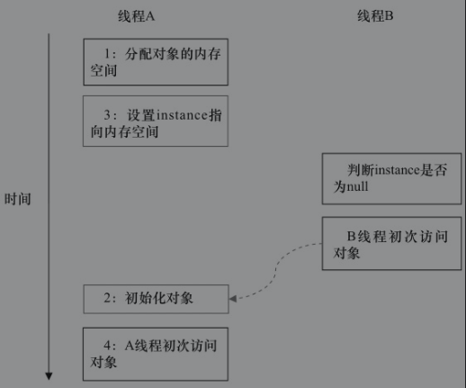

  而使用`volatile`可以禁止重排序，来保证线程安全的延迟初始化。

#### `Synchronized`

**`synchronized` 关键字解决的是多个线程之间访问资源的同步性，`synchronized`关键字可以保证被它修饰的方法或者代码块在任意时刻只能有一个线程执行。** 

在 Java 早期版本中，`synchronized` 属于 **重量级锁**，效率低下。为什么呢？

因为**监视器锁（`monitor`）是依赖于底层的操作系统的`Mutex Lock`来实现的，Java的线程是映射到操作系统的原生线程之上的。如果要挂起或者唤醒一个线程，都需要操作系统帮忙完成，而操作系统实现线程之间的切换时需要从用户态切换到内核态，这个状态之间的需要相对比较长的时间，时间成本相对较高**。

##### 怎样使用`synchronized`关键字

`synchronized`关键字最主要的三种使用方式：

1. 普通同步方法：**锁是当前实例对象**：

   ```java
   synchronized void method() {
     //业务代码
   }
   ```

2. 静态同步方法：**锁是当前对象的Class对象**：

   因为静态成员不属于任何一个实例对象，是类成员（static 表明这是该类的一个静态资源，不管 new 了多少个对象，只有一份）。

   ```java
   synchronized static void method() {
   //业务代码
   }
   ```

3. 修饰同步方法块：锁是`Synchonized`括号里配置的对象：

   - `synchronized(this|object)` 表示进入同步代码库前要获得**给定对象的锁**；
   - `synchronized(类.class)` 表示进入同步代码前要获得 **当前 class 的锁**。

   ```java
   synchronized(this) {
     //业务代码
   }
   ```

总结：

- `synchronized` 关键字加到 `static` 静态方法和 `synchronized(class)` 代码块上都是是给 Class 类上锁。
- `synchronized` 关键字加到实例方法上是给对象实例上锁。
- 尽量不要使用 `synchronized(String a)` 因为 JVM 中，字符串常量池具有缓存功能！

##### `synchronized`的底层原理

- `synchronized`同步方法块的情况

  ```java
  public class SynchronizedDemo {
      public void method() {
          synchronized (this) {
              System.out.println("synchronized 代码块");
          }
      }
  }
  ```

  **`synchronized` 同步语句块的实现使用的是 `monitorenter` 和 `monitorexit` 指令，其中 `monitorenter` 指令指向同步代码块的开始位置，`monitorexit` 指令则指明同步代码块的结束位置。**

  当执行 `monitorenter` 指令时，线程试图获取锁也就是获取 **对象监视器 `monitor`** 的持有权。 

  - 在执行`monitorenter`时，会尝试获取对象的锁，如果锁的计数器为 0 则表示锁可以被获取，获取后将锁计数器设为 1 也就是加 1。
  - 在执行 `monitorexit` 指令后，将锁计数器设为 0，表明锁被释放。如果获取对象锁失败，那当前线程就要阻塞等待，直到锁被另外一个线程释放为止。

- `synchronized`修饰方法的情况

  ```java
  public class SynchronizedDemo2 {
      public synchronized void method() {
          System.out.println("synchronized 方法");
      }
  }
  ```

  `synchronized` 修饰的方法并没有 `monitorenter` 指令和 `monitorexit` 指令，取得代之的确实是 `ACC_SYNCHRONIZED` 标识，该标识指明了该方法是一个同步方法。JVM 通过该 `ACC_SYNCHRONIZED` 访问标志来辨别一个方法是否声明为同步方法，从而执行相应的同步调用。

#### `Synchronized`锁优化

随着 `Java SE1.6` 对 `Synchronized` 进行了各种优化，引入了 **偏向锁** 和 **轻量级锁**。所以在 Java SE1.6 里锁一共有四种状态，`无锁状态`，`偏向锁状态`，`轻量级锁状态`和`重量级锁状态`，它会随着竞争情况逐渐升级。**锁可以升级但不能降级**，意味着偏向锁升级成轻量级锁后不能降级成偏向锁，但是偏向锁状态可以被重置为无锁状态（锁撤销）。这种锁升级却不能降级的策略，**目的是为了提高获得锁和释放锁的效率**。 

| 锁状态   | 优点                                   | 缺点                                 | 适用场景                           |
| -------- | -------------------------------------- | ------------------------------------ | ---------------------------------- |
| 偏向锁   | 加锁、解锁无额外消耗，和非同步方式近似 | 如果竞争线程多，会有额外锁撤销的消耗 | 基本没有线程竞争的场景             |
| 轻量级锁 | 竞争线程不会阻塞，使用自旋等待         | 如果长时间不能获取锁，会消耗CPU      | 少量线程竞争，且线程持有锁时间不长 |
| 重量级锁 | 竞争线程被阻塞，减少CPU空转            | 线程阻塞，响应时间长                 | 很多线程竞争，锁持有时间长         |

##### Java对象头

`synchronized`用的锁是存在Java对象头里的。如果对象时数组类型，则虚拟机用3个字宽（Word）存储对象头，如果对象是非数组类型，则用2个字宽存储对象头。在32位虚拟机中，1字宽等于4字节，即32bit，如表：

| **长度** | **内容**               | **说明**                       |
| -------- | ---------------------- | ------------------------------ |
| 32/64bit | Mark Word              | 存储对象的hashCode或锁信息等   |
| 32/64bit | Class Metadada Address | 存储对象类型数据的指针         |
| 32/64bit | Array Length           | 数组的长度(如果当前对象是数组) |

Java对象头里的**Mark Word**里默认存储`对象的HashCode`、`分代年龄`和`锁标记位`。

1. 无锁状态：

   | 25bit          | 4bit         | 1bit（是否是偏向锁） | 2bit（锁标志位） |
   | -------------- | ------------ | -------------------- | ---------------- |
   | 对象的hashCode | 对象分代年龄 | 0                    | 01               |

2. 偏向锁状态：

   | 23bit  | 2bit  | 4bit         | 1bit（是否是偏向锁） | 2bit（锁标志位） |
   | ------ | ----- | ------------ | -------------------- | ---------------- |
   | 线程ID | Epoch | 对象分代年龄 | 1                    | 01               |

3. 轻量级锁状态：

   | 30bit                | 2bit（锁标志位） |
   | -------------------- | ---------------- |
   | 指向栈中锁记录的指针 | 00               |

4. 重量级锁状态：

   | 30bit                        | 2bit（锁标志位） |
   | ---------------------------- | ---------------- |
   | 指向互斥量（重量级锁）的指针 | 10               |

5. GC标记：

   | 30bit | 2bit（锁标志位） |
   | ----- | ---------------- |
   | 空    | 11               |

##### 锁升级

- 偏向锁

  1. 产生的原因：大多数情况下，锁不仅不存在多线程竞争，而且总是由同一线程多次获得，为了让线程获得锁的代价更低而引入了偏向锁。 它的目的是消除数据在无竞争情况下的同步原语，进一步提高程序的运行性能。 

  2. 加锁：

     当一个线程访问同步块并获取锁时，会在对象头和栈帧中的锁记录里存储锁偏向的线程ID，以后线程在进入或者退出同步块时不需要进行CAS操作来加锁和解锁，**线程只需要比较对象头的Mark Word是否存储着指向当前线程的偏向锁**。

     - `Mark Word`存储着该线程ID，表示线程已经获得了锁。
     - 未存储线程ID，需要比较`Mark Word`中的`偏向锁标识`是否设置为`1`：
       - 没有设置，则使用CAS竞争锁；
       - 为`1`，则尝试CAS将`Mark Word`的偏向锁指向当前线程。

     

  3. 撤销：

     偏向锁使用了一种等到竞争出现才释放锁的机制，所以当其他线程尝试竞争偏向锁时，持有偏向锁的线程才会释放锁。偏向锁的撤销，需要等到全局安全点（即没有正在执行的字节码的时间点）。

     首先它会暂停拥有偏向锁的线程，然后检查持有偏向锁的线程是否活着：

     - 如果线程不处于活动状态，则将对象头设置为无锁状态；
     - 如果线程仍然活着，唤醒被暂停的线程执行后续操作，其他线程自旋获取轻量级锁。

     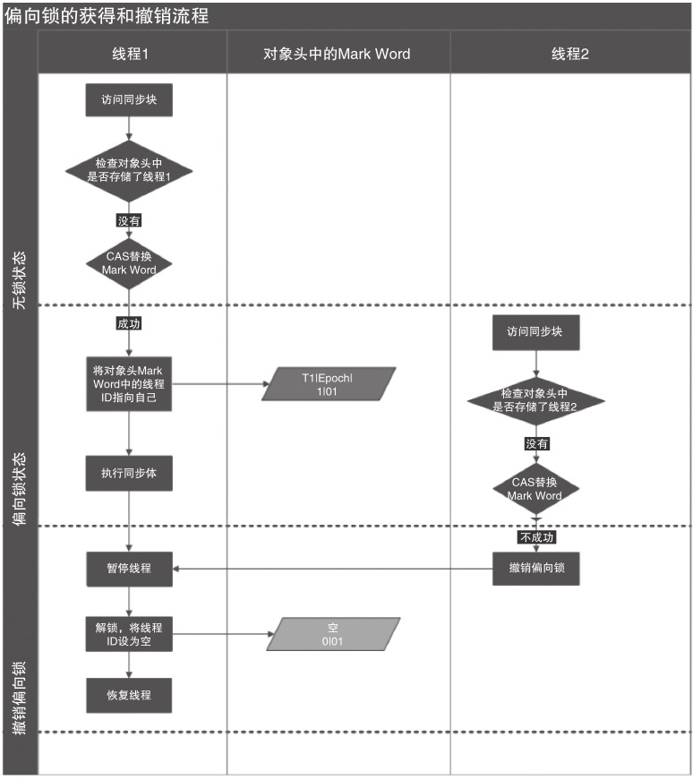

- 轻量级锁

  **轻量级锁就是使用 CAS 和自旋锁来获取锁从而降低使用操作系统互斥量来完成重量级锁的性能消耗** 。

  **轻量级加锁**，线程在执行同步块之前，JVM会先在当前线程的栈帧中创建用于存储锁记录的空间，并将对象头中的`Mark Word`复制到锁记录中，成为`Displaced Mark Word`。然后线程尝试使用CAS将对象头中的Mark Word替换为锁记录的指针。

  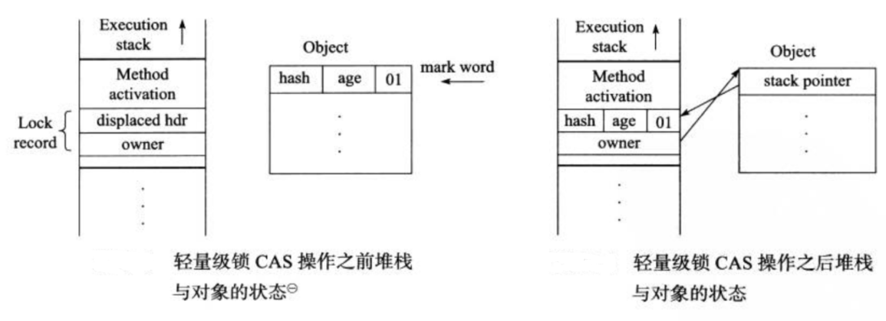

  - 如果成功，当前线程获得锁；
  - 如果失败，表示其他线程竞争锁，当前线程便尝试使用自旋来获取锁。

  例子：

  1. 假设线程 B 替换成功，表明成功获得该锁，然后继续执行代码，此时 Mark Word 如下：

     

  2. 此时线程 C 来获取该锁，CAS 修改对象头的时候失败发现已经被线程 B 占用，然后它就自旋获取锁，结果线程 B 这时正好执行完成，线程 C 自旋获取成功：

     

  3. 此时线程 D 又获取该锁，发现被线程 C 占用，然后它自旋获取锁，自旋默认 10 次后发现还是无法获得对应的锁（线程 C 还没有释放），那么线程 D 就将 Mark Word 修改为重量级锁:

     

  4. 然后这时线程 C 执行完成了，将栈帧中的 Mark Word 替换回对象头的 Mark Word 的时候，发现有其它线程竞争该锁（被线程 D 修改了锁状态）然后它释放锁并且唤醒在等待的线程，后续的线程操作就全部都是重量级锁了：

     

  **轻量级解锁**，会使用原子的CAS操作将`Displaced Mark Word`替换会到对象头：

  - 如果成功，则表示没有竞争发生。
  - 如果失败，表示当前锁存在竞争，锁就会膨胀成重量级锁。

  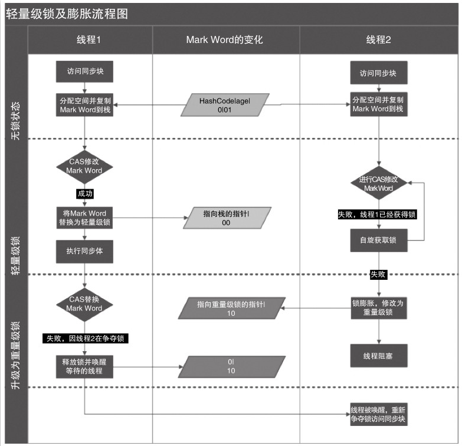

参考：[从偏向锁是如何升级到重量级锁的](https://juejin.cn/post/6844903957324627975)

##### 锁的比较

| 锁       | 优点                                                         | 缺点                                             | 适用场景                             |
| -------- | ------------------------------------------------------------ | ------------------------------------------------ | ------------------------------------ |
| 偏向锁   | 加锁和解锁不需要额外的消耗，和执行非同步代码方法的性能相差无几。 | 如果线程间存在锁竞争，会带来额外的锁撤销的消耗。 | 适用于只有一个线程访问的同步场景。   |
| 轻量级锁 | 竞争的线程不会阻塞，提高了程序的响应速度。                   | 如果始终得不到锁竞争的线程，使用自旋会消耗CPU。  | 追求响应时间，同步块执行速度非常快。 |
| 重量级锁 | 线程竞争不使用自旋，不会消耗CPU。                            | 线程阻塞，响应时间缓慢。                         | 追求吞吐量，同步块执行速度较长。     |

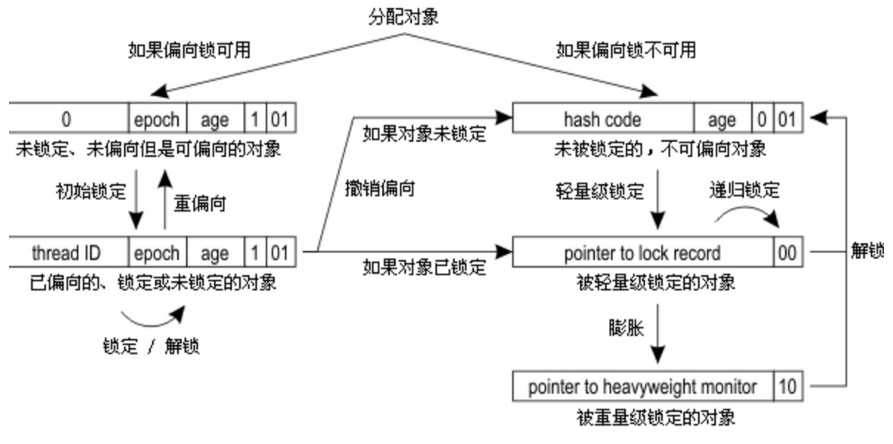

#### `ThreadLocal`

通常情况下，我们创建的变量是可以被任何一个线程访问并修改的。**如果想实现每一个线程都有自己的专属本地变量该如何解决呢？** JDK 中提供的`ThreadLocal`类正是为了解决这样的问题。 

当使用 `ThreadLocal` 维护变量时，`ThreadLocal` 为每个使用该变量的线程提供独立的变量副本，所以每一个线程都可以独立地改变自己的副本，而不会影响其它线程所对应的副本。 

每个线程中都保有一个`ThreadLocalMap`的成员变量，`ThreadLocalMap `内部采用`WeakReference`数组保存，数组的key即为`ThreadLocal `内部的Hash值。

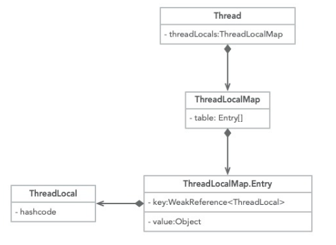

**最终的变量是放在了当前线程的 `ThreadLocalMap` 中，并不是存在 `ThreadLocal` 上，`ThreadLocal` 可以理解为只是`ThreadLocalMap`的封装，传递了变量值。** `ThrealLocal` 类中可以通过`Thread.currentThread()`获取到当前线程对象后，直接通过`getMap(Thread t)`可以访问到该线程的`ThreadLocalMap`对象。

比如我们在同一个线程中声明了两个 `ThreadLocal` 对象的话，会使用 `Thread`内部都是使用仅有那个`ThreadLocalMap` 存放数据的，`ThreadLocalMap`的 key 就是 `ThreadLocal`对象，value 就是 `ThreadLocal` 对象调用`set`方法设置的值。 

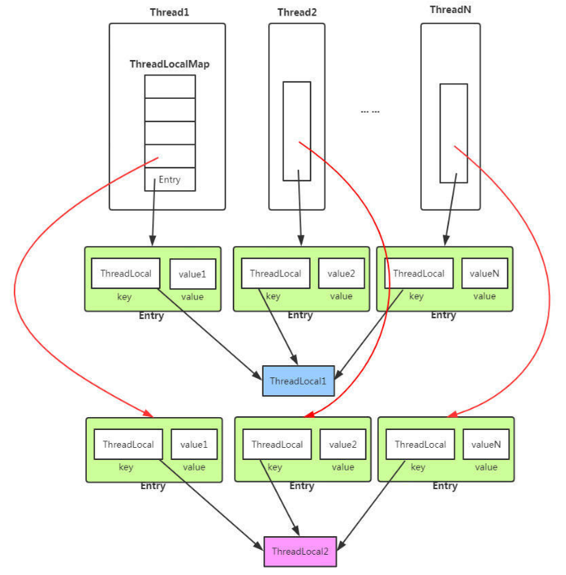

**`ThreadLocal`内存泄露问题**

`ThreadLocalMap` 中使用的 key 为 `ThreadLocal` 的弱引用,而 value 是强引用。所以，如果 `ThreadLocal` 没有被外部强引用的情况下，在垃圾回收的时候，key 会被清理掉，而 value 不会被清理掉。这样一来，`ThreadLocalMap` 中就会出现 key 为 null 的 Entry。假如我们不做任何措施的话，value 永远无法被 GC 回收，这个时候就可能会产生内存泄露。

ThreadLocalMap 实现中已经考虑了这种情况，在调用 `set()`、`get()`、`remove()` 方法的时候，会清理掉 key 为 null 的记录。使用完 `ThreadLocal`方法后 最好手动调用`remove()`方法 

#### `Atomic`原子类

**基本类型**

使用原子的方式更新基本类型

- `AtomicInteger`：整形原子类
- `AtomicLong`：长整型原子类
- `AtomicBoolean`：布尔型原子类

**数组类型**

使用原子的方式更新数组里的某个元素

- `AtomicIntegerArray`：整形数组原子类
- `AtomicLongArray`：长整形数组原子类
- `AtomicReferenceArray`：引用类型数组原子类

**引用类型**

- `AtomicReference`：引用类型原子类
- `AtomicStampedReference`：原子更新带有版本号的引用类型。该类将整数值与引用关联起来，可用于解决原子的更新数据和数据的版本号，可以解决使用 CAS 进行原子更新时可能出现的 ABA 问题。
- `AtomicMarkableReference` ：原子更新带有标记位的引用类型

**对象的属性修改类型**

- `AtomicIntegerFieldUpdater`：原子更新整形字段的更新器
- `AtomicLongFieldUpdater`：原子更新长整形字段的更新器
- `AtomicReferenceFieldUpdater`：原子更新引用类型字段的更新器

 **AtomicInteger 类常用方法**：

```java
public final int get() //获取当前的值
public final int getAndSet(int newValue)//获取当前的值，并设置新的值
public final int getAndIncrement()//获取当前的值，并自增
public final int getAndDecrement() //获取当前的值，并自减
public final int getAndAdd(int delta) //获取当前的值，并加上预期的值
boolean compareAndSet(int expect, int update) //如果输入的数值等于预期值，则以原子方式将该值设置为输入值（update）
public final void lazySet(int newValue)//最终设置为newValue,使用 lazySet 设置之后可能导致其他线程在之后的一小段时间内还是可以读到旧的值。
```

 **AtomicInteger 类的使用示例**：

```java
class AtomicIntegerTest {
    private AtomicInteger count = new AtomicInteger();
    //使用AtomicInteger之后，不需要对该方法加锁，也可以实现线程安全。
    public void increment() {
        count.incrementAndGet();
    }
    public int getCount() {
        return count.get();
    }
}
```

 **AtomicInteger 类的原理**：

 AtomicInteger 类的部分源码：

```java
// setup to use Unsafe.compareAndSwapInt for updates（更新操作时提供“比较并替换”的作用）
private static final Unsafe unsafe = Unsafe.getUnsafe();
private static final long valueOffset;

static {
    try {
        valueOffset = unsafe.objectFieldOffset
            (AtomicInteger.class.getDeclaredField("value"));
    } catch (Exception ex) { throw new Error(ex); }
}

private volatile int value;
```

AtomicInteger 类主要利用 **CAS (compare and swap) + volatile 和 native 方法**来保证原子操作，从而避免 synchronized 的高开销，执行效率大为提升。 

CAS 的原理是拿期望的值和原本的一个值作比较，如果相同则更新成新的值。UnSafe 类的 objectFieldOffset() 方法是一个本地方法，这个方法是用来拿到“原来的值”的内存地址，返回值是 valueOffset。另外 value 是一个 volatile 变量，在内存中可见，因此 JVM 可以保证任何时刻任何线程总能拿到该变量的最新值。

#### 线程池

**线程池**提供了一种限制和管理资源（包括执行一个任务）。 每个**线程池**还维护一些基本统计信息，例如已完成任务的数量。 

**使用线程池的好处**： 

- **降低资源消耗**。通过重复利用已创建的线程降低线程创建和销毁造成的消耗。
- **提高响应速度**。当任务到达时，任务可以不需要的等到线程创建就能立即执行。
- **提高线程的可管理性**。线程是稀缺资源，如果无限制的创建，不仅会消耗系统资源，还会降低系统的稳定性，使用线程池可以进行统一的分配，调优和监控。

1. Runnable接口和Callable接口的区别：

   `Runnable`不支持的用例。**`Runnable` 接口**不会返回结果或抛出检查异常，但是**`Callable` 接口**可以。所以，如果任务不需要返回结果或抛出异常推荐使用 **`Runnable` 接口**，这样代码看起来会更加简洁。

2. 执行execute()方法和submit()方法的区别：

   - **`execute()`方法用于提交不需要返回值的任务，所以无法判断任务是否被线程池执行成功与否；**
   - **`submit()`方法用于提交需要返回值的任务。线程池会返回一个 `Future` 类型的对象，通过这个 `Future` 对象可以判断任务是否执行成功**，并且可以通过 `Future` 的 `get()`方法来获取返回值，`get()`方法会阻塞当前线程直到任务完成，而使用 `get（long timeout，TimeUnit unit）`方法则会阻塞当前线程一段时间后立即返回，这时候有可能任务没有执行完。

   ```java
   public Future<?> submit(Runnable task) {
       if (task == null) throw new NullPointerException();
       RunnableFuture<Void> ftask = newTaskFor(task, null);
       execute(ftask);
       return ftask;
   }
   ```

   上面方法调用的 `newTaskFor` 方法返回了一个 `FutureTask` 对象。 

   ```java
   protected <T> RunnableFuture<T> newTaskFor(Runnable runnable, T value) {
       return new FutureTask<T>(runnable, value);
   }
   ```

3. 如何创造线程池：

   - 通过 Executor 框架的工具类 Executors 来实现（不建议使用）：

     - **FixedThreadPool** ： 该方法返回一个固定线程数量的线程池。该线程池中的线程数量始终不变。当有一个新的任务提交时，线程池中若有空闲线程，则立即执行。若没有，则新的任务会被暂存在一个任务队列中，待有线程空闲时，便处理在任务队列中的任务。
     - **SingleThreadExecutor：** 方法返回一个只有一个线程的线程池。若多余一个任务被提交到该线程池，任务会被保存在一个任务队列中，待线程空闲，按先入先出的顺序执行队列中的任务。
     - **CachedThreadPool：** 该方法返回一个可根据实际情况调整线程数量的线程池。线程池的线程数量不确定，但若有空闲线程可以复用，则会优先使用可复用的线程。若所有线程均在工作，又有新的任务提交，则会创建新的线程处理任务。所有线程在当前任务执行完毕后，将返回线程池进行复用。

     弊端：

     - **FixedThreadPool 和 SingleThreadExecutor** ： 允许请求的队列长度为 Integer.MAX_VALUE ，可能堆积大量的请求，从而导致 OOM。
     - **CachedThreadPool 和 ScheduledThreadPool** ： 允许创建的线程数量为 Integer.MAX_VALUE ，可能会创建大量线程，从而导致 OOM。

   - 通过**构造方法**实现（建议使用）：

     通过 `ThreadPoolExecutor` 的方式，这样的处理方式让写的同学更加明确线程池的运行规则，规避资源耗尽的风险。

     构造方法：

     ```java
         /**
          * 用给定的初始参数创建一个新的ThreadPoolExecutor。
          */
         public ThreadPoolExecutor(int corePoolSize,
                                   int maximumPoolSize,
                                   long keepAliveTime,
                                   TimeUnit unit,
                                   BlockingQueue<Runnable> workQueue,
                                   ThreadFactory threadFactory,
                                   RejectedExecutionHandler handler) {
             if (corePoolSize < 0 ||
                 maximumPoolSize <= 0 ||
                 maximumPoolSize < corePoolSize ||
                 keepAliveTime < 0)
                 throw new IllegalArgumentException();
             if (workQueue == null || threadFactory == null || handler == null)
                 throw new NullPointerException();
             this.corePoolSize = corePoolSize;
             this.maximumPoolSize = maximumPoolSize;
             this.workQueue = workQueue;
             this.keepAliveTime = unit.toNanos(keepAliveTime);
             this.threadFactory = threadFactory;
             this.handler = handler;
         }
     
     ```

     参数：

     - **`corePoolSize` **：核心线程数线程数定义了最小可以同时运行的线程数量。
     - **`maximumPoolSize` **：当队列中存放的任务达到队列容量的时候，当前可以同时运行的线程数量变为最大线程数。
     - **`keepAliveTime`**：当线程池中的线程数量大于 `corePoolSize` 的时候，如果这时没有新的任务提交，核心线程外的线程不会立即销毁，而是会等待，直到等待的时间超过了 `keepAliveTime`才会被回收销毁；
     - **`unit`** ：`keepAliveTime` 参数的时间单位。
     - **`workQueue`**：当新任务来的时候会先判断当前运行的线程数量是否达到核心线程数，如果达到的话，新任务就会被存放在队列中。
     - **`threadFactory`**：executor 创建新线程的时候会用到。
     - **`handler`**：饱和策略。

     饱和策略定义：

     - `AbortPolicy`：抛出 `RejectedExecutionException`来拒绝新任务的处理。 
     - `CallerRunsPolicy`：调用执行自己的线程运行任务，也就是直接在调用`execute`方法的线程中运行(`run`)被拒绝的任务，如果执行程序已关闭，则会丢弃该任务。因此这种策略会降低对于新任务提交速度，影响程序的整体性能。如果您的应用程序可以承受此延迟并且你要求任何一个任务请求都要被执行的话，你可以选择这个策略。 
     - `DiscardPolicy`：不处理新任务，直接丢弃掉。
     - `DiscardOldestPolicy`：此策略将丢弃最早的未处理的任务请求。 

4. 线程池原理分析

   **为了搞懂线程池的原理，我们需要首先分析一下 `execute`方法**。我们一般使用 `executor.execute(worker)`来提交一个任务到线程池中去，这个方法非常重要，下面我们来看看它的源码：

   ```java
   // 存放线程池的运行状态 (runState) 和线程池内有效线程的数量 (workerCount)
   private final AtomicInteger ctl = new AtomicInteger(ctlOf(RUNNING, 0));
   
   private static int workerCountOf(int c) {
       return c & CAPACITY;
   }
   
   private final BlockingQueue<Runnable> workQueue;
   
   public void execute(Runnable command) {
       // 如果任务为null，则抛出异常。
       if (command == null)
           throw new NullPointerException();
       // ctl 中保存的线程池当前的一些状态信息
       int c = ctl.get();
       // 下面会涉及到 3 步 操作
       // 1.首先判断当前线程池中执行的任务数量是否小于 corePoolSize
       // 如果小于的话，通过addWorker(command, true)新建一个线程，并将任务(command)添加到该线程中；然后，启动该线程从而执行任务。
       if (workerCountOf(c) < corePoolSize) {
           if (addWorker(command, true))
               return;
           c = ctl.get();
       }
       // 2.如果当前执行的任务数量大于等于 corePoolSize 的时候就会走到这里
       // 通过 isRunning 方法判断线程池状态，线程池处于 RUNNING 状态才会被并且队列可以加入任务，该任务才会被加入进去
       if (isRunning(c) && workQueue.offer(command)) {
           int recheck = ctl.get();
           // 再次获取线程池状态，如果线程池状态不是 RUNNING 状态就需要从任务队列中移除任务，并尝试判断线程是否全部执行完毕。同时执行拒绝策略。
           if (!isRunning(recheck) && remove(command))
               reject(command);
           // 如果当前线程池为空就新创建一个线程并执行。
           else if (workerCountOf(recheck) == 0)
               addWorker(null, false);
       }
       //3. 通过addWorker(command, false)新建一个线程，并将任务(command)添加到该线程中；然后，启动该线程从而执行任务。
       //如果addWorker(command, false)执行失败，则通过reject()执行相应的拒绝策略的内容。
       else if (!addWorker(command, false))
           reject(command);
   }
   ```

   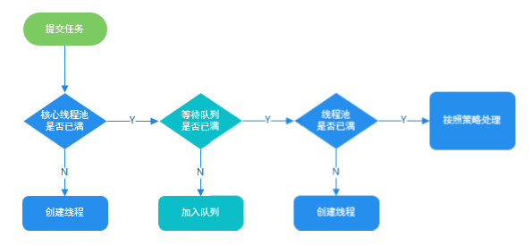

#### AQS

##### AQS原理概览

AQS核心思想是：

- 如果被请求的共享资源空闲，则将当前请求资源的线程设置为有效的工作线程，并且将共享资源设置为锁定状态。
- 如果被请求的共享资源被占用，那么就需要一套线程阻塞等待以及被唤醒时所分配的机制，这个机制AQS是用CLH队列锁实现的，将暂时获取不到锁的线程加入到队列中。

> CLH(Craig,Landin,and Hagersten)队列是一个虚拟的双向队列（虚拟的双向队列即不存在队列实例，仅存在结点之间的关联关系）。AQS 是将每条请求共享资源的线程封装成一个 CLH 锁队列的一个结点（Node）来实现锁的分配。 

AQS(AbstractQueuedSynchronizer)原理图：

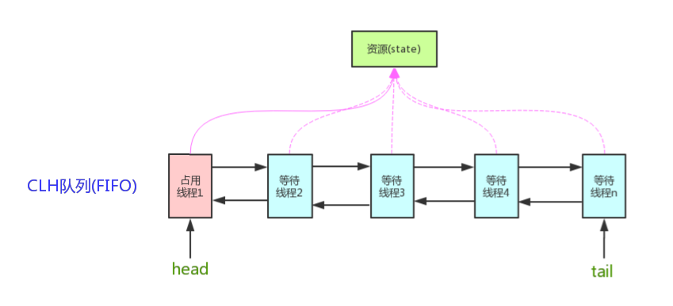

AQS 使用一个 int 成员变量来表示同步状态，通过内置的 FIFO 队列来完成获取资源线程的排队工作。AQS 使用 CAS 对该同步状态进行原子操作实现对其值的修改。

```java
private volatile int state;//共享变量，使用volatile修饰保证线程可见性
```

状态信息通过 protected 类型的 getState，setState，compareAndSetState 进行操作：

```java
//返回同步状态的当前值
protected final int getState() {
        return state;
}
 // 设置同步状态的值
protected final void setState(int newState) {
        state = newState;
}
//原子地（CAS操作）将同步状态值设置为给定值update如果当前同步状态的值等于expect（期望值）
protected final boolean compareAndSetState(int expect, int update) {
        return unsafe.compareAndSwapInt(this, stateOffset, expect, update);
}
```

##### AQS对资源的共享方式

- `Exclusive`：只有一个线程能执行，如`ReentrantLock`。又分为公平锁和非公平锁：
  - 公平锁：按照线程在队列中的排队顺序，先到者先拿到锁
  - 非公平锁：当线程要获取锁时，无视队列顺序直接去抢锁，谁抢到就是谁的（性能高）
- `Share`：多个线程可同时执行，如`CountDownLatch`、`Semaphore`、`CyclicBarrier`、`ReadWriteLock`。

`ReentrantReadWriteLock`可以看成是组合式，**它表示两个锁，一个是读操作相关的锁，称为共享锁；一个是写相关的锁，称为排他锁**。

- 线程进入读锁的前提条件：
  - 没有其他线程的写锁；
  - 没有写请求或者**有写请求，但调用线程和持有锁的线程是同一个**。
- 线程进入写锁的前提条件：
  - 没有其他线程的读锁；
  - 没有其他线程的写锁。

不同的自定义同步器争用共享资源的方式也不同。自定义同步器在实现时只需要实现共享资源 state 的获取与释放方式即可，至于具体线程等待队列的维护（如获取资源失败入队/唤醒出队等），AQS 已经在顶层实现好了。

##### AQS使用模板方法模式

同步器的设计是基于模板方法模式的，如果需要自定义同步器一般的方式是这样（模板方法模式很经典的一个应用）：

1. 使用者继承 `AbstractQueuedSynchronizer` 并重写指定的方法。（这些重写方法很简单，无非是对于共享资源 state 的获取和释放）
2. 将 AQS 组合在自定义同步组件的实现中，并调用其模板方法，而这些模板方法会调用使用者重写的方法。

AQS 使用了模板方法模式，自定义同步器时需要重写下面几个 AQS 提供的模板方法：

```java
isHeldExclusively()//该线程是否正在独占资源。只有用到condition才需要去实现它。
tryAcquire(int)//独占方式。尝试获取资源，成功则返回true，失败则返回false。
tryRelease(int)//独占方式。尝试释放资源，成功则返回true，失败则返回false。
tryAcquireShared(int)//共享方式。尝试获取资源。负数表示失败；0表示成功，但没有剩余可用资源；正数表示成功，且有剩余资源。
tryReleaseShared(int)//共享方式。尝试释放资源，成功则返回true，失败则返回false。
```

这些方法的实现必须是内部线程安全的，并且通常应该简短而不是阻塞。AQS 类中的其他方法都是 final ，所以无法被其他类使用，只有这几个方法可以被其他类使用。

**以`ReentrantLock`为例**：

state初始化为0，表示未锁定状态。A线程`Lock()`时，会调用`tryAcquire()`独占该锁并将state+1。此后，其他线程再tryAcquire()时就会失败，直到A线程unlock()到state=0（即释放锁）为止，其他线程才有机会获取该锁。当然，释放锁之前，A线程自己是可以重复获取此锁的，就是可重入。但是，获取多少次就要释放多少次，保证state是能回0的。

**`ReentrantLock`与`Synchronized`比较**：

- 锁的实现：synchronized 是 JVM 实现的，而 ReentrantLock 是 JDK 实现的。

- 性能：JDK1.6 对 synchronized 进行了很多优化，例如自旋锁等，synchronized 与 ReentrantLock 大致相同。

- 等待可中断：当持有锁的线程长期不释放锁的时候，正在等待的线程可以选择放弃等待，改为处理其他事情。

  ReentrantLock 可中断，而 synchronized 不行。

- 公平锁：公平锁是指多个线程在等待同一个锁时，必须按照申请锁的时间顺序来依次获得锁。

  synchronized 中的锁是非公平的，ReentrantLock 默认情况下也是非公平的，但是也可以是公平的。

- 锁绑定多个条件：一个 ReentrantLock 可以同时绑定多个 Condition 对象。

以`CountDownLatch`为例：

任务分为N个子线程去执行，state也初始化为N。这N个子线程是并行执行的，每个子线程执行完后`countDown()`一次，state会CAS减1.等到所有的子线程执行完后（state=0），会`unpack()`主调用线程，然后主调用线程就会从`await()`函数返回，继续后余动作。

一般来说，自定义同步器要么是独占方法，要么是共享方式，他们也只需实现`tryAcquire-tryRelease`、`tryAcquireShared-tryReleaseShared`中的一种即可。但 AQS 也支持自定义同步器同时实现独占和共享两种方式，如`ReentrantReadWriteLock`。


