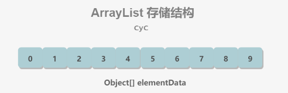
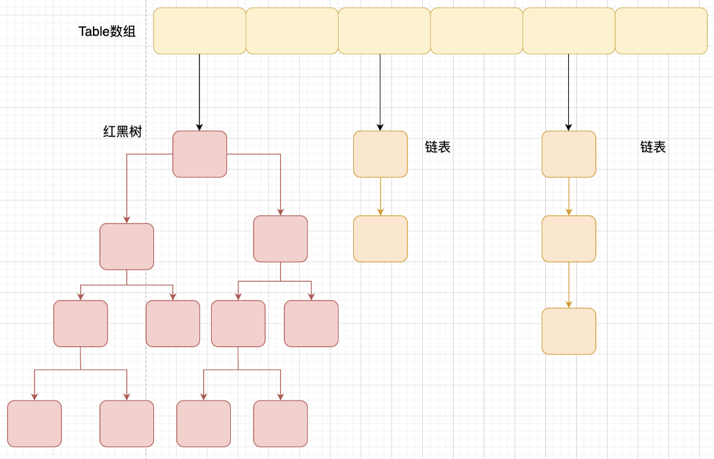

#### 集合概述

从下图可以看出，在 Java 中除了以 `Map` 结尾的类之外， 其他类都实现了 `Collection` 接口。并且，以 `Map` 结尾的类都实现了 `Map` 接口。


`List`，`Set`，`Queue`：

- `List`
  - ArrayList：基于动态数组实现，支持随机访问。
  - Vector：和 ArrayList 类似，但它是线程安全的。
  - LinkedList：基于双向链表实现，只能顺序访问，但是可以快速地在链表中间插入和删除元素。不仅如此，LinkedList 还可以用作栈、队列和双向队列。
- `Set`
  - TreeSet：基于红黑树实现，支持有序性操作，例如根据一个范围查找元素的操作。但是查找效率不如 HashSet，HashSet 查找的时间复杂度为 O(1)，TreeSet 则为 O(logN)。
  - HashSet：基于哈希表实现，支持快速查找，但不支持有序性操作。并且失去了元素的插入顺序信息，也就是说使用 Iterator 遍历 HashSet 得到的结果是不确定的。
  - LinkedHashSet：具有 HashSet 的查找效率，并且内部使用双向链表维护元素的插入顺序。
- `Queue`
  - LinkedList：可以用它来实现双向队列。
  - PriorityQueue：基于堆结构实现，可以用它来实现优先队列。
- `Map`
  - TreeMap：基于红黑树实现。
  - HashMap：基于哈希表实现。
  - HashTable：和 HashMap 类似，但它是线程安全的，这意味着同一时刻多个线程同时写入 HashTable 不会导致数据不一致。
  - LinkedHashMap：使用双向链表来维护元素的顺序，顺序为插入顺序或者最近最少使用（LRU）顺序。

#### List

##### `ArrayList`

1. 概览：

   `ArrayList` 的底层是数组队列，相当于动态数组。与 Java 中的数组相比，它的容量能动态增长。在添加大量元素前，应用程序可以使用`ensureCapacity`操作来增加 `ArrayList` 实例的容量。这可以减少递增式再分配的数量。

   `ArrayList`继承于 **`AbstractList`** ，实现了 **`List`**, **`RandomAccess`**, **`Cloneable`**, **`java.io.Serializable`** 这些接口。

   ```java
   public class ArrayList<E> extends AbstractList<E>
           implements List<E>, RandomAccess, Cloneable, java.io.Serializable{
       
   }
   ```

   - `RandomAccess` 是一个标志接口，表明实现这个这个接口的 List 集合是支持**快速随机访问**的。在 `ArrayList` 中，我们即可以通过元素的序号快速获取元素对象，这就是快速随机访问。
   - `ArrayList` 实现了 **`Cloneable` 接口** ，即覆盖了函数`clone()`，能被克隆。
   - `ArrayList` 实现了 `java.io.Serializable `接口，这意味着`ArrayList`支持序列化，能通过序列化去传输。

   数组的默认大小为 10。

   ```java
   private static final int DEFAULT_CAPACITY = 10;
   ```

   

2. ArrayList与Vector、LinkedList的区别：

   - `Vector`：
     - `ArrayList` 是 `List` 的主要实现类，底层使用 `Object[ ]`存储，适用于频繁的查找工作，**线程不安全** ；
     - `Vector` 是 `List` 的古老实现类，底层使用 `Object[ ]`存储，**线程安全的**。
   - `LinkedList`：
     - **是否保证线程安全：** `ArrayList` 和 `LinkedList` 都是不同步的，也就是不保证线程安全；
     - **底层数据结构：** `Arraylist` 底层使用的是 **`Object` 数组**；`LinkedList` 底层使用的是 **双向链表** 数据结构；
     - **插入和删除是否受元素位置的影响：**
       1. **`ArrayList` 采用数组存储，所以插入和删除元素的时间复杂度受元素位置的影响。** 比如：执行`add(E e)`方法的时候， `ArrayList` 会默认在将指定的元素追加到此列表的末尾，这种情况时间复杂度就是 O(1)。但是如果要在指定位置 i 插入和删除元素的话（`add(int index, E element)`）时间复杂度就为 O(n-i)。因为在进行上述操作的时候集合中第 i 和第 i 个元素之后的(n-i)个元素都要执行向后位/向前移一位的操作。
       2. **`LinkedList` 采用链表存储，所以对于`add(E e)`方法的插入，删除元素时间复杂度不受元素位置的影响，近似 O(1)，如果是要在指定位置`i`插入和删除元素的话（`(add(int index, E element)`） 时间复杂度近似为`o(n))`因为需要先移动到指定位置再插入。**
     - **是否支持快速随机访问：** `LinkedList` 不支持高效的随机元素访问，而 `ArrayList` 支持。快速随机访问就是通过元素的序号快速获取元素对象(对应于`get(int index)`方法)。
     - **内存空间占用：** `ArrayList` 的空 间浪费主要体现在在 list 列表的结尾会预留一定的容量空间，而 `LinkedList` 的空间花费则体现在它的每一个元素都需要消耗比 `ArrayList` 更多的空间（因为要存放直接后继和直接前驱以及数据）。

3. **扩容**

   添加元素时使用 ensureCapacityInternal() 方法来保证容量足够，如果不够时，需要使用 grow() 方法进行扩容，新容量的大小为 `oldCapacity + (oldCapacity >> 1)`，即 oldCapacity+oldCapacity/2。其中 oldCapacity >> 1 需要取整，所以新容量大约是旧容量的 1.5 倍左右。（oldCapacity 为偶数就是 1.5 倍，为奇数就是 1.5 倍-0.5）。

   - 构造函数：

     ```java
     //默认初始容量大小
     private static final int DEFAULT_CAPACITY = 10;
     //空数组（用于空实例）。
     private static final Object[] EMPTY_ELEMENTDATA = {};
     //用于默认大小空实例的共享空数组实例。和EMPTY_ELEMENTDATA数组中区分出来，以知道在添加第一个元素时容量需要增加多少。
     private static final Object[] DEFAULTCAPACITY_EMPTY_ELEMENTDATA = {};
     
     //默认构造函数，使用初始容量10构造一个空列表(无参数构造)
     public ArrayList() {
         this.elementData = DEFAULTCAPACITY_EMPTY_ELEMENTDATA;
     }
     
     //带初始容量参数的构造函数。（用户自己指定容量）
     public ArrayList(int initialCapacity) {
         if (initialCapacity > 0) {//初始容量大于0
             //创建initialCapacity大小的数组
             this.elementData = new Object[initialCapacity];
         } else if (initialCapacity == 0) {//初始容量等于0
             //创建空数组
             this.elementData = EMPTY_ELEMENTDATA;
         } else {//初始容量小于0，抛出异常
             throw new IllegalArgumentException("Illegal Capacity: "+initialCapacity);
         }
     }
     
     /**
         *构造包含指定collection元素的列表，这些元素利用该集合的迭代器按顺序返回
         *如果指定的集合为null，throws NullPointerException。
         */
     public ArrayList(Collection<? extends E> c) {
         elementData = c.toArray();
         if ((size = elementData.length) != 0) {
             if (elementData.getClass() != Object[].class)
                 elementData = Arrays.copyOf(elementData, size, Object[].class);
         } else {
             // replace with empty array.
             this.elementData = EMPTY_ELEMENTDATA;
         }
     }
     
     ```

     **以无参数构造方法创建 ArrayList 时，实际上初始化赋值的是一个空数组。当真正对数组进行添加元素操作时，才真正分配容量。即向数组中添加第一个元素时，数组容量扩为 10**。

   - `add()`方法：

     ```java
     
     //将指定的元素追加到此列表的末尾。
     public boolean add(E e) {
         //添加元素之前，先调用ensureCapacityInternal方法
         ensureCapacityInternal(size + 1);  // Increments modCount!!
         //这里看到ArrayList添加元素的实质就相当于为数组赋值
         elementData[size++] = e;
         return true;
     }
     ```

   - `ensureCapacityInternal()`方法

     ```java
     //得到最小扩容量
     private void ensureCapacityInternal(int minCapacity) {
         if (elementData == DEFAULTCAPACITY_EMPTY_ELEMENTDATA) {
             // 获取默认的容量和传入参数的较大值
             minCapacity = Math.max(DEFAULT_CAPACITY, minCapacity);
         }
         ensureExplicitCapacity(minCapacity);
     }
     ```

     当 要 add 进第 1 个元素时，minCapacity 为 1，在 Math.max()方法比较后，minCapacity 为 10。

   - `ensureExplicitCapacity()`方法

     ```java
     //判断是否需要扩容
     private void ensureExplicitCapacity(int minCapacity) {
         modCount++;
         // overflow-conscious code
         if (minCapacity - elementData.length > 0)
             //调用grow方法进行扩容，调用此方法代表已经开始扩容了
             grow(minCapacity);
     }
     
     ```

     分析一下：

     - 当我们要 add 进第 1 个元素到 ArrayList 时，elementData.length 为 0 （因为还是一个空的 list），因为执行了 `ensureCapacityInternal()` 方法 ，所以 minCapacity 此时为 10。此时，`minCapacity - elementData.length > 0`成立，所以会进入 `grow(minCapacity)` 方法。
     - 当 add 第 2 个元素时，minCapacity 为 2，此时 e lementData.length(容量)在添加第一个元素后扩容成 10 了。此时，`minCapacity - elementData.length > 0` 不成立，所以不会进入 （执行）`grow(minCapacity)` 方法。
     - 添加第 3、4···到第 10 个元素时，依然不会执行 grow 方法，数组容量都为 10。
     - 直到添加第 11 个元素，minCapacity(为 11)比 elementData.length（为 10）要大。进入 grow 方法进行扩容。

   - `grow()`方法

     ```java
     //要分配的最大数组大小
     private static final int MAX_ARRAY_SIZE = Integer.MAX_VALUE - 8;
     
     private void grow(int minCapacity) {
         // oldCapacity为旧容量，newCapacity为新容量
         int oldCapacity = elementData.length;
         //将oldCapacity 右移一位，其效果相当于oldCapacity /2，我们知道位运算的速度远远快于整除运算，整句运算式的结果就是将新容量更新为旧容量的1.5倍
         int newCapacity = oldCapacity + (oldCapacity >> 1);
         //然后检查新容量是否大于最小需要容量，若还是小于最小需要容量，那么就把最小需要容量当作数组的新容量，
         if (newCapacity - minCapacity < 0)
             newCapacity = minCapacity;
         if (newCapacity - MAX_ARRAY_SIZE > 0)
             newCapacity = hugeCapacity(minCapacity);
         elementData = Arrays.copyOf(elementData, newCapacity);
     }
     ```

     **int newCapacity = oldCapacity + (oldCapacity >> 1),所以 ArrayList 每次扩容之后容量都会变为原来的 1.5 倍左右（oldCapacity 为偶数就是 1.5 倍，否则是 1.5 倍左右）**！

   - `System.arraycopy()`和`Arrays.copyOf()`方法

     `System.arraycopy()` 方法：

     ```java
     //arraycopy()方法实现数组自己复制自己：elementData:源数组;index:源数组中的起始位置;elementData：目标数组；index + 1：目标数组中的起始位置； size - index：要复制的数组元素的数量；
     System.arraycopy(elementData, index, elementData, index + 1, size - index);
     ```

     `Arrays.copyOf()`方法：

     ```java
     //以正确的顺序返回一个包含此列表中所有元素的数组（从第一个到最后一个元素）; 返回的数组的运行时类型是指定数组的运行时类型。
     public Object[] toArray() {
         //elementData：要复制的数组；size：要复制的长度
         return Arrays.copyOf(elementData, size);
     }
     
     ```

     联系：看两者源代码可以发现 `copyOf()`内部实际调用了 `System.arraycopy()` 方法

     区别：

     - `arraycopy()` 需要目标数组，将原数组拷贝到你自己定义的数组里或者原数组，而且可以选择拷贝的起点和长度以及放入新数组中的位置；
     - `copyOf()` 是系统自动在内部新建一个数组，并返回该数组。

##### `Vector`

它的实现与 ArrayList 类似，但是使用了 synchronized 进行同步。

与 ArrayList 的比较：

- Vector 是同步的，因此开销就比 ArrayList 要大，访问速度更慢。最好使用 ArrayList 而不是 Vector，因为同步操作完全可以由程序员自己来控制；
- Vector 每次扩容请求其大小的 2 倍（也可以通过构造函数设置增长的容量），而 ArrayList 是 1.5 倍。

##### `CopyOnWriteArrayList`

1. 读写分离：**写操作在一个复制的数组上进行**，**读操作还是在原始数组中进行**，读写分离，互不影响。

   - 写：

     写操作需要加锁，防止并发写入时导致写入数据丢失，写操作结束之后需要把原始数组指向新的复制数组。

     ```java
     public boolean add(E e) {
         final ReentrantLock lock = this.lock;
         lock.lock();
         try {
             Object[] elements = getArray();
             int len = elements.length;
             Object[] newElements = Arrays.copyOf(elements, len + 1);
             newElements[len] = e;
             setArray(newElements);
             return true;
         } finally {
             lock.unlock();
         }
     }
     
     final void setArray(Object[] a) {
         array = a;
     }
     ```

   - 读：

     ```java
     @SuppressWarnings("unchecked")
     private E get(Object[] a, int index) {
         return (E) a[index];
     }
     ```

2. 使用场景：

   CopyOnWriteArrayList 在写操作的同时允许读操作，大大提高了读操作的性能，因此很适合读多写少的应用场景。

   缺点：

   - 内存占用：在写操作时需要复制一个新的数组，使得内存占用为原来的两倍左右；
   - 数据不一致：读操作不能读取实时性的数据，因为部分写操作的数据还未同步到读数组中。

   所以不适合内存敏感以及对实时性要求很高的场景。

##### `LinkedList`

LinkedList是一个实现了List接口和Deque接口的双端链表。 LinkedList底层的链表结构使它支持高效的插入和删除操作，另外它实现了Deque接口，使得LinkedList类也具有队列的特性; 

基于双向链表实现，使用Node存储链表节点信息：

```java
private static class Node<E> {
    E item;
    Node<E> next;
    Node<E> prev;
    Node(Node<E> prev, E element, Node<E> next) {
        this.item = element;
        this.next = next;
        this.prev = prev;
    }
}
```

每个链表存储了`first`和`last`指针：

```java
transient Node<E> first;
transient Node<E> last;
```

内部结构示意图：


与`ArrayList`的比较：

ArrayList 基于动态数组实现，LinkedList 基于双向链表实现。ArrayList 和 LinkedList 的区别可以归结为数组和链表的区别：

- 数组支持随机访问，但插入删除的代价很高，需要移动大量元素；
- 链表不支持随机访问，但插入删除只需要改变指针。

#### Map

##### `HashMap`

1. HashMap简介

   HashMap 主要用来存放键值对，它基于哈希表的 Map 接口实现，是常用的 Java 集合之一。

   JDK1.8 之前 HashMap 由 数组+链表 组成的，数组是 HashMap 的主体，链表则是主要为了解决哈希冲突而存在的（“拉链法”解决冲突）。

   JDK1.8 之后 HashMap 的组成多了红黑树，在满足下面两个条件之后，会执行链表转红黑树操作，以此来加快搜索速度。

   - 链表长度大于阈值（默认为8）；
   - HashMap数组长度超过64。

2. 底层数据结构（以JDK1.8为例）

   HashMap 通过 key 的 hashCode 经过扰动函数处理过后得到 hash 值，然后通过 `(n - 1) & hash` 判断当前元素存放的位置（这里的 n 指的是数组的长度），如果当前位置存在元素的话，就判断该元素与要存入的元素的 hash 值以及 key 是否相同，如果相同的话，直接覆盖，不相同就通过拉链法（或红黑树）解决冲突。

   JDK 1.8 HashMap的hash方法源码：

   ```java
   static final int hash(Object key) {
       int h;
       // key.hashCode()：返回散列值也就是hashcode
       // ^ ：按位异或(不相同为1，相同为0)
       // >>>:无符号右移，忽略符号位，空位都以0补齐
       return (key == null) ? 0 : (h = key.hashCode()) ^ (h >>> 16);
   }
   ```

   hash的值计算如下图所示：

   

   **HashMap的长度必须是2的幂次方**：

   我们计算数组下标的计算方法是**`(n-1)&hash`**(n代表数组长度)(`get()`、`put()`源码中都有)。

   一般计算下标是通过将hash值对数组长度取模运算，得到的余数就是对应的数组下标。一般取余运算使用`%`。但是：**取余(%)操作中如果除数是2的幂次方则等价于与其减一的与操作(&)，即当length是2的幂次方时，hash%length=hash&(length-1)**。采用二进制操作&，相对于%操作能够提高运算效率，所以HashMap的长度被优化为了2的幂次方。

   当发生hash冲突的时候，JDK1.8相较之前有了较大的变化，当链表长度大于阈值（默认为 **8**）（将链表转换成红黑树前会判断，如果当前数组的长度小于 **64**，那么会选择先进行数组扩容，而不是转换为红黑树）时，将链表转化为红黑树，以减少搜索时间。

   

3. `HashMap`源码分析

   **类的属性**：

   ```java
   public class HashMap<K,V> extends AbstractMap<K,V> implements Map<K,V>, Cloneable, Serializable {
       // 序列号
       private static final long serialVersionUID = 362498820763181265L;
       // 默认的初始容量是16
       static final int DEFAULT_INITIAL_CAPACITY = 1 << 4;
       // 最大容量
       static final int MAXIMUM_CAPACITY = 1 << 30;
       // 默认的填充因子
       static final float DEFAULT_LOAD_FACTOR = 0.75f;
       // 当桶(bucket)上的结点数大于这个值时会转成红黑树
       static final int TREEIFY_THRESHOLD = 8;
       // 当桶(bucket)上的结点数小于这个值时树转链表
       static final int UNTREEIFY_THRESHOLD = 6;
       // 桶中结构转化为红黑树对应的table的最小大小
       static final int MIN_TREEIFY_CAPACITY = 64;
       // 存储元素的数组，总是2的幂次倍
       transient Node<k,v>[] table;
       // 存放具体元素的集
       transient Set<map.entry<k,v>> entrySet;
       // 存放元素的个数，注意这个不等于数组的长度。
       transient int size;
       // 每次扩容和更改map结构的计数器
       transient int modCount;
       // 临界值 当实际大小(容量*填充因子)超过临界值时，会进行扩容
       int threshold;
       // 加载因子
       final float loadFactor;
   }
   ```

   - `capacity`：table的容量大小，默认是16。`capacity`必须是2的n次方。
   - `size`：键值对数量。
   - `loadFactor`：加载因子，table能够使用的比例，threshold=(int)(capacity*loadFactor)。
   - `threshold`：临界值，当size大于等于threshold就必须进行扩容操作。

   **Node节点类**：

   ```java
   // 继承自 Map.Entry<K,V>
   static class Node<K,V> implements Map.Entry<K,V> {
   	// 哈希值，存放元素到hashmap中时用来与其他元素hash值比较
       final int hash;
       final K key;//键
       V value;//值
       // 指向下一个节点
       Node<K,V> next;
       Node(int hash, K key, V value, Node<K,V> next) {
           this.hash = hash;
           this.key = key;
           this.value = value;
           this.next = next;
       }
       public final K getKey()        { return key; }
       public final V getValue()      { return value; }
       public final String toString() { return key + "=" + value; }
       // 重写hashCode()方法
       public final int hashCode() {
           return Objects.hashCode(key) ^ Objects.hashCode(value);
       }
       public final V setValue(V newValue) {
           V oldValue = value;
           value = newValue;
           return oldValue;
       }
       // 重写 equals() 方法
       public final boolean equals(Object o) {
           if (o == this)
               return true;
           if (o instanceof Map.Entry) {
               Map.Entry<?,?> e = (Map.Entry<?,?>)o;
               if (Objects.equals(key, e.getKey()) &&
                   Objects.equals(value, e.getValue()))
                   return true;
           }
           return false;
       }
   }
   ```

   **树节点类**：

   ```java
   static final class TreeNode<K,V> extends LinkedHashMap.Entry<K,V> {
       TreeNode<K,V> parent;  // 父
       TreeNode<K,V> left;    // 左
       TreeNode<K,V> right;   // 右
       TreeNode<K,V> prev;    // needed to unlink next upon deletion
       boolean red;           // 判断颜色
       TreeNode(int hash, K key, V val, Node<K,V> next) {
           super(hash, key, val, next);
       }
       // 返回根节点
       final TreeNode<K,V> root() {
           for (TreeNode<K,V> r = this, p;;) {
               if ((p = r.parent) == null)
                   return r;
               r = p;
           }
       }
   }
   ```

   **构造方法**：

   有四个构造方法:

   ```java
   // 默认构造函数。
   public HashMap() {
       this.loadFactor = DEFAULT_LOAD_FACTOR;
   }
   
   // 包含另一个“Map”的构造函数
   public HashMap(Map<? extends K, ? extends V> m) {
       this.loadFactor = DEFAULT_LOAD_FACTOR;
       putMapEntries(m, false);//下面会分析到这个方法
   }
   
   // 指定“容量大小”的构造函数
   public HashMap(int initialCapacity) {
       this(initialCapacity, DEFAULT_LOAD_FACTOR);
   }
   
   // 指定“容量大小”和“加载因子”的构造函数
   public HashMap(int initialCapacity, float loadFactor) {
       if (initialCapacity < 0)
           throw new IllegalArgumentException("Illegal initial capacity: " + initialCapacity);
       if (initialCapacity > MAXIMUM_CAPACITY)
           initialCapacity = MAXIMUM_CAPACITY;
       if (loadFactor <= 0 || Float.isNaN(loadFactor))
           throw new IllegalArgumentException("Illegal load factor: " + loadFactor);
       this.loadFactor = loadFactor;
       this.threshold = tableSizeFor(initialCapacity);
   }
   ```

   **`put()`方法**：

   HashMap 只提供了 put 用于添加元素，putVal 方法只是给 put 方法调用的一个方法，并没有提供给用户使用。

   putVal方法添加元素分析：

   1. 如果定位到的数组位置没有元素，就直接插入；
   2. 如果定位到的数组位置有元素，如果key相等就直接覆盖，如果key不相等，就判断p是否是树节点，如果是就插入树节点，如果不是就遍历链表插入。

   

   ```java
   public V put(K key, V value) {
       return putVal(hash(key), key, value, false, true);
   }
   
   final V putVal(int hash, K key, V value, boolean onlyIfAbsent,
                      boolean evict) {
       Node<K,V>[] tab; Node<K,V> p; int n, i;
       // table未初始化或者长度为0，进行扩容
       if ((tab = table) == null || (n = tab.length) == 0)
           n = (tab = resize()).length;
       // (n - 1) & hash 确定元素存放在哪个桶中，桶为空，新生成结点放入桶中(此时，这个结点是放在数组中)
       if ((p = tab[i = (n - 1) & hash]) == null)
           tab[i] = newNode(hash, key, value, null);
       // 桶中已经存在元素
       else {
           Node<K,V> e; K k;
           // 比较桶中第一个元素(数组中的结点)的hash值相等，key相等
           if (p.hash == hash &&
               ((k = p.key) == key || (key != null && key.equals(k))))
                   // 将第一个元素赋值给e，用e来记录
                   e = p;
           // hash值不相等，即key不相等；为红黑树结点
           else if (p instanceof TreeNode)
               // 放入树中
               e = ((TreeNode<K,V>)p).putTreeVal(this, tab, hash, key, value);
           // 为链表结点
           else {
               // 在链表最末插入结点
               for (int binCount = 0; ; ++binCount) {
                   // 到达链表的尾部
                   if ((e = p.next) == null) {
                       // 在尾部插入新结点
                       p.next = newNode(hash, key, value, null);
                       // 结点数量达到阈值(默认为 8 )，执行 treeifyBin 方法
                       // 这个方法会根据 HashMap 数组来决定是否转换为红黑树。只有当数组长度大于或者等于 64 的情况下，才会执行转换红黑树操作，以减少搜索时间。否则，就是只是对数组扩容。
                       if (binCount >= TREEIFY_THRESHOLD - 1) // -1 for 1st
                           treeifyBin(tab, hash);
                       // 跳出循环
                       break;
                   }
                   // 判断链表中结点的key值与插入的元素的key值是否相等
                   if (e.hash == hash &&
                       ((k = e.key) == key || (key != null && key.equals(k))))
                       // 相等，跳出循环
                       break;
                   // 用于遍历桶中的链表，与前面的e = p.next组合，可以遍历链表
                   p = e;
               }
           }
           // 表示在桶中找到key值、hash值与插入元素相等的结点
           if (e != null) {
               // 记录e的value
               V oldValue = e.value;
               // onlyIfAbsent为false或者旧值为null
               if (!onlyIfAbsent || oldValue == null)
                   //用新值替换旧值
                   e.value = value;
               // 访问后回调
               afterNodeAccess(e);
               // 返回旧值
               return oldValue;
           }
       }
       // 结构性修改
       ++modCount;
       // 实际大小大于阈值则扩容
       if (++size > threshold)
           resize();
       // 插入后回调
       afterNodeInsertion(evict);
       return null;
   }
   ```

   **`get()`方法**：

   ```java
   public V get(Object key) {
       Node<K,V> e;
       return (e = getNode(hash(key), key)) == null ? null : e.value;
   }
   
   final Node<K,V> getNode(int hash, Object key) {
       Node<K,V>[] tab; Node<K,V> first, e; int n; K k;
       if ((tab = table) != null && (n = tab.length) > 0 &&
           (first = tab[(n - 1) & hash]) != null) {
           // 数组元素相等
           if (first.hash == hash && // always check first node
               ((k = first.key) == key || (key != null && key.equals(k))))
               return first;
           // 桶中不止一个节点
           if ((e = first.next) != null) {
               // 在树中get
               if (first instanceof TreeNode)
                   return ((TreeNode<K,V>)first).getTreeNode(hash, key);
               // 在链表中get
               do {
                   if (e.hash == hash &&
                       ((k = e.key) == key || (key != null && key.equals(k))))
                       return e;
               } while ((e = e.next) != null);
           }
       }
       return null;
   }
   ```

   **`resize()`方法**：

   进行扩容，会伴随着一次重新 hash 分配，并且会遍历 hash 表中所有的元素，是非常耗时的。在编写程序中，要尽量避免 resize。

   ```java
   final Node<K,V>[] resize() {
       Node<K,V>[] oldTab = table;
       int oldCap = (oldTab == null) ? 0 : oldTab.length;
       int oldThr = threshold;
       int newCap, newThr = 0;
       if (oldCap > 0) {
           // 超过最大值就不再扩充了，就只好随你碰撞去吧
           if (oldCap >= MAXIMUM_CAPACITY) {
               threshold = Integer.MAX_VALUE;
               return oldTab;
           // 没超过最大值，就扩充为原来的2倍
           }else if ((newCap = oldCap << 1) < MAXIMUM_CAPACITY && oldCap >= DEFAULT_INITIAL_CAPACITY) {
               newThr = oldThr << 1;
           }
       }else if (oldThr > 0)
           newCap = oldThr;
       else {
           newCap = DEFAULT_INITIAL_CAPACITY;
           newThr = (int)(DEFAULT_LOAD_FACTOR * DEFAULT_INITIAL_CAPACITY);
       }
       // 计算新的resize上限
       if (newThr == 0) {
           float ft = (float)newCap * loadFactor;
           newThr = (newCap < MAXIMUM_CAPACITY && ft < (float)MAXIMUM_CAPACITY ? (int)ft : Integer.MAX_VALUE);
       }
       threshold = newThr;
       @SuppressWarnings({"rawtypes","unchecked"})
       Node<K,V>[] newTab = (Node<K,V>[])new Node[newCap];
       table = newTab;
       if (oldTab != null) {
           // 把每个bucket都移动到新的buckets中
           for (int j = 0; j < oldCap; ++j) {
               Node<K,V> e;
               if ((e = oldTab[j]) != null) {
                   oldTab[j] = null;
                   if (e.next == null)
                       newTab[e.hash & (newCap - 1)] = e;
                   else if (e instanceof TreeNode)
                       ((TreeNode<K,V>)e).split(this, newTab, j, oldCap);
                   else {
                       Node<K,V> loHead = null, loTail = null;
                       Node<K,V> hiHead = null, hiTail = null;
                       Node<K,V> next;
                       do {
                           next = e.next;
                           // 原索引
                           if ((e.hash & oldCap) == 0) {
                               if (loTail == null)
                                   loHead = e;
                               else
                                   loTail.next = e;
                               loTail = e;
                           }
                           // 原索引+oldCap
                           else {
                               if (hiTail == null)
                                   hiHead = e;
                               else
                                   hiTail.next = e;
                               hiTail = e;
                           }
                       } while ((e = next) != null);
                       // 原索引放到bucket里
                       if (loTail != null) {
                           loTail.next = null;
                           newTab[j] = loHead;
                       }
                       // 原索引+oldCap放到bucket里
                       if (hiTail != null) {
                           hiTail.next = null;
                           newTab[j + oldCap] = hiHead;
                       }
                   }
               }
           }
       }
       return newTab;
   }
   ```

##### `HashTable`

HashMap和Hashtable的区别：

1. **线程是否安全：** `HashMap` 是非线程安全的，`HashTable` 是线程安全的,因为 `HashTable` 内部的方法基本都经过`synchronized` 修饰。
2. **效率：** 因为线程安全的问题，`HashMap` 要比 `HashTable` 效率高一点。另外，`HashTable` 基本被淘汰，不要在代码中使用它；
3. **对 Null key 和 Null value 的支持：** `HashMap` 可以存储 null 的 key 和 value，但 null 作为键只能有一个，null 作为值可以有多个；HashTable 不允许有 null 键和 null 值，否则会抛出 `NullPointerException`。
4. **初始容量大小和每次扩充容量大小的不同**
5. **底层数据结构：** JDK1.8 以后的 `HashMap` 在解决哈希冲突时有了较大的变化，当链表长度大于阈值（默认为 8）（将链表转换成红黑树前会判断，如果当前数组的长度小于 64，那么会选择先进行数组扩容，而不是转换为红黑树）时，将链表转化为红黑树，以减少搜索时间。Hashtable 没有这样的机制。

##### `TreeMap`

`TreeMap` 和`HashMap` 都继承自`AbstractMap` ，但是需要注意的是`TreeMap`它还实现了`NavigableMap`接口和`SortedMap` 接口。

- 实现 `NavigableMap` 接口让 `TreeMap` 有了对集合内元素的搜索的能力。

- 实现`SortMap`接口让 `TreeMap` 有了对集合中的元素根据键排序的能力。默认是按 key 的升序排序，不过我们也可以指定排序的比较器。示例代码如下：

  ```java
  /**
   * @author shuang.kou
   * @createTime 2020年06月15日 17:02:00
   */
  public class Person {
      private Integer age;
      public Person(Integer age) {
          this.age = age;
      }
      public Integer getAge() {
          return age;
      }
      
      public static void main(String[] args) {
          TreeMap<Person, String> treeMap = new TreeMap<>(
              new Comparator<Person>() {
                  @Override
                  public int compare(Person person1, Person person2) {
                      int num = person1.getAge() - person2.getAge();
                      return Integer.compare(num, 0);
                  }
              }
          );
          treeMap.put(new Person(3), "person1");
          treeMap.put(new Person(18), "person2");
          treeMap.put(new Person(35), "person3");
          treeMap.put(new Person(16), "person4");
          treeMap.entrySet().stream().forEach(personStringEntry -> {
              System.out.println(personStringEntry.getValue());
          });
      }
  }
  ```

  输出：

  ```bash
  person1
  person4
  person2
  person3
  ```

  可以看出，`TreeMap` 中的元素已经是按照 `Person` 的 age 字段的升序来排列了。

  也可以将代码替换成 Lambda 表达式实现的方式：

  ```java
  TreeMap<Person, String> treeMap = new TreeMap<>((person1, person2) -> {
    int num = person1.getAge() - person2.getAge();
    return Integer.compare(num, 0);
  });
  ```

  **相比于`HashMap`来说 `TreeMap` 主要多了对集合中的元素根据键排序的能力以及对集合内元素的搜索的能力**。

##### `ConcurrentHashMap`

1. JDK1.7的ConcurrentHashMap：

   - 存储结构：

     

     Java 7 中 ConcurrentHashMap 的存储结构如上图，ConcurrnetHashMap 由很多个 Segment 组合，而每一个 Segment 是一个类似于 HashMap 的结构，所以每一个 HashMap 的内部可以进行扩容。但是 Segment 的个数一旦**初始化就不能改变**，默认 Segment 的个数是 16 个，你也可以认为 ConcurrentHashMap 默认支持最多 16 个线程并发。

2. JDK1.8的ConcurrentHashMap：

   - 存储结构：

     

     可以发现 Java8 的 ConcurrentHashMap 相对于 Java7 来说变化比较大，不再是之前的 **Segment 数组 + HashEntry 数组 + 链表**，而是 **Node 数组 + 链表 / 红黑树**。当冲突链表达到一定长度时，链表会转换成红黑树。

   - 初始化`initTable`：

     ```java
     /**
      * Initializes table, using the size recorded in sizeCtl.
      */
     private final Node<K,V>[] initTable() {
         Node<K,V>[] tab; int sc;
         while ((tab = table) == null || tab.length == 0) {
     		//如果 sizeCtl < 0 ,说明另外的线程执行CAS 成功，正在进行初始化。
             if ((sc = sizeCtl) < 0)
                 // 让出 CPU 使用权
                 Thread.yield(); // lost initialization race; just spin
             else if (U.compareAndSwapInt(this, SIZECTL, sc, -1)) {
                 try {
                     if ((tab = table) == null || tab.length == 0) {
                         int n = (sc > 0) ? sc : DEFAULT_CAPACITY;
                         @SuppressWarnings("unchecked")
                         Node<K,V>[] nt = (Node<K,V>[])new Node<?,?>[n];
                         table = tab = nt;
                         sc = n - (n >>> 2);
                     }
                 } finally {
                     sizeCtl = sc;
                 }
                 break;
             }
         }
         return tab;
     }
     ```

     从源码中可以发现 ConcurrentHashMap 的初始化是通过**自旋和 CAS** 操作完成的。里面需要注意的是变量 `sizeCtl` ，它的值决定着当前的初始化状态。

     1. -1 说明正在初始化
     2. -N 说明有N-1个线程正在进行扩容
     3. 表示 table 初始化大小，如果 table 没有初始化
     4. 表示 table 容量，如果 table　已经初始化。

   - `put`：

     ```java
     public V put(K key, V value) {
         return putVal(key, value, false);
     }
     
     /** Implementation for put and putIfAbsent */
     final V putVal(K key, V value, boolean onlyIfAbsent) {
         // key 和 value 不能为空
         if (key == null || value == null) throw new NullPointerException();
         int hash = spread(key.hashCode());
         int binCount = 0;
         for (Node<K,V>[] tab = table;;) {
             // f = 目标位置元素
             Node<K,V> f; int n, i, fh;// fh 后面存放目标位置的元素 hash 值
             if (tab == null || (n = tab.length) == 0)
                 // 数组桶为空，初始化数组桶（自旋+CAS)
                 tab = initTable();
             else if ((f = tabAt(tab, i = (n - 1) & hash)) == null) {
                 // 桶内为空，CAS 放入，不加锁，成功了就直接 break 跳出
                 if (casTabAt(tab, i, null,new Node<K,V>(hash, key, value, null)))
                     break;  // no lock when adding to empty bin
             }else if ((fh = f.hash) == MOVED)
                 tab = helpTransfer(tab, f);
             else {
                 V oldVal = null;
                 // 使用 synchronized 加锁加入节点
                 synchronized (f) {
                     if (tabAt(tab, i) == f) {
                         // 说明是链表
                         if (fh >= 0) {
                             binCount = 1;
                             // 循环加入新的或者覆盖节点
                             for (Node<K,V> e = f;; ++binCount) {
                                 K ek;
                                 if (e.hash == hash &&
                                     ((ek = e.key) == key ||
                                      (ek != null && key.equals(ek)))) {
                                     oldVal = e.val;
                                     if (!onlyIfAbsent)
                                         e.val = value;
                                     break;
                                 }
                                 Node<K,V> pred = e;
                                 if ((e = e.next) == null) {
                                     pred.next = new Node<K,V>(hash, key,
                                                               value, null);
                                     break;
                                 }
                             }
                         }
                         else if (f instanceof TreeBin) {
                             // 红黑树
                             Node<K,V> p;
                             binCount = 2;
                             if ((p = ((TreeBin<K,V>)f).putTreeVal(hash, key,
                                                            value)) != null) {
                                 oldVal = p.val;
                                 if (!onlyIfAbsent)
                                     p.val = value;
                             }
                         }
                     }
                 }
                 if (binCount != 0) {
                     if (binCount >= TREEIFY_THRESHOLD)
                         treeifyBin(tab, i);
                     if (oldVal != null)
                         return oldVal;
                     break;
                 }
             }
         }
         addCount(1L, binCount);
         return null;
     }
     ```

     1. 根据 key 计算出 hashcode 。
     2. 判断是否需要进行初始化。
     3. 即为当前 key 定位出的 Node，如果为空表示当前位置可以写入数据，利用 CAS 尝试写入，失败则自旋保证成功。
     4. 如果当前位置的 `hashcode == MOVED == -1`,则需要进行扩容。
     5. 如果都不满足，则利用 **synchronized** 锁写入数据。
     6. 如果数量大于 `TREEIFY_THRESHOLD` 则要转换为红黑树。

   - `get`：

     ```java
     public V get(Object key) {
         Node<K,V>[] tab; Node<K,V> e, p; int n, eh; K ek;
         // key 所在的 hash 位置
         int h = spread(key.hashCode());
         if ((tab = table) != null && (n = tab.length) > 0 &&
             (e = tabAt(tab, (n - 1) & h)) != null) {
             // 如果指定位置元素存在，头结点hash值相同
             if ((eh = e.hash) == h) {
                 if ((ek = e.key) == key || (ek != null && key.equals(ek)))
                     // key hash 值相等，key值相同，直接返回元素 value
                     return e.val;
             }
             else if (eh < 0)
                 // 头结点hash值小于0，说明正在扩容或者是红黑树，find查找
                 return (p = e.find(h, key)) != null ? p.val : null;
             while ((e = e.next) != null) {
                 // 是链表，遍历查找
                 if (e.hash == h &&
                     ((ek = e.key) == key || (ek != null && key.equals(ek))))
                     return e.val;
             }
         }
         return null;
     }
     ```

     总结一下 get 过程：

     1. 根据 hash 值计算位置。
     2. 查找到指定位置，如果头节点就是要找的，直接返回它的 value.
     3. 如果头节点 hash 值小于 0 ，说明正在扩容或者是红黑树，查找之。
     4. 如果是链表，遍历查找之。

3. ConcurrentHashMap和Hashtable的区别：

   - **底层数据结构：** JDK1.7 的 `ConcurrentHashMap` 底层采用 **分段的数组+链表** 实现，JDK1.8 采用的数据结构跟 `HashMap1.8` 的结构一样，数组+链表/红黑二叉树。`Hashtable` 和 JDK1.8 之前的 `HashMap` 的底层数据结构类似都是采用 **数组+链表** 的形式，数组是 HashMap 的主体，链表则是主要为了解决哈希冲突而存在的；

   - **实现线程安全的方式（重要）：** 

     - **在 JDK1.7 的时候，`ConcurrentHashMap`（分段锁）** 对整个桶数组进行了分割分段(`Segment`)，每一把锁只锁容器其中一部分数据，多线程访问容器里不同数据段的数据，就不会存在锁竞争，提高并发访问率。 

     - **到了 JDK1.8 的时候已经摒弃了 `Segment` 的概念，而是直接用 `Node` 数组+链表+红黑树的数据结构来实现，并发控制使用 `synchronized` 和 CAS 来操作。（JDK1.6 以后 对 `synchronized` 锁做了很多优化）** 整个看起来就像是优化过且线程安全的 `HashMap`，虽然在 JDK1.8 中还能看到 `Segment` 的数据结构，但是已经简化了属性，只是为了兼容旧版本；

     - **`Hashtable`(同一把锁)** :使用 `synchronized` 来保证线程安全，效率非常低下。当一个线程访问同步方法时，其他线程也访问同步方法，可能会进入阻塞或轮询状态，如使用 put 添加元素，另一个线程不能使用 put 添加元素，也不能使用 get，竞争会越来越激烈效率越低。

     

#### Set

##### `HashSet`

`HashSet` 是 `Set` 接口的主要实现类 ，`HashSet` 的底层是 `HashMap`，线程不安全的，可以存储 null 值；

`LinkedHashSet` 是 `HashSet` 的子类，能够按照添加的顺序遍历；

`TreeSet` 底层使用红黑树，能够按照添加元素的顺序进行遍历，排序的方式有自然排序和定制排序。

**HashSet怎么检查重复**：

当你把对象加入`HashSet`时，`HashSet` 会先计算对象的`hashcode`值来判断对象加入的位置，同时也会与其他加入的对象的 `hashcode` 值作比较，如果没有相符的 `hashcode`，`HashSet` 会假设对象没有重复出现。但是如果发现有相同 `hashcode` 值的对象，这时会调用`equals()`方法来检查 `hashcode` 相等的对象是否真的相同。如果两者相同，`HashSet` 就不会让加入操作成功。

**`hashCode()`与 `equals()` 的相关规定：**

1. 如果两个对象相等，则 `hashcode` 一定也是相同的
2. 两个对象相等,对两个 `equals()` 方法返回 true
3. 两个对象有相同的 `hashcode` 值，它们也不一定是相等的
4. 综上，`equals()` 方法被覆盖过，则 `hashCode()` 方法也必须被覆盖
5. `hashCode() `的默认行为是对堆上的对象产生独特值。如果没有重写 `hashCode()`，则该 class 的两个对象无论如何都不会相等（即使这两个对象指向相同的数据）。

**==与 equals 的区别**：

对于基本类型来说，== 比较的是值是否相等；

对于引用类型来说，== 比较的是两个引用是否指向同一个对象地址（两者在内存中存放的地址（堆内存地址）是否指向同一个地方）；

对于引用类型（包括包装类型）来说，equals 如果没有被重写，对比它们的地址是否相等；如果 equals()方法被重写（例如 String），则比较的是地址里的内容。

#### Queue

##### `PriorityQueue`

数据结构：


PriorityQueue的**逻辑结构是一棵完全二叉树**，**存储结构其实是一个数组**。逻辑结构层次遍历的结果刚好是一个数组。

1. add(E e) 和 offer(E e) 方法：

   add(E e) 和 offer(E e) 方法都是向PriorityQueue中加入一个元素，其中add（）其实调用了offer（）方法如下：

   ```java
   public boolean add(E e) {
       return offer(e);
   }
   ```

   下面主要看看offer（）方法的作用：

   

   如上图调用 offer（4）方法后，往堆中压入4然后从下往上调整堆为小顶堆。offer（）的代码实现：

   ```java
   public boolean offer(E e) {
       if (e == null)
           throw new NullPointerException();
       //如果压入的元素为null 抛出异常      
       int i = size;
       if (i >= queue.length)
           grow(i + 1);
       //如果数组的大小不够扩充
       size = i + 1;
   	//如果只有一个元素之间放在堆顶
       if (i == 0)
           queue[0] = e;
   	//否则调用siftUp函数从下往上调整堆。
       else
           siftUp(i, e);
       return true;
   }
   ```

   注意：

   - 优先队列中不能存放空元素。
   - 压入元素后如果数组的大小不够会进行扩充，上面的queue其实就是一个默认初始值为11的数组（也可以赋初始值）。
   - offer元素的主要调整逻辑在 siftUp ( i, e )函数中。

   ```java
   private void siftUpComparable(int k, E x) {
       Comparable<? super E> key = (Comparable<? super E>) x;
       while (k > 0) {
           int parent = (k - 1) >>> 1;
           Object e = queue[parent];
           if (key.compareTo((E) e) >= 0)
               break;
           queue[k] = e;
           k = parent;
       }
       queue[k] = key;
   }
   ```

   当前元素与父节点不断比较如果比父节点小就交换然后继续向上比较，否则停止比较的过程。

2. poll() 和 remove() 方法：

   - poll 方法每次从 PriorityQueue 的头部删除一个节点，也就是从小顶堆的堆顶删除一个节点
   - 而remove（）不仅可以删除头节点而且还可以用 remove(Object o) 来删除堆中的与给定对象相同的最先出现的对象。

   **poll（）方法的源码**:

   ```java
   public E poll() {
       //如果堆大小为0则返回null  
       if (size == 0)
           return null;        
       int s = --size;
       modCount++;
       E result = (E) queue[0];
       E x = (E) queue[s];
       queue[s] = null;
       //如果堆中只有一个元素直接删除,否则删除元素后对堆进行调整  
       if (s != 0)
           siftDown(0, x);
       return result;
   }
   ```

   ```java
   private void siftDownComparable(int k, E x) {
       Comparable<? super E> key = (Comparable<? super E>)x;
       int half = size >>> 1;        // loop while a non-leaf
       while (k < half) {
           int child = (k << 1) + 1; // assume left child is least
           Object c = queue[child];
           int right = child + 1;
           if (right < size &&
               ((Comparable<? super E>) c).compareTo((E) queue[right]) > 0)
               c = queue[child = right];
           if (key.compareTo((E) c) <= 0)
               break;
           queue[k] = c;
           k = child;
       }
       queue[k] = key;
   }
   ```

   siftDown（）方法就是从堆的第一个元素往下比较，如果比左右孩子节点的最小值小则与最小值交换，交换后继续向下比较，否则停止比较。

使用PriorityQueue实现大顶堆：

```java
private static final int DEFAULT_INITIAL_CAPACITY = 10;

PriorityQueue<Integer> maxHeap=new PriorityQueue<Integer>(
    DEFAULT_INITIAL_CAPACITY,
    new Comparator<Integer>() {
        @Override
        public int compare(Integer o1, Integer o2) {                
            return o2-o1;
        }
    });
```

##### `BlockingQueue`

`BlockingQueue` 支持当获取队列元素但是队列为空时，会阻塞等待队列中有元素再返回；也支持添加元素时，如果队列已满，那么等到队列可以放入新元素时再放入。


下表总结了这些方法：

| 方法类型 | 抛出异常  | 特殊值   | 阻塞   | 超时               |
| -------- | --------- | -------- | ------ | ------------------ |
| 插入     | add(e)    | offer(e) | put(e) | offer(e,time,unit) |
| 移除     | remove()  | poll()   | take() | poll(time,unit)    |
| 检查     | element() | peek()   | 无     | 无                 |

这4种不同的行为集意味着：

- 引发异常：如果无法立即进行尝试的操作，则会引发异常。

- 特殊值：如果无法立即尝试操作，**则会返回一个特殊值（通常为true / false）**。
- 阻塞：如果无法立即进行尝试的操作，则该方法调用将一直阻塞直到可行为止。
- 超时：如果无法立即进行尝试的操作，则该方法调用将一直阻塞直到成功，但等待时间不得长于给定超时。返回一个特殊值，告诉操作是否成功（通常为true / false）。

##### ArrayBlockingQueue

`ArrayBlockingQueue` 是底层由数组存储的有界队列。遵循FIFO，所以在队首的元素是在队列中等待时间最长的，而在队尾的则是最短时间的元素。新元素被插入到队尾，队列的取出 操作队首元素。

`ArrayBlockingQueue` 内部使用了 `ReentrantLock` 以及两个 `Condition` 来实现。

```java
/** Main lock guarding all access */
final ReentrantLock lock;
/** Condition for waiting takes */
private final Condition notEmpty;
/** Condition for waiting puts */
private final Condition notFull;
```

`PUT` 方法也很简单，就是 `Condition` 的应用。

```java
public void put(E e) throws InterruptedException {
    checkNotNull(e);
    final ReentrantLock lock = this.lock;
    lock.lockInterruptibly();
    try {
        while (count == items.length)
            notFull.await(); // 如果队列已满，则等待
        insert(e);
    } finally {
        lock.unlock();
    }
}

private void insert(E x) {
    items[putIndex] = x;
    putIndex = inc(putIndex);
    ++count;
    notEmpty.signal(); // 有新的元素被插入，通知等待中的取走元素线程
}
```

`take` 方法也同样的。

```java
public E take() throws InterruptedException {
    final ReentrantLock lock = this.lock;
    lock.lockInterruptibly();
    try {
        while (count == 0)
            notEmpty.await(); // 如果队列为空，则等待
        return extract();
    } finally {
        lock.unlock();
    }
}

private E extract() {
    final Object[] items = this.items;
    E x = this.<E>cast(items[takeIndex]);
    items[takeIndex] = null;
    takeIndex = inc(takeIndex);
    --count;
    notFull.signal(); // 有新的元素被取走，通知等待中的插入元素线程
    return x;
}
```

可以看见，put(E)与take()是同步的，在put操作中，当队列满了，会阻塞put操作，直到队列中有空闲的位置。而在take操作中，当队列为空时，会阻塞take操作，直到队列中有新的元素。

而这里使用两个Condition，则可以避免调用signal()时，会唤醒相同的put或take操作。

#### Collections工具类

1. 排序

   ```java
   void reverse(List list)//反转
   void shuffle(List list)//随机排序
   void sort(List list)//按自然排序的升序排序
   void sort(List list, Comparator c)//定制排序，由Comparator控制排序逻辑
   void swap(List list, int i , int j)//交换两个索引位置的元素
   void rotate(List list, int distance)//旋转。当distance为正数时，将list后distance个元素整体移到前面。当distance为负数时，将 list的前distance个元素整体移到后面
   ```

2. 查找,替换操作

   ```java
   int binarySearch(List list, Object key)//对List进行二分查找，返回索引，注意List必须是有序的
   int max(Collection coll)//根据元素的自然顺序，返回最大的元素。 类比int min(Collection coll)
   int max(Collection coll, Comparator c)//根据定制排序，返回最大元素，排序规则由Comparatator类控制。类比int min(Collection coll, Comparator c)
   void fill(List list, Object obj)//用指定的元素代替指定list中的所有元素。
   int frequency(Collection c, Object o)//统计元素出现次数
   int indexOfSubList(List list, List target)//统计target在list中第一次出现的索引，找不到则返回-1，类比int lastIndexOfSubList(List source, list target).
   boolean replaceAll(List list, Object oldVal, Object newVal) //用新元素替换旧元素
   ```

comparable和Comparator的区别：

- `comparable` 接口实际上是出自`java.lang`包 它有一个 `compareTo(Object obj)`方法用来排序
- `comparator`接口实际上是出自 java.util 包它有一个`compare(Object obj1, Object obj2)`方法用来排序

一般我们需要对一个集合使用自定义排序时，我们就要重写`compareTo()`方法或`compare()`方法，当我们需要对某一个集合实现两种排序方式，比如一个 song 对象中的歌名和歌手名分别采用一种排序方法的话，我们可以重写`compareTo()`方法和使用自制的`Comparator`方法或者以两个 Comparator 来实现歌名排序和歌星名排序，第二种代表我们只能使用两个参数版的 `Collections.sort()`.

```java
// 定制排序的用法
Collections.sort(arrayList, new Comparator<Integer>() {
    @Override
    public int compare(Integer o1, Integer o2) {
        return o2.compareTo(o1);
    }
});
```

```java
// person对象没有实现Comparable接口，所以必须实现，这样才不会出错，才可以使treemap中的数据按顺序排列
// 前面一个例子的String类已经默认实现了Comparable接口，详细可以查看String类的API文档，另外其他
// 像Integer类等都已经实现了Comparable接口，所以不需要另外实现了
public  class Person implements Comparable<Person> {
    private String name;
    private int age;
    public Person(String name, int age) {
        super();
        this.name = name;
        this.age = age;
    }
    public String getName() {
        return name;
    }
    public void setName(String name) {
        this.name = name;
    }
    public int getAge() {
        return age;
    }
    public void setAge(int age) {
        this.age = age;
    }
    /**
     * T重写compareTo方法实现按年龄来排序
     */
    @Override
    public int compareTo(Person o) {
        if (this.age > o.getAge()) {
            return 1;
        }
        if (this.age < o.getAge()) {
            return -1;
        }
        return 0;
    }
}
```


