#### OOP

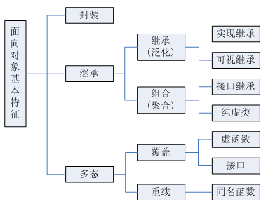

面向对象三要素：封装、继承、多态

- `封装`：封装是指把一个对象的状态信息（也就是属性）隐藏在对象内部，不允许外部对象直接访问对象的内部信息。但是可以提供一些可以被外界访问的方法来操作属性。 
- `继承`：基于基类的方法，并做出自己的扩展。 通过使用继承我们能够非常方便地复用以前的代码。 
- `多态`：多态是同一个行为具有多个不同表现形式或形态的能力。基于对象所属类的不同，外部对同一个方法的调用，实际执行的逻辑不同。具体表现为父类的引用指向子类的实例。

方法签名：`方法名+参数列表（参数类型、个数、顺序）`

**重写**：

子类重写父类的方法，只有实例方法可以被重写，重写后的方法必须仍为实例方法。

1. 返回值类型、方法名、参数列表必须相同，抛出的异常范围小于等于父类，访问修饰符范围大于等于父类。
2. 如果父类方法访问修饰符为 `private/final/static` 则子类就不能重写该方法，但是被 static 修饰的方法能够被再次声明。
3. 构造方法无法被重写

**重载**：

在一个类中，有多个方法名相同，参数列表不同（参数个数不同，参数类型不同），与方法的返回值无关，与权限修饰符无关。**编译器通过对方法签名的识别即可静态编译出不同的方法。这也是java中重载与重写的区别之一**。 

**Java中父类和子类初始化顺序**：

1. 父类中静态成员变量和静态代码块；
2. 子类中静态成员变量和静态代码块；
3. 父类中普通成员变量和代码块，父类的构造函数；
4. 子类中普通成员变量和代码块，子类的构造函数。

其中“和”字两端的代码按照先后顺序执行。

#### 数据类型

**基本类型**：

| 基本类型 | 包装类    | 位数 | 字节 | 默认值  |
| -------- | --------- | ---- | ---- | ------- |
| int      | Integer   | 32   | 4    | 0       |
| short    | Short     | 16   | 2    | 0       |
| long     | Long      | 64   | 8    | 0L      |
| byte     | Byte      | 8    | 1    | 0       |
| char     | Character | 16   | 2    | 'u0000' |
| float    | Float     | 32   | 4    | 0f      |
| double   | Double    | 64   | 8    | 0d      |
| boolean  | Boolean   | 1    |      | false   |

boolean 只有两个值：true、false，可以使用 1 bit 来存储，但是具体大小没有明确规定。JVM 会在编译时期将 boolean 类型的数据转换为 int，使用 1 来表示 true，0 表示 false。 

注意：

1. Java里使用long类型的数据一定要在数值后面加上L，否则将作为整形解析；
2. `char a='h'`单引号、`String a="h"`：双引号。

**自动拆箱与装箱**：

- **装箱**：将基本类型用它们对应的引用类型包装起来；
- **拆箱**：将包装类型转换为基本数据类型；

**常量池**：

`Byte`,`Short`,`Integer`,`Long`,`Character`,`Boolean`；前面四种包装类默认创建了数值[-128,127]的相应类型的缓存数据，Character创建了[0,127]范围的缓存数据，Boolean直接返回True Or False。如果超出对应范围仍然回去创建新的对象。

```java
private static class CharacterCache {
    private CharacterCache(){}
    static final Character cache[] = new Character[127 + 1];
    static {
        for (int i = 0; i < cache.length; i++)
            cache[i] = new Character((char)i);
    }
}
```

两种浮点数的包装类Float，Double没有实现常量池技术：

```java
Integer i1 = 33;
Integer i2 = 33;
System.out.println(i1 == i2);// 输出 true
Integer i11 = 333;
Integer i22 = 333;
System.out.println(i11 == i22);// 输出 false
Double i3 = 1.2;
Double i4 = 1.2;
System.out.println(i3 == i4);// 输出 false
```

Integer 缓存源代码：

```java
/**
*此方法将始终缓存-128 到 127（包括端点）范围内的值，并可以缓存此范围之外的其他值。
*/
public static Integer valueOf(int i) {
    if (i >= IntegerCache.low && i <= IntegerCache.high)
        return IntegerCache.cache[i + (-IntegerCache.low)];
    return new Integer(i);
}
```

应用场景：

1. Integer i1=40；Java 在编译的时候会直接将代码封装成 Integer i1=Integer.valueOf(40);，从而使用常量池中的对象。
2. Integer i1 = new Integer(40);这种情况下会创建新的对象。

```java
Integer i1 = 40;
Integer i2 = new Integer(40);
System.out.println(i1 == i2);//输出 false
Integer i3 = new Integer(40);
System.out.println(i2 == i3);//输出 true
i3=i3+1;//先拆箱后装箱
System.out.println(i2 == i3);//输出 false
```

#### String

简单的来说：**`String` 类中使用 final 关键字修饰字符数组来保存字符串**，`private final char value[]`，所以**`String` 对象是不可变的**。

```java
public final class String
    implements java.io.Serializable, Comparable<String>, CharSequence {
    /** The value is used for character storage. */
    private final char value[];
}
```

value 数组被声明为 final，这意味着 value 数组初始化之后就不能再引用其它数组。并且 **String 内部没有改变 value 数组的方法**，因此可以保证 **`String` 不可变**。 

不可变的好处：

1. **线程安全**。

2. **可以缓存hash值**。String 的 hash 值经常被使用，例如 String 用做 HashMap 的 key。不可变的特性可以使得 hash 值也不可变，因此只需要进行一次计算。 

3. **`String Pool`的需要**。如果一个 String 对象已经被创建过了，那么就会从 String Pool 中取得引用。只有 String 是不可变的，才可能使用 String Pool。 

   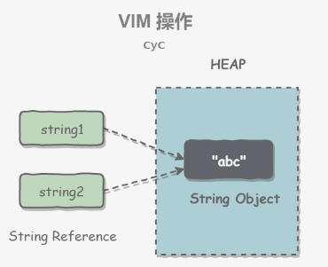

   字符串常量池（String Pool）保存着所有字符串字面量（literal strings），这些字面量在编译时期就确定。不仅如此，还可以使用 String 的 intern() 方法在运行过程将字符串添加到 String Pool 中。 

   ```java
   String s1 = new String("aaa");
   String s2 = new String("aaa");
   System.out.println(s1 == s2);// false
   //intern()首先将"aaa"放入String Pool中，然后返回这个字符串的应勇。
   String s3 = s1.intern();
   String s4 = s2.intern();
   System.out.println(s3 == s4);// true
   ```

   如果直接使用"bb"这种字面量的形式创建字符串，会自动地将字符串放入String Pool中。

   ```java
   String s5 = "bbb";
   String s6 = "bbb";
   System.out.println(s5 == s6);  // true
   ```

   > 在 Java 7 之前，String Pool 被放在运行时常量池中，它属于永久代。而在 Java 7，String Pool 被移到堆中。这是因为永久代的空间有限，在大量使用字符串的场景下会导致 OutOfMemoryError 错误。 

而 `StringBuilder` 与 `StringBuffer` 都继承自 `AbstractStringBuilder` 类，在 `AbstractStringBuilder` 中也是使用字符数组保存字符串`char[]value` 但是没用 `final` 关键字修饰，所以这两种对象都是可变的。`StringBuilder` 与 `StringBuffer` 的构造方法都是调用父类构造方法也就是`AbstractStringBuilder` 实现的：

```java
abstract class AbstractStringBuilder implements Appendable, CharSequence {
    /**
     * The value is used for character storage.
     */
    char[] value;
    /**
     * The count is the number of characters used.
     */
    int count;
    AbstractStringBuilder(int capacity) {
        value = new char[capacity];
    }
}
```

 `AbstractStringBuilder` 是 `StringBuilder` 与 `StringBuffer` 的公共父类，定义了一些字符串的基本操作，如 `expandCapacity`、`append`、`insert`、`indexOf` 等公共方法。

- `StringBuffer` 对方法加了同步锁或者对调用的方法加了同步锁，所以是**线程安全**的。
- `StringBuilder` 并没有对方法进行加同步锁，所以是**非线程安全**的。 

对于三者使用的总结：

1. 操作少量的数据: 适用 `String`
2. 单线程操作字符串缓冲区下操作大量数据: 适用 `StringBuilder`
3. 多线程操作字符串缓冲区下操作大量数据: 适用 `StringBuffer`

#### Object

```java
//native方法，用于返回对象的哈希码，主要使用在哈希表中，比如JDK中的HashMap。可以被重写。
public native int hashCode()
//用于比较2个对象的内存地址是否相等，String类对该方法进行了重写用户比较字符串的值是否相等。
public boolean equals(Object obj)
//naitive方法，用于创建并返回当前对象的一份拷贝。
protected native Object clone() throws CloneNotSupportedException
//返回类的名字@实例的哈希码的16进制的字符串。建议Object所有的子类都重写这个方法。
public String toString()
////native方法，用于返回当前运行时对象的Class对象，使用了final关键字修饰，故不允许子类重写。
public final native Class<?> getClass()
//实例被垃圾回收器回收的时候触发的操作
protected void finalize() throws Throwable {}
//native方法，并且不能重写。唤醒一个在此对象监视器上等待的线程(监视器相当于就是锁的概念)。如果有多个线程在等待只会任意唤醒一个。
public final native void notify()
//跟notify一样，唯一的区别就是会唤醒在此对象监视器上等待的所有线程
public final native void notifyAll()
//native方法，并且不能重写。暂停线程的执行。注意：sleep方法没有释放锁，而wait方法释放了锁 。timeout是等待时间。
public final native void wait(long timeout) throws InterruptedException
//多了nanos参数，这个参数表示额外时间
public final void wait(long timeout, int nanos) throws InterruptedException
//跟之前的2个wait方法一样，只不过该方法一直等待，没有超时时间这个概念
public final void wait() throws InterruptedException
```

1. clone()

   ```java
   public class CloneExample implements Cloneable {
       private int a;
       private int b;
       @Override
       public Object clone() throws CloneNotSupportedException {
           return super.clone();
       }
   }
   
   CloneExample e1 = new CloneExample();
   try {
       CloneExample e2 = e1.clone();
   } catch (CloneNotSupportedException e) {
       e.printStackTrace();
   }
   ```

   clone() 方法并不是 Cloneable 接口的方法，而是 Object 的一个 protected 方法。Cloneable 接口只是规定，如果一个类没有实现 Cloneable 接口又调用了 clone() 方法，就会抛出 CloneNotSupportedException。 

   - 浅拷贝：对基本数据类型进行值传递；对引用数据类型进行引用传递般的拷贝。
   - 深拷贝：对基本数据类型进行值传递；对引用数据类型，创建一个新的对象，并复制其内容。

   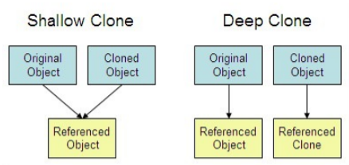

2. wait()

   当前线程等待直到其他线程调用该对象的 `notify` 或者 `notifyAll`方法。当前线程必须拥有该对象的 `monitor`。线程释放该对象`monitor`的拥有权，并且等待到别的线程通知等待在该对象`monitor`上的线程苏醒。然后线程重新拥有`monitor`并继续执行。 

3. notify()

   唤醒一个等待在该对象`monitor`上的线程。如果有多个线程等待，则会随机选择一个线程唤醒。线程等待是通过调用`wait`方法。 

   该方法只能被拥有该对象`monitor`的线程调用。线程拥有`monitor`有下面三种方式： 

   - 执行该对象的 `synchronized` 方法
   - 执行以该对象作为同步语句的`synchronized`方法体
   - 对于class对象，可以执行该对象的`static synchronized`方法

4. equals()

   - **==** : **它的作用是判断两个对象的地址是不是相等**。即，判断两个对象是不是同一个对象(基本数据类型==比较的是值，引用数据类型==比较的是内存地址)。 
   - **equals()** : 它的作用也是判断两个对象是否相等。但它一般有两种使用情况： 
     - 类没有覆盖 equals() 方法。则通过 equals() 比较该类的两个对象时，等价于通过“==”比较这两个对象。
     - 类覆盖了 equals() 方法。一般，我们都覆盖 equals() 方法来比较两个对象的内容是否相等；若它们的内容相等，则返回 true (即，认为这两个对象相等)。 

   说明：

   - String 中的 equals 方法是被重写过的，因为 object 的 equals 方法是比较的对象的内存地址，而 String 的 equals 方法比较的是对象的值。
   - 当创建 String 类型的对象时，虚拟机会在常量池中查找有没有已经存在的值和要创建的值相同的对象，如果有就把它赋给当前引用。如果没有就在常量池中重新创建一个 String 对象。

5. hashCode()

   hashCode() 的作用是获取哈希码，也称为散列码；它实际上是返回一个 int 整数。这个哈希码的作用是确定该对象在哈希表中的索引位置。hashCode() 定义在 JDK 的 Object.java 中，这就意味着 Java 中的任何类都包含有 hashCode() 函数。 

   **散列表**存储的是键值对(key-value)，它的特点是：能根据“键”快速的检索出对应的“值”。这其中就利用到了散列码！（可以快速找到所需要的对象）。

   我们先以“HashSet 如何检查重复”为例子来说明为什么要有 hashCode：

   当你把对象加入 HashSet 时，HashSet 会先计算对象的 hashcode 值来判断对象加入的位置，同时也会与该位置其他已经加入的对象的 hashcode 值作比较。

   - 如果没有相符的 hashcode，HashSet 会假设对象没有重复出现。

   - 但是如果发现有相同 hashcode 值的对象，这时会调用 `equals()`方法来检查 hashcode 相等的对象是否真的相同。
     - 如果两者相同，HashSet 就不会让其加入操作成功。
     - 如果不同的话，就会重新散列到其他位置。

   `hashCode()` 的作用就是**获取哈希码**，也称为散列码；它实际上是返回一个 int 整数。这个哈希码的作用是确定该对象在哈希表中的索引位置。**`hashCode()`在散列表中才有用，在其它情况下没用**。在散列表中 hashCode() 的作用是获取对象的散列码，进而确定该对象在散列表中的位置。 

#### 泛型

泛型可以使类型（类和接口）在定义类、接口和方法时进行参数化。与在方法定义的形参类似，类型参数化能让不同的输入使用同一份代码。差别在于，形参传入的是值，而类型参数化传入的是类型。 

```java
public class Box<T> {
    // T stands for "Type"
    private T t;
    public void set(T t) { this.t = t; }
    public T get() { return t; }
}
```

**有界类型参数**：

当一个方法进行数字计算，并且想接收所有 `Number` 类型及其子类时，就需要用到有界类型参数。要声明一个有界类型参数，先列出该类型参数的名称，然后是 `extends` 关键字，然后是其上界，在这里是 `Number`。 

```java
public <U extends Number> void inspect(U u){
    System.out.println("T: " + t.getClass().getName());
    System.out.println("U: " + u.getClass().getName());
}
```

**通配符**：

在泛型中，**使用 `?` 做为通配符，代表未知类型**。有界类型参数在上面已有介绍： `List`。类似的，通配符可以没有上界，即 `List`，这被称之为未知类型的List。  通配符还可声明类型参数的下界：`List<? super Integer>`。

**类型擦除**：

Java 语言引入了泛型，以在编译时提供更严格的类型检查并支持泛型编程。在Java编译期间，所有的泛型信息都会被擦掉，就是指类型擦除：

1. 替换所有类型参数为他们的上界或者 `Object`，因此，字节码仅包含普通的类，接口和方法。
2. 必要时插入类型转换，以保持类型安全。
3. 生成桥接方法以在扩展的泛型类型中保留多态。

#### 异常

Java异常类层次结构图：

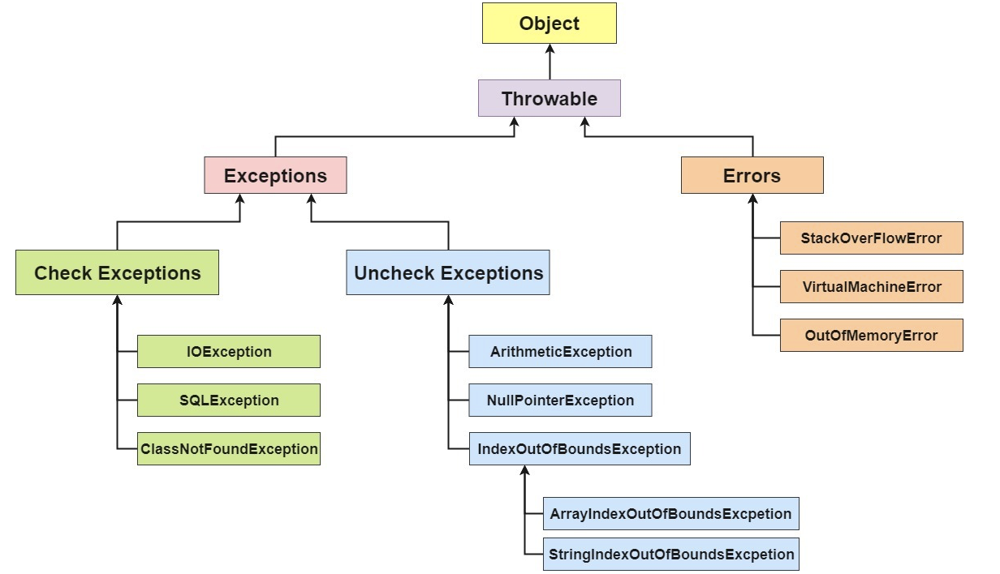

所有的异常都有一个共同的祖先`java.lang`包中的`Throwable`类。`Throwable`类有两个重要的子类：`Exception`(异常)和`Error`(错误)。`Exception` 能被程序本身处理(`try-catch`)， `Error` 是无法处理的(只能尽量避免)。 

- `Exception`：程序本身可以处理的异常，可以通过 `catch` 来进行捕获。`Exception` 又可以分为 **受检查异常**(必须处理) 和 **不受检查异常**(可以不处理)。 
- `Error`：`Error` 属于程序无法处理的错误 。这些异常发生时，Java 虚拟机（JVM）一般会选择线程终止。 

**Throwable**类常用方法：

- **`public string getMessage()`**:返回异常发生时的简要描述
- **`public string toString()`**:返回异常发生时的详细信息
- **`public string getLocalizedMessage()`**:返回异常对象的本地化信息。使用 `Throwable` 的子类覆盖这个方法，可以生成本地化信息。如果子类没有覆盖该方法，则该方法返回的信息与 `getMessage（）`返回的结果相同
- **`public void printStackTrace()`**:在控制台上打印 `Throwable` 对象封装的异常信息

**`try-catch-finally`**

- **`try`块：** 用于捕获异常。其后可接零个或多个 `catch` 块，如果没有 `catch` 块，则必须跟一个 `finally` 块。
- **`catch`块：** 用于处理 try 捕获到的异常。
- **`finally` 块：** 无论是否捕获或处理异常，`finally` 块里的语句都会被执行。当在 `try` 块或 `catch` 块中遇到 `return` 语句时，`finally` 语句块将在方法返回之前被执行。

以下三种情况，`finally`块不会被执行：

1. 在 `try` 或 `finally `块中用了 `System.exit(int)`退出程序。但是，如果 `System.exit(int)` 在异常语句之后，`finally` 还是会被执行
2. 程序所在的线程死亡。
3. 关闭 CPU。

**注意**：当 try 语句和 finally 语句中都有 return 语句时，在方法返回之前，finally 语句的内容将被执行，并且 **finally 语句的返回值将会覆盖原始的返回值**。 

**`try-catch-resources`**

1. **适用范围（资源的定义）：** 任何实现 `java.lang.AutoCloseable`或者 `java.io.Closeable` 的对象。
2. **关闭资源和 final 的执行顺序：** 在 `try-with-resources` 语句中，任何 catch 或 finally 块在声明的资源关闭后运行。

Java 中类似于`InputStream`、`OutputStream` 、`Scanner` 、`PrintWriter`等的资源都需要我们调用`close()`方法来手动关闭，一般情况下我们都是通过`try-catch-finally`语句来实现这个需求，如下： 

```java
try-catch-finally:
---
Scanner scanner = null;
try {
    scanner = new Scanner(new File("D://read.txt"));
    while (scanner.hasNext()) {
        System.out.println(scanner.nextLine());
    }
} catch (FileNotFoundException e) {
    e.printStackTrace();
} finally {
    if (scanner != null) {
        scanner.close();
    }
}

try-with-resources:
---
try (Scanner scanner = new Scanner(new File("test.txt"))) {
	while (scanner.hasNext()) {
		System.out.println(scanner.nextLine());
	}
} catch (FileNotFoundException fnfe) {
    fnfe.printStackTrace();
}
```

#### `I\O`流

何为I/O？

根据冯.诺依曼结构，计算机结构分为 5 大部分：运算器、控制器、存储器、输入设备、输出设备。 

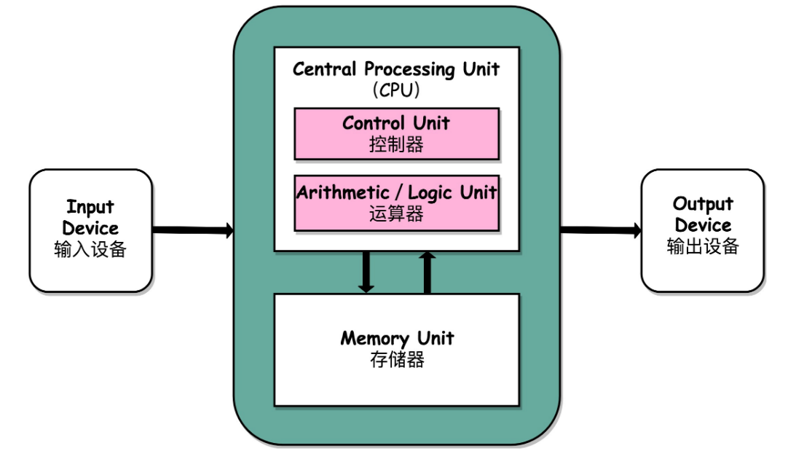

为了保证操作系统的稳定性和安全性，一个进程的地址空间划分为 **用户空间（User space）** 和 **内核空间（Kernel space ）** 。

我们平常运行的应用程序都是运行在用户空间，只有内核空间才能进行系统态级别的资源有关的操作，比如如文件管理、进程通信、内存管理等等。也就是说，我们想要进行 IO 操作，一定是要依赖内核空间的能力。并且，用户空间的程序不能直接访问内核空间。 因此，用户进程想要执行 IO 操作的话，必须通过 **系统调用** 来间接访问内核空间。

平常开发过程中接触最多的就是 **磁盘 IO（读写文件）** 和 **网络 IO（网络请求和相应）**。**从应用程序的视角来看的话，我们的应用程序对操作系统的内核发起 IO 调用（系统调用），操作系统负责的内核执行具体的 IO 操作。也就是说，我们的应用程序实际上只是发起了 IO 操作的调用而已，具体 IO 的执行是由操作系统的内核来完成的。** 

当应用程序发起 I/O 调用后，会经历两个步骤：

1. 内核等待 I/O 设备准备好数据
2. 内核将数据从内核空间拷贝到用户空间。

常见的IO模型：BIO、NIO

- BIO

  同步阻塞 IO 模型中，应用程序发起 read 调用后，会一直阻塞，直到在内核把数据拷贝到用户空间。

  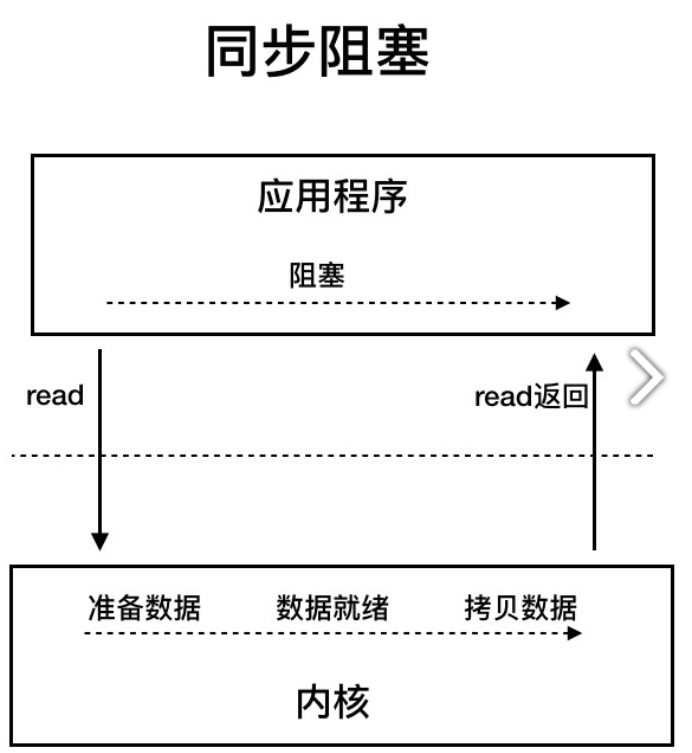

- NIO

  Java 中的 NIO 于 Java 1.4 中引入，对应 `java.nio` 包，提供了 `Channel` , `Selector`，`Buffer` 等抽象。NIO 中的 N 可以理解为 Non-blocking，不单纯是 New。它支持面向缓冲的，基于通道的 I/O 操作方法。 对于高负载、高并发的（网络）应用，应使用 NIO 。

  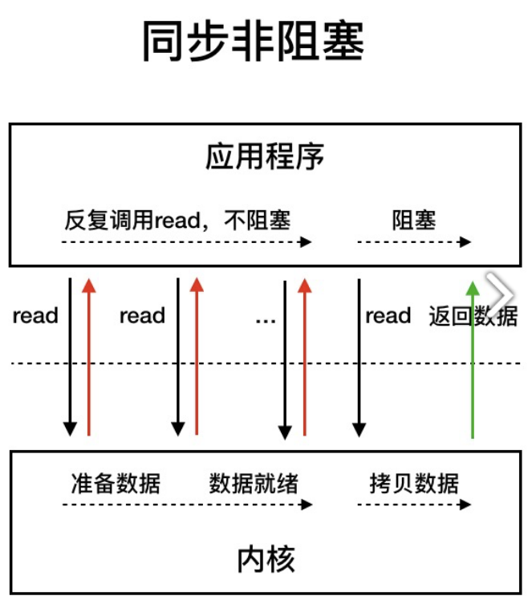

  同步非阻塞 IO 模型中，应用程序会一直发起 read 调用，等待数据从内核空间拷贝到用户空间的这段时间里，线程依然是阻塞的，直到在内核把数据拷贝到用户空间。同步非阻塞IO模型也存在问题： **应用程序不断进行 I/O 系统调用轮询数据是否已经准备好的过程是十分消耗 CPU 资源的。** 

  **I/O多路复用模型**

  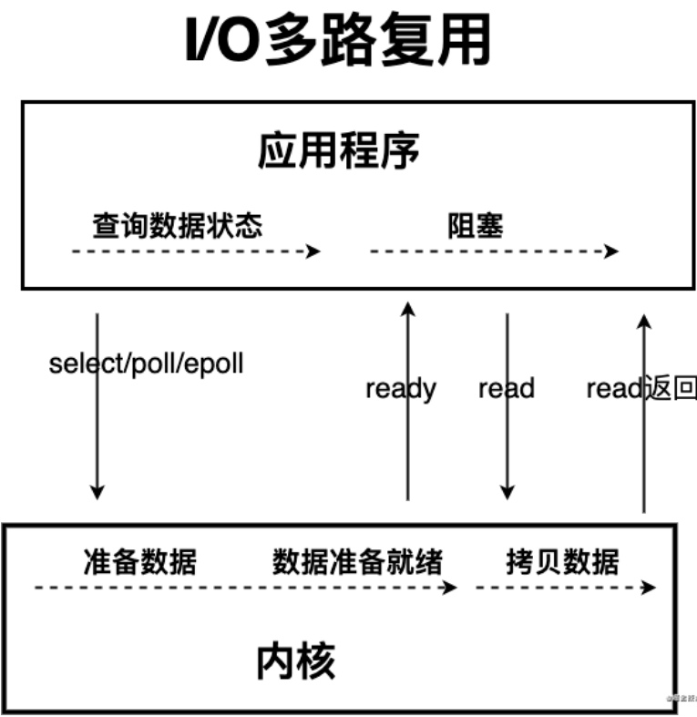

  IO 多路复用模型中，线程首先发起 select 调用，询问内核数据是否准备就绪，等内核把数据准备好了，用户线程再发起 read 调用。read 调用的过程（数据从内核空间->用户空间）还是阻塞的。

  > 目前支持 IO 多路复用的系统调用，有 select，epoll 等等。select 系统调用，是目前几乎在所有的操作系统上都有支持
  >
  > - **select 调用** ：内核提供的系统调用，它支持一次查询多个系统调用的可用状态。几乎所有的操作系统都支持。
  > - **epoll 调用** ：linux 2.6 内核，属于 select 调用的增强版本，优化了 IO 的执行效率。

  

  **IO 多路复用模型，通过减少无效的系统调用，减少了对 CPU 资源的消耗。** 

  Java 中的 NIO ，有一个非常重要的**选择器 ( Selector )** 的概念，也可以被称为 **多路复用器**。通过它，只需要一个线程便可以管理多个客户端连接。当客户端数据到了之后，才会为其服务。 

  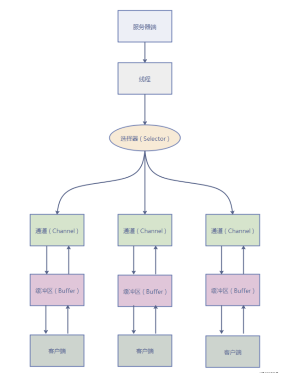

Java中的`IO`流：

- 按照流的流向分，可以分为输入流和输出流；
- 按照操作单元划分，可以划分为字节流和字符流；
- 按照流的角色划分为节点流和处理流。

 Java I0 流的 40 多个类都是从如下 4 个抽象类基类中派生出来的：

- InputStream/Reader: 所有的输入流的基类，前者是字节输入流，后者是字符输入流。
- OutputStream/Writer: 所有输出流的基类，前者是字节输出流，后者是字符输出流。

按操作方式分类结构图：

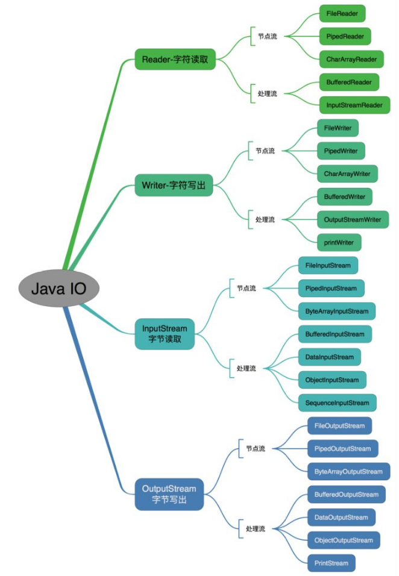

按操作对象分类结构图：

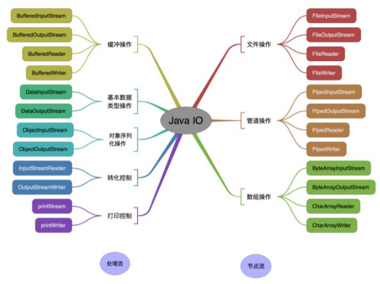

> 既然有了字节流，为什么还要有字符流？
>
> 不管是文件读写还是网络接收，信息的最小存储单元都是字节。字符流是由Java虚拟机将字节转换得到的，这个过程非常耗时，并且如果我们不知道编码类型很容易出现乱码问题。所以IO流就干脆提供了一个直接操作字符的接口，方便我们平时对字符进行流操作。

#### 多线程

**线程、程序、进程的基本概念**：

- `程序`：指含有指令和数据的文件，被存储在磁盘或其他的数据存储设备中，也就是说程序是静态的代码；
- `进程`：进程时程序的一次执行过程，是系统运行程序的基本单位，因此进程是动态的。系统运行一个程序即是一个进程从创建、运行到小王的过程。简单来说，一个进程就是一个执行中的程序，它在计算机中一个指令接着一个指令地执行着，同时，每个进程还占有某些系统资源如 CPU 时间，内存空间，文件，输入输出设备的使用权等等。换句话说，当程序在执行时，将会被操作系统载入内存中。 线程是进程划分成的更小的运行单位。线程和进程最大的不同在于基本上各进程是独立的，而各线程则不一定，因为同一进程中的线程极有可能会相互影响。
- `线程`：与进程相似，但线程是一个比进程更小的执行单位。一个进程在其执行的过程中可以产生多个线程。与进程不同的是同类的多个线程共享同一块内存空间和一组系统资源，所以系统在产生一个线程，或是在各个线程之间作切换工作时，负担要比进程小得多，也正因为如此，线程也被称为轻量级进程。 

**线程的基本状态**：

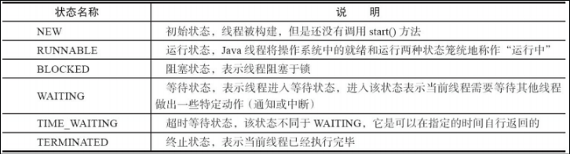

线程在生命周期中并不是固定处于某一个状态而是随着代码的执行在不同状态之间切换。Java 线程状态变迁如下图所示：

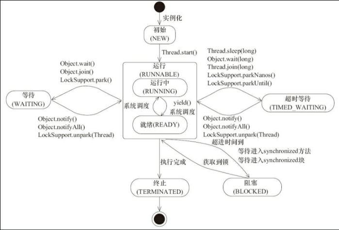

线程创建之后它将处于 NEW（新建） 状态，调用 `start()` 方法后开始运行，线程这时候处于 READY（可运行） 状态。可运行状态的线程获得了 cpu 时间片（timeslice）后就处于 RUNNING（运行） 状态。 

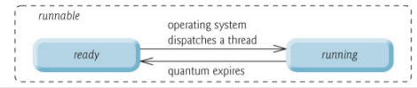

当线程执行 `wait()`方法之后，线程进入 **WAITING（等待）** 状态。进入等待状态的线程需要依靠其他线程的通知才能够返回到运行状态，而 **TIME_WAITING(超时等待)** 状态相当于在等待状态的基础上增加了超时限制，比如通过 `sleep（long millis）`方法或 `wait（long millis）`方法可以将 Java 线程置于 TIMED WAITING 状态。当超时时间到达后 Java 线程将会返回到 RUNNABLE 状态。当线程调用同步方法时，在没有获取到锁的情况下，线程将会进入到 **BLOCKED（阻塞）** 状态。线程在执行 Runnable 的`run()`方法之后将会进入到 **TERMINATED（终止）** 状态。 


