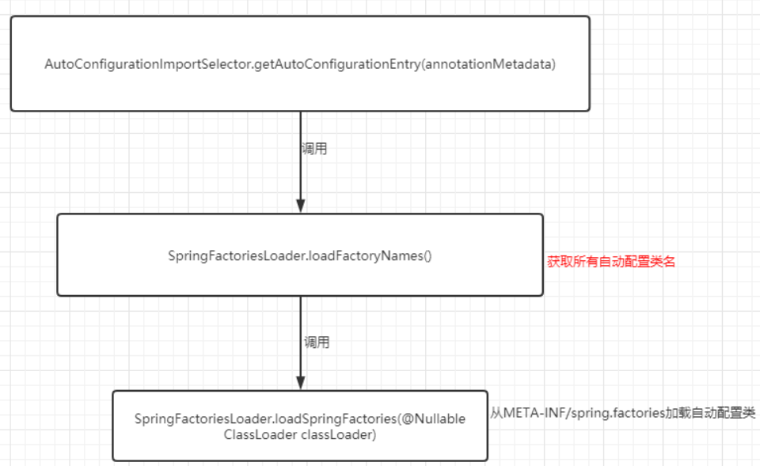
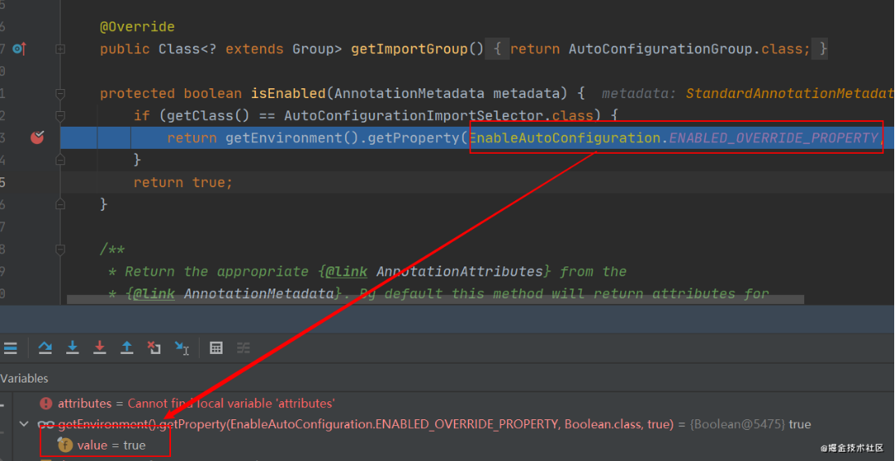
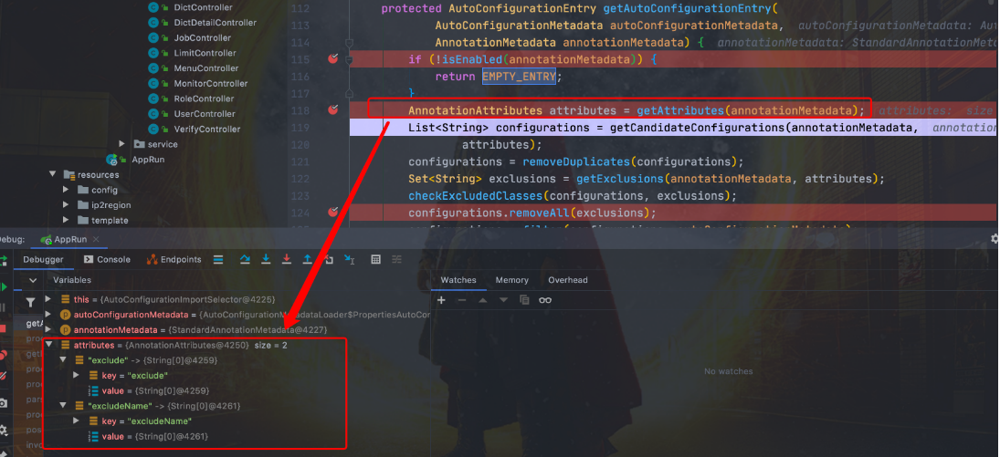
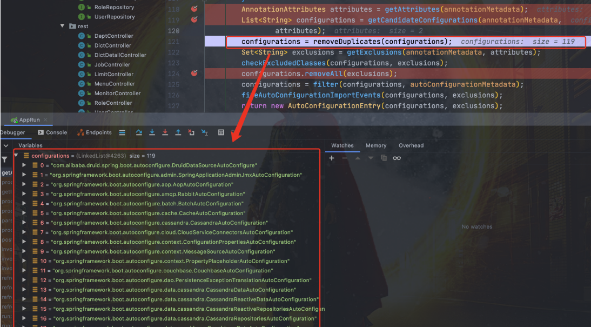
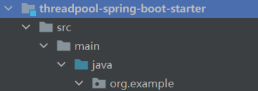
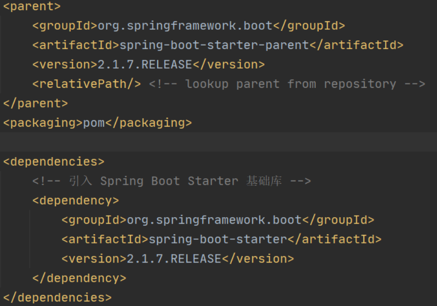
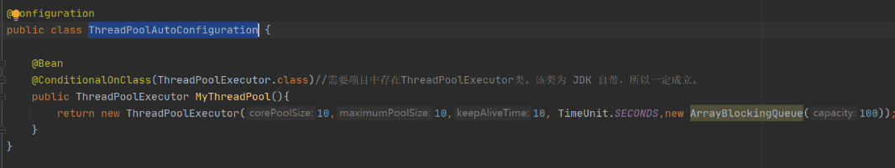
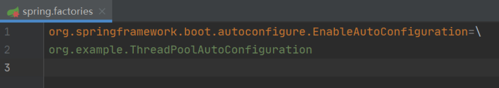
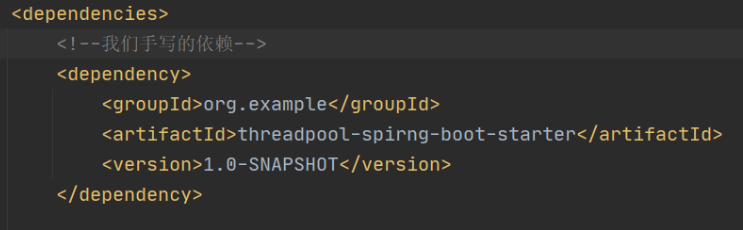
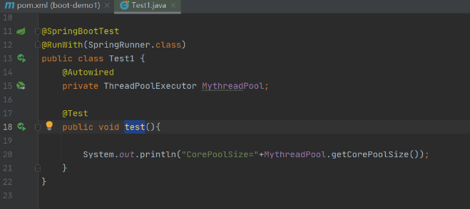

SpringBoot项目，我们只需要添加相关依赖，无需配置，通过启动下面的`main`方法即可。

```java
@SpringBootApplication
public class DemoApplication {
    public static void main(String[] args){
        SpringApplication.run(DemoApplication.class,args);
    }
}
```

并且，我们通过 Spring Boot 的全局配置文件 `application.properties`或`application.yml`即可对项目进行设置比如更换端口号，配置 JPA 属性等等。

#### SpringBoot 自动装配

我们现在提到自动装配的时候，一般会和 Spring Boot 联系在一起。但是，实际上 Spring Framework 早就实现了这个功能。Spring Boot 只是在其基础上，通过 SPI 的方式，做了进一步优化。

> SpringBoot定义了一套接口规范，这套规范规定：SpringBoot在启动时会扫描外部引用jar包中的`META-INF/spring.factories`文件，将文件中配置的类型信息加载到Spring容器（此处涉及到JVM类加载机制与Spring的容器知识），并执行类中定义的各种操作。只需要按照SpringBoot定义的标准，就能将自己的功能配置进SpringBoot。

没有 Spring Boot 的情况下，如果我们需要引入第三方依赖，需要手动配置，非常麻烦。但是，Spring Boot 中，我们直接引入一个 starter 即可。比如你想要在项目中使用 redis 的话，直接在项目中引入对应的 starter 即可。

```java
<dependency>
    <groupId>org.springframework.boot</groupId>
    <artifactId>spring-boot-starter-data-redis</artifactId>
</dependency>
```

引入stater之后，我们通过少量注解和一些简单的配置就能使用第三方组件提供的功能。

首先来看SpringBoot的核心注解`SpringBootApplication`。

```java
@Target(ElementType.TYPE)
@Retention(RetentionPolicy.RUNTIME)
@Documented
@Inherited
@SpringBootConfiguration
@EnableAutoConfiguration
@ComponentScan(excludeFilters = { @Filter(type = FilterType.CUSTOM, classes = TypeExcludeFilter.class),@Filter(type = FilterType.CUSTOM, classes = AutoConfigurationExcludeFilter.class) })
public @interface SpringBootApplication {
}
```

而`@SpringBootConfiguration`其实就是一个`@Configuration`：

```java
@Target(ElementType.TYPE)
@Retention(RetentionPolicy.RUNTIME)
@Documented
@Configuration
public @interface SpringBootConfiguration {
}
```

所以@SpringBootApplication可以看作是下面三个注解的集合：

1. **@Configuration**：允许上下文中注册额外的bean或导入其他配置类。
2. **@ComponentScan**：扫描被`@Component` (`@Service`,`@Controller`)注解的 bean，注解默认会扫描启动类所在的包下所有的类 ，可以自定义不扫描某些 bean。如下图所示，容器中将排除`TypeExcludeFilter`和`AutoConfigurationExcludeFilter`。
3. **@EnableAutoConfiguration**：启用 SpringBoot 的自动配置机制。

**`@EnableAutoConfiguration` 是实现自动装配的重要注解，我们以这个注解入手**。

#### @EnableAutoConfiguration：实现自动装配的核心注解

`@EnableAutoConfiguration`只是一个简单的注解，自动装配核心功能的实现实际上是通过**`AutoConfigurationImportSelector`**类。

```java
@Target({ElementType.TYPE})
@Retention(RetentionPolicy.RUNTIME)
@Documented
@Inherited
@AutoConfigurationPackage //作用：将main包下的所欲组件注册到容器中
@Import({AutoConfigurationImportSelector.class}) //加载自动装配类 xxxAutoconfiguration
public @interface EnableAutoConfiguration {
    String ENABLED_OVERRIDE_PROPERTY = "spring.boot.enableautoconfiguration";

    Class<?>[] exclude() default {};

    String[] excludeName() default {};
}
```

#### AutoConfigurationImportSelector：加载自动装配类

`AutoConfigurationImportSelector`类的继承关系如下：

```java
public class AutoConfigurationImportSelector implements DeferredImportSelector, BeanClassLoaderAware, ResourceLoaderAware, BeanFactoryAware, EnvironmentAware, Ordered {

}

public interface DeferredImportSelector extends ImportSelector {

}

public interface ImportSelector {
    String[] selectImports(AnnotationMetadata var1);
}
```

可以看出，`AutoConfigurationImportSelector`类实现了`ImportSelector`接口，也就实现了这个接口中的`selectImports`方法，该方法**主要用于获取所有条件的类的全限定类名，这些类需要被加载到`IoC`容器中**。

```java
private static final String[] NO_IMPORTS = {};

public String[] selectImports(AnnotationMetadata annotationMetadata) {
    //用于判断自动配置开关是否打开
    if (!isEnabled(annotationMetadata)) {
        return NO_IMPORTS;
    }
    //获取所有需要装配的bean
    AutoConfigurationMetadata autoConfigurationMetadata = AutoConfigurationMetadataLoader.loadMetadata(this.beanClassLoader);
    //重点是getAutoConfigurationEntry()方法
    AutoConfigurationEntry autoConfigurationEntry = getAutoConfigurationEntry(autoConfigurationMetadata,annotationMetadata);
    return StringUtils.toStringArray(autoConfigurationEntry.getConfigurations());
}
```

**`getAutoConfigurationEntry()`**方法，这个方法主要负责加载自动配置类的。

该方法的调用链如下：



结合**`getAutoConfigurationEntry()`**的源码来详细分析一下：

```java
protected AutoConfigurationEntry getAutoConfigurationEntry(AutoConfigurationMetadata autoConfigurationMetadata,AnnotationMetadata annotationMetadata) {
    //1
    if (!isEnabled(annotationMetadata)) {
        return EMPTY_ENTRY;
    }
    //2
    AnnotationAttributes attributes = getAttributes(annotationMetadata);
	//3
    List<String> configurations = getCandidateConfigurations(annotationMetadata, attributes);
    configurations = removeDuplicates(configurations);
    Set<String> exclusions = getExclusions(annotationMetadata, attributes);
    checkExcludedClasses(configurations, exclusions);
    configurations.removeAll(exclusions);
    //4
    configurations = filter(configurations, autoConfigurationMetadata);
    fireAutoConfigurationImportEvents(configurations, exclusions);
    return new AutoConfigurationEntry(configurations, exclusions);
}
```

1. 判断自动配置开关是否打开。默认是`spring.boot.enableautoconfiguration=true`，可以在`application.properties` 或 `application.yml` 中设置。

   

2. 用于获取`EnableAutoConfiguration`注解中的`exclude`和`excludeName`。

   

3. 获取需要自动装配的所有配置类，读取`META-INF/spring.factories`

   ```bash
   spring-boot/spring-boot-project/spring-boot-autoconfigure/src/main/resources/META-INF/spring.factories
   ```

   ```java
   List<String> configurations = getCandidateConfigurations(annotationMetadata, attributes);
   ```

   ```java
   protected List<String> getCandidateConfigurations(AnnotationMetadata metadata, AnnotationAttributes attributes) {
       List<String> configurations = SpringFactoriesLoader.loadFactoryNames(getSpringFactoriesLoaderFactoryClass(),                                                                 getBeanClassLoader());
       Assert.notEmpty(configurations, "No auto configuration classes found in META-INF/spring.factories. If you "
                       + "are using a custom packaging, make sure that file is correct.");
       return configurations;
   }
   ```

   

   不光是这个依赖下的`META-INF/spring.factories`被读取到，所有 Spring Boot Starter 下的`META-INF/spring.factories`都会被读取到。

4. `spring.factories`中这么多配置，每次启动都要全部加载么？

  只有`@ConditionalOnXXX` 中的所有条件都满足，该类才会生效。

  ```java
  configurations = filter(configurations, autoConfigurationMetadata);
  ```
  
  会对`configurations`进行过滤。
  
  例如：
  
  ```java
  @Configuration
  // 检查相关的类：RabbitTemplate 和 Channel是否存在,只有都存在才会加载
  @ConditionalOnClass({ RabbitTemplate.class, Channel.class })
  @EnableConfigurationProperties(RabbitProperties.class)
  @Import(RabbitAnnotationDrivenConfiguration.class)
  public class RabbitAutoConfiguration {
  }
  ```
  
  Spring Boot 提供的条件注解
  
  - `@ConditionalOnBean`：当容器里有指定 Bean 的条件下
  - `@ConditionalOnMissingBean`：当容器里没有指定 Bean 的情况下
  - `@ConditionalOnSingleCandidate`：当指定 Bean 在容器中只有一个，或者虽然有多个但是指定首选 Bean
  - `@ConditionalOnClass`：当类路径下有指定类的条件下
  - `@ConditionalOnMissingClass`：当类路径下没有指定类的条件下
  - `@ConditionalOnProperty`：指定的属性是否有指定的值
  - `@ConditionalOnResource`：类路径是否有指定的值
  - `@ConditionalOnExpression`：基于 SpEL 表达式作为判断条件
  - `@ConditionalOnJava`：基于 Java 版本作为判断条件
  - `@ConditionalOnJndi`：在 JNDI 存在的条件下差在指定的位置
  - `@ConditionalOnNotWebApplication`：当前项目不是 Web 项目的条件下
  - `@ConditionalOnWebApplication`：当前项目是 Web 项 目的条件下
  

  
#### 自定义一个Starter

实现自定义线程池：

1. 创建`threadpool-spring-boot-starter`工程

   

2. 引入 `SpringBoot` 相关依赖：

   

3. 创建`ThreadPoolAutoConfiguration`：

   

4. 在`threadpool-spring-boot-starter`工程的 resources 包下创建`META-INF/spring.factories`文件：

   

5. 最后新建工程引入`threadpool-spring-boot-starter`：

   

6. 测试：

   

#### 总结

Spring Boot 通过`@EnableAutoConfiguration`开启自动装配，通过 SpringFactoriesLoader 最终加载`META-INF/spring.factories`中的自动配置类实现自动装配，自动配置类其实就是通过`@Conditional`按需加载的配置类，想要其生效必须引入`spring-boot-starter-xxx`包实现起步依赖

  


