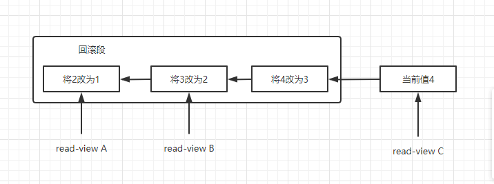
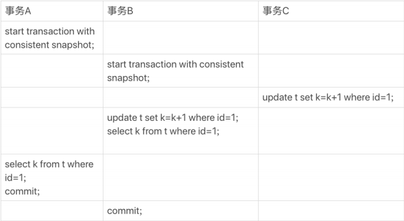
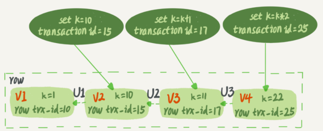
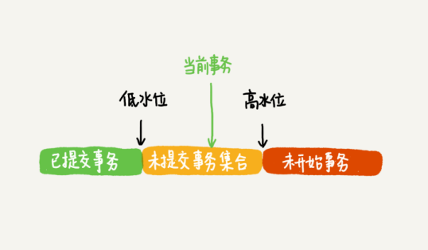
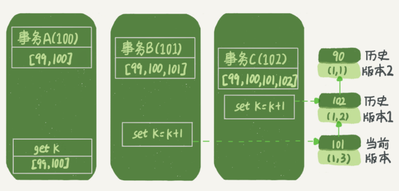
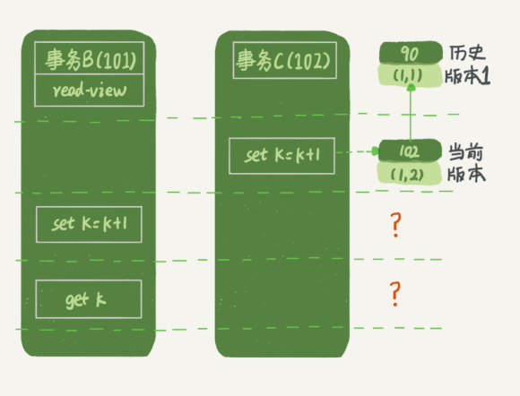
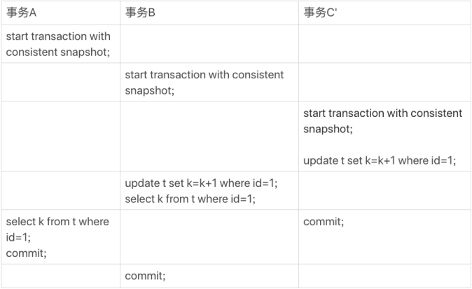
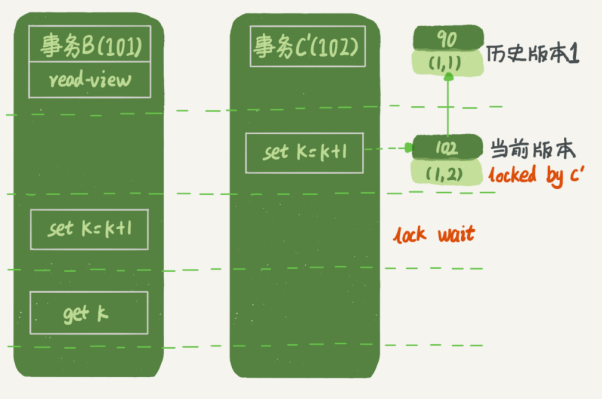
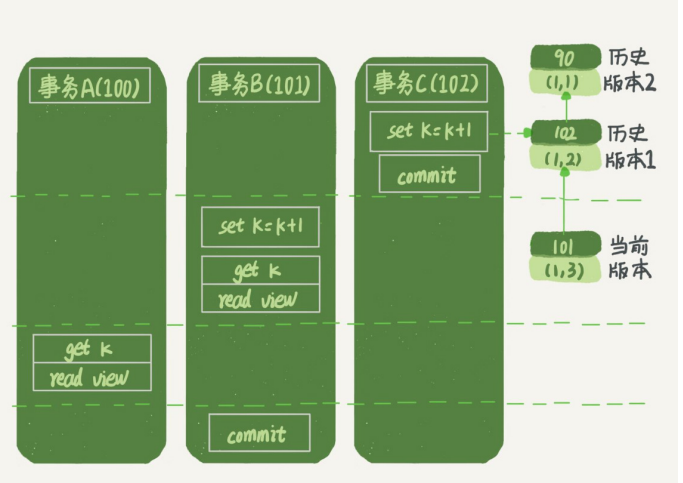

#### 一 .隔离性与隔离级别

事务的四大特性ACID：

- Atomicity：原子性
- Consistency：一致性
- Isolation：隔离性
- Durability：持久性

SQL标准的事务隔离级别：

- read uncommitted（读未提交）:一个事务还未提交，它做的变更就能被别的事务看到。
- read committed（读提交）:一个事务提交后，它做的变更才会被别的事务看到。
- repeatable read（可重复读）:一个事务执行过程中看到的数据，总是跟这个事务在启动时看到的数据是一致的。同时未提交的变更对其它事务也是不可见的。
- serializable（串行化）:写会加写锁，读会加读锁。当出现锁冲突的时候，后访问到的事务必须等前一个事务执行完成，才能继续执行。

在实现上，数据库里面会创建一个视图，访问的时候以视图的逻辑结果为准。在“Repeatable Read”隔离级别下，这个视图是在事务启动的时候创建的，整个事务存在期间都用这个视图。

在“read committed”隔离级别下，这个视图是在每个SQL语句开始执行的时候创建的。

使用

```sql
mysql> show variables like 'transaciton_isolation'; #8#
或者
mysql> show variables like 'tx_isolation';

#结果
+---------------+-----------------+
| Variable_name | Value           |
+---------------+-----------------+
| tx_isolation  | REPEATABLE-READ |
+---------------+-----------------+
1 row in set (0.00 sec)
```

查看隔离级别。

#### 二 .事务隔离的实现

以“repeatable read”为例。在mysql中实际上每条记录在更新的时候都会同时记录一条回滚操作。记录上的最新值，通过回滚操作，都可以得到前一个状态的值。

假设一个值从1按顺序改成了2，3，4，在**undo log**（回滚日志）里面就会有类似下面的记录：



当前值是4，但是查询这条记录的时候，不同时刻启动的事务会有不同的read-view。同一条记录在系统中可以存在不同的版本，就是数据库的MVCC（多版本并发控制）。对于read-view A，要想得到1，就必须将当前值依次执行图中所有的回滚操作得到。

**undo log**什么时候删除？系统会判断，当没有事务再需要用到这些回滚日志的时候，回滚日志会删除。就是当系统中没有比回滚日志更早的read-view的时候。

基于上面的说明，应该避免使用长事务。长事务意味着会存在很老的事务视图。由于这些事务随时可能访问数据库里面的任何数据，所以这个事务提交之前，数据库里面它可能会用到的回滚记录都必须保留，这回导致大量占用存储空间。并且长事务还会占用锁资源。

#### 三 .事务的启动方式

MySQL的事务启动方式有以下几种：

1. 显示启动事务语句，begin和start transaction。提交语句commit，回滚语句rollback；
2. set autocommit=0这个命令会将这个线程的自动提交关掉。需要主动commit或rollback。

建议使用set autocommit=1，通过显示的语句来启动事务。

 begin/start transaction 命令并不是一个事务的起点，在执行到它们之后的第一个操作 InnoDB 表的语句，事务才真正启动。如果你想要马上启动一个事务，可以使用 transaction with consistent snapshot 这个命令。 

#### 四.事务到底是否隔离

举例：

先执行只有两行的表的初始化语句：

```sql
mysql> CREATE TABLE `t` (
 `id` int(11) NOT NULL,
 `k` int(11) DEFAULT NULL,
 PRIMARY KEY (`id`)
) ENGINE=InnoDB;
insert into t(id, k) values(1,1),(2,2);
```

然后执行一下事务：



 在这个例子中，事务 C 没有显式地使用 begin/commit，表示这个 update 语句本身就是 一个事务，语句完成的时候会自动提交。事务 B 在更新了行之后查询 ; 事务 A 在一个只读 事务中查询，并且时间顺序上是在事务 B 的查询之后。 

执行后结果：事务B查到的k值为3，而事务A查到的k值是1。

疑惑(⊙o⊙)？？？

首先，在MySQL里，有两个试图概念：

- 一个是view。它是一个用查询语句定义的虚拟表，在调用的时候执行查询语句并生成结果。创建视图的语法是create view ...，而它的查询方法与表一样。
- 另一个是InnoDB在实现MVCC时用到的一致性读视图，即consistent read view，用于支持RC（Read Committed，读提交）和RR（Repeatable Read，可重复度）隔离级别的实现。它没有物理结构，作用是事务执行期间用来定义“我能看到什么数据”。

##### "快照"在MVCC里是怎么工作的

 InnoDB 里面每个事务有一个唯一的事务 ID，叫作 transaction id。它是在事务开始的时 候向 InnoDB 的事务系统申请的，是按申请顺序严格递增的。 

 而每行数据也都是有多个版本的。每次事务更新数据的时候，都会生成一个新的数据版本， 并且把 transaction id 赋值给这个数据版本的事务 ID，记为 row trx_id。同时，旧的数据 版本要保留，并且在新的数据版本中，能够有信息可以直接拿到它。 

 也就是说，数据表中的一行记录，其实可能有多个版本 (row)，每个版本有自己的 row trx_id。 比如：



 图中的三个虚线箭头，就是 undo log(回滚日志)；而 V1、V2、V3 并不是物理上真实存 在的，而是每次需要的时候根据当前版本和 undo log 计算出来的。比如，需要 V2 的时 候，就是通过 V4 依次执行 U3、U2 算出来。 

根据可重复读的定义，一个事务启动的时候，能够看到所有已经提交的十五结果。但是之后，这个事务执行期间，其他事务的更新对他不可见。

在实现上，InnoDB为每个事务构造了一个数组，用来保存这个事务启动瞬间，当前活跃的所有事务ID。活跃指的是，启动了但还没提交。

数组里面事务ID的最小值记为低水位，当前系统里面已经创建过的事务ID的最大值加1几位高水位。

这个视图数组和高水位，就组成了当前事务的一致性视图（consistent read view）。

而数据版本的可见性规则，就是基于数据的row trx_id和这个一致性视图的对比结果得到的。这个视图数组把所有的row trx_id分成了几种不同的情况。



这样，对于当前事务的启动瞬间来说，一个数据版本的row trx_id，有以下几种可能：

1. 如果落在绿色部分，表示这个版本是已提交的事务或者是当前事务自己生成的，这个数 据是可见的； 

2.  如果落在红色部分，表示这个版本是由将来启动的事务生成的，是肯定不可见的； 

3.  如果落在黄色部分，那就包括两种情况  

   a.  若 row trx_id 在数组中，表示这个版本是由还没提交的事务生成的，不可见； 

   b.  若 row trx_id 不在数组中，表示这个版本是已经提交了的事务生成的，可见。 

**InnoDB 利用了“所有数据都有多个版本”的这个特性，实现了“秒级创建快照”的能力。**


- 接下来，看一下栗子中的三个事务，分析事务A的语句返回的结果，为什么是k=1。

  先做出假设：

  1.  事务 A 开始前，系统里面只有一个活跃事务 ID 是 99； 
  2.  事务 A、B、C 的版本号分别是 100、101、102，且当前系统里只有这四个事务； 
  3.  三个事务开始前，(1,1）这一行数据的 row trx_id 是 90。 

  这样，事务A的视图数组就是 [99,100], 事务B的视图数组是 [99,100,101], 事务C的视图数组是 [99,100,101,102]。  

  事务A的查询逻辑有关的操作如下：

  

  第一个有效更新是事务 C，把数据从 (1,1) 改成了 (1,2)。这时候，这个 数据的最新版本的 row trx_id 是 102，而 90 这个版本已经成为了历史版本。

  第二个有效更新是事务 B，把数据从 (1,2) 改成了 (1,3)。这时候，这个数据的最新版本（即 row trx_id）是 101，而 102 又成为了历史版本。（？？？具体看下面的特殊情况：当前读）

  在事务 A 查询的时候，其实事务 B 还没有提交，但是它生成的 (1,3) 这 个版本已经变成当前版本了。但这个版本对事务 A 必须是不可见的，否则就变成脏读了。 

  现在事务 A 要来读数据了，它的视图数组是 [99,100]。读数据都是从当前版 本读起的。所以，事务 A 查询语句的读数据流程是这样的：

  -  找到 (1,3) 的时候，判断出 row trx_id=101，比高水位大，处于红色区域，不可见；  
  -  接着，找到上一个历史版本，一看 row trx_id=102，比高水位大，处于红色区域，不可见； 
  -  再往前找，找到了（1,1)，它的 row trx_id=90，比低水位小，处于绿色区域，可见。 

  这样执行下来，虽然期间这一行数据被修改过，但是事务 A 不论在什么时候查询，看到这行数据的结果都是一致的，所以我们称之为**一致性读**。 

  一个数据版本，对一个事务视图来说，**处理自己的更新总是可见以外**，有三种情况：

  1.  版本未提交，不可见； 
  2.  版本已提交，但是是在视图创建后提交的，不可见； 
  3.  版本已提交，而且是在视图创建前提交的，可见。 

- 更新逻辑，**分析事务B的update语句，如果按照一致性读，好像结果不对**

  事务 B 的视图数组是先生成的，之后事务 C 才提交，不是应该看不见 (1,2)吗，怎么能算出 (1,3) 来？ 

  

  如果事务 B 在更新之前查询一次数据，这个查询返回的 k 的值确实是 1。但是，当它要去更新数据的时候，就不能再在历史版本上更新了，**否则事务 C 的更新就丢失了**。因此，事务 B 此时的 set k=k+1 是在（1,2）的基础上进行的操作。 

  所以，这里就用到了一条规则：**更新数据都是先读后写，而这个读，只能读当前的值，成为“当前读”**。

  在**更新**的时候，当前读拿到的数据是 (1,2)，更新后生成了新版本的数据 (1,3)，这个 新版本的 row trx_id 是 101。所以，在执行事务 B **查询**语句的时候，一看自己的版本号是 101，最新数据的版本号也是 101，是自己的更新，可以直接使用，所以查询得到的 k 的值是 3。  

  其实，除了 update 语句外，select 语句如果加锁，也是当前读。如：

  ```sql
  读锁（S锁，共享锁）
  select k from t where id=1 lock in share mode;
  写锁（X锁，排他锁）
  select k from t where id=1 for update;
  ```

  假设事务 C 不是马上提交的，而是变成了下面的事务 C'，会怎么样呢？ 

  

  事务 C'的不同是，更新后并没有马上提交，在它提交前，事务 B 的更新语句先发起了。前面说过了，虽然事务 C'还没提交，但是 (1,2) 这个版本也已经生成了，并且是当前的最新版本。 

  这时候，就需要**两阶段锁协议**。

  事务 C'没提交，也就是说 (1,2) 这个版本上的写锁还没释放。而事务 B 是当前读，必须要读最新版本，而且必须加锁，因此就被锁住了，必须等到事务 C'释放这个锁，才能继续它的当前读。 

  

  **可重复读的核心就是一致性读(consistent read)而事务更新数据的时候，只能用当前读。如果当前的记录的行锁被其他事务占用的话，就需要进入锁等待。**

  而**读提交**的逻辑和**可重复读**的逻辑类似，它们最主要的区别是： 

  - 在可重复读隔离级别下，只需要在事务开始的时候创建一致性视图，之后事务里的其他查询都共用这个一致性视图；
  - 在读提交隔离级别下，每一个语句执行前都会重新算出一个新的视图。 

  首先说明以下， "start transaction with consistent snapshot; "的意思是从这个语句开始，创建一个持续整个事务的一致性快照。所以，在读提交隔离级别下，这个用法就没意义了，等效于普通的 start transaction，因为，**读提交隔离界级别下，每一个语句执行前都会重新算出一个新的视图**。  

  下面是读提交时的状态图，可以看到这两个查询语句的创建视图数组的时机发生了变化，就是图中的 read view 框。 

  

  这时，事务 A 的查询语句的视图数组是在执行这个语句的时候创建的，时序上 (1,2)、(1,3) 的生成时间都在创建这个视图数组的时刻之前。但是，在这个时刻： 

  -  (1,3) 还没提交，属于情况 1，不可见； 
  -  (1,2) 提交了，属于情况 3，可见。 

  所以，这时候事务 A 查询语句返回的是 k=2。显然地，事务 B 查询结果 k=3。 

#### 五. 参考

- [MySQL 实战45讲 ]( https://time.geekbang.org/column/intro/100020801 )

