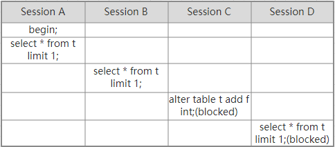
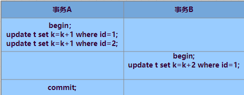

### 一 全局锁

全局锁就是对整个数据库实例加锁。MySQL提供了一个加全局锁的方法，命令是**Flush tables with read lock**(FTWRL)。当你需要整个数据库处于**只读**状态的时候，可以使用这个命令，之后其他线程的以下命令都会被阻塞：数据库更新命令、数据库定义语句和更新事务的提交语句。

**全局锁的典型应用场景：做全库逻辑备份。**

同时官方也自带的逻辑备份工具是：**mysqldump**。当mysqldump使用参数single-transaction的时候，导数据之前就会启动一个事务，来确保拿到一致性视图。而由于MVCC的支持，这个过程是可以正常更新的。前提是引擎要支持这个隔离级别。

### 二 表级锁

MySQL里面的表级锁分为两种：一种是表锁，一种是元数据锁。

表锁的语法是：lock tables ... read/write.对于InnoDB这种支持行锁的引擎，不建议使用lock tables命令来控制并发。

另一种就是**MDL**（metadata lock）。MDL不需要显示使用，在访问一个表时会被自动加上。MDL的作用是，保证读写的正确性。

当对一个表做增删改查操作的时候，加MDL读锁；当要对表结构变更操作的时候，加MDL写锁。

读锁之间不互斥，读写锁、写锁之间互斥，用来保证变更表结构操作的安全性。

Example：

>假设现在给一个小表T加个字段（实验环境5.6）
>
>
>
>可以发现session A先启动，这时候会对表t加一个MDL读锁。由于session B需要的也是MDL读锁，因此可以正常执行。之后session C会被blocked，是因为session A的读锁还没有被释放，而session C需要写锁，因此只能被阻塞。之后所有在表t上新申请MDL读锁的请求也会被阻塞。等于这个表完全不可读了。
>
>如果某个表上的查询语句频繁，而且客户端有重试机制，这个库的线程很快就会爆满。
>
>那么如何安全的给小表加字段呢？
>
>首先可以先解决长事务，事务不提交，就会一直占着MDL锁。可以暂停长事务或者kill掉。
>
>如果是一个热点表，kill掉后，立马会有新请求来。比较理想的机制是，在alter table语句里面设定等待时间。
>
>```sql
>alter table tbl_name nowait add column ...
>alter table tbl_name wait N add column ...
>```

Q6:

> 备份一般会在备库上执行，你在用-single-transaction方法做逻辑备份的过程中，如果主库上的小表做了一个DDL，比如给一个表上加了一列。这时候，从备库上会看到什么现象？

A6：

> 当备库做逻辑备份时，从主库的binlog传来一个DDL语句。
>
> 假设这个DDL是针对表t1的，这里把备份记录过程中的几个关键语句列出：
>
> ```sql
> Q1：set session transaction isolation level repeatable read;
> Q2：start transaction with consistent snapshot;
> /*other tables*/
> Q3：savepoint sp;
> /*时刻1*/
> Q4：show create table `t1`;
> /*时刻2*/
> Q5：select * from `t1`;
> /*时刻3*/
> Q6：rollback to savepoint sp;
> /*时刻4*/
> /*other tables*/
> ```
>
> 在备份开始的时候，确保是RR的隔离级别。
>
> 启动事务，这里用**with consistent snapshot**确保这个语句执行完后就可以得到一个一致性视图（Q2）；
>
> 设置一个保存点，这个很重要（Q3）；
>
> show create 是为了拿到表结构（Q4），然后正式导数据（Q5），回滚到SAVEPOINT sp，在这里的作用是释放t1的MDL锁（Q6）。
>
> 情况如下：
>
> 1. 如果在Q4之前到达，备份拿到的是DDL后的表结构。
> 2. 如果在时刻2到达，则表结构被改过，Q5执行的时候，报Table definition has changed,please retry transaction,现象：mysqldump终止。
> 3. 如果在时刻2和时刻3之间到达，mysqldump占着t1的MDL读锁，binlog被阻塞，现象：主从延迟，直到Q6执行完成。
> 4. 从时刻4开始，mysqldump释放了MDL的读锁，现象：没有影响，备份拿到的是DDL前的表结构。

### 三 行锁

行锁就是针对数据表中行记录的锁

#####  两阶段锁

Example：

> 在下面的操作序列中，事务B的update语句执行时回事什么现象呢？（字段id是表t的主键）
>
> 
>
> 实际上事务B的update会被阻塞，直到事务A执行commit之后，事务B才能继续执行。

在InnoDB事务中，行锁是在需要的时候才加上的，但并不是不需要了就立刻释放，而是等到事务结束才释放。这个就是两阶段协议。

**如果你的事务中需要锁多个行，要把最可能造成锁冲突、最可能影响并发度的锁尽量往后放。**

##### 死锁和死锁检测

当并发系统中出现不同线程循环资源依赖，涉及的线程都在等待别的线程释放资源时，就会导致这几个线程都进入无限等待的状态，称为死锁。

当出现死锁后，有两种策略：

- 直接进入等待，直到超时。这个超时时间可以通过参数**innodb_lock_wait_timeout**来设置。
- 发起死锁检测，发现死锁后，主动回滚死锁链条中的某一个事务，让其他事务得以继续执行。将参数**innodb_deadlock_detect**设置为**on**，表示开启这个逻辑。

正常情况下，使用第二种策略，即：主动检测死锁，而且**innodb_deadlock_detect**的默认值本身就是**on**。

Example：

> 如果所有的事务都要更新同一行的场景呢？
>
> 每个新来的被堵住的线程，都要判断会不会由于自己的加入导致了死锁，这是一个时间复杂度为O(n)的操作。假设有1000个并发线程要同时更新同一行，那么死锁的检测操作就是100万量级的。虽然最终检测的结果是没有死锁，但这期间要消耗大量的CPU资源。因此，你可能会看到CPU资源利用率很高，但是每秒却执行不了几个事务。
>
> 那么怎么解决这种**热点行更新**导致的性能问题呢？
>
> - 临时关闭死锁检测
>
> - 控制并发度
>
> 底层源码修改：对于相同行的更新，在进入引擎前排队。
>
> 或者从业务角度减少每一行的并发度。

Q7：

> 如果你要删除一个表中的前10000行数据，有以下三张方法可以做到：
>
> 第一种：直接执行 delete from T limit 10000;
>
> 第二种：在一个连接中循环执行20次delete from T limit 500;
>
> 第三种：在20个连接中同时执行 delete from T limit 500.
>
> 你会选择哪一种？

A7：

> 第二种。
>
> 第一种单句语句占用时间长，锁的时间也比较长；而且大事务还会导致主从延迟。
>
> 第三种会人为造成锁冲突。

### 四 参考

-  [MySQL 实战45讲 ]( https://time.geekbang.org/column/intro/100020801 )