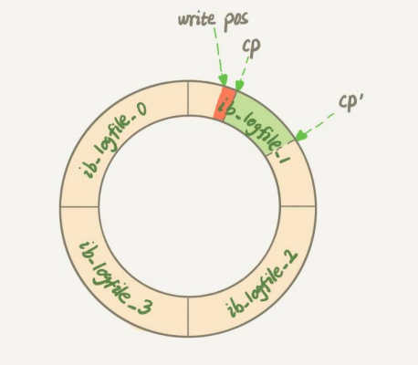

你的SQL语句为什么变""慢"了

**InnoDB在处理更新语句的时候，只做了写日志这一磁盘操作。这个日志叫做redo log(重做日志)，在更新完内存洗碗redo log后，就返回给客户端，本次更新成功**。

日志文件需要在合适的时间把内存里的数据写入磁盘，就是**flush**。

**当内存数据页跟磁盘数据也内存不一致的时候，称这个内存页为"脏页"。内存数据写入磁盘后，内存和磁盘上的数据页的内容就一致了，称为"干净页"**。

平时执行很快的更新操作，其实就是在写内存和日志，而MySQL偶尔"抖"一下的哪个瞬间，可能就是在刷脏页(flush)。

##### 什么情况会引发数据库的**flush**过程呢？

1. **InnoDB的redo log写满了**。这时候系统会停止所有的更新操作，把checkpoint往前推荐，redo log留出空间可以继续写。

   

   checkpoint可不是随便往前修改一下位置就可以的。如图，把checkpoint位置从CP推进到CP'，就需要将两个点之间的日志（浅绿色部分），对应的所有脏页都flush到磁盘上。之后，图中从write pos到CP'之间就是再写入redo log的区域。

2. **系统内存不足**。当需要新的内存页，而内存空间不够用的时候，就要淘汰一些数据页，空出内存给别的数据页使用。如果淘汰的是"脏页"，就要先将脏页写到磁盘。

3. **MySQL认为系统空闲**。

4. **MySQL正常关闭**。

以上四种场景对性能的影响：

第三种情况是属于 MySQL 空闲时的操作，这时系统没什么压力；而第四种场景是 数据库本来就要关闭了。这两种情况下，你不会太关注“性能”问题。

所以这里，我们主要 来分析一下前两种场景下的性能问题。

- 第一种是**"redo log写满了，要flush脏页"**，这种情况是InnoDB要尽量避免的。因为出现这种情况的时候，整个系统就不能再接受更新了，所有的更新都必须堵住。如果你从监控上看，这时候更新数会跌为 0。 

- 第二种是**"内存不够用了，要先将脏页写到磁盘"**，这种情况其实是常态。

  InnoDB 用**缓冲池**（buffer pool）管理内存，缓冲池中的内存页有三种状态：

  1.  还没有使用的 ；
  2.  使用了并且是干净页 ；
  3.  使用了并且是脏页 。

  InnoDB 的策略是尽量使用内存，因此对于一个长时间运行的库来说，未被使用的页面很少。

  而当要读入的数据页没有在内存的时候，就必须到缓冲池中申请一个数据页。这时候只能把最久不使用的数据页从内存中淘汰掉：

  - 如果要淘汰的是一个干净页，就直接释放出来复用；
  - 但如果是脏页呢，就必须将脏页先刷到磁盘，变成干净页后才能复用。 

所以，刷脏页虽然是常态，但是出现以下这两种情况，都是会明显影响性能的：

1.  一个查询要淘汰的脏页个数太多，会导致查询的响应时间明显变长；  
2.  日志写满，更新全部堵住，写性能跌为 0，这种情况对敏感业务来说，是不能接受的。 

##### InnoDB刷脏页的控制策略

InnoDB 脏页的控制策略，以及和这些策略相关的参数。

 