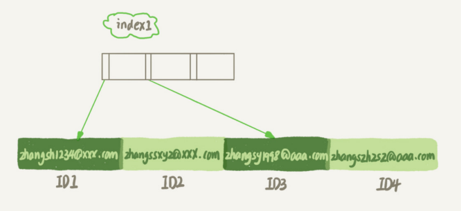
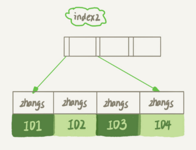

假设，你现在维护一个支持邮箱登录的系统，用户表是这么定义的：

```sql
mysql> create table SUser(
ID bigint unsigned primary key,
email varchar(64),
...
)engine=innodb; 
```

由于使用邮箱登录，所以业务代码中一定会出现类似于这样的语句：

```sql
select f1, f2 from SUser where email='xxx';
```

如果 email 这个字段上没有索引，那 么这个语句就只能做全表扫描。

##### 前缀索引

MySQL 是支持**前缀索引**的，也就是说，你可以定义字符串的一部分作为索引。默认地，如果你创建索引的语句不指定前缀长度，那么索引就会包含整个字符串。

在email字段上创建索引的语句：

```sql
alter table SUser add index index1(email);
或
alter table SUser add index index2(email(6));
```

- 第一个语句创建的 index1 索引里面，包含了每个记录的整个字符串； 
- 而第二个语句创建的 index2 索引里面，对于每个记录都是只取前 6 个字节。  

两种不同的定义在数据结构和存储有什么区别？

email索引结构：



email(6)索引结构：



**由于 email(6) 这个索引结构中每个邮箱字段都只取前 6 个字节（即： zhangs），所以占用的空间会更小，这就是使用前缀索引的优势**。  

接下来，看下面这两个索引定义分别是怎么执行的？

```sql
select id,name,email from SUser where email='zhangssxyz@xxx.com';
```

- 如果使用的是index1（即 email 整个字符串的索引结构 ），执行顺序如下：

  1.  从 index1 索引树找到满足索引值是’zhangssxyz@xxx.com’的这条记录，取得 ID2 的值；  
  2.  到主键上查到主键值是 ID2 的行，判断 email 的值是正确的，将这行记录加入结果集； 
  3.  取 index1 索引树上刚刚查到的位置的下一条记录，发现已经不满足 email='zhangssxyz@xxx.com’的条件了，循环结束。  

  这个过程中，只需要回主键索引取一次数据，所以系统认为只扫描了一行。 

- 如果使用的是index2（即 email(6) 索引结构），执行顺序是这样的： 

  1.  从 index2 索引树找到满足索引值是’zhangs’的记录，找到的第一个是 ID1； 
  2.  到主键上查到主键值是 ID1 的行，判断出 email 的值不是’zhangssxyz@xxx.com’， 这行记录丢弃； 
  3.  取 index2 上刚刚查到的位置的下一条记录，发现仍然是’zhangs’，取出 ID2，再到 ID 索引上取整行然后判断，这次值对了，将这行记录加入结果集； 
  4.  重复上一步，直到在 idxe2 上取到的值不是’zhangs’时，循环结束。 

  在这个过程中，要回主键索引取 4 次数据，也就是扫描了 4 行。  

通过这个对比，你很容易就可以发现，**使用前缀索引后，可能会导致查询语句读数据的次数变多**。

但是，对于这个查询语句来说，如果你定义的 index2 不是 email(6) 而是 email(7），也 就是说取 email 字段的前 7 个字节来构建索引的话，即满足前缀’zhangss’的记录只有 一个，也能够直接查到 ID2，只扫描一行就结束了。  

也就是说**使用前缀索引，定义好长度，就可以做到既节省空间，又不用额外增加太多的查询成本**。

我们在建立索引时关注的是**区分度**，区分度越高越好。因为**区分度越高，意味着重复的键值越少**。因此，我们可以**通过统计索引上有多少个不同的值来判断要使用多长的前缀**。

可以使用下面这个语句，算出这个列上有多少个不同的值：  

```sql
select count(distinct email) as L from SUser;
```

依次选取不同长度的前缀来看这个值，比如我们要看一下 4~7 个字节的前缀索引,可以用这个语句：  

```sql
mysql> select
 count(distinct left(email,4)）as L4,
 count(distinct left(email,5)）as L5,
 count(distinct left(email,6)）as L6,
 count(distinct left(email,7)）as L7,
from SUser;
```

##### 前缀索引对覆盖索引的影响

比较两个SQL语句的区别：

```sql
//可以使用前缀索引
select id,email from SUser where email='zhangssxyz@xxx.com';
和
select id,name,email from SUser where email='zhangssxyz@xxx.com';
```

- 使用 index1（即 email 整个字符串的索引结构）的话，可以利用覆盖索引，从 index1 查到结果后直接就返回了，不需要回到 ID 索引再去查一次。
- 而如果使用 index2（即 email(6) 索引结构）的话，就不得不回到 ID 索引再去判断 email 字段的值。

**使用前缀索引就用不上覆盖索引对查询性能的优化 **，这也是你在选择是否使用 前缀索引时需要考虑的一个因素。

##### 其他方式

比如，我们国家的身份证号，一共 18 位，其中前 6 位是地址码，所以同一个县的人的身份 证号前 6 位一般会是相同的。  

假设你维护的数据库是一个市的公民信息系统，这时候如果对身份证号做长度为 6 的前缀 索引的话，这个索引的区分度就非常低了。按照我们前面说的方法，可能你需要创建长度为 12 以上的前缀索引，才能够满足区分度要求。 但是，索引选取的越长，占用的磁盘空间就越大，相同的数据页能放下的索引值就越少，搜索的效率也就会越低。 

其他处理方式：

1. 使用倒序存储 ，存储身份证号的时候把它倒过来存，每次查询的时候，你可以这么写：  

   ```sql
    select field_list from t where id_card = reverse('input_id_card_string');
   ```

   由于身份证号的最后 6 位没有地址码这样的重复逻辑，所以最后这 6 位很可能就提供了足 够的区分度。 

2. 使用 hash 字段 , 在表上再创建一个整数字段，来保存身份证的校验码，同时在这个字段上创建索引。

   ```sql
   alter table t add id_card_crc int unsigned, add index(id_card_crc);
   ```

   然后每次插入新记录的时候，都同时用 crc32() 这个函数得到校验码填到这个新字段。由于校验码可能存在冲突，也就是说两个不同的身份证号通过 crc32() 函数得到的结果可能是相同的，所以你的查询语句 where 部分要判断 id_card 的值是否精确相同。 

   ```sql
   select field_list from t where id_card_crc=crc32('input_id_card_string') and id_card='input_id_card_string'
   ```

   索引的长度变成了 4 个字节，比原来小了很多。 

倒序存储和使用 hash 字段这两种方法的异同点:

- 相同点是，都不支持范围查询。 
- 区别，主要体现在以下三个方面： 
  1. 从占用的额外空间来看，倒序存储方式在主键索引上，不会消耗额外的存储空间，而 hash 字段方法需要增加一个字段。当然，倒序存储方式使用 4 个字节的前缀长度应该是不够的，如果再长一点，这个消耗跟额外这个 hash 字段也差不多抵消了。 
  2. 在 CPU 消耗方面，倒序方式每次写和读的时候，都需要额外调用一次 reverse 函数，而 hash 字段的方式需要额外调用一次 crc32() 函数。如果只从这两个函数的计算复杂度来看的话，reverse 函数额外消耗的 CPU 资源会更小些。 
  3. 从查询效率上看，使用 hash 字段方式的查询性能相对更稳定一些。因为 crc32 算出来的值虽然有冲突的概率，但是概率非常小，可以认为每次查询的平均扫描行数接近 1。而倒序存储方式毕竟还是用的前缀索引的方式，也就是说还是会增加扫描行数。 


