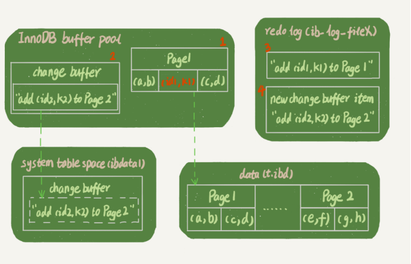
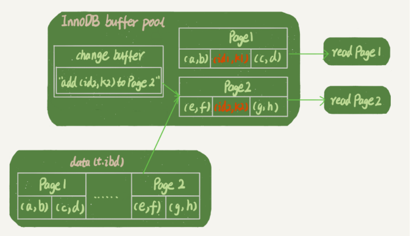

假设，创建一个主键为ID的表，表中有字段k，并且在k上有索引：

```sql
mysql> create table T(
    -> id int primary key,
    -> k int not null,
    -> name varchar(16),
    -> index (k))engine=InnoDB;
```

插入（ID，k）值为（100，1），（200，2），（300，3），（500，5），（600，6），两棵树的实例图如下：


根据叶子节点的内容，索引类型分为主键索引和非主键索引：

- 主键索引的叶子节点纯的是整行数据。在InnoDB里，主键索引也被称为聚簇索引（clustered index）;
- 非主键索引的叶子节点内容是主键的值。在InnoDB里，非主键索引也被称为二级索引（secondary index）；

 基于主键索引和普通索引的查询有什么区 别？  

-  如果语句是 select * from T where ID=500，即主键查询方式，则只需要搜索 ID 这棵 B+ 树；  
-  如果语句是 select * from T where k=5，即普通索引查询方式，则需要先搜索 k 索引 树，得到 ID 的值为 500，再到 ID 索引树搜索一次。这个过程称为**回表**。 

接下来，我们从这两种索引对查询语句和更新语句的性能影响来进行分析。

##### 查询过程

假设，执行的查询语句为：

```sql
select id from T where k=5
```

这个查询语句在索引树上的查找过程，显示通过B+树从树根开始，按层搜索到叶子节点，然后在数据页内部通过二分法来定位记录。

- 对于普通索引来说，查找到满足条件的第一个记录（5，500）后，需要查找下一个记录，知道碰到第一个不满足k=5的记录
- 而对于唯一索引来说，查找到满足条件的第一个记录（5，500）后，就会停止检索

由于引擎是按页读写的，所以找到k=5的记录的时候，它所在的数据页就都存在内存中，是否继续检索，就只需要一次指针查找和一次计算（如果k=5这个记录恰好是这个数据页的最后一条记录，需要取出下一数据页，这个复杂一点，但是概率很低），所以**这两者之间几乎没有性能差异！**

##### 更新操作

首先介绍一个概念**change buffer**：

> 当需要更新一个数据页时，如果数据页在内存中就直接更新，而如果这个数据页还没有在内存中的话，在不影响数据一致性的前提下，InnoDB会将这些更新操作直接缓存在change buffer中，就不需要从磁盘中读取这个数据页。在下次访问这个数据页的时候，将数据页读入内存，然后执行change buffer与这个数据页的merge操作。

change buffer是可以持久化的数据，它在内存中有拷贝，会被写入磁盘中。

将change buffer中的操作应用到原数据页，得到最新结果称为merge。除了访问这个数据页会触发merge外，系统由后台线程会定期merge，数据库在shutdown时，也会执行merge操作。

**使用该机制可以减少读磁盘，并且避免占用内存，提高内存利用率。**

但是对于唯一索引来说，所有的更新操作都需要先判断这个操作是否违反唯一性约束。所以必须先将数据页读入内存中才能判断，那就没必要使用change buffer。

**所以只有普通索引支持change buffer。**

change buffer 用的是 buffer pool 里的内存，因此不能无限增大。change  buffer的大小，可以通过参数innodb_change_buffer_max_size来动态设置。这个参数设置为50的时候，表示change buffer 的大小最多只能占用buffer pool的50%。

**当记录要更新的数据页不在内存中**，InnoDB的处理流程如下：

- 唯一索引，需要将数据页读入内存，判断没有冲突，插入这个值，结束；
- 普通索引，直接记录在change buffer中，结束。

将数据页从磁盘读入内存涉及随机IO的访问，是数据库里面成本最高的操作之一。change buffer因为减少了随机读磁盘的IO消耗，普通索引对更新性能的提升是很明显的。

通过以上分析，可以发现普通索引和change buffer的配合使用，对于**写多读少**的场景，更新优化是很明显的。

##### change buffer和redo log

**WAL**技术全程叫**Write-Ahead Logging**，它的关键点就是**先写日志，再写磁盘**。具体来说，当有一条记录需要更新的时候，InnoDB引擎就会先把记录写到redo log里面，并更新内存，这个时候更新就算完成了。同时，InnoDB引擎会在适当的时候，将这个操作记录更新到磁盘里面。

示例：

- 更新请求

  现在，我们要在表上执行这个插入语句： 

  ```sql
  mysql> insert into t(id,k) values(id1,k1),(id2,k2);
  ```

  这里，我们假设当前 k 索引树的状态，查找到位置后，k1 所在的数据页在内存 (InnoDB buffer pool) 中，k2 所在的数据页不在内存中。 

  如图所示是带change buffer的更新状态图：

  

  分析这条更新语句，会发现它涉及4个部分：内存、redo log(ib_log_fileX)、数据表空间(t.ibd)、系统表空间(ibdata1)。

  这条更新语句做了如下操作：

  1. Page 1在内存中，直接更新内存；
  2. Page 2不在内存中，就在内存的change buffer区域记录下"我要往Page 2插入一行"这个信息；
  3. 将上述两个动作记入redo log中（图中的3和4）。

  **执行这条更新语句的成本很低，就是写了两处内存，然后写了一处磁盘（两次操作合在一起写了一次磁盘），而且还是顺序写的。**  

- 然后读请求：

  ```sql
  select * from t where k in (k1, k2);
  ```

  

  从图中可以看出：

  1. 读 Page 1 的时候，直接从内存返回。（虽然磁盘上还是之前的数据，但 是这里直接从内存返回结果，结果是正确的。）
  2. 要读 Page 2 的时候，需要把 Page 2 从磁盘读入内存中，然后应用 change buffer 里面的操作日志，生成一个正确的版本并返回结果。 

简单对比两个机制在提升更新性能上的收益的化：

- **redo log主要节省的是随机写磁盘的IO消耗（转为顺序写）；**
- **change buffer主要节省的则是随机读磁盘的IO消耗。**

Q：

> change buffer 一开始是写内存的，那么如果这个时候机器掉电重 启，会不会导致 change buffer 丢失呢？ 

A：

> 会导致change buffer丢失，会导致本次未完成的操作数据丢失，但不会导致已完成操作丢失。
>
> 1. change buffer中分两部分，一部分是本次写入未写完的，一部分是已经写入完成的。
> 2. 针对未写完的，此部分操作，还未写入redo log，因此事务还未提交，所以没影响。
> 3. 针对已经写完的，可以通过redo log来进行恢复。
>
> 所以不会对数据库照成影响。

