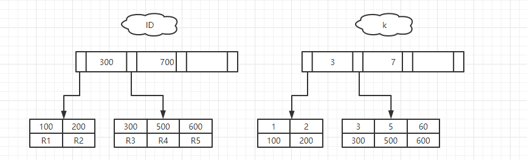

假设，创建一个主键为ID的表，表中有字段k，并且在k上有索引：

```sql
mysql> create table T(
    -> id int primary key,
    -> k int not null,
    -> name varchar(16),
    -> index (k))engine=InnoDB;
```

插入（ID，k）值为（100，1），（200，2），（300，3），（500，5），（600，6），两棵树的实例图如下：



接下来，我们从这两种索引对查询语句和更新语句的性能影响来进行分析。

##### 查询过程

假设，执行的查询语句为：

```sql
select id from T where k=5
```

这个查询语句在索引树上的查找过程，显示通过B+树从树根开始，按层搜索到叶子节点，然后在数据页内部通过二分法来定位记录。

- 对于普通索引来说，查找到满足条件的第一个记录（5，500）后，需要查找下一个记录，知道碰到第一个不满足k=5的记录
- 而对于唯一索引来说，查找到满足条件的第一个记录（5，500）后，就会停止检索

由于引擎是按页读写的，所以找到k=5的记录的时候，它所在的数据页就都存在内存中，是否继续检索，就只需要一次指针查找和一次计算（如果k=5这个记录恰好是这个数据页的最后一条记录，需要取出下一数据页，这个复杂一点，但是概率很低），所以**这两者之间几乎没有性能差异！**

##### 更新操作

首先介绍一个概念**change buffer**：

> 当需要更新一个数据页时，如果数据页在内存中就直接更新，而如果这个数据页还没有在内存中的话，在不影响数据一致性的前提下，InnoDB会将这些更新操作直接缓存在change buffer中，就不需要从磁盘中读取这个数据页。在下次访问这个数据页的时候，将数据页读入内存，然后执行change buffer与这个数据页的merge操作。

change buffer是可以持久化的数据，它在内存中有拷贝，会被写入磁盘中。

将change buffer中的操作应用到原数据页，得到最新结果称为merge。除了访问这个数据页会触发merge外，系统由后台线程会定期merge，数据库在shutdown时，也会执行merge操作。

**使用该机制可以减少读磁盘，并且避免占用内存，提高内存利用率。**

但是对于唯一索引来说，所有的更新操作都需要先判断这个操作是否违反唯一性约束。所以必须先将数据页读入内存中才能判断，那就没必要使用change buffer。

**所以只有普通索引支持change buffer。**

当记录要更新的数据页不在内存中，InnoDB的处理流程如下：

- 唯一索引，需要将数据页读入内存，判断没有冲突，插入这个值，结束；
- 普通索引，直接记录在change buffer中，结束。

将数据页从磁盘读入内存涉及随机IO的访问，是数据库里面成本最高的操作之一。change buffer因为减少了随机读磁盘的IO消耗，普通索引对更新性能的提升是很明显的。

通过以上分析，可以发现普通索引和change buffer的配合使用，对于**写多读少**的场景，更新优化是很明显的。

