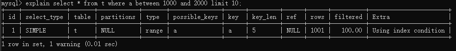

首先来看一个栗子：

建一个只有a、b两个字段的表，并分别建上索引：

```sql
CREATE TABLE `t` (
 `id` int(11) NOT NULL,
 `a` int(11) DEFAULT NULL,
 `b` int(11) DEFAULT NULL,
 PRIMARY KEY (`id`),
 KEY `a` (`a`),
 KEY `b` (`b`)
) ENGINE=InnoDB;
```

然后，我们往表 t 中插入 10 万行记录，取值按整数递增，即：(1,1,1)，(2,2,2)，(3,3,3) 直 到 (100000,100000,100000)。 

使用存储过程来插入数据：

```sql
delimiter ;;
create procedure idata()
begin
 declare i int;
 set i=1;
 while(i<=10000)do
 insert into t values(i, i, i);
 set i=i+1;
 end while;
end;;
delimiter ;
call idata();
```

接下来，我们分析一条 SQL 语句： 

```sql
select * from t where a between 10000 and 20000;
```

使用explain命令看到这条语句的执行情况：



