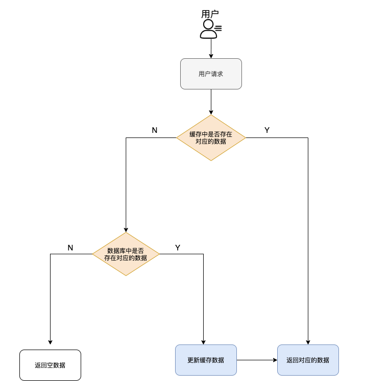
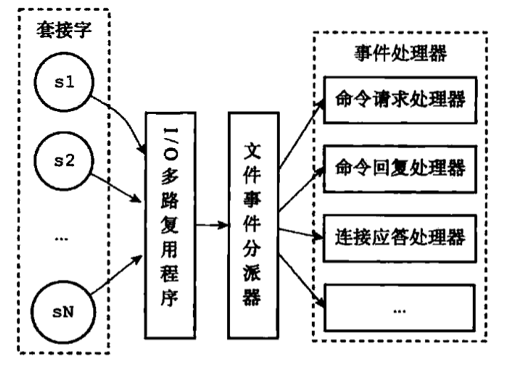
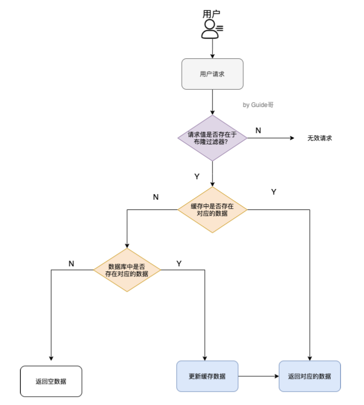

#### 缓存数据的处理流程



#### Redis常见数据结构以及使用场景分析

##### string

1. 介绍：string 数据结构是简单的 key-value 类型。虽然 Redis 是用 C 语言写的，但是 Redis 并没有使用 C 的字符串表示，而是自己构建了一种 **简单动态字符串**（simple dynamic string，**SDS**）。相比于 C 的原生字符串，Redis 的 SDS 不光可以保存文本数据还可以保存二进制数据，并且**获取字符串长度复杂度为 O(1)**（C 字符串为 O(N)）,除此之外,Redis 的 SDS API 是安全的，不会造成缓冲区溢出。

2. **常用命令**： `set,get,strlen,exists,dect,incr,setex` 等等。

3. **应用场景**：一般常用在计数的场景，比如用户的访问次数、热点文章的点赞转发数量等待。

4. **基本操作**：

   普通字符串的基本操作：

   ```bash
   > set key value #设置 key-value 类型的值
   OK
   > get key # 根据 key 获得对应的 value
   "value"
   > exists key  # 判断某个 key 是否存在
   (integer) 1
   > strlen key # 返回 key 所储存的字符串值的长度。
   (integer) 5
   > del key # 删除某个 key 对应的值
   (integer) 1
   > get key
   (nil)
   ```

   批量操作：

   ```bash
   > mset key1 value1 key2 value2 # 批量设置 key-value 类型的值
   OK
   > mget key1 key2 # 批量获取多个 key 对应的 value
   1) "value1"
   2) "value2"
   ```

   计数器(字符串的内容为整数的时候可以使用)：

   ```bash
   > set number 1
   OK
   > incr number #将key中存储的数字增1
   (integer)2
   > get number
   "2"
   > decr number 
   (integer) 1
   > get number
   "1"
   ```

   过期：

   ```bash
   > expire key 60
   (integer)
   > setex key 60 value
   OK
   > ttl key
   (integer) 56
   ```

##### list

1. 介绍：list即是链表。链表是一种非常常见的数据结构，特点是易于数据元素的插入和删除并且可以灵活调整链表长度，但链表的随机访问困难。许多高级编程语言都内置了链表的实现比如 Java 中的 **LinkedList**，但是 C 语言并没有实现链表，所以 Redis 实现了自己的链表数据结构。Redis 的 list 的实现为一个 **双向链表**，即可以支持反向查找和遍历，更方便操作，不过带来了部分额外的内存开销。

2. 常用命令：`rpush`、`lpop`、`lpush`、`rpop`、`lrange`、`llen`等。

3. 常用场景：发布于订阅或者消息队列、慢查询。

4. 基本操作：

   通过`rpush/lpop`实现队列：

   ```bash
   > rpush myList value1
   1
   > rpush myList value2 value3
   3
   > lpop myList
   "value1"
   > lrange myList 0 1
   "value2"
   "value3"
   > lrange myList 0 -1
   "value2"
   "value3"
   > llen myList
   3
   ```

##### hash

1. 介绍：hash类似于JDK1.8前的HashMap，内部实现也差不多（数组+链表）。不过，Redis的hash做了更多优化。另外，hash是一个string类型的field和value的映射表，特币适用用于存储对象，后续操作的时候，你可以直接仅仅修改这个对象的某个字段的值。

2. 常用命令：`hset`、`hmset`、`hexists`、`hget`、`hgetall`、`hkeys`、`hvals`等。

3. 应用场景：系统中对象数据的存储。

4. 基本操作：

   ```bash
   > hset userInfoKey name "guide" description "dev" age "24"
   OK
   > hexists userInfoKey name
   1
   > hget userInfoKey name
   "guide"
   > hget userInfoKey age
   "24"
   > hgetall userInfoKey
   1) "name"
   2) "guide"
   3) "description"
   4) "dev"
   5) "age"
   6) "24"
   > hkeys userInfoKey # 获取 key 列表
   1) "name"
   2) "description"
   3) "age"
   > hvals userInfoKey # 获取 value 列表
   1) "guide"
   2) "dev"
   3) "24"
   > hset userInfoKey name "GuideGeGe" # 修改某个字段对应的值
   > hget userInfoKey name
   "GuideGeGe"
   ```

##### set

1. 介绍：set 类似于 Java 中的 `HashSet` 。Redis 中的 set 类型是一种**无序集合，集合中的元素没有先后顺序**。当你需要存储一个列表数据，又不希望出现重复数据时，set 是一个很好的选择，并且 set 提供了判断某个成员是否在一个 set 集合内的重要接口，这个也是 list 所不能提供的。可以基于 set 轻易实现交集、并集、差集的操作。

2. 常用命令：`sadd`、`spop`、`smembers`、`sismember`、`scard`、`sinterstore`、`sunion`等。

3. 应用场景：需要存放的数据不能重复以及需要获取多个数据源交集和并集等场景。

4. 基本使用：

   ```bash
   > sadd mySet value1 value2
   2
   > sadd mySet value1
   0
   > smemebers mySet
   "value1"
   "value2"
   > scard mySet
   2
   > sismember mySet value1
   1
   > sadd mySet2 value2 value3
   2
   > sinterstore mySet3 mySet mySet2
   1
   > smembers mySet3
   value2
   ```

##### sorted set

1. 介绍：和 set 相比，**sorted set 增加了一个权重参数 score，使得集合中的元素能够按 score 进行有序排列，还可以通过 score 的范围来获取元素的列表**。有点像是 Java 中 HashMap 和 TreeSet 的结合体。

2. 常用命令： `zadd,zcard,zscore,zrange,zrevrange,zrem` 等。

3. 应用场景：需要对数据根据某个权重进行排序的场景。

4. 基本操作：

   ```bash
   > zadd myZset 3.0 value1
   1
   > zadd myZset 2.0 value2 1.0 value3
   2
   > zcard myZset
   3
   > zscore myZset value1
   "3"
   > zrange myZset 0 -1
   1) "value3"
   2) "value2"
   3) "value1"
   > zrange myZset 0 1
   1) "value3"
   2) "value2"
   > zrevrange myZset 0 1
   1) "value1"
   2) "value2"
   ```

##### bitmap

1. 介绍：bitmap存储的是连续的二进制数字（0和1），通过bitmap只需要一个bit位来表示某个元素对应的值或状态，key就是对应元素本身。我们知道 8 个 bit 可以组成一个 byte，所以 bitmap 本身会极大的节省储存空间。

2. 常用命令：`setbit`、`getbit`、`bitcount`、`bitop`

3. 应用场景：适合需要保存状态信息（比如是否签到、是否登录...）并需要进一步对这些信息进行分析的场景。比如用户签到情况、活跃用户情况、用户行为统计（比如是否点赞过某个视频）。

4. 基本操作：

   ```bash
   > setbit mykey 7 1
   0
   > setbit mykey 7 0
   1
   > getbit mykey 7
   0
   > setbit mykey 6 1
   0
   > setbit mykey 8 1
   0
   > bitcount mykey
   2
   ```

5. 使用场景：

   - 用户行为分析

     ```bash
     #100001_video某一视频、uid你的账号id
     > setbit 100001_video uid 1
     ```

   - 统计活跃用户

     使用时间作为 key，然后用户 ID 为 offset，如果当日活跃过就设置为 1

     ```bash
     # 对一个或多个保存二进制位的字符串 key 进行位元操作，并将结果保存到 destkey 上。
     # BITOP 命令支持 AND 、 OR 、 NOT 、 XOR 这四种操作中的任意一种参数
     BITOP operation destkey key [key ...]
     ```

     ```bash
     #初始化数据
     > setbit 20210308 1 1
     0
     > setbit 20210308 2 1
     0
     > setbit 20210309 1 1
     0
     #统计20210308~20210309 总活跃用户数: 1
     > bitop and desk1 20210308 20210309
     1
     > bitcount desk1
     1
     #统计 20210308~20210309 在线活跃用户数: 2
     > bitop or desk2 20210308 20210309
     1
     > bitcount desk2
     2
     ```

   - 用户在线状态

     对于获取或者统计用户在线状态，使用 bitmap 是一个节约空间效率又高的一种方法。

     只需要一个 key，然后用户 ID 为 offset，如果在线就设置为 1，不在线就设置为 0。

#### Redis单线程模型详解

**Redis 基于 Reactor 模式来设计开发了自己的一套高效的事件处理模型** （Netty 的线程模型也基于 Reactor 模式，Reactor 模式不愧是高性能 IO 的基石），这套事件处理模型对应的是 Redis 中的文件事件处理器（file event handler）。由于文件事件处理器（file event handler）是单线程方式运行的，所以我们一般都说 Redis 是单线程模型。

Redis 通过**IO 多路复用程序** 来监听来自客户端的大量连接（或者说是监听多个 socket），它会将感兴趣的事件及类型(读、写）注册到内核中并监听每个事件是否发生。

这样的好处非常明显： **I/O 多路复用技术的使用让 Redis 不需要额外创建多余的线程来监听客户端的大量连接，降低了资源的消耗**（和 NIO 中的 `Selector` 组件很像）。

文件事件处理器（file event handler）主要是包含 4 个部分：

- 多个 socket（客户端连接）
- IO 多路复用程序（支持多个客户端连接的关键）
- 文件事件分派器（将 socket 关联到相应的事件处理器）
- 事件处理器（连接应答处理器、命令请求处理器、命令回复处理器）



#### Redis给缓存数据设置过期时间

一般情况下，我们设置保存的缓存数据的时候都会设置一个过期时间。为什么呢？

因为内存是有限的，如果缓存中的所有数据都是一直保存的话，分分钟直接 Out of memory。

Redis 自带了给缓存数据设置过期时间的功能，比如：

```bash
> expire key  60 # 数据在 60s 后过期
1
> setex key 60 value
OK
> ttl key
56
```

Redis 中除了字符串类型有自己独有设置过期时间的命令 `setex` 外，其他方法都需要依靠 `expire` 命令来设置过期时间 。另外， `persist` 命令可以移除一个键的过期时间：

很多时候，我们的业务场景就是需要某个数据只在某一时间段内存在，比如我们的短信验证码可能只在 1 分钟内有效，用户登录的 token 可能只在 1 天内有效。

#### Redis内存淘汰机制

MySQL 里有 2000w 数据，Redis 中只存 20w 的数据，如何保证 Redis 中的数据都是热点数据?

Redis 的数据淘汰策略：

1. **volatile-lru（least recently used）**：从已设置过期时间的数据集（server.db[i].expires）中挑选最近最少使用的数据淘汰
2. **volatile-ttl**：从已设置过期时间的数据集（server.db[i].expires）中挑选将要过期的数据淘汰
3. **volatile-random**：从已设置过期时间的数据集（server.db[i].expires）中任意选择数据淘汰
4. **allkeys-lru（least recently used）**：当内存不足以容纳新写入数据时，在键空间中，移除最近最少使用的 key（这个是最常用的）
5. **allkeys-random**：从数据集（server.db[i].dict）中任意选择数据淘汰

#### Redis持久化机制

很多时候我们需要持久化数据也就是将内存中的数据写入到硬盘里面，大部分原因是为了之后重用数据（比如重启机器、机器故障之后恢复数据），或者是为了防止系统故障而将数据备份到一个远程位置。

**Redis 的一种持久化方式叫快照（snapshotting，RDB），另一种方式是只追加文件（append-only file, AOF）**。

##### 快照(`snapshotting`)持久化(`RDB`)

Redis 可以通过创建快照来获得存储在内存里面的数据在某个时间点上的副本。Redis 创建快照之后，可以对快照进行备份，可以将快照复制到其他服务器从而创建具有相同数据的服务器副本（Redis 主从结构，主要用来提高 Redis 性能），还可以将快照留在原地以便重启服务器的时候使用。

快照持久化是 Redis 默认采用的持久化方式，在 Redis.conf 配置文件中默认有此下配置：

```conf
save 900 1           #在900秒(15分钟)之后，如果至少有1个key发生变化，Redis就会自动触发BGSAVE命令创建快照。

save 300 10          #在300秒(5分钟)之后，如果至少有10个key发生变化，Redis就会自动触发BGSAVE命令创建快照。

save 60 10000        #在60秒(1分钟)之后，如果至少有10000个key发生变化，Redis就会自动触发BGSAVE命令创建快照。

```

##### `AOF（append-only file）`持久化

与快照持久化相比，AOF 持久化 的实时性更好，因此已成为主流的持久化方案。默认情况下 Redis 没有开启 AOF（append only file）方式的持久化，可以通过 appendonly 参数开启：

```conf
appendonly yes
```

开启 AOF 持久化后每执行一条会更改 Redis 中的数据的命令，Redis 就会将该命令写入硬盘中的 AOF 文件。AOF 文件的保存位置和 RDB 文件的位置相同，都是通过 dir 参数设置的，默认的文件名是 appendonly.aof。

#### 缓存穿透

缓存穿透说简单点就是**大量请求的 key 根本不存在于缓存中，导致请求直接到了数据库上，根本没有经过缓存这一层**。举个例子：某个黑客故意制造我们缓存中不存在的 key 发起大量请求，导致大量请求落到数据库。

1. 缓存无效key

   如果缓存和数据库都查不到某个 key 的数据就写一个到 Redis 中去并设置过期时间，具体命令如下： `SET key value EX 10086` 。这种方式可以解决请求的 key 变化不频繁的情况，如果黑客恶意攻击，每次构建不同的请求 key，会导致 Redis 中缓存大量无效的 key 。

2. 布隆过滤器

   布隆过滤器是一个非常神奇的数据结构，通过它我们可以非常方便地判断一个给定数据是否存在于海量数据中。我们需要的就是判断 key 是否合法，有没有感觉布隆过滤器就是我们想要找的那个“人”。

   具体是这样做的：把所有可能存在的请求的值都存放在布隆过滤器中，当用户请求过来，先判断用户发来的请求的值是否存在于布隆过滤器中。不存在的话，直接返回请求参数错误信息给客户端，存在的话才会走下面的流程。

   

#### 缓存雪崩

实际上，缓存雪崩描述的就是这样一个简单的场景：**缓存在同一时间大面积的失效，后面的请求都直接落到了数据库上，造成数据库短时间内承受大量请求。** 这就好比雪崩一样，摧枯拉朽之势，数据库的压力可想而知，可能直接就被这么多请求弄宕机了。

举个例子：系统的缓存模块出了问题比如宕机导致不可用。造成系统的所有访问，都要走数据库。

还有一种缓存雪崩的场景是：**有一些被大量访问数据（热点缓存）在某一时刻大面积失效，导致对应的请求直接落到了数据库上。**

**针对 Redis 服务不可用的情况：**

1. 采用 Redis 集群，避免单机出现问题整个缓存服务都没办法使用。
2. 限流，避免同时处理大量的请求。

**针对热点缓存失效的情况：**

1. 设置不同的失效时间比如随机设置缓存的失效时间。
2. 缓存永不失效。