## 云计算

**云计算是一种按需使用，按量付费的服务模式，提供可用的、便携的、按需的网络访问，可配置的计算资源共享池**。

### 云计算基础

1. **互联网数据中心（IDC）**：IDC是指为互联网企业、电商、媒体和各类网站等客户提供大规模、高质量、安全可靠的专业化服务器托管、空间租用、带宽批发以及ASP、EC等业务的场所。

   **企业级数据中心（EDC）**：EDC（Enterprise Data Center）企业级数据中心：EDC也可以理解为企业是由数据中心，IDC数据中心主要服务于外部客户，更类似于[公有云](https://link.zhihu.com/?target=https%3A//links.jianshu.com/go%3Fto%3Dhttp%3A%2F%2Fwww.idcquan.com%2FSpecial%2F2018trucs%2F)，而EDM则是私有云的概念。

2. 云计算关键特点：

   - 按需服务（资源/时间）
   - 资源池化（提升利用率/可用性）
   - 弹性扩展（业务需求/成本均衡）
   - 泛网络访问（随时随地/高质量）
   - 服务可度量（服务计费/精细化运营）

3. 云计算服务模式

   - Saas：软件即服务
   - PasS：平台即服务
   - Iaas：基础设施即服务

   

4. 云计算技术架构

   

5. 云计算4种部署模式

   

   公有云与私有云：

   

   混合云：

   

   行业云：

   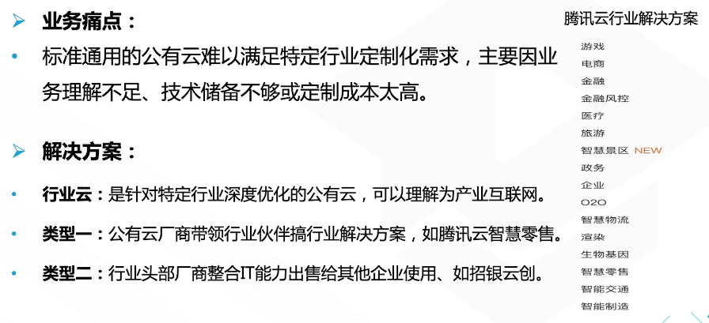

6. 计算虚拟化

   - 计算虚拟化原理：

     

   - 计算虚拟化分类：`KVM`重要

     

   - 计算虚拟化对比：

     

   - `KVM`

     

7. 分布式存储

   - 分布式数据存储

     

8. 网络虚拟化

   

   SDN与NFU对比：

   

9. 云管理平台

   1. OpenStack：

      

   2. VStation

      

      架构：

      

   3. 对比

      

10. 应用虚拟化

    - 容器技术：一种轻量级虚拟化技术，通过进程隔离，将应用软件及其运行所依赖的资源与配置打包封装，提供独立可以指的运行环境。

      

      Docker容器：

      

11. 大数据和AI

    

12. 总结

    

### 云服务器

#### 基础知识

1. 地域与可用区

   - 可用区（Zone）同一个地域内电力和网络相互独立的物理数据中心。命名（城市+编号）
   - 地域（region）：一个独立的地理区域，命名（覆盖方位+机房所在城市）

2. 云服务器实例

   - 实例：一台完整的云服务器（虚拟机），包含CPU，内存，磁盘，网络，操作系统等组件
   - 命名：系列。机型。规格（cCPU核数和内存大小）
   - 管理：实例可通过控制台或API管理；实例配置可在线调整，重启生效
   - 安全：策略控制，安全组，登陆控制

   不同系列的实例硬件型号和规格不同：

   

   - 实例类型：通过不同配置（CPU,内存，IO，网络）提供不同的IO、计算、存储或网络能力。

   - 实例类型的特点与应用：

     

3. 云服务器镜像

   - 定义：镜像就创建云服务器的模板（装机盘），提供云服务器实例所需的操作系统与软件配置等信息。

   - 镜像类型：公有、服务市场、自定义、共享镜像

4. 云服务器存储

   - 按存储介质：普通云、高性能、SSD云硬盘
   - 按使用场景：系统盘、数据盘
   - 按架构模式：本地盘、云硬盘、对象储存

#### 云服务器

1. 云服务器CVM

   - 云服务器CVM（Cloud Virtual Machine）是一种弹性伸缩的计算服务
     - 弹性计算：分钟级扩展收缩
     - 灵活配置：配置CPU、内存、带宽等
     - 稳定可靠：3副本
     - 管理简单
     - 安全网络：VPC/ACL/安全组
     - 全面防护

2. GPU云服务器

   基于GPU应用的计算服务，具有实时高速的并行计算和浮点计算能力

   

   应用场景：

   - 计算型GPU：

     

   - 渲染型GPU：

     

   大数据分析：

   

3. FPGA云服务器

   基于FPGA（Field Programmable Gate Array）现场可编程阵列的计算服务。可使用FPGA镜像在几分钟内部署FPGA实例，实现硬件加速。

   优势：

   

   应用场景：深度学习模型，实时图像压缩处理等

4. 专用宿主机CDH

   1. 定义：**专业宿主机（CVM Delicated Host）提供独享宿主机资源的购买、搭建虚拟化平台，可创建云主机**。

   2. 优势：物理隔离、资源独享、安全合规、灵活配置

      

   3. 应用场景：

      - 金融业务：安全合规

        

      - 高性能业务：资源独享

        

5. 黑石物理服务器CPM

   1. 定义：**黑石物理服务器CPM（Cloud Physical Machine）是一种按需购买、按量付费的物理服务器租赁服务。提供云端专用高性能、安全隔离的物理集群**。

      - 黑石Stack-V（深度整合VMware）：混合云场景

        

      - 黑石ARM服务器（CPM for ARM）

        

      - 黑石OpenPOWER服务器（CPM for OpenPOWER）

        

#### 云服务计费方案

1. 云服务计费方案

   - 计费模式：
     - 包年包月，持续稳定：预付费
     - 按量计费，灵活方便：后付费
     - 阶梯计价，越多越省

2. 包年包月计费

   

   停服回收机制：

   

3. 按量计费模式

   

   停收回收机制：

   

   

   限制：

   

4. 云服务器计费方案

   以CVM为例：

   - CVM费用：实例费用（CPU+内存）+存储费用+带宽费用

   - 计费模式：

     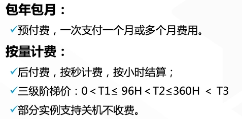

   - 计费方案：

     

总结：

### 云网络产品

#### 私有网络VPC功能

1. 私有网络（Virtual Private Cloud）是用户自定义的、逻辑隔离的专属云上网络空间

   

2. VPC私有网段

   - 私有网段

     

   - 子网

     

   - IP子网划分

     

3. VPC路由表

   **VPC内网互通，不同VPC内网不同。通过路由表实现子网间、子网与外部的路由通信**。

   

4. VPC访问控制

   - 安全组与网络ACL

     

   - 对比

     

5. 弹性网卡ENI

  - 弹性网卡（Elastic Network Interface）

    绑定自由网络内云服务器的一种弹性网络接口，可在云服务器间自由迁移。

    

####网络连接功能

1. 公网接入

   - 弹性IP：

     

   - 公网网关

     

   - NAT网关

     

   - 比较

     

2. 企业DC连接

   - 专线接入

     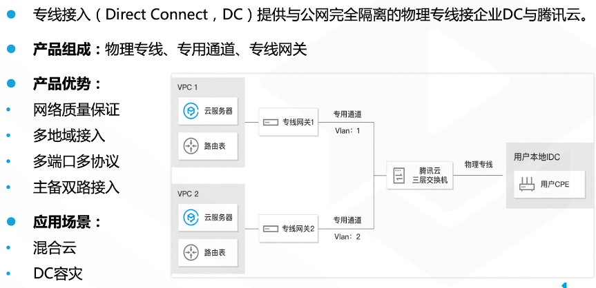

   - VPN

     

   - 对比

     

3. 对等连接

   - 定义

     

   - 限制

     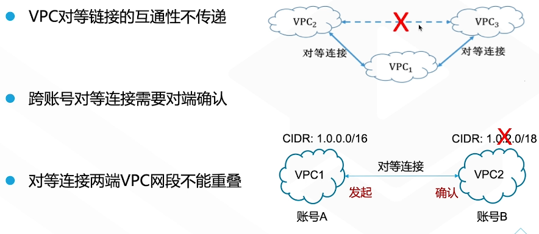

   - 对比

     

4. 云联网

   

   限制：

   

   应用场景：

   

#### 负载均衡功能

1. 负载均衡CLB

   **负载均衡（Cloud Load Balancer，CLB）提供安全快捷的流量分发服务**。

   

   优势：

   

2. 流量分发算法

   

   算法：

   

3. 负载均衡类型

   

   对比：

   

4. CLB应用场景

   

   业务访问分离：

   

   出入流量分离：

   

   混合云：

   

   

#### 网络产品的计费方案

1. 免费的网络产品

   

2. 公网接入计费方案

   

   公网网关计费：

   

   NAT网关计费：

   

   对等连接计费：

   

   云联网计费方案：

   

   专线接入计费方案：

   

   VPN连接计费：

   

   CLB计费方案：

   

总结：

### 云CDN加速

#### CDN加速基础知识、访问原理

1. 内容分发网络

   内容分发网络（Content Delivery Network,CDN）通过高性能加速节点提前就近缓存业务内容，实现快速响应，降低用户访问延迟，提升可用性。

   

   CDN解决问题：

   

2. CDN访问原理

   传统网络访问：

   

   CDN访问：

   

3. CDN发展阶段

   

   发展趋势：

   

#### CDN加速系统架构

1. CDN系统架构

   

2. CDN内容系统

   

   缓存刷新：

   

3. CDN监控系统

   

   智能调度：

   

4. CDN管理系统

   

5. CDN接入步骤

   

#### CDN加速安全机制

1. CDN安全机制

   

2. 移动解析HttpDNS

   

3. SSL安全证书

   

   SSL证书服务：

   

   SSL证书类型：

   

4. CDN访问控制

   

#### CDN加速产品介绍

1. CDN加速产品

   

   下载分发加速DD：

   

   音视频加速VCD：

   

2. 海外加速GCD

   

3. 动态加速网络DSA

   

4. 全球应用加速GAAP

   

5. CDN边缘计算

   

6. 智能CDN：X-P2P

   

#### CDN加速计费方案

1. 带宽

   

   日峰带宽取月均：

   

   月95带宽：

   

2. 流量

   

3. 计费方案选择

   

   示例：

   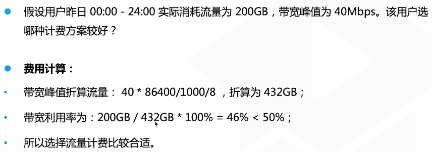

总结：

### 云存储产品

#### 存储基础知识、存储类型

1. 存储发展

   发展历程：

   

   

2. 存储类型

   

3. 存储介质

   

4. 储存分级

   

   对比：

   

   

#### 腾讯云存储产品的功能、原理与优势

##### 云存储产品

1. 云硬盘CBS

   

   云硬盘类型：

   

   云硬盘快照：

   

   优势：

   

   应用场景：

   

2. 文件存储CFS

   定义：

   

   CBS与CFS对比：

   

   应用场景：

   

3. 对象储存COS

   定义：

   

   访问控制：

   

   产品优势：

   

   

   应用场景：

   

4. 归档存储CAS

   定义：

   

   CAS数据取回：

   

   CAS与COS对比：

   

   产品优势：

   

   应用场景：合规性文件归档

   

##### 云存储服务

1. 存储网关CSG

   定义：

   

   CSG网关类型：

   

   产品优势：

   

   应用场景：

   

2. 云数据迁移CDM

   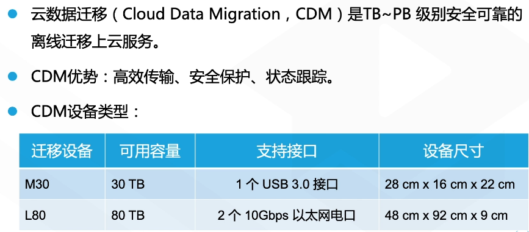

   优势：

   

   应用场景：

   

3. 日志服务CLS

   

   产品优势：

   

   应用场景：

   

#### 腾讯云存储产品计费方案

1. CBS计费方案：

   

   CBS计费示例：

   

2. CFS计费方案：

   

   CFS计费示例：

   

3. COS计费方案

  
  
  计费组成：
  
  
  
  计费案例：
  
  
  
4. CAS计费方案

   

   计费组成：

   

   

   计费示例：

   

   

5. CDM计费方案

   

   计费示例：

   

总结：

### 云数据库产品

#### 数据库基础知识

1. 数据库类型对比

   

   主流关系型数据库：

   

   主流NoSQL数据库：

   

2. 数据库排名

   

3. 数据库发展趋势

   

4. 腾讯云数据库产品

   

#### 腾讯云关系型数据库

1. MySQL

   

   应用场景：

   - 游戏场景：

     

   - 移动APP场景：

     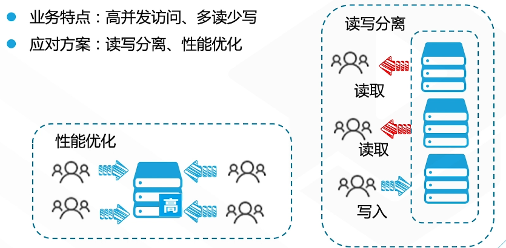

2. SQL Server

   

   产品功能：

   

   镜像机制：

   

   Windows平台：

   

3. Postgre SQL

   

   应用场景：

   

   OLTP与OLAP对比：

   

4. MariaDB/TDSQL

   

   产品优势：

   

   数据复制方式：

   

   MAR强同步：

   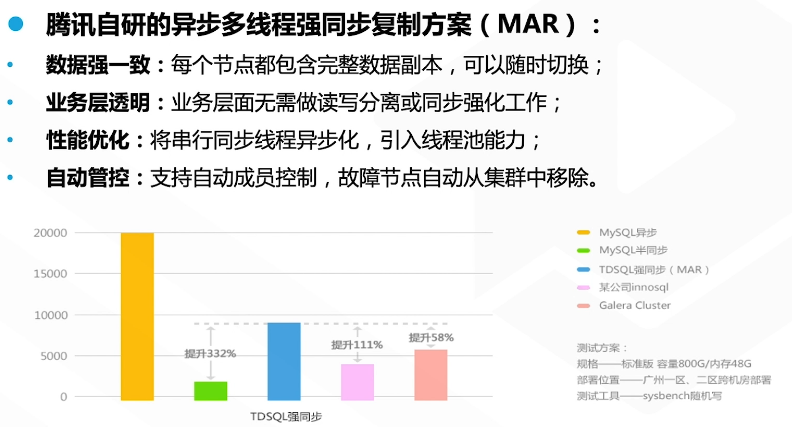

   TDSQL水平拆分机制：

   

   MariaDB应用场景：金融服务

   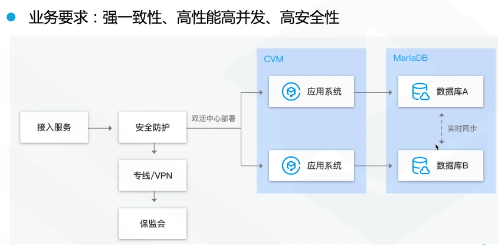

   TDSQL应用场景：

   

5. CynosDB

   

   架构：

   

   应用场景：

   

#### 腾讯云NoSQL数据库

1. MongoDB

   

   容灾架构：

   

   应用场景：游戏开发场景

   

2. Redis

   

   对比：

   

3. Memcached

   

   自动容灾：

   

   在线扩容：

   

   应用场景：

   

4. CTSDB

   

   应用场景：

   

5. TData

   

   产品优势：

   

   应用场景：

   

6. DTS

   

   数据库灾备：

   

   数据上云/归档：

   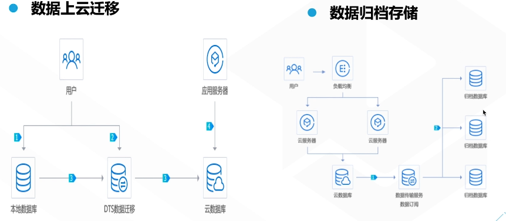

#### 腾讯云数据库计费方案

1. 关系型数据库计费方案：

   

   

   示例：

   

2. TDSQL计费方案

   

3. 关系型数据库升级

   

4. MongoDB计费方案

   

   示例：

   

5. Redis计费方案

   

   示例：

   

6. Memacached计费方案

   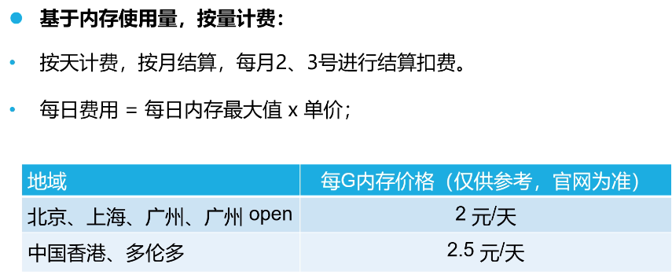

总结：

### 云安全产品

### 云视频与通信服务

