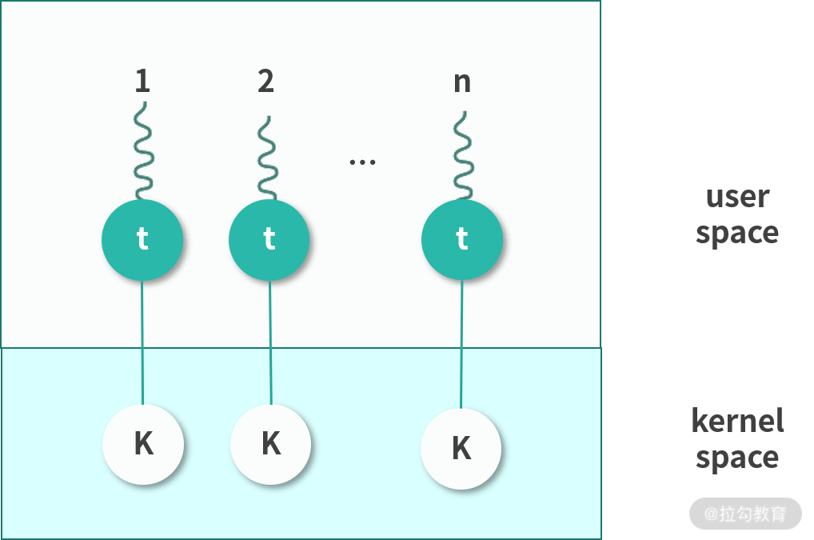

#### 一.操作系统内核

##### 什么是内核

内核是操作系统中应用连接硬件设备的桥梁。

##### 内核的能力

4种基本功能：

- 管理进程、线程（决定哪个进程、线程使用 CPU）；
- 管理内存（决定内存用来做什么）；
- 连接硬件设备（为进程、和设备间提供通信能力）；
- 提供系统调用（接收进程发送来的系统调用）。

##### 操作系统分层

操作系统分为三层：最底层的硬件设备抽象、中间的内核、最上层的应用：

##### 内核是如何工作的？

多数操作系统的设计都遵循一个原则：进程向内核发起一个请求，然后将 CPU 执行权限让出给内核。内核接手 CPU 执行权限，然后完成请求，再转让出 CPU 执行权限给调用进程。

##### Linux的内核设计

Multitask & SMP（Symmetric multiprocessing）

- **Multitask指多任务**，Linux是一个多任务的操作系统。多任务就是多个任务同时执行，这里的**同时**并不是要求并发，而是在一段时间内可以执行多个任务。
- **SMP指对称多处理**，Linux下的每个处理器的地位是相等的，内存对多个处理器来说是共享的，每个处理器都可以访问完整的内存和硬件资源。这个特点决定了在Linux上不会存在一个特定的处理器处理用户程序和内核程序，它们可以被分配到任何一个处理器上执行。

ELF（Executable & Linkable Format）

这个名词翻译过来叫作可执行文件链接格式。这是一种从 Unix 继承而来的可执行文件的存储格式。我们可以看到 ELF 中把文件分成了一个个分段（Segment），每个段都有自己的作用。

##### Monolithic Kernel（宏内核）

宏内核的反义词就是 Micro Kernel(微内核)。**Linux是宏内核架构，这说明Linux的内核是一个完整的可执行程序，且内核用最高权限来运行。**宏内核的特点就是有很多程序会打包在内核中，比如，文件系统、驱动、内存管理等。

与宏内核相反-> **微内核中，内核只保留最基本的能力。比如进程调度，虚拟内存、中断。多数应用，甚至包括驱动程序、文件系统，是在用户空间管理的。**

在内核层和在用户层有什么区别吗？

比如驱动程序是需要频繁调用底层能力的，如果在内核中，性能会好很多。对于微内核设计，驱动在内核外，驱动和硬件设备交互就需要频繁的做内核态的切换，会产生性能损失。但是微内核也有它的好处，比如微内核体积更小，可移植性强。

还有一种就是**混合类型内核**。 混合类型的特点就是架构像微内核，内核中会有一个最小版本的内核，其他功能会在这个能力上搭建。但是实现的时候，是用宏内核的方式实现的，就是内核被做成了一个完整的程序，大部分功能都包含在内核中。就是在宏内核之内有抽象出了一个微内核。

##### Windows内核设计

我们今天用的 Windows 7, Windows 10 是另一个内核，叫作 Windows NT。NT 指的是 New Technology。接下来我们讨论的都是 NT 版本的内核。

Windows 内核架构：

Windows 同样支持 Multitask 和 SMP（对称多处理）。Windows 的内核设计属于混合类型。你可以看到内核中有一个 Microkernel 模块。而整个内核实现又像宏内核一样，含有的能力非常多，是一个完整的整体。

从整体设计上来看，**Linux 是宏内核，NT 内核属于混合型内核**。和微内核不同，宏内核和混合类型内核从实现上来看是一个完整的程序。只不过混合类型内核内部也抽象出了微内核的概念，从内核内部看混合型内核的架构更像微内核。

NT 内核和 Linux 内核还存在着许多其他的差异，比如：

- Linux 内核是一个开源的内核；
- 它们支持的可执行文件格式不同；
- 它们用到的虚拟化技术不同。

#### 

##### 什么是用户态和内核态

**Kernel 运行在超级权限模式（Supervisor Mode）下**，所以拥有很高的权限。按照权限管理的原则，多数应用程序应该运行在最小权限下。因此，很多操作系统，将内存分成了两个区域：

- 内核空间(Kernel Space),这个空间只有内核程序可以访问；
- 用户空间(User Space),这部分内存专门给应用程序使用。

用户空间中的代码被限制了只能使用一个局部的内存空间，我们说这些程序在**用户态（User Mode）** 执行。内核空间中的代码可以访问所有内存，我们称这些程序在**内核态（Kernel Mode）** 执行。

##### 系统调用过程

如果用户态程序需要执行系统调用，就需要切换到内核态执行。

如上图所示：内核程序执行在内核态（Kernel Mode），用户程序执行在用户态（User Mode）。当发生系统调用时，用户态的程序发起系统调用。因为系统调用中牵扯特权指令，用户态程序权限不足，因此会中断执行，也就是 Trap（Trap 是一种中断）。

发生中断后，当前 CPU 执行的程序会中断，跳转到中断处理程序。内核程序开始执行，也就是开始处理系统调用。内核处理完成后，主动触发 Trap，这样会再次发生中断，切换回用户态工作。

#### 二.线程模型

##### 进程和线程

一个应用程序启动后会在内存中创建一个执行副本，这就是进程。Linux的内核是一个Monolithic Kernel(宏内核)，因此可以看作一个进程。也就是开机的时候，磁盘的内核镜像被导入内存作为一个执行副本，成为内核进程。

进程可以分成用户进程和内核进程两类。用户态进程通常是应用程序的副本，内核态进程就是内核本身的进程。**如果用户态进程需要申请资源，比如内存，可以通过系统调用想内核申请。**

那么用户态进程如果要执行程序，是否也要向内核申请呢？

程序在现代操作系统中并不是以进程为单位在执行，而是以一种轻量级进程(Light Weighted Process)，也称作线程(Thread)的形式执行。

一个进程可以拥有多个线程。进程创建的时候，一般会有一个主线程随着进程创建而创建。如果进程想要创造更多的线程，就需要思考一件事情，这个线程创建在用户态还是内核态。你可能会问，难道不是用户态的进程创建用户态的线程，内核态的进程创建内核态的线程吗？

**其实不是，进程可以通过 API 创建用户态的线程，也可以通过系统调用创建内核态的线程，接下来我们说说用户态的线程和内核态的线程。**

##### 用户态线程

用户态线程也称作用户级线程（User Level Thread）。操作系统内核并不知道它的存在，它完全是在用户空间中创建。

用户级线程有很多优势：

- **管理开销小**：创建、销毁不需要系统调用。
- **切换成本低**：用户空间程序可以自己维护，不需要走操作系统调度。

但是这种线程也有很多的缺点：

- **与内核协作成本高**：比如这种线程完全是用户空间程序在管理，当它进行 I/O 的时候，无法利用到内核的优势，需要频繁进行用户态到内核态的切换。
- **线程间协作成本高**：设想两个线程需要通信，通信需要 I/O，I/O 需要系统调用，因此用户态线程需要支付额外的系统调用成本。
- **无法利用多核优势**：比如操作系统调度的仍然是这个线程所属的进程，所以无论每次一个进程有多少用户态的线程，都只能并发执行一个线程，因此一个进程的多个线程无法利用多核的优势。
- **操作系统无法针对线程调度进行优化**：当一个进程的一个用户态线程阻塞（Block）了，操作系统无法及时发现和处理阻塞问题，它不会更换执行其他线程，从而造成资源浪费。

##### 内核态线程

内核态线程也称作内核级线程（Kernel Level Thread）。这种线程执行在内核态，可以通过系统调用创造一个内核级线程。

内核级线程有很多优势：

- 可以利用多核 CPU 优势：内核拥有较高权限，因此可以在多个 CPU 核心上执行内核线程。
- 操作系统级优化：内核中的线程操作 I/O 不需要进行系统调用；一个内核线程阻塞了，可以立即让另一个执行。

内核线程也有一些缺点：

- 创建成本高：创建的时候需要系统调用，也就是切换到内核态。
- 扩展性差：由一个内核程序管理，不可能数量太多。
- 切换成本较高：切换的时候，也同样存在需要内核操作，需要切换内核态。

##### 用户态线程和内核态线程之间的映射关系

**用户态线程创建成本低，问题明显，不可以利用多核。内核态线程，创建成本高，可以利用多核，切换速度慢。**因此通常我们会在内核中预先创建一些线程，并反复利用这些线程。这样，用户态线程和内核态线程之间就构成了下面 4 种可能的关系：

- **多对一（Many to One）**

  用户态进程中的多线程复用一个内核态线程。这样，极大地减少了创建内核态线程的成本，但是线程不可以并发。**因此，这种模型现在基本上用的很少。**我再多说一句，这里你可能会有疑问，比如：用户态线程怎么用内核态线程执行程序？程序是存储在内存中的指令，用户态线程是可以准备好程序让内核态线程执行的。

  

- **一对一（One to One）**

  该模型为每个用户态的线程分配一个单独的内核态线程，在这种情况下，每个用户态都需要通过系统调用创建一个绑定的内核线程，并附加在上面执行。 这种模型允许所有线程并发执行，能够充分利用多核优势，**Windows NT 内核采取的就是这种模型**。但是因为线程较多，对内核调度的压力会明显增加。

  

- **多对多(Many To Many)**

  这种模式下会为 n 个用户态线程分配 m 个内核态线程。m 通常可以小于 n。一种可行的策略是将 m 设置为核数。这种多对多的关系，减少了内核线程，同时也保证了多核心并发。**Linux 目前采用的就是该模型。**

  

- **两层设计(Two Level)**

  这种模型混合了多对多和一对一的特点。多数用户态线程和内核线程是 n 对 m 的关系，少量用户线程可以指定成 1 对 1 的关系。

  

##### 用户态线程和内核态线程的区别？

用户态线程工作在用户空间，内核态线程工作在内核空间。用户态线程调度完全由进程负责，通常就是由进程的主线程负责。相当于进程主线程的延展，使用的是操作系统分配给进程主线程的时间片段。内核线程由内核维护，由操作系统调度。

- 用户态线程无法跨核心，一个进程的多个用户态线程不能并发，阻塞一个用户态线程会导致进程的主线程阻塞，直接交出执行权限。这些都是用户态线程的劣势。

- 内核线程可以独立执行，操作系统会分配时间片段。因此内核态线程更完整，也称作轻量级进程。内核态线程创建成本高，切换成本高，创建太多还会给调度算法增加压力，因此不会太多。

实际操作中，往往结合两者优势，**将用户态线程附着在内核态线程中执行。**

##### JVM 的线程是用户态线程还是内核态线程？

JVM 自己本身有一个线程模型。在 JDK 1.1 的时候，JVM 自己管理用户级线程。这样做缺点非常明显，操作系统只调度内核级线程，用户级线程相当于基于操作系统分配到进程主线程的时间片，再次拆分，因此无法利用多核特性。

为了解决这个问题，**后来 Java 改用线程映射模型，因此，需要操作系统支持。在 Windows 上是 1 对 1 的模型，在 Linux 上是 n 对 m 的模型。**顺便说一句，Linux 的PThreadAPI 创建的是用户级线程，如果 Linux 要创建内核级线程有KThreadAPI。映射关系是操作系统自动完成的，用户不需要管。

补充：go-routine还是线程。区分线程和协程，关键在于能不能并行(parallelism)，就是利用多核。 **go-routine是用户级线程**，也称为Green Thread。多个Go-Routine复用多个内核线程。比如100个go-routine复用10的内核线程

#### 中断的设计

第一层是硬件设计、第二层是操作系统设计、第三层是程序语言的设计。

**按键码的收集，是键盘芯片和主板的能力。主板知道有新的按键后，通知 CPU，CPU 要中断当前执行的程序，将 PC 指针跳转到一个固定的位置，我们称为一次中断（interrupt）**。

考虑到系统中会出现各种各样的事件，我们需要根据中断类型来判断PC 指针跳转的位置，中断类型不同，PC 指针跳转的位置也可能会不同。

因此我们需要把不同的中断类型进行分类，这个类型叫作中断识别码。比如按键，我们可以考虑用编号 16，数字 16 就是按键中断类型的识别码。不同类型的中断发生时，**CPU 需要知道 PC 指针该跳转到哪个地址，这个地址，称为中断向量（Interrupt Vector）**。

例如：当编号 16 的中断发生时，32 位机器的 PC 指针直接跳转到内存地址 16*4 的内存位置。如果设计最多有 255 个中断，编号就是从 0~255，刚好需要 1K 的内存地址存储中断向量——这个 1K 的空间，称为中断向量表。

因此 CPU 接收到中断后，CPU 根据中断类型操作 PC 指针，找到中断向量。操作系统必须在这之前，修改中断向量，插入一条指令。比如操作系统在这里写一条Jump指令，将 PC 指针再次跳转到自己处理对应中断类型的程序。

##### 中断的类型

- 按照中断的触发方分成同步中断和异步中断；
- 根据中断是否强制触发分成可屏蔽中断和不可屏蔽中断。

中断可以由 CPU 指令直接触发，这种主动触发的中断，叫作**同步中断**。同步中断有几种情况：

- 系统调用，需要从用户态切换内核态，这种情况需要程序触发一个中断，叫作陷阱（Trap），中断触发后需要继续执行系统调用。
- 错误（Fault），通常是因为检测到某种错误，需要触发一个中断，中断响应结束后，会重新执行触发错误的地方，比如缺页中断。
- 程序的异常，这种情况和 Trap 类似，用于实现程序抛出的异常。

另一部分中断不是由 CPU 直接触发，是因为需要响应外部的通知，比如响应键盘、鼠标等设备而触发的中断。这种中断我们称为**异步中断**。

CPU 通常都支持设置一个中断屏蔽位（一个寄存器），设置为 1 之后 CPU 暂时就不再响应中断。对于键盘鼠标输入，比如陷阱、错误、异常等情况，会被临时屏蔽。但是对于一些特别重要的中断，比如 CPU 故障导致的掉电中断，还是会正常触发。可以被屏蔽的中断我们称为**可屏蔽中断**，**多数中断都是可屏蔽中断**。