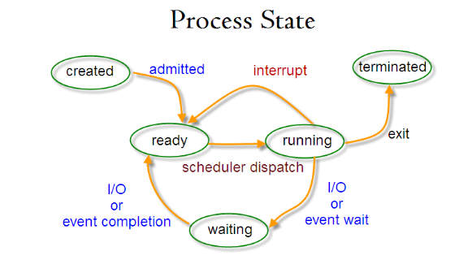
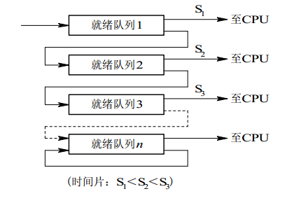

#### 进程与线程

**进程（Process）是系统进行资源分配和调度的基本单位**，进程控制块 (Process Control Block, PCB) 描述进程的基本信息和运行状态，所谓的创建进程和撤销进程，都是指对 PCB 的操作。

**线程（Thread）是CPU调度和分派的基本单位**。一个进程可以有多个线程，它们共享进程资源。 

- 进程是系统进行**资源分配和调度的基本单位**，线程是**CPU调度和分配的基本单位**；
- **线程依赖于进程存在**，一个进程至少有一个线程；
- 进程**有自己独立地址空间**，线程**共享进程的地址空间**；
- 进程**是拥有系统资源的一个独立单位**，而线程自己基本上不拥有系统资源，只拥有一点在运行中必不可少的资源（如程序计数器，一组寄存器和栈），**和其他线程共享本进程的相关资源如内存、I/O、CPU等**；
- **进程切换的开销远大于线程切换的开销**。在进程切换时，涉及到**整个当前进程CPU环境的保存环境的设置以及新被调度运行的CPU环境的设置**，而**线程切换只需保存和设置少量的寄存器的内容**，并不涉及存储器管理方面的操作；
- **线程之间的通信更方便** 。同一进程下的线程**共享全局变量**等数据，而进程之间的通信需要以**进程间通信(IPC)的方式**进行；
- 进程有自己的独立地址空间，因此**多进程更加健壮**。多线程程序只要有一个线程崩溃，整个程序就崩溃了，但多进程程序中一个进程崩溃并不会对其它进程造成影响 。

##### 1.进程的基本状态

- `就绪态(ready)`： 进程已获得除处理机以外的所需资源，等待分配处理机资源 
- `执行态(running)`： 占用处理机资源运行，处于此状态的进程数小于等于CPU数 
- `阻塞态(waiting)`： 进程等待某种条件，在条件满足之前无法执行 

执行态 -> 阻塞态：往往是由于**等待外设，等待主存等资源分配或等待人工干预**而引起的。 

阻塞态 -> 就绪态：则是**等待的条件已满足**，只需分配到处理器后就能运行。 

执行态 -> 就绪态：不是由于自身原因，而是由外界原因使运行状态的进程让出处理器，这时候就变成就绪态。例如**时间片用完，或有更高优先级的进程来抢占处理器**等。 

就绪态 -> 执行态：**系统按某种策略选中就绪队列中的一个进程占用处理器**，此时就变成了运行态 

##### 2.进程调度

- **上下文切换**

  线程/进程的上下文主要包括两个部分：寄存器（PC）和操作系统需要的特定数据（PCB）。上下文切换（context switch），是一个被存储和重建CPU的过程，完整的上下文切换主要涉及这两部分的切换，**旧的上下文被保存，新的上下文被加载**。

  **当系统发生中断或者OS进行线程调度时会进行上下文切换**。

- **非抢占式调度与抢占式调度**

  - `非抢占式`：分派程序一旦把处理机分配给某进程后便让它一直运行下去，直到进程完成或发生进程调度某事件而阻塞时，才把处理机分配给另一个进程。 
  - `抢占式`：操作系统将正在运行的进程强行暂停，由调度程序将CPU分配给其他就绪进程的调度方式。 

- **调度策略的设计**

  - `响应时间`：从用户输入到产生反应的时间。
  - `周转时间`：从任务开始到任务结束的时间。
  - `平均周转时间`：周转总时间初除以作业个数。

  CPU任务可以分为**交互式任务**和**批处理任务**，调度最终的目标是合理的使用CPU，使得交互式任务的响应时间尽可能短，同时使得批处理任务的周转时间尽可能短。

- **调度算法**

  - **批处理系统**

    批处理系统没有太多的用户操作，在该系统中，调度算法目标是吞吐量和周转时间。

    1. 先来先服务（first-come first-served）

       非抢占式的调度算法，按照请求的顺序进行调度。 有利于长作业，不利于短作业。

    2. 短作业优先（shortest job first）

       非抢占式的调度算法，按估计运行时间最短的顺序进行调度。 长作业有可能会饿死，处于一直等待短作业执行完成的状态。

    3. 最短剩余时间优先（shortest remaining time next）

       最短作业优先的抢占式版本，按剩余运行时间的顺序进行调度。

  - **交互式系统**

    交互式系统有大量的用户交互操作，在该系统中调度算法的目标是快速的进行响应。

    1. 时间片轮转

       将所有就绪进程按 FCFS 的原则排成一个队列，每次调度时，把 CPU 时间分配给队首进程，该进程可以执行一个时间片。当时间片用完时，由计时器发出时钟中断，调度程序便停止该进程的执行，并将它送往就绪队列的末尾，同时继续把 CPU 时间分配给队首的进程。 

       时间片轮转算法的效率和时间片的大小有很大关系： 

       - 进程切换都要保存进程的信息并且载入新进程的信息，如果时间片太小，会导致进程切换得太频繁，在进程切换上就会花过多时间。 
       - 如果时间片过长，那么实时性就不能得到保证。 

    2. 优先级调度

       为每个进程分配一个优先级，按优先级进行调度。为了防止低优先级的进程永远等不到调度，可以随着时间的推移增加等待进程的优先级。

    3. 多级反馈队列

       多级队列是为需要连续执行多个时间片的进程考虑，它设置了多个队列，每个队列时间片大小都不同，例如1，2，4，8...。进程在第一个队列没执行完，就会被移动到下一个队列。

       每个队列的优先权也不同，最上面的优先权最高。因此只有上一个队列没有进程在排队，才能调度当前队列上的进程。如果进程用完了当前队列的时间片还未执行完，则会被移到下一队列。 

       设置多级就绪队列，各级队列优先级从高到低，时间片从小到大，新进程到达时先进入就绪队列1，按FCFS原则排队等待被分配时间片。若用完时间片进程还未结束，则队列进入下一级队列队尾。如果此时已经在最下级的队列，则重新放回最下级队列队尾，只有第k级队列为空时，才会为k+1级对头的进程分配时间片，被抢占处理的进程重新重新放回原队列队尾。

       [多级反馈队列调度算法](https://blog.csdn.net/weixin_44730681/article/details/109270711?ops_request_misc=%257B%2522request%255Fid%2522%253A%2522161552846316780266225537%2522%252C%2522scm%2522%253A%252220140713.130102334..%2522%257D&request_id=161552846316780266225537&biz_id=0&utm_medium=distribute.pc_search_result.none-task-blog-2~all~sobaiduend~default-1-109270711.pc_search_result_hbase_insert&utm_term=%E5%A4%9A%E7%BA%A7%E5%8F%8D%E9%A6%88%E9%98%9F%E5%88%97%E8%B0%83%E5%BA%A6%E7%AE%97%E6%B3%95)

       

##### 3.进程同步

- **临界区**

  在操作系统中，进程是占有资源最小单位（线程可以访问其所在进程内的所有资源，但线程本身并不占有资源或仅仅占有一点必须资源）。但对于某些资源来说，其在同一时间只能被一个进程所占有。这些**一次只能被一个进程占有的资源**就是所谓的**临界资源**。

  对于临界资源的访问，必须是**互斥**进行的。也就是**当临界资源被占用时，另一个申请临界资源的进程会被阻塞，直到其所申请的临界资源被释放**。而**进程内访问临界资源的代码被称为临界区(Critical Section)**。

- **信号量(Semaphore)**

  信号量（Semaphore）是一个整型变量，可以对其执行 down 和 up 操作，也就是常见的 P 和 V 操作。

  - `down`：如果信号量大于0，执行-1操作；如果信号量大于0，进程睡眠，等待信号量大于0
  - `up`：对信号量执行+1操作，唤醒睡眠的进程让其完成down操作。

  如果信号量的取值只能为0或者1，那么就成为了**互斥量(Mutex)**，0表示临界区已经加锁，1表示临界区解锁。比如 Java 中的 synchronized 关键词和各种 Lock 都是这种机制。 

- **事件**

  **允许一个线程在处理完一个任务后，主动唤醒另外一个线程执行任务。**事件分为手动重置事件和自动重置事件。手动重置事件被设置为激发状态后，会唤醒所有等待的线程，而且一直保持为激发状态，直到程序重新把它设置为未激发状态。自动重置事件被设置为激发状态后，会唤醒**一个**等待中的线程，然后自动恢复为未激发状态。 

- **锁**

  - 互斥锁：同一时间只能由一个线程访问加锁的数据。

  - 自旋锁：互斥锁的一种实现，如果自旋锁已经被别的执行单位保持，调用者就一直循环等待是否该自旋锁的保持者以及释放了锁。

  - 读写锁：一种特殊的自旋锁，它把对共享资源的访问者分为读者和写者，读者只对共享资源进行读访问，写者则需要对共享资源进行写操作。写者是具有排他性的，一个读写锁同时只能由一个写者或者多个读者。

  - 阻塞锁：与自旋锁不同，改变了线程的运行状态。让线程进入了阻塞状态进行等待，当获得相应的信号（唤醒，时间）时，才可以进入线程的准备就绪状态，准备就绪状态的所有线程，通过竞争，进入运行状态。

  - 可重入锁：也叫递归锁，指的是同一线程上该锁是可重入的，对于不同线程则相当于普通的互斥锁。

  - 公平锁：加锁前检查是否由排队的等待的线程，优先排队等待的线程，先来先得。

  - 非公平锁：加锁时不考虑排队等待问题，直接尝试获取锁，获取不到自动到队尾等待。`ReentrantLock`的`lock()`默认就是非公平锁。

  - 悲观锁：假定会发生并发冲突，屏蔽一切可能违反数据完整性的操作。加锁的时间可能会很长，也就是说**悲观锁的并发访问性不好**。 

  - 乐观锁：假设不会发生并发冲突，只在提交操作时检查是否违反数据完整性。乐观锁不能解决脏读的问题，可以通过添加时间戳和版本来来解决。 

  - **死锁**

    **死锁是指多个进程因循环等待资源而造成无法执行的现象。死锁会造成进程无法执行，同时会造成系统资源的极大浪费(资源无法释放)**。

    死锁产生的必要条件：

    - 互斥：一个资源一次只能被一个进程在使用
    - 占有并等待：一个进程至少占有一个资源，并在等待另一个被其他进程占有的资源
    - 非抢占：已经分配给一个进程的资源不能被强制性抢占，只能由进程完成任务之后自愿释放； 
    - 循环等待：若干进程之间形成一种头尾相接的环形等待资源关系，该环路中的每个进程都在等待下一个进程所占有的资源。 

    死锁避免：

    **互斥锁的加锁规则**：给定所有互斥操作一个全序，如果每个线程均按这种顺序获得互斥锁，并且按相反顺序解锁，则不会发生死锁。 

- **CAS**（比较并交换）

  比较并交换（compare and swap,CAS），是原子操作的一种，可用于在多线程编程中实现不被打断的数据交换操作。该操作通过将内存中的值与指定数据比较，当数值一样时将内存中的数据替换为新的值。

##### 4.进程间通信

进程通信与进程同步很容易混淆，区别在于：

- 进程同步：控制多个进程按一定顺序执行；
- 进程通信：进程间传输信息；

进程通信是一种手段，而进程同步是一种目的。也就是说，为了达到进程同步的目的，需要让进程间进行通信，传输一些进程同步所需要的信息。

1. 管道（pipe）

   - 只支持半双工通信（单向交替传输）；需要双方通信时，需要建立其两个管道；
   - 只能在父子进程或者兄弟进程（具有亲缘关系的进程）中使用。

2. 命名管道(Names Pipe)

   匿名管道由于没有名字，只能用于亲缘关系的进程间通信。为了克服这个缺点，提出了有名管道(去除了管道只能在父子进程中使用的限制)。有名管道严格遵循**先进先出(first in first out)**。有名管道以磁盘文件的方式存在，可以实现本机任意两个进程通信。 

3. 消息队列(Message Queueing)

   消息队列是消息的链表,具有特定的格式,存放在内存中并由消息队列标识符标识。管道和消息队列的通信数据都是先进先出的原则。相比管道，消息队列有以下优点：

   - **消息队列可以独立于读写进程存在**，从而避免了 FIFO 中同步管道的打开和关闭时可能产生的困难；
   - **避免了 FIFO 的同步阻塞问题**，不需要进程自己提供同步方法；
   - **读进程可以根据消息类型有选择地接收消息**，而不像 FIFO 那样只能默认地接收。

4. 共享内存(Shared memory)

   使得多个进程可以访问同一块内存空间，不同进程可以及时看到对方进程中对共享内存中数据的更新。这种方式需要依靠某种同步操作，如互斥锁和信号量等。可以说这是最有用的进程间通信方式。 

5. 信号(Signal)

   信号是一种比较复杂的通信方式，用于通知接收进程某个事件已经发生； 

6. 信号量(Semaphores)

   信号量是一个计数器，用于多进程对共享数据的访问，信号量的意图在于进程间同步。这种通信方式主要用于解决与同步相关的问题并避免竞争条件。 

7. 套接字(Sockets)

   此方法主要用于在客户端和服务器之间通过网络进行通信。套接字是支持 TCP/IP 的网络通信的基本操作单元，可以看做是不同主机之间的进程进行双向通信的端点，简单的说就是通信的两方的一种约定，用套接字中的相关函数来完成通信过程。 

##### 5.线程

- **轻型实体**：线程中的实体基本上不拥有系统资源，只是有一点必不可少的、能保证独立运行的资源。线程的实体包括程序、数据和TCB。**线程是动态概念**，它的动态特性由线程控制块TCB（Thread Control Block）描述。TCB包括以下信息： 

  - 线程状态。
  - 当线程不运行时，被保存的现场资源。
  - 一组执行堆栈。
  - 存放每个线程的局部变量主存区。
  - 访问同一个进程中的主存和其它资源。

  用于指示被执行指令序列的程序计数器、保留局部变量、少数状态参数和返回地址等的一组寄存器和堆栈。 

- **独立调度和分派的基本单位**：在多线程OS中，**线程是能独立运行的基本单位**，因而也**是独立调度和分派的基本单位**。由于线程很“轻”，故**线程的切换非常迅速且开销小**。 

- **可并发执行**：在一个进程中的多个线程之间，可以并发执行，甚至允许在一个进程中所有线程都能并发执行 。

- **共享进程资源**：在同一进程中的各个线程，都可以共享该进程所拥有的资源。