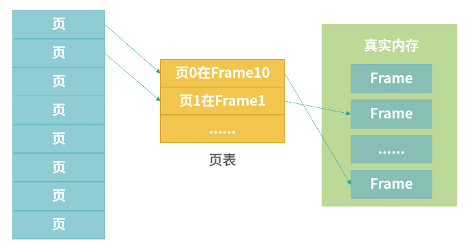

内存管理

---

##### 1.虚拟内存

虚拟化技术中，应用使用的是虚拟内存，**操作系统管理虚拟内存和真实内存之间的映射**。操作系统将虚拟内存分成整齐小块，每个小块称为一个**页（Page）**。 这些页被映射到物理内存，但不需要映射到连续的物理内存，也不需要所有页都必须在物理内存中。当程序引用到不在物理内存中的页时，由硬件执行必要的映射，将缺失的部分装入物理内存并重新执行失败的指令。 之所以这样做，原因主要有以下两个方面：

- 一方面应用使用内存是以页为单位，整齐的页能够避免内存碎片问题。
- 另一方面，每个应用都有高频使用的数据和低频使用的数据。这样做，操作系统就不必从应用角度去思考哪个进程是高频的，仅需思考哪些页被高频使用、哪些页被低频使用。如果是低频使用，就将它们保存到硬盘上；如果是高频使用，就让它们保留在真实内存中。

##### 2.页和页表

操作系统将虚拟内存分块，每个小块称为一个页（Page）；真实内存也需要分块，每个小块我们称为一个 Frame。**Page 到 Frame 的映射，需要一种叫作页表的结构**。

上图展示了 Page、Frame 和页表 （Page Table）三者之间的关系。 Page 大小和 Frame 大小通常相等，页表中记录的某个 Page 对应的 Frame 编号。页表也需要存储空间，比如虚拟内存大小为 10G， Page 大小是 4K，那么需要 10G/4K = 2621440 个条目。如果每个条目是 64bit，那么一共需要 20480K = 20M 页表。操作系统在内存中划分出小块区域给页表，并负责维护页表。

页表维护了虚拟地址到真实地址的映射。每次程序员使用内存时，需要把虚拟内存地址换算成物理内存，换算过程分为以下3个步骤：

1. 通过虚拟地址计算 Page 编号；
2. 查页表，根据 Page 编号，找到 Frame 编号；
3. 将虚拟地址换算成物理地址。

##### 3.分页系统地址映射

上面的过程发生在CPU中一个小型设备——**内存管理单元(Memory Management Unit,MMU)**中。

内存管理单元（MMU）管理着地址空间和物理内存的转换，其中的页表（Page table）存储着页（程序地址空间）和页框（物理内存空间）的映射表。 

一个虚拟地址分成两个部分，一部分存储**页面号**，一部分存储**偏移量**。 

下图的页表存放着 16 个页，这 16 个页需要用 4 个比特位来进行索引定位。例如对于虚拟地址（0010 000000000100）：

1. 前 4 位（0010）是存储页面号 2，读取表项内容为（110 1），页表项最后一位表示是否存在于内存中，1 表示存在。
2. 后 12 位存储偏移量。这个页对应的页框的地址为 （110 000000000100）。 

##### 4.页表条目

下图页表中的每一项（页表条目）的一个演示：

- Absent（“在”）位，是一个 bit。0 表示页的数据在磁盘中（不再内存中），1 表示在内存中。如果读取页表发现 Absent = 0，那么会触发缺页中断，去磁盘读取数据。
- Protection（保护）字段可以实现成 3 个 bit，它决定页表用于读、写、执行。比如 000 代表什么都不能做，100 代表只读等。
- Reference（访问）位，代表这个页被读写过，这个记录对回收内存有帮助。
- Dirty（“脏”）位，代表页的内容被修改过，如果 Dirty =1，那么意味着页面必须回写到磁盘上才能置换（Swap)。如果 Dirty = 0，如果需要回收这个页，可以考虑直接丢弃它（什么也不做，其他程序可以直接覆盖）。
- Caching（缓存位），描述页可不可以被 CPU 缓存。CPU 缓存会造成内存不一致问题，在上个模块的加餐中我们讨论了内存一致性问题，具体你可以参考“模块四”的加餐内容。
- Frame Number（Frame 编号），这个是真实内存的位置。用 Frame 编号乘以页大小，就可以得到 Frame 的基地址。

##### 5.多级页表

引入多级页表的主要目的是为了避免把全部页表一直放在内存中占用过多空间，特别是那些根本就不需要的页表就不需要保留在内存中。多级页表属于时间换空间的典型场景。

为了减少条目的创建，可以考虑进程内部用一个更大的页表（比如 4M），操作系统继续用 4K 的页表。这就形成了一个二级页表的结构，如下图所示：

##### 6.TLB

在 MMU 中往往还有一个微型的设备，叫作**转置检测缓冲区（Translation Lookaside Buffer，TLB）**。缓存的设计，通常是一张表，所以 **TLB 也称作快表**。TLB 中最主要的信息就是 Page Number到 Frame Number 的映射关系。

为了解决虚拟地址到物理地址的转换速度，操作系统在 **页表方案** 基础之上引入了 **快表** 来加速虚拟地址到物理地址的转换。我们可以把快表理解为一种特殊的高速缓冲存储器（Cache），其中的内容是页表的一部分或者全部内容。作为页表的 Cache，它的作用与页表相似，但是提高了访问速率。由于采用页表做地址转换，读写内存数据时 CPU 要访问两次主存。有了快表，有时只要访问一次高速缓冲存储器，一次主存，这样可加速查找并提高指令执行速度。 

使用快表之后的地址转换流程是这样的：

1. 根据虚拟地址中的页号查快表；
2. 如果该页在快表中，直接从快表中读取相应的物理地址；
3. 如果该页不在快表中，就访问内存中的页表，再从页表中得到物理地址，同时将页表中的该映射表项添加到快表中；
4. 当快表填满后，又要登记新页时，就按照一定的淘汰策略淘汰掉快表中的一个页。

- TCB Miss 问题

  如果 Page Number 在 TLB 总没有找到，我们称为TLB 失效（Miss）。这种情况，分成两种。

  - 软失效（Soft Miss），这种情况 Frame 还在内存中，只不过 TLB 缓存中没有。那么这个时候需要刷新 TLB 缓存。如果 TLB 缓存已经满了，就需要选择一个已经存在的缓存条目进行覆盖。
  - 硬失效（Hard Miss)，这种情况下对应的 Frame 没有在内存中，需要从磁盘加载。这种情况非常麻烦，首先操作系统要触发一个**缺页中断**（原有需要读取内存的线程被休眠），然后中断响应程序开始从磁盘读取对应的 Frame 到内存中，读取完成后，再次触发中断通知更新 TLB，并且唤醒被休眠的线程去排队。注意，**线程不可能从休眠态不排队就进入执行态**，因此 Hard Miss 是相对耗时的。

##### 7.页面置换算法

在程序运行的过程中，如果要访问的页面不在内存中，就发生**缺页中断**从而将该页调入内存中。此时如果内存已无空闲空间，系统必须从内存中调出一个页面到磁盘对换区中来腾出空间。

页面置换算法的主要目标是使页面置换频率最低（也可以说缺页率最低）。 

1. OPT（Optimal replacement algorithm）算法：

   所选择的被换出的页面将是最长时间内不再被访问的页面，通常可以保证获得最低的缺页率。可惜，OPT需要知道将来发生的事，只能在理论中存在，实际不可应用。 

2. NRU（Not Recently Used）算法:

   优先把最近没有使用的数据置换出去。

   而且NRU实现起来比较简单，在页表条目设计中：

   

   在页表中有一个访问位，代表页表有被读取过。还有一个脏位，代表页表被写入过。无论是读还是写，我们都可以认为是访问过。 

3. LRU（Least Recently Used）算法：

   选最近最长时间没有使用的页淘汰(也称最近最少使用) 。

   为了实现 LRU，需要在内存中维护一个所有页面的链表。当一个页面被访问时，将这个页面移到链表表头。这样就能保证链表表尾的页面是最近最久未访问的。 

4. LFU（Least Frequently Used）算法：

   即最不经常使用页置换算法，要求在页置换时置换引用计数最小的页，因为经常使用的页应该有一个较大的引用次数。与页面的使用次数有关。

5. FIFO算法：

   先入先出，即淘汰最早调入的页面。 

6. 第二次机会算法

   FIFO 算法可能会把经常使用的页面置换出去，为了避免这一问题，对该算法做一个简单的修改：

   - 当页面被访问 (读或写) 时设置该页面的 R 位为 1。
   - 需要替换的时候，检查最老页面的 R 位。
     - 如果 R 位是 0，那么这个页面既老又没有被使用，可以立刻置换掉；
     - 如果是 1，就将 R 位清 0，并把该页面放到链表的尾端，修改它的装入时间使它就像刚装入的一样，然后继续从链表的头部开始搜索。

   

7. Clock：

   第二次机会算法需要在链表中移动页面，降低了效率。时钟算法使用环形链表将页面连接起来，再使用一个指针指向最老的页面。 

   

##### 8.分段

段式存储：**用户进程地址空间按照自身逻辑关系划分为若干个段（segment）**（如代码段，数据段，堆栈段），内存空间被动态划分为长度不同的区域，分配时以段为单位，每段在内存中占据连续空间，各段可以不相邻。段式管理通过段表对应逻辑地址和物理地址。

下图为一个编译器在编译过程中建立的多个表，有4个表动态增长的，如果使用分页系统的一维地址空间，动态增长的特点会导致覆盖问题的出现。

分段的做法是把每个表分成段，一个段构成一个独立的地址空间。每个段的长度可以不同，并且可以动态增长。 

##### 9.分页与分段的比较 

- 地址空间的维度：分页是一维地址空间 （每个进程一个页表/多级页表，通过一个逻辑地址就能找到对应的物理地址） ，分段是二维的 （段号+段内偏移） 。 
- 大小是否可以改变：页的大小不可变，段的大小可以动态改变。 
- 分页主要用于实现虚拟内存，从而获得更大的地址空间；分段主要是为了使程序和数据可以被划分为逻辑上独立的地址空间并且有助于共享和保护。 
- 目的不同：分页的目的是管理内存，用于虚拟内存以获得更大的地址空间；分段的目的是满足用户的需要，使程序和数据可以被划分为逻辑上独立的地址空间； 

##### 10.段页式管理机制

程序的地址空间划分成多个拥有独立地址空间的段，每个段上的地址空间分成大小相同的页。

简单来说段页式管理机制就是把主存先分成若干段，每个段又分成若干页，也就是说 **段页式管理机制** 中段与段之间以及段的内部的都是离散的。

**这样即拥有分段的共享和保护，又拥有分页系统的虚拟内存功能**。

