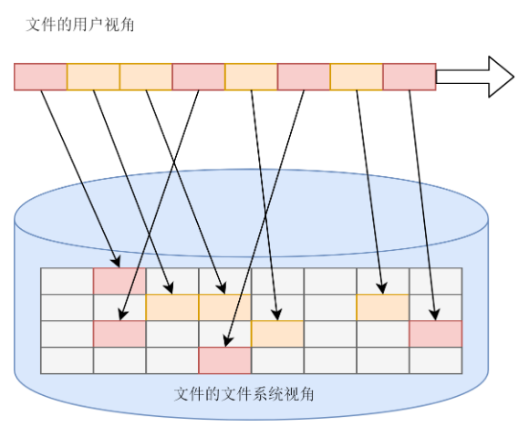
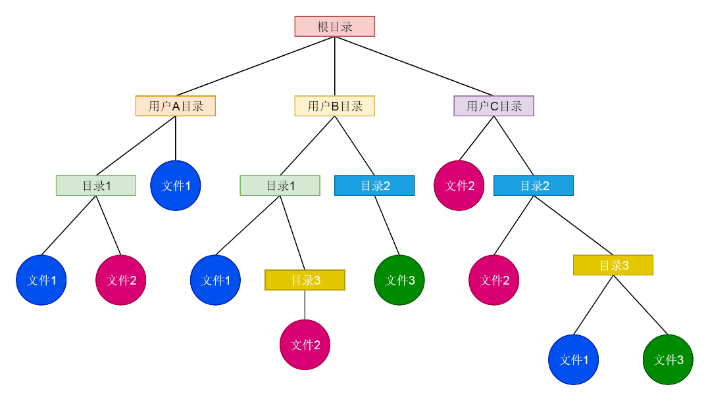
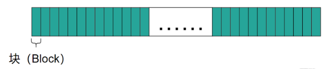
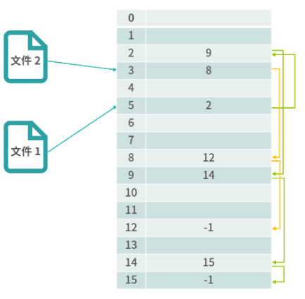
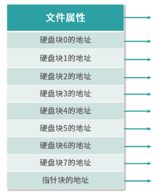
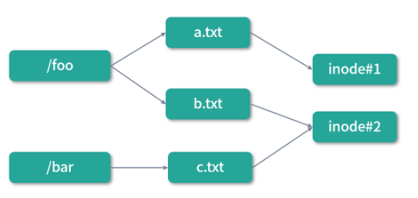
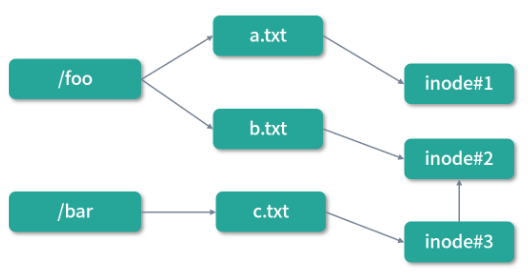

文件系统

---

##### 文件系统的功能

-  以块为单位的存储组织形式 

-  要有索引, 方便查找 

  

-  热点文件应该有缓存 

-  可以以文件夹形式组织, 方便管理 

  

-  在内存中维护数据结构, 保存哪些文件被哪些进程打开/使用 

##### 硬盘分块

使用硬盘和使用内存有一个很大的区别，内存可以支持到字节级别的随机存取，而这种情况在硬盘中通常是不支持的。为了提高性能，通常会将物理存储（硬盘）划分成一个个小块，比如每个 4KB。



##### 文件的描述

- **FAT（File Allocate Table）表**

  

  一个文件，最基本的就是要描述文件在硬盘中到底对应了哪些块。FAT 表通过一种类似链表的结构描述了文件对应的块。

  上图中：文件 1 从位置 5 开始，这就代表文件 1 在硬盘上的第 1 个块的序号是 5 的块 。然后位置 5 的值是 2，代表文件 1 的下一个块的是序号 2 的块。顺着这条链路，我们可以找到 5 → 2 → 9 → 14 → 15 → -1。-1 代表结束，所以文件 1 的块是：5,2,9,14,15。

  **FAT 通过一个链表结构解决了文件和物理块映射的问题，算法简单实用，因此得到过广泛的应用，到今天的 Windows/Linux/MacOS 都还支持 FAT 格式的文件系统。**FAT 的缺点就是**非常占用内存**，比如 1T 的硬盘，如果块的大小是 1K，那么就需要 1G 个 FAT 条目。

- **索引节点（inode）**

  为了改进 FAT 的容量限制问题，可以考虑为每个文件增加一个索引节点（inode）。这样，随着虚拟内存的使用，当文件导入内存的时候，先导入索引节点（inode），然后索引节点中有文件的全部信息，包括文件的属性和文件物理块的位置。

  

  如上图，索引节点除了属性和块的位置，还包括了一个指针块的地址。这是为了应对文件非常大的情况。一个大文件，一个索引节点存不下，需要通过指针链接到其他的块去描述文件。

- 目录的实现

  有了文件的描述，接下来我们来思考如何实现目录（Directory）。**目录是特殊的文件，所以每个目录都有自己的 inode**。目录是文件的集合，所以目录的内容中必须有所有其下文件的 inode 指针。

  ```shell
  #硬链接
  ln a b
  #软链接
  ln -s a b
  ```

  1. 硬链接

     /foo 和 /bar 两个目录中的 b.txt 和 c.txt 其实是一个文件，但是拥有不同的名称。这种形式我们称作“硬链接”，就是多个文件共享 inode。

     

     硬链接有一个非常显著的特点，硬链接的双方是平等的。上面的程序我们用ln指令为文件 a 创造了一个硬链接b。如果我们创造完删除了 a，那么 b 也是可以正常工作的。如果要删除掉这个文件的 inode，必须 a,b 同时删除。这里你可以看出 a,b 是平等的。

     ```shell
     ln a b
     ```

  2. 软链接

     

     图中c.txt是b.txt的一个软链接，软链接拥有自己的inode，但是文件内容就是一个快捷方式。因此，如果我们删除了b.txt，那么b.txt对应的 inode 也就被删除了。但是c.txt依然存在，只不过指向了一个空地址（访问不到）。如果删除了c.txt，那么不会对b.txt造成任何影响。

     ```shell
     ln -s a b
     ```

##### Linux文件权限

Linux文件采用10个标志位来表示文件权限，如下所示： 

```shell
-rw-r--r--  1 skyline  staff    20B  1 27 10:34 1.txt
drwxr-xr-x   5 skyline  staff   170B 12 23 19:01 ABTableViewCell
```

第一个字符一般用来区分文件和目录，其中：

- d：表示是一个目录，事实上在ext2fs中，目录是一个特殊的文件。
- -：表示这是一个普通的文件。
- l: 表示这是一个符号链接文件，实际上它指向另一个文件。
- b、c：分别表示区块设备和其他的外围设备，是特殊类型的文件。
- s、p：这些文件关系到系统的数据结构和管道，通常很少见到。

第2～10个字符当中的每3个为一组，左边三个字符表示所有者权限，中间3个字符表示与所有者同一组的用户的权限，右边3个字符是其他用户的权限。 

这三个一组共9个字符，代表的意义如下：

- r(Read，读取)：对文件而言，具有读取文件内容的权限；对目录来说，具有浏览目录的权限
- w(Write,写入)：对文件而言，具有新增、修改文件内容的权限；对目录来说，具有删除、移动目录内文件的权限。
- x(execute，执行)：对文件而言，具有执行文件的权限；对目录来说该用户具有进入目录的权限。

1. chmod命令

   用于改变文件或目录的访问权限。用户用它控制文件或目录的访问权限。 

   ```shell
   #110 100 100
   chmod 644 mm.txt
   ```

2. chgrp命令

   改变文件或目录所属的组。 

   ```shell
   #改变/opt/local /book/及其子目录下的所有文件的属组为book。
   chgrp - R book /opt/local/book
   ```

3. chown命令

   更改某个文件或目录的属主和属组。这个命令也很常用。例如root用户把自己的一个文件拷贝给用户cc，为了让用户cc能够存取这个文件，root用户应该把这个文件的属主设为cc，否则，用户cc无法存取这个文件。 

   ```shell
   #把文件shiyan.c的所有者改为wang。
   chown wang shiyan.c
   ```

   