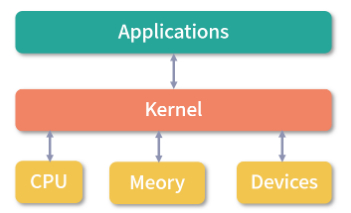
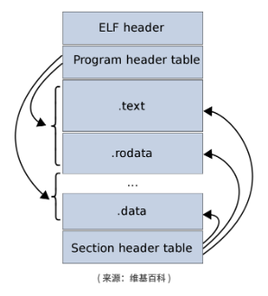
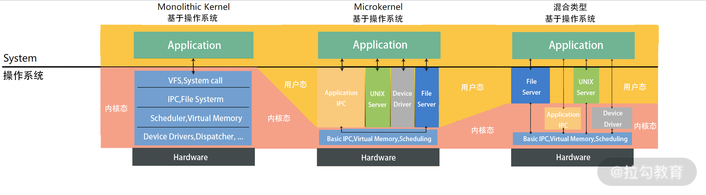
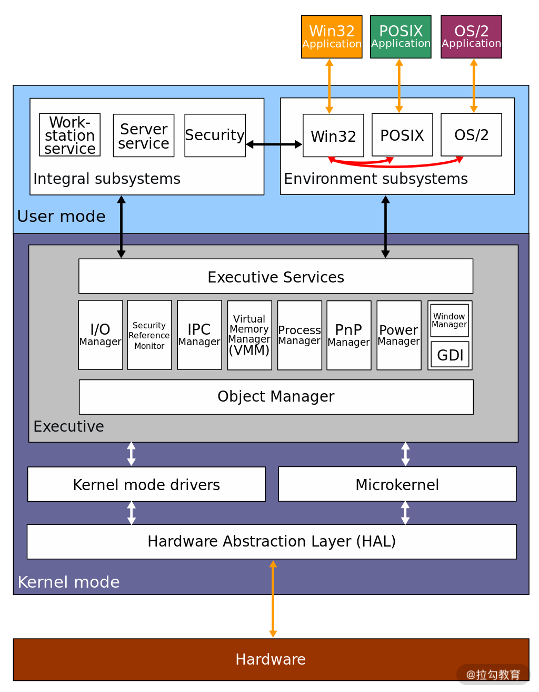

##### 什么是内核

内核是操作系统中应用连接硬件设备的桥梁。

##### 内核的能力

4种基本功能：

- 管理进程、线程（决定哪个进程、线程使用 CPU）；
- 管理内存（决定内存用来做什么）；
- 管理内存（决定内存用来做什么）；
- 提供系统调用（接收进程发送来的系统调用）。

##### 操作系统分层

操作系统分为三层：最底层的硬件设备抽象、中间的内核、最上层的应用：

##### 内核是如何工作的？

多数操作系统的设计都遵循一个原则：进程向内核发起一个请求，然后将 CPU 执行权限让出给内核。内核接手 CPU 执行权限，然后完成请求，再转让出 CPU 执行权限给调用进程。

##### Linux的内核设计

#### Multitask & SMP（Symmetric multiprocessing）

- **Multitask指多任务**，Linux是一个多任务的操作系统。多任务就是多个任务同时执行，这里的**同时**并不是要求并发，而是在一段时间内可以执行多个任务。
- **SMP指对称多处理**，Linux下的每个处理器的地位是相等的，内存对多个处理器来说是共享的，每个处理器都可以访问完整的内存和硬件资源。这个特点决定了在Linux上不会存在一个特定的处理器处理用户程序和内核程序，它们可以被分配到任何一个处理器上执行。

#### ELF（Executable & Linkable Format）

这个名词翻译过来叫作可执行文件链接格式。这是一种从 Unix 继承而来的可执行文件的存储格式。我们可以看到 ELF 中把文件分成了一个个分段（Segment），每个段都有自己的作用。

##### Monolithic Kernel（宏内核）

宏内核的反义词就是 Micro Kernel(微内核)。**Linux是宏内核架构，这说明Linux的内核是一个完整的可执行程序，且内核用最高权限来运行。**宏内核的特点就是有很多程序会打包在内核中，比如，文件系统、驱动、内存管理等。

与宏内核相反-> **微内核中，内核只保留最基本的能力。比如进程调度，虚拟内存、中断。多数应用，甚至包括驱动程序、文件系统，是在用户空间管理的。**

在内核层和在用户层有什么区别吗？

比如驱动程序是需要频繁调用底层能力的，如果在内核中，性能会好很多。对于微内核设计，驱动在内核外，驱动和硬件设备交互就需要频繁的做内核态的切换，会产生性能损失。但是微内核也有它的好处，比如微内核体积更小，可移植性强。

还有一种就是**混合类型内核**。 混合类型的特点就是架构像微内核，内核中会有一个最小版本的内核，其他功能会在这个能力上搭建。但是实现的时候，是用宏内核的方式实现的，就是内核被做成了一个完整的程序，大部分功能都包含在内核中。就是在宏内核之内有抽象出了一个微内核。

##### Windows内核设计

我们今天用的 Windows 7, Windows 10 是另一个内核，叫作 Windows NT。NT 指的是 New Technology。接下来我们讨论的都是 NT 版本的内核。

Windows 内核架构：

Windows 同样支持 Multitask 和 SMP（对称多处理）。Windows 的内核设计属于混合类型。你可以看到内核中有一个 Microkernel 模块。而整个内核实现又像宏内核一样，含有的能力非常多，是一个完整的整体。

从整体设计上来看，**Linux 是宏内核，NT 内核属于混合型内核**。和微内核不同，宏内核和混合类型内核从实现上来看是一个完整的程序。只不过混合类型内核内部也抽象出了微内核的概念，从内核内部看混合型内核的架构更像微内核。

NT 内核和 Linux 内核还存在着许多其他的差异，比如：

- Linux 内核是一个开源的内核；

- 它们支持的可执行文件格式不同；

- 它们用到的虚拟化技术不同。