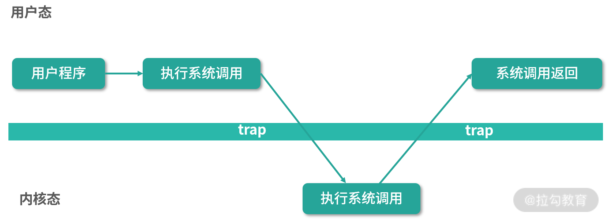
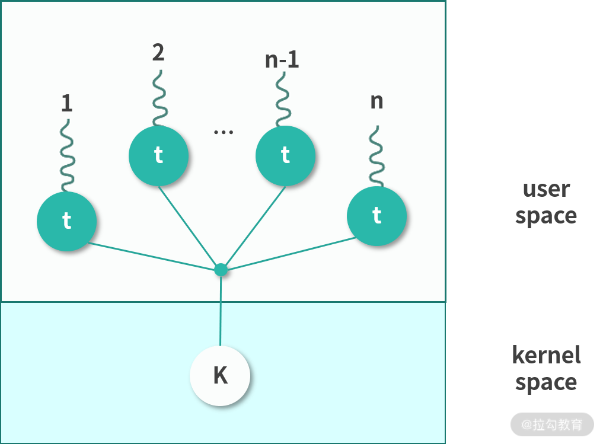
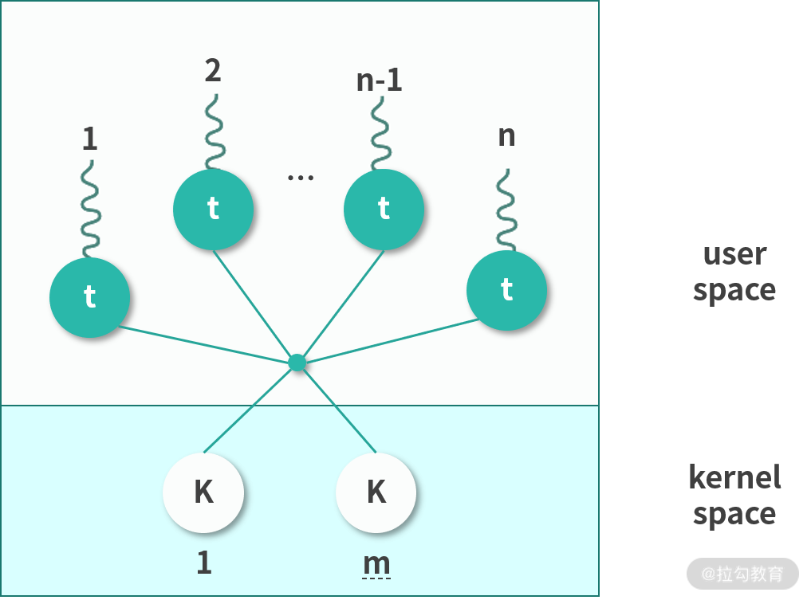
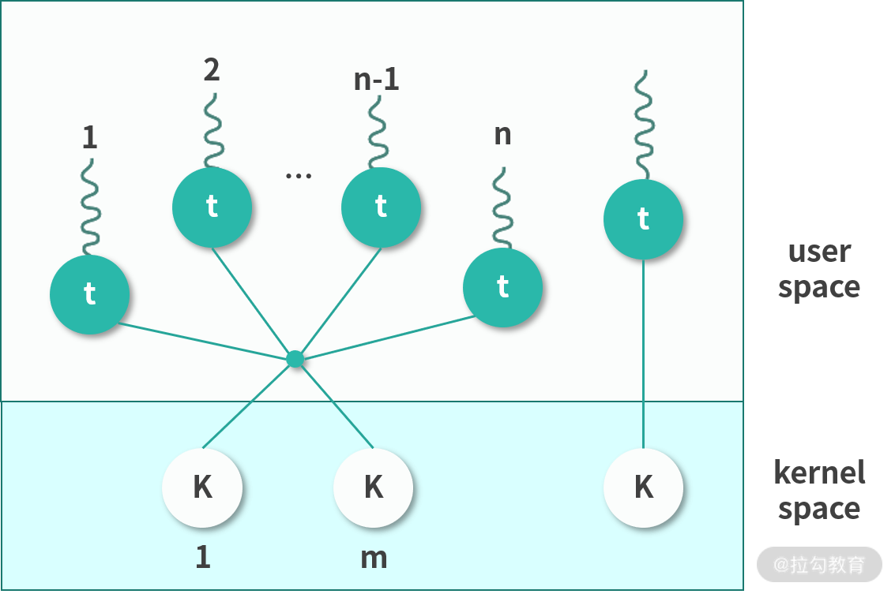

## 什么是用户态和内核态

**Kernel 运行在超级权限模式（Supervisor Mode）下**，所以拥有很高的权限。按照权限管理的原则，多数应用程序应该运行在最小权限下。因此，很多操作系统，将内存分成了两个区域：

- 内核空间(Kernel Space),这个空间只有内核程序可以访问；
- 用户空间(User Space),这部分内存专门给应用程序使用。

用户空间中的代码被限制了只能使用一个局部的内存空间，我们说这些程序在**用户态（User Mode）** 执行。内核空间中的代码可以访问所有内存，我们称这些程序在**内核态（Kernel Mode）** 执行。

## 系统调用过程

如果用户态程序需要执行系统调用，就需要切换到内核态执行。

如上图所示：内核程序执行在内核态（Kernel Mode），用户程序执行在用户态（User Mode）。当发生系统调用时，用户态的程序发起系统调用。因为系统调用中牵扯特权指令，用户态程序权限不足，因此会中断执行，也就是 Trap（Trap 是一种中断）。

发生中断后，当前 CPU 执行的程序会中断，跳转到中断处理程序。内核程序开始执行，也就是开始处理系统调用。内核处理完成后，主动触发 Trap，这样会再次发生中断，切换回用户态工作。

## 线程模型

#### 进程和线程

一个应用程序启动后会在内存中创建一个执行副本，这就是进程。Linux的内核是一个Monolithic Kernel(宏内核)，因此可以看作一个进程。也就是开机的时候，磁盘的内核镜像被导入内存作为一个执行副本，成为内核进程。

进程可以分成用户进程和内核进程两类。用户态进程通常是应用程序的副本，内核态进程就是内核本身的进程。**如果用户态进程需要申请资源，比如内存，可以通过系统调用想内核申请。**

那么用户态进程如果要执行程序，是否也要向内核申请呢？

程序在现代操作系统中并不是以进程为单位在执行，而是以一种轻量级进程(Light Weighted Process)，也称作线程(Thread)的形式执行。

一个进程可以拥有多个线程。进程创建的时候，一般会有一个主线程随着进程创建而创建。如果进程想要创造更多的线程，就需要思考一件事情，这个线程创建在用户态还是内核态。你可能会问，难道不是用户态的进程创建用户态的线程，内核态的进程创建内核态的线程吗？

**其实不是，进程可以通过 API 创建用户态的线程，也可以通过系统调用创建内核态的线程，接下来我们说说用户态的线程和内核态的线程。**

#### 用户态线程

用户态线程也称作用户级线程（User Level Thread）。操作系统内核并不知道它的存在，它完全是在用户空间中创建。

用户级线程有很多优势：

- **管理开销小**：创建、销毁不需要系统调用。
- **切换成本低**：用户空间程序可以自己维护，不需要走操作系统调度。

但是这种线程也有很多的缺点：

- **与内核协作成本高**：比如这种线程完全是用户空间程序在管理，当它进行 I/O 的时候，无法利用到内核的优势，需要频繁进行用户态到内核态的切换。
- **线程间协作成本高**：设想两个线程需要通信，通信需要 I/O，I/O 需要系统调用，因此用户态线程需要支付额外的系统调用成本。
- **无法利用多核优势**：比如操作系统调度的仍然是这个线程所属的进程，所以无论每次一个进程有多少用户态的线程，都只能并发执行一个线程，因此一个进程的多个线程无法利用多核的优势。
- **操作系统无法针对线程调度进行优化**：当一个进程的一个用户态线程阻塞（Block）了，操作系统无法及时发现和处理阻塞问题，它不会更换执行其他线程，从而造成资源浪费。

#### 内核态线程

内核态线程也称作内核级线程（Kernel Level Thread）。这种线程执行在内核态，可以通过系统调用创造一个内核级线程。

内核级线程有很多优势：

- 可以利用多核 CPU 优势：内核拥有较高权限，因此可以在多个 CPU 核心上执行内核线程。
- 操作系统级优化：内核中的线程操作 I/O 不需要进行系统调用；一个内核线程阻塞了，可以立即让另一个执行。

内核线程也有一些缺点：

- 创建成本高：创建的时候需要系统调用，也就是切换到内核态。
- 扩展性差：由一个内核程序管理，不可能数量太多。
- 切换成本较高：切换的时候，也同样存在需要内核操作，需要切换内核态。

#### 用户态线程和内核态线程之间的映射关系

**用户态线程创建成本低，问题明显，不可以利用多核。内核态线程，创建成本高，可以利用多核，切换速度慢。**因此通常我们会在内核中预先创建一些线程，并反复利用这些线程。这样，用户态线程和内核态线程之间就构成了下面 4 种可能的关系：

- **多对一（Many to One）**

  用户态进程中的多线程复用一个内核态线程。这样，极大地减少了创建内核态线程的成本，但是线程不可以并发。**因此，这种模型现在基本上用的很少。**我再多说一句，这里你可能会有疑问，比如：用户态线程怎么用内核态线程执行程序？程序是存储在内存中的指令，用户态线程是可以准备好程序让内核态线程执行的。

  

- **一对一（One to One）**

  该模型为每个用户态的线程分配一个单独的内核态线程，在这种情况下，每个用户态都需要通过系统调用创建一个绑定的内核线程，并附加在上面执行。 这种模型允许所有线程并发执行，能够充分利用多核优势，**Windows NT 内核采取的就是这种模型**。但是因为线程较多，对内核调度的压力会明显增加。

  

- **多对多(Many To Many)**

  这种模式下会为 n 个用户态线程分配 m 个内核态线程。m 通常可以小于 n。一种可行的策略是将 m 设置为核数。这种多对多的关系，减少了内核线程，同时也保证了多核心并发。**Linux 目前采用的就是该模型。**

  

- **两层设计(Two Level)**

  这种模型混合了多对多和一对一的特点。多数用户态线程和内核线程是 n 对 m 的关系，少量用户线程可以指定成 1 对 1 的关系。

  

## 用户态线程和内核态线程的区别？

用户态线程工作在用户空间，内核态线程工作在内核空间。用户态线程调度完全由进程负责，通常就是由进程的主线程负责。相当于进程主线程的延展，使用的是操作系统分配给进程主线程的时间片段。内核线程由内核维护，由操作系统调度。

- 用户态线程无法跨核心，一个进程的多个用户态线程不能并发，阻塞一个用户态线程会导致进程的主线程阻塞，直接交出执行权限。这些都是用户态线程的劣势。

- 内核线程可以独立执行，操作系统会分配时间片段。因此内核态线程更完整，也称作轻量级进程。内核态线程创建成本高，切换成本高，创建太多还会给调度算法增加压力，因此不会太多。

实际操作中，往往结合两者优势，**将用户态线程附着在内核态线程中执行。**

## JVM 的线程是用户态线程还是内核态线程？

JVM 自己本身有一个线程模型。在 JDK 1.1 的时候，JVM 自己管理用户级线程。这样做缺点非常明显，操作系统只调度内核级线程，用户级线程相当于基于操作系统分配到进程主线程的时间片，再次拆分，因此无法利用多核特性。

为了解决这个问题，**后来 Java 改用线程映射模型，因此，需要操作系统支持。在 Windows 上是 1 对 1 的模型，在 Linux 上是 n 对 m 的模型。**顺便说一句，Linux 的PThreadAPI 创建的是用户级线程，如果 Linux 要创建内核级线程有KThreadAPI。映射关系是操作系统自动完成的，用户不需要管。

补充：go-routine还是线程。区分线程和协程，关键在于能不能并行(parallelism)，就是利用多核。 **go-routine是用户级线程**，也称为Green Thread。多个Go-Routine复用多个内核线程。比如100个go-routine复用10的内核线程