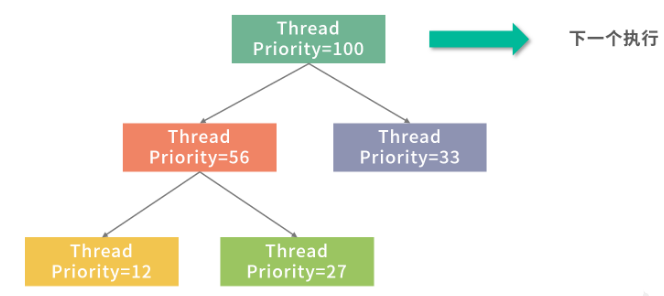
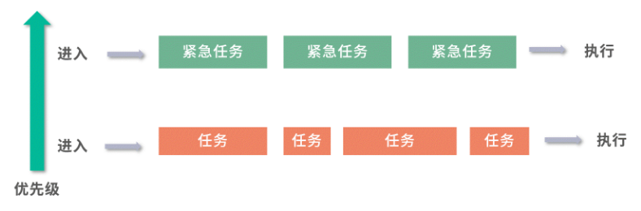
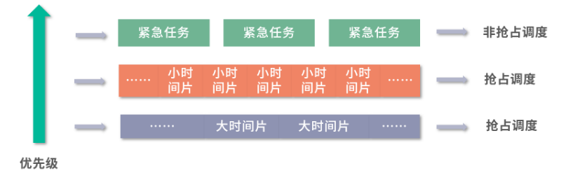

## 线程调度都有哪些方法？

所谓调度，是制定一个计划的过程，放在线程调度背景下，就是操作系统如何决定未来执行哪些线程？

可以抓住两条主线：

1. 形形色色的调度场景怎么来的？
2. 每个调度算法是如何工作的？

### 先来先服务(First Come First Service,FCFS)

早期的操作系统是一个个处理作业（Job），比如很多保险业务，每处理一个称为一个作业（Job）。处理作业最容易想到的就是先到先服务（First Come First Service，FCFS），也就是**先到的作业先被计算，后到的作业，排队进行**。

这里需要用到一个叫作队列的数据结构，具有**先入先出（First In First Out，FIFO）**性质。先进入队列的作业，先处理，因此从公平性来说，这个算法非常朴素。另外，一个作业完全完成才会进入下一个作业，作业之间不会发生切换，从吞吐量上说，是最优的——因为没有额外开销。

**但是**这样对于等待作业的用户来说，是有问题的：比如一笔需要用时 1 天的作业 ，如果等待了 10 分钟，用户是可以接受的；一个用时 10 分钟的作业，用户等待一天就要投诉了。 **因此如果用时 1 天的作业先到，用时 10 分钟的任务后到，应该优先处理用时少的，也就是短作业优先（Shortest Job First，SJF）**。

### 短作业优先(Shortest Job First,SJF)

通常会同时考虑到来顺序和作业预估时间的长短，比如下面的到来顺序和预估时间：

短作业优先的优势，就是平均等待时间：**平均等待时间=总等待时间/任务数**

按上图的栗子：

- 按照3、3、10的顺序处理，平均等待时间是：（0+3+6）/3 = 3min
- 按照10、3、3的顺序处理，平均等待时间是：（0+10+13）/3 = 7.66min

平均等待时间和用户满意度是成反比的。因此在大多数情况下，**应该是优先处理用时少的，从而降低平均等待时间。**

采用**FCFS**和**SJF**后，还有一些问题没有解决：

1. 紧急任务如何插队？
2. 等待太久的任务如何插队？
3. 先执行的大任务导致后面来的小任务没有执行 如何处理？

为了解决上面的问题，设计出了两种方案：1、优先级队列(Priority Queue)，2、抢占(Preemption)。

###  优先级队列(Priority Queue)

优先级队列可以给队列中每个元素一个优先级，优先级越高的任务就会被先执行。

优先级队列的一种实现方法就是用到了堆(Heap)这种数据结构，更最简单的实现方法，就是每次扫描整个队列优先级最高的任务。也就是说，**堆可以帮你在O(1)的时间复杂度内查找到最大优先级的元素。**

**比如重要的任务，就给一个更高的优先级。而对于普通任务，可以在等待时间(W)和预估执行时间(P)中，找一个数学关系来描述。比如：优先级=W/P。W越大，或则P越小，就越排在前面。**也可以通过其他的数学方法，利用对数计算或者某种特别的分段函数。

---

这样，关于**紧急任务如何插队**？**等待太久的任务如何插队**？这两个任务就可以解决了。接下来来看**先执行的大任务导致后面的先任务没有执行的情况**如何解决？

### 抢占(Preemption)

为了解决这个问题，我们需要用到抢占(Preemption)。

**抢占就是把执行能力分时，分成时间片段。让每个任务都执行一个时间片段。如果在时间片段内，任务完成，那么就调度下一个任务。如果任务没有执行完成，则中断任务，让任务重新排队，调度下一个任务。**

拥有了抢占的能力，再结合之前我们提到的优先级队列能力，这就构成了一个基本的线程调度模型。线程相对于操作系统是排队到来的，操作系统为每个到来的线程分配一个优先级，然后把它们放入一个优先级队列中，优先级最高的线程下一个执行。

每个线程执行一个时间片段，然后每次执行完一个线程就执行一段调度程序。

图中用红色代表调度程序，其他颜色代表被调度线程的时间片段。调度程序可以考虑实现为一个单线程模型，这样不需要考虑竞争条件。

---

上面的这个模型已经是一个非常优秀的方案，但是还有一些问题可以进一步处理得更好。

1. **如果一个线程优先级非常高，其实没必要再抢占，因为无论如何调度，下一个时间片段还是给它。那么这种情况如何实现？**
2. **如果希望实现最短作业优先的抢占，就必须知道每个线程的执行时间，而这个时间是不可预估的，那么这种情况有应该如何处理？**

### 多级队列模型

多级队列，就是多个队列执行调度。我们先考虑最简单的两级模型，如图：

上图中设计了两个优先级不同的队列，从下到上优先级上升，**上层队列调度紧急任务，下层队列调度普通任务**。只要上层队列有任务，下层队列就会让出执行权限。

- 低优先级队列可以考虑**抢占+优先级队列**的方式实现，这样每次执行一个时间片段就可以判断一下高优先级队列中是否有任务。
- 高优先级队列可以考虑用**非抢占(每个任务执行完才执行下一个)+优先级队列**实现，这样紧急任务优先级有个区分。

上面这个模型虽然解决了任务间的优先级问题，但是还没有解决段任务先行的问题。可以考虑再增加一些队列，让级别更多。比如下面这个模型：

紧急任务仍然走高优先队列，非抢占执行。

**普通任务先放到优先级仅次于高优先任务的队列中，并且只分配很小的时间片。如果没有执行完成，说明任务不是很短，就将任务下调一层。下面一层，最低优先级的队列中时间片很大，长任务就有更大的时间片可以用。**

通过这种方式，短任务会在更高优先级的队列中执行完成，长任务优先级会下调，也就类似实现了最短作业优先的问题。

### 总结：线程调度都有哪些方法？

非抢占的先到先服务的模型是最朴素的，公平性和吞吐量可以保证。

但是因为**操作系统希望减少用户的平均等待时间，往往需要实现抢占。操作系统希望有优先级，希望有最短任务优先。**

但是存在一个问题，**操作系统无法预判每个任务的预估执行时间**，就需要使用**分级队列**。

- **最高优先级的任务可以考虑非抢占的优先级队列**。
- **其他任务放到分级模型中执行，从最高优先级时间片段最小向最低优先级时间片段最大逐渐沉淀。**这样就同时保证小任务先行和高优任务最先执行。

