面试的时候，面试官问了一个很常见的TopN算法，我却傻了。算法是面试官经常考核的内容，所以决定专门来通过写文档把常见的算法面试题给学习一下。

##### TopN算法与排行榜

> 在系统中，我们经常会遇到这样的需求：**将大量（比如几十万、甚至上百万）的对象进行排序，然后只需要取出最Top的前N名作为排行榜的数据，这即是一个TopN算法**。
>
> 使用最小堆排序，然后取出前N名。

##### 堆的介绍

Heap是一种数据结构且具有以下特点：

1. 完全二叉树
2. heap中存储的值是偏序

Min-heap：父节点的值小于或等于子节点的值（查找最大的N个元素）

Max-heap：父节点的值大于或等于子节点的值（查找最小的N个元素）

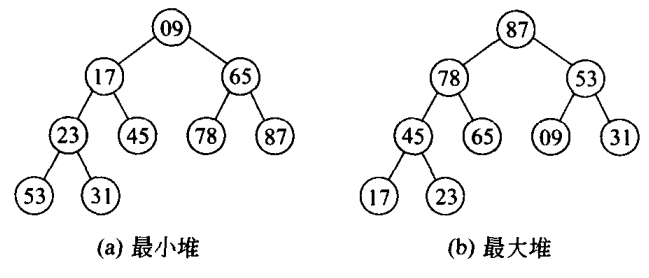

##### 堆的存储

一般用数组来表示堆，i 节点的父节点下标就为**(i-1)/2**。它的左右节点下标分别为**2*i+1**和**2*i+2**。

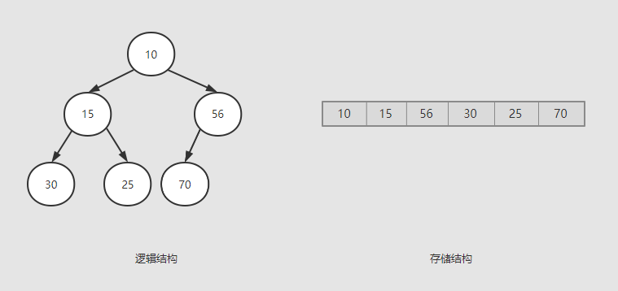

由于堆存储在下标从0开始计数的在数组中，因此，在堆中给定下标为i的节点时：

1. 如果i=0，节点i是根节点，无父节点；否则节点i的父节点为节点(i-1)/2；
2. 如果2i+1>n-1，则节点i无左子女；否则节点i的左子女为节点2i+1；
3. 如果2i+2>n-1，则节点i无右节点；否则节点的右子女为节点2i+2。

比如56的下标为2，**2*2+2>5**，则无右节点。

##### 堆的操作：插入元素

插入一个元素：**新元素被加入到heap的末尾，然后更新树以恢复堆的顺序。**

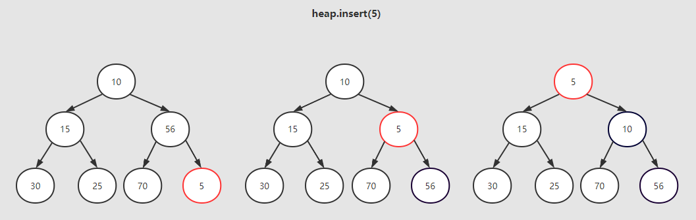

##### 堆的操作：删除元素

**最小堆的删除操作，总是按照堆的根节点删除元素**。为了便于重建堆，**实际的操作是将最后一个数据的值赋给根节点，然后从根节点开始一次从上向下的调整。**

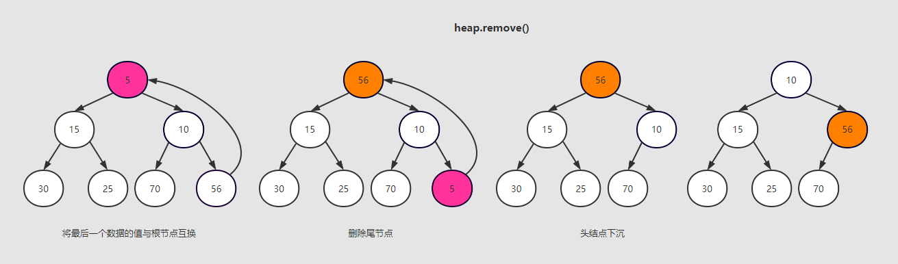

##### 堆的操作：创建堆

 创建最小堆有两种方法： 

1. 先创建一个空堆，然后根据元素一个一个去插入节点。由于插入操作的时间复杂度为**O(log2(n))**，然后n个元素插入进去，总的时间复杂度为**O(n*log2(n))**。
2. 将这n个元素先按顺序放入一个二叉树中形成一个完全二叉树，然后调整各个节点的位置来满足最大堆的特性。

最大堆有一个特点就是其各个子树都是一个最大堆，那么我们就可以从最小字数转换成一个最大堆，然后依次转换它的父节点对应的子树，直到最后的根节点所在的整个完全二叉树变成最大堆。

那么就按照方法2来构建最小堆吧！

具体步骤：

｛30，25，70，10，15，56｝将这6个数字放入一个完全二叉树中，如下：

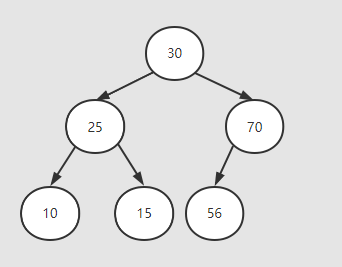

1.找到二叉树中倒数第一个非叶子节点**70**，然后以该非叶子节点为根节点的子树，查看该子树是否满足最小堆要求，很明显目前该子树不满足最小堆，所以需要移动节点。该子树最大移动次数为1。

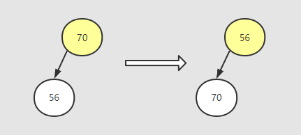

2. 来到节点25，做类似操作（该子树最大移动次数为1）：

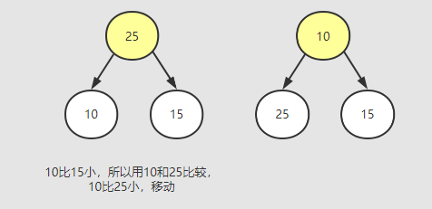

3. 来到节点30，对该子树做同样操作（该子树最大移动次数为2）：

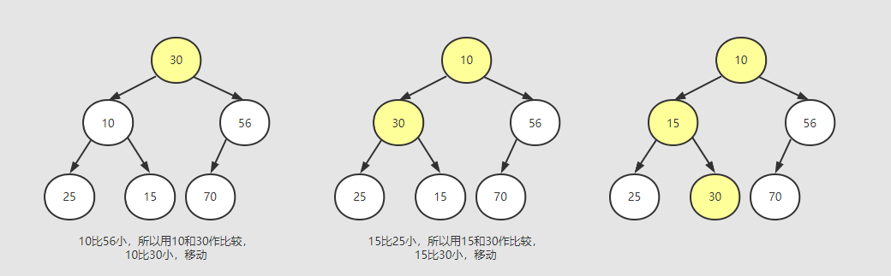

即创建的最小队如图上（最大移动次数为4次。） ；                                                                                👆 

##### 堆的操作：堆的排序

如果是从大到小排序，创建最小堆后，第0个数据就是堆中最小的数据。取出这个数据，放在数组的最后一个元素上，将当前元素总数减一，再执行下推的删除操作，这样堆中的第0个数据又是堆中最小的数据，重复上述步骤直至堆中只有一个数据时，数组元素就已经有序。

演示：

最小堆：

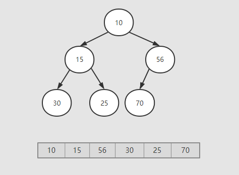

1. 把根节点10“删除”，第一次排序如图：

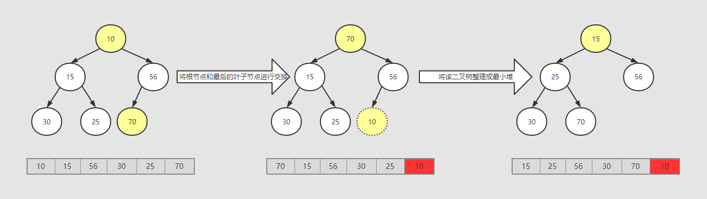

2. 节点15进行相同操作：


3. 。。。

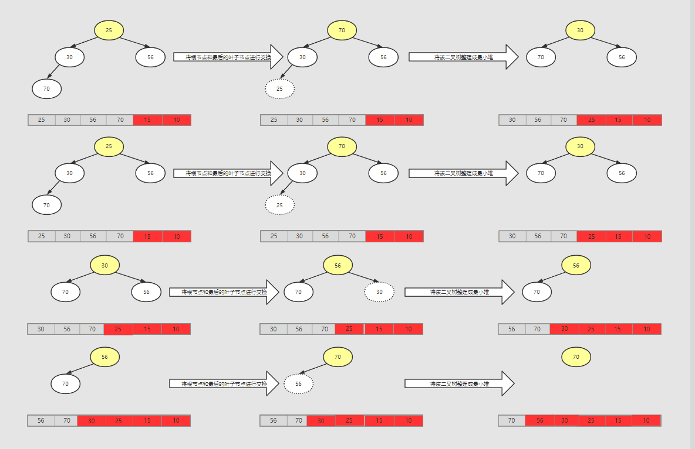

经过上述步骤，最后可以得到一个排序结果：

```java
{70,56,30,25,15,10}
```

- 时间复杂度：O(*nlgn*)
- 空间复杂度：O(1)

##### 使用堆排序

> 我们指定获取前N个最大的数字，所以我们构建一有N个节点的小根堆，遍历百万级数组，用数组去和小根堆的根节点进行比较，如果比根节点大，则替换根节点，然后重建小根堆，维护小根堆的性质，保证根节点在堆中最小，遍历完成后，堆中数字则为数组中最大数字。

##### 代码实现：

```java
package com.dueclassic.algorithm.sort;

import java.util.Arrays;
import java.util.Random;

public class TopN {

    public static void main(String[] args) {
        //首先创建一个含100000个浮点数的数组。
        float arr[]=new float[100000];
        Random random=new Random();
        float v;
        for (int i=0;i<100000;i++){
            v=random.nextFloat()*10f;
            arr[i]=v;
        }
        long start=System.currentTimeMillis();
        //获取其最大的前一百个
        float[] maxNumArr=getMaxNum(100,arr);
        //对这一百个进行堆排序
        heapSort(maxNumArr);
        print(maxNumArr);
        System.out.println("花费时间："+(System.currentTimeMillis()-start));
    }

    //核心方法
    private static float[] getMaxNum(int count,float[] data){
        float[] maxNumArr= Arrays.copyOfRange(data,0,count);
        //1.先构造小根堆
        createMindHeap(maxNumArr,count-1);
        //2.维护小根堆
        for (int i=100;i<data.length-1;i++){
            //如果值大于最小堆的最小值，则添加该值，维护最小堆
            if (data[i]>maxNumArr[0]){
                maxNumArr[0]=data[i];
                buildMindHeap(maxNumArr,count-1);
            }
        }
        return maxNumArr;
    }

    //构造小根堆
    private static void createMindHeap(float[] num,int lastIndex){
        for (int i=(num.length-1)/2;i>=0;i--){
            heapCompare(i,num,lastIndex);
        }
    }

    //维护小根堆
    private static void buildMindHeap(float[] data,int lastIndex){
        int i=0;
        heapCompare(i,data,lastIndex);
    }

    //堆下沉
    private static void heapCompare(int i,float[] num,int lastIndex){
        //0.判断是否超出数组范围
        while (i*2+1<=lastIndex){
            int index=i*2+1;
            int rightIndex=index+1;
            //1.判断右节点是否存在
            if (rightIndex<=lastIndex){
                //2.判断左右节点大小
                if (num[index]>num[rightIndex]){
                    //如果右节点值比较小，则使用右节点值来与父节点的值来作比较
                    index=rightIndex;
                }
            }
            //3.判读父节点和其子节点中小的节点作比较，如果是父节点大，则做下一回合的比较，否则，退出循环
            if (num[i]>num[index]){
                swap(num,i,index);
                i=index;
            }else {
                break;
            }
        }
    }

    //小根堆排序
    private static void heapSort(float[] data){
        for (int i=0;i<data.length-1;i++){
            //每次将最小的数字放在最后，然后使用剩下的数组进行堆排序
            buildMindHeap(data,data.length-1-i);
            swap(data,0,data.length-1-i);
        }
    }

    //交换元素
    private static void swap(float[] data,int i,int j){
        if (i==j){
            return;
        }
        float temp=data[i];
        data[i]=data[j];
        data[j]=temp;
    }

    //输出数组
    private static void print(float[] data){
        for (int i=0;i<data.length;i++){
            System.out.println(data[i]+" ");
        }
    }
}

```


##### 参考

- [最大堆（创建、删除、插入和堆排序）]( https://www.jianshu.com/p/21bef3fc3030 )
- [小根堆(Heap)的详细实现](https://www.cnblogs.com/WindSun/p/11444446.html)
- [数据结构——堆（Heap）大根堆、小根堆]( https://www.cnblogs.com/wangchaowei/p/8288216.html )
- [堆排序实现百万级数据取若干数量的最大数字（java）]( https://blog.csdn.net/jayzym/article/details/79494900?utm_medium=distribute.pc_relevant_t0.none-task-blog-BlogCommendFromMachineLearnPai2-1.nonecase&depth_1-utm_source=distribute.pc_relevant_t0.none-task-blog-BlogCommendFromMachineLearnPai2-1.nonecase )

##### 工具

- [ProcessOn]( https://www.processon.com/diagrams )