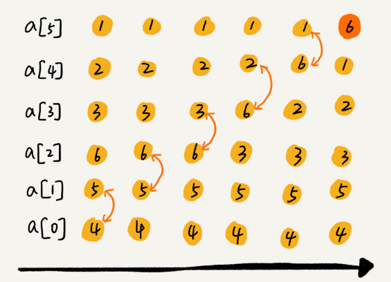
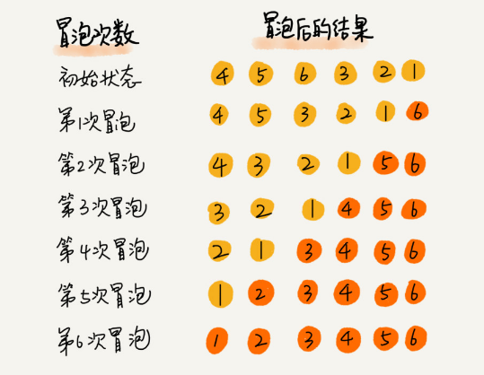
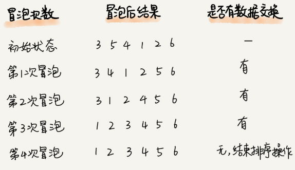
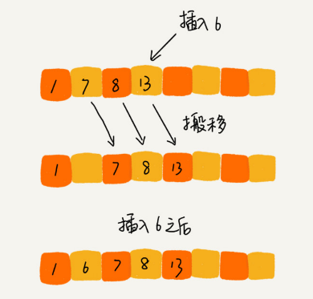
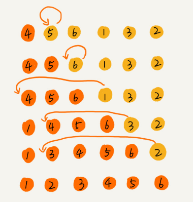
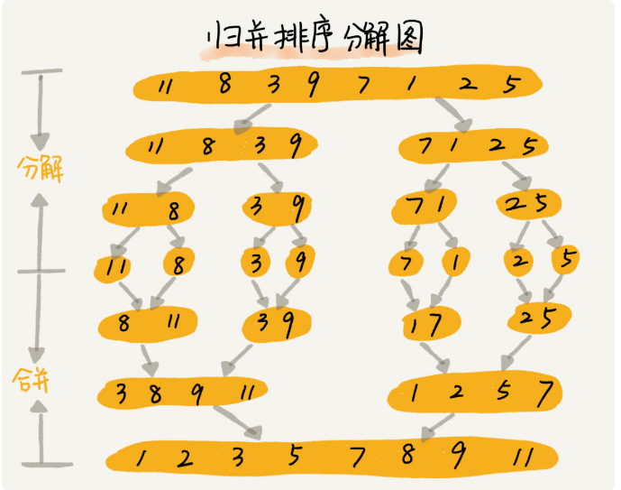
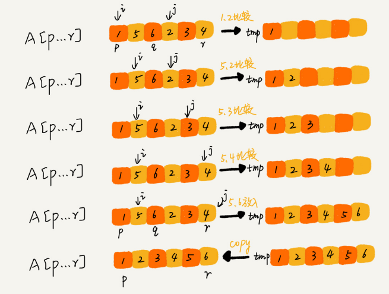
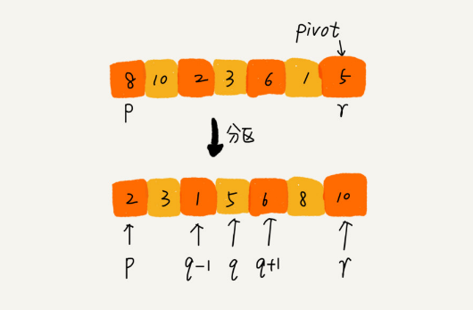
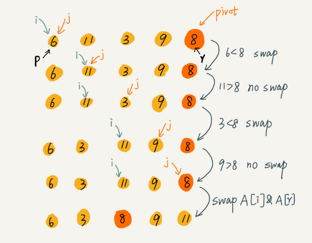
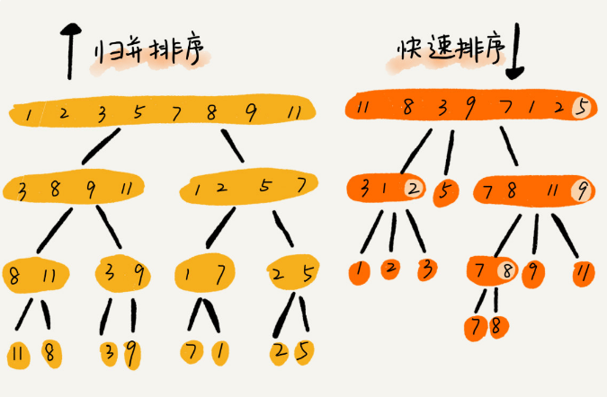

基本的排序算法包含以下几种：

- 冒泡排序（Bubble Sort）
- 插入排序（Insertion Sort）(重要)
- 选择排序（Selection Sort）
- 归并排序（Merge Sort）(重要)
- 快速排序（Quick Sort）(重要)

#### 如何分析一个排序算法

1. 排序算法的执行效率

   -  最好情况、最坏情况、平均情况时间复杂度 
   -  时间复杂度的系数、常数 、低阶 
   -  比较次数和交换（或移动）次数 

2. 排序算法的内存消耗

   针对排序算法的空间复杂度，我们还引入了一个新的概念，**原地排序（Sorted in place）**。原地排序算法，就是特指空间复杂度是 O(1) 的排序算法。 

3. 排序算法的稳定性

   **稳定性**。这个概念是说，如果待排序的序列中存在值相等的元素，经过排序之后，相等元素之间原有的先后顺序不变。 

#### 冒泡排序（Bubble Sort）

冒泡排序只会操作相邻的两个数据。每次冒泡操作都会对相邻的两个元素进行比较，看是否满足大小关系要求。如果不满足就让它两互换。一次冒泡会让至少一个元素移动到它应该在的位置，重复n次，就完成了n个数据的排序工作。

我用一个例子，带你看下冒泡排序的整个过程。我们要对一组数据 4，5，6，3，2，1，从小到大进行排序。第一次冒泡操作的详细过程就是这样： 



可以看出，经过一次冒泡操作之后，6 这个元素已经存储在正确的位置上。要想完成所有数据的排序，我们只要进行 6 次这样的冒泡操作就行了。 



实际上，刚讲的冒泡过程还可以优化。当某次冒泡操作已经没有数据交换时，说明已经达到完全有序，不用再继续执行后续的冒泡操作。我这里还有另外一个例子，这里面给 6 个元素排序，只需要 4 次冒泡操作就可以了。



**代码** ：

```java
public void bubbleSort(int[] nums){
    if(nums.length<=1) return ;
    boolean flag;
    for(int i=0;i<nums.length-1;i++){
        flag=true;
        for(int j=0;j<nums.length-i-1;j++){
            if(nums[j]>nums[j+1]){
                int temp=nums[j];
                nums[j]=nums[j+1];
                nums[j+1]=temp;
                flag=false;
            }
        }
        if(flag==true){
            break;
        }
    }
}
```

1. 冒泡的过程只涉及相邻数据的交换操作，只需要常量级的临时空间，所以它的空间复杂度为 O(1)，**是一个原地排序算法**。

2. 在冒泡排序中，只有交换才可以改变两个元素的前后顺序。为了保证冒泡排序算法的稳定性，当有相邻的两个元素大小相等的时候，我们不做交换，相同大小的数据在排序前后不会改变顺序，所以**冒泡排序是稳定的排序算法**。

3. **最坏**的情况是，要排序的数据刚好是倒序排列的，我们需要进行 n 次冒泡操作，所以最坏情况时间复杂度为 **O(n2)**。

   **最好**情况下，要排序的数据已经是有序的了，我们只需要进行一次冒泡操作，就可以结束了，所以最好情况时间复杂度是 **O(n)**。

   **平均**情况下的时间复杂度就是 **O(n2)**。

#### 插入排序（Insertion Sort）

首先，一个有序的数组，我们往里面添加一个新的数据后，如何继续保持数据有序呢？很简单，我们只要遍历数组，找到数据应该插入的位置将其插入即可。 



插入排序具体是如何借助上面的思想来实现排序的呢？ 

首先，我们将数组中的数据分为两个区间，**已排序区间**和**未排序区间**。**初始已排序区间只有一个元素，就是数组的第一个元素。插入算法的核心思想是取未排序区间中的元素，在已排序区间中找到合适的插入位置将其插入，并保证已排序区间数据一直有序**。重复这个过程，直到未排序区间中元素为空，算法结束。 

如图所示，要排序的数据是 4，5，6，1，3，2，其中左侧为已排序区间，右侧是未排序区间。 



插入排序包含两个操作：

- **元素的比较**：当我们需要将一个数据a插入到已排序区间时，需要拿a与已排序区间的元素比较大小，找到合适的插入位置。
- **元素的移动**：找到插入点之后，我们还需要将插入点之后的元素顺序往后移动一位。

**代码**：

```java
public void insertSort(int[] nums){
    if(nums.length<=1) return;
    for(int i=1;i<nums.length;i++) {
        //只会被覆盖，提前保留
        int temp = nums[i];
        int j = i;
        //从后向前比较
        for (; j > 0; j--) {
            //移动
            if (temp < nums[j - 1]) {
                nums[j] = nums[j - 1];
            } else {
                break;
            }
        }
        nums[j] = temp;
    }
}
```

1. 插入排序算法的运行并不需要额外的存储空间，所以空间复杂度是 O(1)，也就是说，这**是一个原地排序算法**。 
2. 在插入排序中，对于值相同的元素，我们可以选择将后面出现的元素，插入到前面出现元素的后面，这样就可以保持原有的前后顺序不变，所以插入排序**是稳定的排序算法**。
3. 时间复杂度：
   -  最好是时间复杂度为 O(n)。 
   -  最坏情况时间复杂度为 O(n2)。 
   -  平均时间复杂度为 O(n2)。 

Q:

> 在实际的软件开发中，为什么我们更倾向于使用插入排序而不是冒泡排序算法呢？

A:

> 从代码实现上来看，冒泡排序的数据交换要比插入排序的数据移动要复杂，冒泡排序需要3个赋值操作，而插入排序只需要1个，所以在对相同数组进行排序时，冒泡排序的运行时间理论上要长于插入排序。 

#### 选择排序（Selection Sort）

选择排序算法的实现思路有点类似插入排序，也分**已排序区间**和**未排序区间**。但是**选择排序每次会从未排序区间中找到最小的元素，将其放到已排序区间的末尾**。

1. 选择排序空间复杂度为 O(1)，是一种原地排序算法。 
2. 选择排序的最好情况时间复杂度、最坏情况和平均情况时间复杂度都为 O(n2)。 
3. 选择排序是一种不稳定的排序算法。选择排序每次都要找剩余未排序元素中的最小值，并和前面的元素交换位置，这样破坏了稳定性。 


> 归并排序和快速排序都用到了分治思想

#### 归并排序（Merge Sort）

归并排序的核心思想还是蛮简单的。如果要排序一个数组，我们先把数组从中间分成前后两部分，然后对前后两部分分别排序，再将排好序的两部分合并在一起，这样整个数组就都有序了。 



归并排序使用的就是**分治思想**。分治，顾名思义，就是分而治之，将一个大问题分解成小的子问题来解决。分治算法一般都是用递归来实现的。

> 分治是一种解决问题的处理思想，递归是一种编程技巧 

 归并排序的递推公式:

```tiki wiki
#递推公式：
merge_sort(p...r) = merge(merge_sort(p...q),merge_sort(q+1...r))
q的下标=(p+r)/2
#中止条件：
p>=r 不再继续分解
```

merge_sort(p…r) 表示，给下标从 p 到 r 之间的数组排序。我们将这个排序问题转化为了两个子问题，merge_sort(p…q) 和 merge_sort(q+1…r)，其中下标 q 等于 p 和 r 的中间位置，也就是 (p+r)/2。当下标从 p 到 q 和从 q+1 到 r 这两个子数组都排好序之后，我们再将两个有序的子数组合并在一起，这样下标从 p 到 r 之间的数据就也排好序了。

merge(A[p...r], A[p...q], A[q+1...r]) 这个函数的作用就是，将已经有序的 A[p...q]和 A[q+1....r]合并成一个有序的数组，并且放入 A[p....r]。 

 如图所示，我们申请一个临时数组 tmp，大小与 A[p...r]相同。我们用两个游标 i 和 j，分别指向 A[p...q]和 A[q+1...r]的第一个元素。比较这两个元素 A[i]和 A[j]，如果 A[i]<=A[j]，我们就把 A[i]放入到临时数组 tmp，并且 i 后移一位，否则将 A[j]放入到数组 tmp，j 后移一位。 



继续上述比较过程，直到其中一个子数组中的所有数据都放入临时数组中，再把另一个数组中的数据依次加入到临时数组的末尾，这个时候，临时数组中存储的就是两个子数组合并之后的结果了。最后再把临时数组 tmp 中的数据拷贝到原数组 A[p...r]中。 

**代码**：

```java
public static void merge_sort(int[] nums){
    merge_sort_c(nums,0,nums.length-1);
}

public static void merge_sort_c(int[] nums,int l,int r){
    if(l>=r) return;
    int m=l+(r-l)/2;
    //System.out.println("r="+l+","+"m="+m+","+"n="+r);
    //分解
    merge_sort_c(nums,l,m);
    merge_sort_c(nums,m+1,r);
    //合并
    merge(nums,l,m,r);
    //System.out.print("<<");
    //for(int i=l;i<=r;i++){
    //    System.out.print(nums[i]+" ");
    //}
    //System.out.println(">>");
}

public static void merge(int[] nums,int l,int m,int r){
    //申请一个数组，数组长度：r-l+1
    int[] tmp=new int[r-l+1];
    int k=0;
    int i=l;
    int j=m+1;
    //i=0,m=1,j=2,r=3
    while(i<=m && j<=r){
        if(nums[i]<nums[j]){
            tmp[k++]=nums[i++];
        }else{
            tmp[k++]=nums[j++];
        }
    }
    //判断哪个子数组还有空余(一定有一个子数组空余)
    int start;
    int end;
    if(m>=i){
        start=i;
        end=m;
    }else{
        start=j;
        end=r;
    }
    //将剩余数据拷贝到临时数组tmp中
    while(start<=end){
        tmp[k++]=nums[start++];
    }
    //将tmp中的数据拷贝回原数组中
    for(int n=0;n<=r-l;n++){
        nums[n+l]=tmp[n];
    }
}
```

1.  归并排序保证了值相同的元素，在合并前后的先后顺序不变，是一个稳定的排序算法。（主要看merge函数的实现）
2. 最好情况、最坏情况，还是平均情况，时间复杂度都是 O(n log n)。
3. 在任意时刻，CPU 只会有一个函数在执行，也就只会有一个临时的内存空间在使用。临时内存空间最大也不会超过 n 个数据的大小，所以空间复杂度是O(n) 。(与快速排序相比的致命弱点)

#### 快速排序（Quick Sort）

快排的思想是这样的：**如果要排序数组中下标从 p 到 r 之间的一组数据，我们选择 p 到 r 之间的任意一个数据作为 pivot（分区点）**。 

我们遍历 p 到 r 之间的数据：

- 将小于 pivot 的放到左边
- 将大于 pivot 的放到右边
- 将 pivot 放到中间

经过这一步骤之后，数组 p 到 r 之间的数据就被分成了三个部分：

- 前面 p 到 q-1 之间都是小于 pivot 的
- 中间是 pivot
- 后面的 q+1 到 r 之间是大于 pivot 的。 



根据分治、递归的处理思想，我们可以用递归排序下标从 p 到 q-1 之间的数据和下标从 q+1 到 r 之间的数据，直到区间缩小为 1，就说明所有的数据都有序了。 

**递推公式 **:

```tiki wiki
#递推公式
quick_sort(l...r)=quick_sort(l...m-1)+quick_sort(m+1...r)
#中止条件
l>=r
```

**代码**：

```java
public void quick_sort(int[] nums){
    quick_sort_c(nums,0,nums.length-1);
}

public void quick_sort_c(int[] nums,int l,int r){
    if(l>=r) return;
    int p=partition(nums,l,r);
    quick_sort_c(nums,l,p-1);
    quick_sort_c(nums,p+1,r);
}

public int partition(int[] nums,int l,int r){
    //选择分区点
    int pivot=nums[r];
    int i=l;
    //即i下标之前的元素都是小于pivot的！！！
    for(int j=l;j<=r-1;j++){
        if(nums[j]<pivot){
            swap(nums,i,j);
            i++;
        }
    }
    swap(nums,i,r);
    return i;
}

public void swap(int[] nums,int i,int j){
    if(i==j)return;
    int temp=nums[i];
	nums[i]=nums[j];
	nums[j]=temp;
}
```

 一张图来展示快速排序**分区函数**的整个过程： 



1.  快排是一种原地、不稳定的排序算法。
2.  大部分情况下的时间复杂度都可以做到 O(n log n)，只有在极端情况下，才会退化到 O(n2)。而且，我们也有很多方法将这个概率降到很低，如何来做？  

快速排序和归并排序的区别：



可以发现:

- 归并排序的处理过程是由下到上的，先处理子问题，然后再合并。归并排序虽然是稳定的、时间复杂度为 O(n log n) 的排序算法，但是它是非原地排序算法。归并之所以是非原地排序算法，主要原因是合并函数无法在原地执行。
- 而快排正好相反，它的处理过程是由上到下的，先分区，然后再处理子问题。快速排序通过设计巧妙的原地分区函数，可以实现原地排序，解决了归并排序占用太多内存的问题。 


