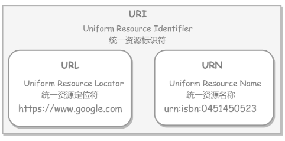
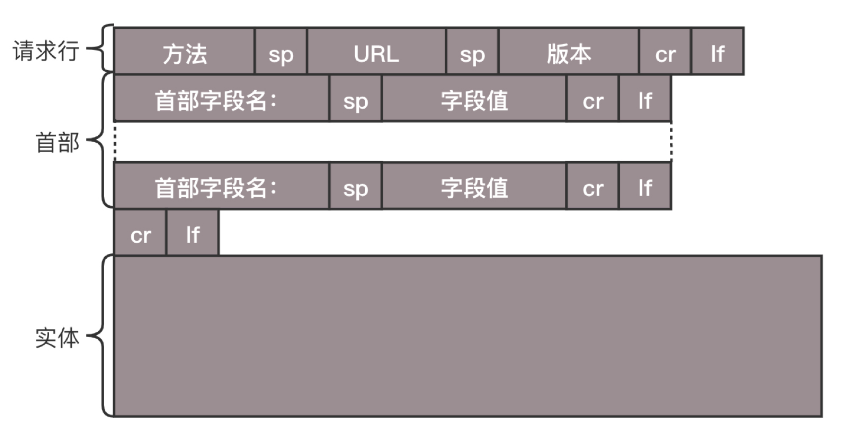
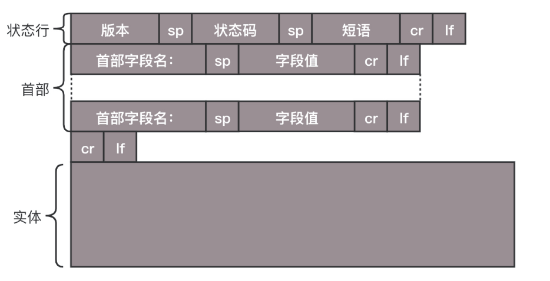
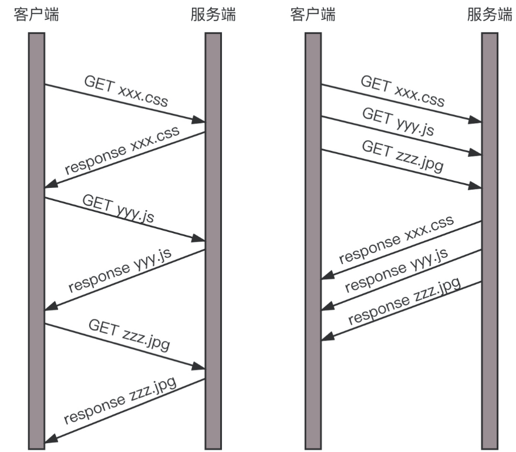
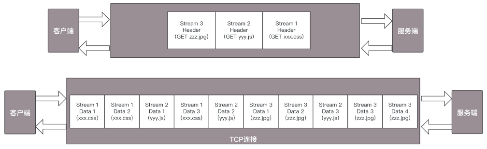
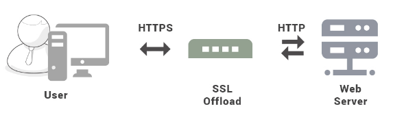
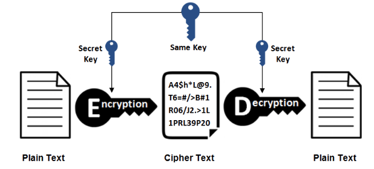
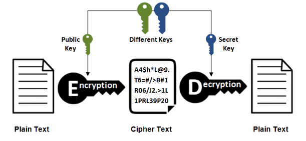

#### HTTP协议

##### URL

HTTP 使用 URL（ **U** niform **R**esource **L**ocator，统一资源定位符）来定位资源，它是 URI（**U**niform **R**esource **I**dentifier，统一资源标识符）的子集，URL 在 URI 的基础上增加了定位能力。 

首先我们请求的 http://www.baidu.com 是个URL，叫做同一资源定位符。之所以叫同一，是因为它是由格式的。

浏览器会将 http://www.baidu.com 这个域名发送给DNS服务器，让它解析为IP地址。这里会将域名解析为IP地址。HTTP请求是基于TCP协议的，要先建立TCP连接，先进行三次握手。

目前使用的HTTP协议大部分都1.1。在1.1的协议里面，默认是开启**Keep-Alive**的，这样建立的TCP连接，就可以在多次请求中**复用**。

> 浏览器访问服务端之后, 一个http请求的底层是tcp连接, tcp连接要经过三次握手之后,开始传输数据, 而且因为http设置了keep-alive,所以单次http请求完成之后这条tcp连接并不会断开, 而是可以让下一次http请求直接使用.当然keep-alive肯定也有timeout, 超时关闭. 

##### HTTP请求的构建

请求的格式如下：

1. **请求行**

   URL就是请求http://www.baidu.com，版本为HTTP 1.1。

   方法有：GET、POST、PUT、DELETE。 

   POST 往往是用来创建一个资源的，而 PUT 往往是用来修改一个资源的。 

2. **首部字段**

  首部是 key value，通过冒号分隔。这里面，往往保存了一些非常重要的字段。

  如：**Accept-Charset**，表示客户端可以接受的**字符集**。防止传过来的是另外的字符集，从而导致出现乱码。

  **Content-Type** 是指**正文的格式**。例如，我们进行 POST 的请求，如果正文是 JSON，那么我们就应该将这个值设置为 JSON。
  
  **Cache-control** 是用来控制缓存的。
  
3. **实体**

##### HTTP请求的发送

- HTTP 协议是基于 TCP 协议的，所以它使用面向连接的方式发送请求，通过 stream 二进制流的方式传给对方。

- 到了 TCP 层，它会把二进制流变成一个个报文段发送给服务器。在发送给每个报文段的时候，都需要对方有一个回应 ACK，来保证报文可靠地到达了对方。如果没有回应，那么 TCP 这一层会进行重新传输，直到可以到达。

  TCP 层发送每一个报文的时候，都需要加上自己的地址（即**源地址**）和它想要去的地方（即**目标地址**），将这两个信息放到 IP 头里面，交给 IP 层进行传输。

- IP 层需要查看目标地址和自己是否是在同一个局域网。

  如果是，就发送 ARP 协议来请求这个目标地址对应的 MAC 地址，然后将源 MAC 和目标 MAC 放入 MAC 头，发送出去即可；

  如果不在同一个局域网，就需要发送到网关，还要需要发送 ARP 协议，来获取网关的 MAC 地址，然后将源 MAC 和网关 MAC 放入 MAC 头，发送出去。这样路由器一跳一跳终于到达目标的局域网。这个时候，最后一跳的路由器能够发现，目标地址就在自己的某一个出口的局域网上。于是，在这个局域网上发送 ARP，获得这个目标地址的 MAC 地址，将包发出去。

- 目标的机器发现 MAC 地址符合，就将包收起来；

  发现 IP 地址符合，根据 IP 头中协议项，知道自己上一层是 TCP 协议，于是解析 TCP 的头，里面有序列号，需要看一看这个序列包是不是我要的，如果是就放入缓存中然后返回一个 ACK，如果不是就丢弃。
  
  TCP 头里面还有端口号，HTTP 的服务器正在监听这个端口号。于是，目标机器自然知道是 HTTP 服务器这个进程想要这个包，于是将包发给 HTTP 服务器。HTTP 服务器的进程看到，原来这个请求是要访问一个网页，于是就把这个网页发给客户端。
  

##### HTTP返回的构建

HTTP 的返回报文也是有一定格式的。这也是基于 HTTP 1.1 的。

**状态码**会反映 HTTP 请求的结果。“200”意味着大吉大利；而我们最不想见的，就是“404”，也就是“服务端无法响应这个请求”。然后，**短语会大概说一下原因**。

| 状态码 |               类别               |            含义            | 常见状态码                                                   |
| :----: | :------------------------------: | :------------------------: | ------------------------------------------------------------ |
|  1XX   |  Informational（信息性状态码）   |     接收的请求正在处理     |                                                              |
|  2XX   |      Success（成功状态码）       |      请求正常处理完毕      | 200 OK；                                                     |
|  3XX   |   Redirection（重定向状态码）    | 需要进行附加操作以完成请求 | 301 永久重定向；302暂时重定向；304客户端有缓存；             |
|  4XX   | Client Error（客户端错误状态码） |     服务器无法处理请求     | 400 Bad Request；401 Unauthorized；403 Forbidden；404 Not Found； |
|  5XX   | Server Error（服务器错误状态码） |     服务器处理请求出错     | 500服务器内部错误；501服务不可用                             |

##### Session

Session 可以存储在服务器上的文件、数据库或者内存中。也可以将 Session 存储在 Redis 这种内存型数据库中，效率会更高。 

使用 Session 维护用户登录状态的过程如下： 

- 用户进行登录时，用户提交包含用户名和密码的表单，放入 HTTP 请求报文中；
- 服务器验证该用户名和密码，如果正确则把用户信息存储到 Redis 中，它在 Redis 中的 Key 称为 Session ID；
- 服务器返回的响应报文的 Set-Cookie 首部字段包含了这个 Session ID，客户端收到响应报文之后将该 Cookie 值存入浏览器中；
- 客户端之后对同一个服务器进行请求时会包含该 Cookie 值，服务器收到之后提取出 Session ID，从 Redis 中取出用户信息，继续之前的业务操作。

应该注意 Session ID 的安全性问题，不能让它被恶意攻击者轻易获取，那么就不能产生一个容易被猜到的 Session ID 值。此外，还需要经常重新生成 Session ID。在对安全性要求极高的场景下，例如转账等操作，除了使用 Session 管理用户状态之外，还需要对用户进行重新验证，比如重新输入密码，或者使用短信验证码等方式 。

##### HTTP 2.0

HTTP 协议也在不断的进化过程中，在 HTTP1.1 基础上便有了 HTTP 2.0。

HTTP 1.1 在应用层以**纯文本**的形式进行通信。每次通信都要带完整的 HTTP 的头，而且不考虑 pipeline 模式的话，每次的过程总是像上面描述的那样一去一回。这样在实时性、并发性上都存在问题。

- HTTP 2.0 会对 HTTP 的头进行一定的压缩，将原来每次都要携带的大量 key  value 在两端建立一个索引表，对相同的头只发送索引表中的索引。
- HTTP 2.0 协议将一个 TCP 的连接中，切分成多个流，每个流都有自己的 ID，而且流可以是客户端发往服务端，也可以是服务端发往客户端。它其实只是一个虚拟的通道。流是有优先级的。
- HTTP 2.0 还将所有的传输信息分割为更小的消息和帧，并对它们采用二进制格式编码。常见的帧有 Header 帧，用于传输 Header 内容，并且会开启一个新的流。再就是 Data 帧，用来传输正文实体。多个 Data 帧属于同一个流。

通过这两种机制，HTTP 2.0 的客户端可以将多个请求分到不同的流中，然后将请求内容拆成帧，进行二进制传输。这些帧可以打散乱序发送， 然后根据每个帧首部的流标识符重新组装，并且可以根据优先级，决定优先处理哪个流的数据。 

例子：

假设我们的一个页面要发送三个独立的请求，一个获取 css，一个获取 js，一个获取图片 jpg。如果使用 HTTP 1.1 就是串行的，但是如果使用 HTTP 2.0，就可以在一个连接里，客户端和服务端都可以同时发送多个请求或回应，而且不用按照顺序一对一对应。

HTTP 2.0 其实是将三个请求变成三个流，将数据分成帧，乱序发送到一个 TCP 连接中。

HTTP 2.0 成功解决了 HTTP 1.1 的**队首阻塞**问题，同时，也不需要通过 HTTP 1.x 的 pipeline 机制用多条 TCP 连接来实现并行请求与响应；减少了 TCP 连接数对服务器性能的影响，同时将页面的多个数据 css、js、 jpg 等通过一个数据链接进行传输，能够加快页面组件的传输速度。

#### HTTPS

HTTP 有以下安全性问题：

- 使用明文进行通信，内容可能会被窃听；
- 不验证通信方的身份，通信方的身份有可能遭遇伪装；
- 无法证明报文的完整性，报文有可能遭篡改。

HTTPS 并不是新协议，而是让 **HTTP 先和 SSL（Secure Sockets Layer）**通信，再由 SSL 和 TCP 通信，也就是说 HTTPS 使用了隧道进行通信。 

通过使用 SSL，HTTPS 具有了加密（防窃听）、认证（防伪装）和完整性保护（防篡改）。 

1. **加密**

   - 对称密钥加密

     对称密钥加密（Symmetric-Key Encryption），**加密和解密使用同一密钥**。 

     - 优点：运算速度快；
     - 缺点：无法安全地将密钥传输给通信方。

     

   - 非对称密钥加密

     又称公开密钥加密（Public-Key Encryption），**加密和解密使用不同的密钥**。 

     公开密钥所有人都可以获得，通信发送方获得接收方的公开密钥之后，就可以使用公开密钥进行加密，接收方收到通信内容后使用私有密钥解密。 

     非对称密钥除了用来加密，还可以用来进行签名。因为私有密钥无法被其他人获取，因此通信发送方使用其私有密钥进行签名，通信接收方使用发送方的公开密钥对签名进行解密，就能判断这个签名是否正确。 

     - 优点：可以更安全地将公开密钥传输给通信发送方；
     - 缺点：运算速度慢。

     

   - HTTPS采用的加密方式

     对称密钥加密方式的传输效率更高，但是无法安全地将密钥 Secret Key 传输给通信方。

     而非对称密钥加密方式可以保证传输的安全性，因此我们可以利用非对称密钥加密方式将 Secret Key 传输给通信方。

     HTTPS 采用**混合的加密机制**，正是利用了上面提到的方案： 

     - **使用非对称密钥加密方式，传输对称密钥加密方式所需要的 Secret Key，从而保证安全性**;
     - **获取到 Secret Key 后，再使用对称密钥加密方式进行通信，从而保证效率。（下图中的 Session Key 就是 Secret Key）**

2. **认证**

   

3. **完整性保护**

