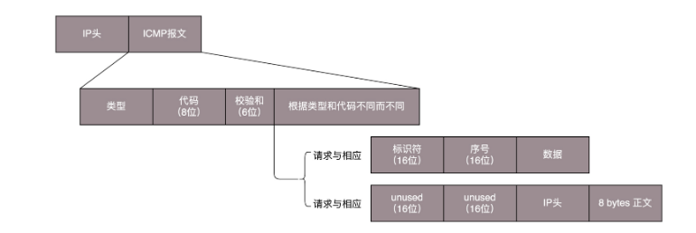

#### ICMP协议

**ping** 是基于 ICMP 协议工作的。**ICMP** 全称 **Internet Control Message Protocol**，就是**互联网控制报文协议**。 

**ICMP 报文是封装在 IP 包里面的**。因为传输指令的时候，肯定需要**源地址**和**目标地址**。 

**ICMP** 报文有很多的**类型**，不同的类型有不同的代码。**最常用的类型是主动请求为 8，主动请求的应答为 0**。 

1. **查询报文类型** 

   常用的 **ping** 就是**查询报文**，是一种**主动请求**，并且**获得主动应答的 ICMP 协议**。所以，ping 发的包也是符合 ICMP 协议格式的，只不过它在后面增加了自己的格式。 

   对 ping 的主动请求，进行网络抓包，称为 **ICMP ECHO REQUEST**。同理主动请求的回复，称为**ICMP ECHO REPLY**。比起原生的 ICMP，这里面多了两个字段，一个是**标识符**。另一个是**序号**。在**选项数据**中，ping 还会存放发送请求的时间值，来计算往返时间，说明路程的长短。 

2. **差错报文类型** 

   ICMP 差错报文的例子：**终点不可达为 3，源抑制为 4，超时为 11，重定向为 5**。 

   差错报文的结构相对复杂一些。**除了前面还是 IP，ICMP 的前 8 字节不变，后面则跟上出错的那个 IP 包的 IP 头和 IP 正文的前 8 个字节**。 

#####  ping：查询报文类型的使用 

ping 的发送和接收过程：

假定主机 A 的 IP 地址是 192.168.1.1，主机 B 的 IP 地址是 192.168.1.2，它们都在同一个子网。 

1. ping 命令执行的时候，源主机首先会构建一个 ICMP 请求数据包，ICMP 数据包内包含多个字段。最重要的是两个，第一个是**类型字段**，对于请求数据包而言该字段为 8；另外一个是**顺序号**，主要用于区分连续 ping 的时候发出的多个数据包。每发出一个请求数据包，顺序号会自动加 1。为了能够计算往返时间 RTT，它会在**报文的数据部分插入发送时间**。 
2. 然后，由 ICMP 协议将这个数据包连同地址 192.168.1.2 一起交给 IP 层。**IP 层将以 192.168.1.2 作为目的地址，本机 IP 地址作为源地址**，加上一些其他控制信息，构建一个 IP 数据包。 
3. 接下来，需要加入 **MAC** 头。如果在本节 ARP 映射表中查找出 IP 地址 192.168.1.2 所对应的 MAC 地址，则可以直接使用；如果没有，则需要发送 **ARP 协议**查询 MAC 地址，获得 MAC 地址后，由数据链路层构建一个数据帧，目的地址是 IP 层传过来的 MAC 地址，源地址则是本机的 MAC 地址；还要附加上一些控制信息，依据以太网的介质访问规则，将它们传送出去。 
4. 主机 B 收到这个数据帧后，**先检查它的目的 MAC 地址，并和本机的 MAC 地址对比**，如符合，则接收，否则就丢弃。接收后检查该数据帧，将 IP 数据包从帧中提取出来，交给本机的 IP 层。同样，IP 层检查后，将有用的信息提取后交给 ICMP 协议。 
5. 主机 B 会构建一个 ICMP 应答包，应答数据包的**类型字段为 0**，**顺序号为接收到的请求数据包中的顺序号**，然后再发送出去给主机 A。 
6. 在规定的时候间内，源主机如果**没有接到 ICMP 的应答包**，则说明**目标主机不可达**；如果接收到了 ICMP 应答包，则说明目标主机可达。此时，源主机会检查，用**当前时刻减去该数据包最初从源主机上发出的时刻，就是 ICMP 数据包的时间延迟**。 

当然这只是最简单的，同一个局域网里面的情况。如果**跨网段**的话，还会涉及**网关的转发**、**路由器的转发**等等。但是对于 ICMP 的头来讲，是没什么影响的。会影响的是根据目标 IP 地址，选择路由的下一跳，还有每经过一个路由器到达一个新的局域网，需要换 MAC 头里面的 MAC 地址。

#####  Traceroute：差错报文类型的使用 

- Traceroute 的第一个作用就是故意设置特殊的 TTL，来追踪去往目的地时沿途经过的路由器。 
- Traceroute 还有一个作用是故意设置不分片，从而确定路径的 MTU。 