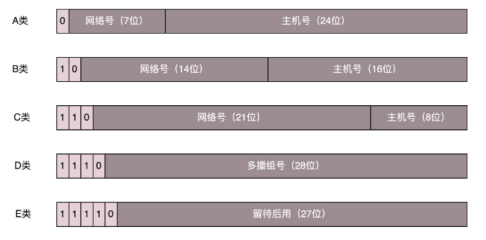
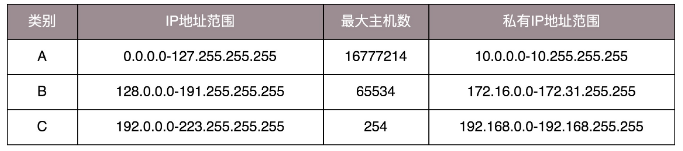
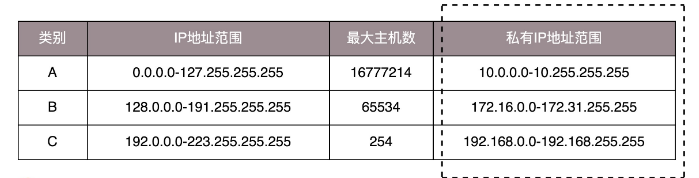

#### IP地址

Linux通过**ip addr**来查看所有的网卡：

```shell
root@test:~# ip addr
1: lo: <LOOPBACK,UP,LOWER_UP> mtu 65536 qdisc noqueue state UNKNOWN group default 
    link/loopback 00:00:00:00:00:00 brd 00:00:00:00:00:00
    inet 127.0.0.1/8 scope host lo
       valid_lft forever preferred_lft forever
    inet6 ::1/128 scope host 
       valid_lft forever preferred_lft forever
2: eth0: <BROADCAST,MULTICAST,UP,LOWER_UP> mtu 1500 qdisc pfifo_fast state UP group default qlen 1000
    link/ether fa:16:3e:c7:79:75 brd ff:ff:ff:ff:ff:ff
    inet 10.100.122.2/24 brd 10.100.122.255 scope global eth0
       valid_lft forever preferred_lft forever
    inet6 fe80::f816:3eff:fec7:7975/64 scope link 
       valid_lft forever preferred_lft forever
```

IP 地址是一个网卡在网络世界的通讯地址，相当于我们现实世界的门牌号码。 

本来32位的IP地址分为了5类：



在网络地址中，至少在当时设计的时候，对于 A、B、 C 类主要分两部分，前面一部分是**网络号**，后面一部分是**主机号**。

下面这个表格，详细地展示了 A、B、C 三类地址所能包含的主机的数量。



##### 无类型域间选路(CIDR)

无类型域间选路，简称 CIDR。这种方式打破了原来设计的几类地址的做法，将 32 位的 IP 地址一分为二，前面是**网络号**，后面是**主机号**。 

**10.100.122.2/24**，这个IP地址有一个斜杠，斜杠后面有个数字24。这种地址形式，就是CIDR。后面24的意思是，32位中，前24位是**网络号**，后8位是**主机号**。

伴随着CIDR存在的：

- 一个是**广播地址**，**10.01.122.255**。如果发送这个地址，说有**10.100.122**网络里面的机器都可以收到。
- 另外一个是**子网掩码**，**255.255.255.0**。

将**子网掩码**（255.255.255.0）和**IP地址**（10.100.122.2）进行**AND**计算，就可以得到**网络号**（10.100.122.0）。

##### 公有IP地址和私有IP地址



##### 举例：一个容易"犯错"的CIDR

我们来看 **16.158.165.91/22** 这个 CIDR。求一下这个网络的**第一个地址**、**子网掩码**和**广播地址**。 

将IP地址转换为=> **16.158.10100101.00000001**

- 第一个IP地址为：**16.158.<101001>00.00000001**=>**16.158.164.1**

- 子网掩码为：**255.255.<111111>00.00000000**=>**255.255.252.0**

- 广播地址为：**16.158.<101001>11.11111111**=>**16.158.167.255**

- 网络号为：IP地址 AND 子网掩码 => 16.158.165.91 AND 255.255.252.0 => 16.158.164.0

lo 全称是 loopback，又称环回接口，往往会被分配到 127.0.0.1 这个地址。这个地址用于本机通信，经过内核处理后直接返回，不会在任何网络中出现。 

#### MAC地址

在 IP 地址的上一行是：
```shell
link/ether fa:16:3e:c7:79:75 brd ff:ff:ff:ff:ff:ff
```
这个被称为 MAC 地址，是一个网卡的物理地址，用十六进制，6 个 byte 表示。 

MAC 地址号称**全局唯一**，不会有两个网卡有相同的 MAC 地址，而且网卡自生产出来，就带着这个地址。 

**一个网络包要从一个地方传到另一个地方，除了要有确定的地址，还需要有定位功能。**

MAC 地址的通信范围比较小，局限在一个子网里面。  

例如，从 192.168.0.2/24 访问 192.168.0.3/24 是可以用 MAC 地址的。一旦跨子网，即从 192.168.0.2/24 到 192.168.1.2/24，MAC 地址就不行了，需要 IP 地址起作用了。 

#### 网络设备的状态标识

<BROADCAST,MULTICAST,UP,LOWER_UP>叫做**net_device flags,网络设备的状态标识**。

- UP 表示网卡处于启动的状态；
- BROADCAST 表示这个网卡有广播地址，可以发送广播包；
- MULTICAST 表示网卡可以发送多播包；
- LOWER_UP 表示 L1 是启动的，也即网线插着呢。 
- MTU1500 是指最大传输单元 MTU 为 1500，这是以太网的默认值。MTU 是二层 MAC 层的概念。MAC 层有 MAC 的头，以太网规定连 MAC 头带正文合起来，不允许超过 1500 个字节。正文里面有 IP 的头、TCP 的头、HTTP 的头。 