#### TCP和UDP有哪些区别？

**TCP 是面向连接的，UDP 是面向无连接的**。

在互通之前，面向连接的协议会先建立连接。TCP会三次握手，而UDP不会。**所谓的建立连接，是为了在客户端和服务端维护连接，而建立一定的数据结构来维护双方交互的状态，用这样的数据结构来保证所谓的面向连接的特性**。

**TCP** 

- **提供可靠交付**。通过 TCP 连接传输的数据，**无差错、不丢失、不重复、并且按序到达**。
- TCP 是**面向字节流**的。发送的时候发的是一个流，没头没尾。
- TCP 是可以有**拥塞控制**的。它意识到包丢弃了或者网络的环境不好了，就会根据情况调整自己的行为，看看是不是发快了，要不要发慢点。
- TCP 其实是一个**有状态服务**，通俗地讲就是有脑子的，里面精确地记着发送了没有，接收到没有，发送到哪个了，应该接收哪个了，错一点儿都不行。

**UDP** 

- 继承了 IP 包的特性，**不保证不丢失，不保证按顺序到达**。 
- UDP 继承了 IP 的特性，**基于数据报**的，一个一个地发，一个一个地收。
- UDP 就不会有拥塞控制，应用让我发，我就发，管它洪水滔天。
- UDP 则是**无状态服务**。通俗地说是没脑子的，天真无邪的，发出去就发出去了。

我们可以这样比喻，如果 **MAC 层定义了本地局域网的传输行为**，**IP 层定义了整个网络端到端的传输行为**，这两层基本定义了这样的基因：**网络传输是以包为单位的**，**二层叫帧（frame）**，**网络层叫包（packet）**，**传输层叫段（segment）**。我们笼统地称为包。**包单独传输，自行选路，在不同的设备封装解封装，不保证到达**。基于这个基因，生下来的孩子  **UDP**完全继承了这些特性，几乎没有自己的思想。

#### UDP

1. 当我发送的 UDP 包到达目标机器后，发现 **MAC 地址匹配**，于是就取下来，将剩下的包传给处理 **IP 层**的代码。
2. 在 IP 头里面有个 **8 位协议**，这里会存放，数据里面到底是 TCP 还是 UDP，当然这里是 UDP。于是，如果我们知道 UDP 头的格式，就能从数据里面，将它解析出来。
3.  处理完传输层的事情，内核的事情基本就干完了，里面的数据应该交给应用程序自己去处理 ， 无论应用程序写的使用 TCP 传数据，还是 UDP 传数据，都要**监听一个端口**。正是这个端口，用来区分应用程序 。

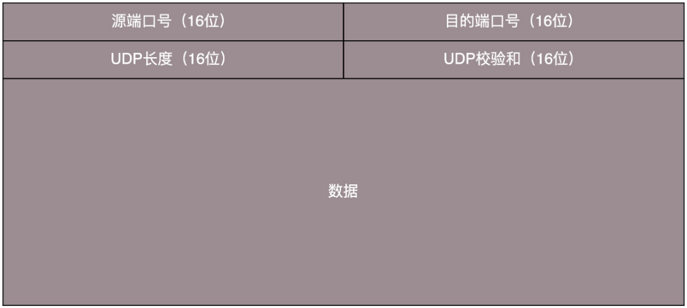

UDP的特点：

- 无连接；
- 尽最大努力交付；
- 面向报文；
- 无拥塞控制；
- 支持一对一、一对多、多对一和多对多的交互通信；
- 首部开销小（只有四个字段：源端口、目的端口、长度、检验和）。 

UDP的使用场景：

1. **需要资源少，在网络情况比较好的内网，或者对于丢包不敏感的应用**。DHCP 就是基于 UDP 协议的。 
2. **不需要一对一沟通，建立连接，而是可以广播的应用**。 UDP 的不面向连接的功能，可以使得可以承载广播或者多播的协议。DHCP 就是一种广播的形式，就是基于 UDP 协议的。
3. **需要处理速度快，时延低，可以容忍少数丢包，但是要求即便网络拥塞，也毫不退缩，一往无前的时候**。

如果你实现的应用需要有自己的连接策略，可靠保证，时延要求，使用 UDP，然后再**应用层实现**这些是再好不过了。

1. QUIC（全称 Quick UDP Internet Connections，快速 UDP 互联网连接）是 Google 提出的一种基于 UDP 改进的通信协议，其目的是降低网络通信的延迟，提供更好的用户互动体验。QUIC 在应用层上，会自己实现快速连接建立、减少重传时延，自适应拥塞控制，是应用层“城会玩”的代表。
2. 直播协议多使用 RTMP，而这个 RTMP 协议也是基于 TCP 的。当网络不好的时候，TCP 协议会主动降低发送速度，这对本来当时就卡的看视频来讲是要命的，应该应用层马上重传，而不是主动让步。因而，很多直播应用，都基于 UDP 实现了自己的视频传输协议。
3. 游戏对实时要求较为严格的情况下，采用自定义的可靠 UDP 协议，自定义重传策略，能够把丢包产生的延迟降到最低，尽量减少网络问题对游戏性造成的影响。 
4. 物联网对实时性要求也很高，而 TCP 还是因为上面的那些原因导致时延大。Google 旗下的 Nest 建立 Thread Group，推出了物联网通信协议 Thread，就是基于 UDP 协议的。
5. 在 4G 网络里，移动流量上网的数据面对的协议 GTP-U 是基于 UDP 的。因为移动网络协议比较复杂，而 GTP 协议本身就包含复杂的手机上线下线的通信协议。

#### TCP

##### TCP 头的格式：

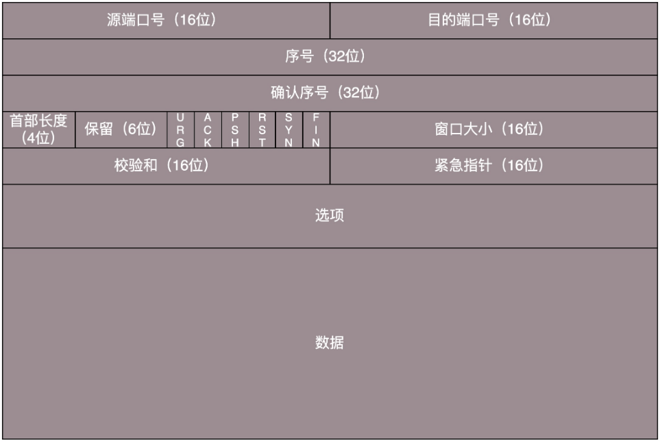

1. 首先，**源端口号**和**目标端口号**是不可少的，这一点和 UDP 是一样的。如果没有这两个端口号。数据就不知道应该发给哪个应用。
2. 接下来是包的**序号**。编号是为了解决乱序问题，确认哪个应该先来，哪个应该后到呢。
3. **确认序号**，发出去的包应该有确认，如果没有收到就应该重新发送，直到送达。这个可以解决不丢包的问题。
4. **状态位**。例如 **SYN 是发起一个连接**，**ACK 是回复**，**RST 是重新连接**，**FIN 是结束连接**等。**TCP 是面向连接的，因而双方要维护连接的状态，这些带状态位的包的发送，会引起双方的状态变更**。
5. **窗口大小**。TCP 要做流量控制，通信双方各声明一个窗口，标识自己当前能够的处理能力，别发送的太快，撑死我，也别发的太慢，饿死我。除了做流量控制以外，TCP 还会做拥塞控制。

##### TCP的三次握手

三次握手确认两件事： 1. **各自确认对方的存在** 2. **约定初始的数据包的序列号** 

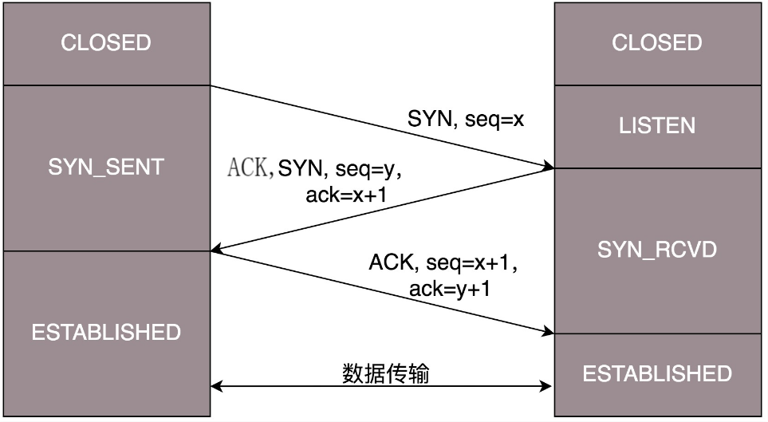

1. 第一次握手：Client将SYN置为1，随机产生一个初始序列号seq发送给Server，进入SYN_SENT状态；
2. 第二次握手：Server收到Client的SYN=1之后，知道Client请求建立连接，将自己的SYN置为1、ACK置为1，产生一个acknowledge number=sequence number+1，并产生一个自己的初始化序列号，发送给客户端，进入SYN_RCVD状态；
3. 第三次握手：Client检查ack是否为序列号+1，ACK为1。检查正确之后将自己的ACK置为1，产生一个acknowledge number=Server发的序列号+1，并将Client的序列号+1，发送给Server；进入ESTABLISHED状态；Server检查ACK为1和acknowledge number为序列号+1之后，也进入ESTABLISHED状态；完成三次握手，连接建立。

> - **TCP建立连接可以两次握手吗？**
>
>   不可以：
>
>   1. 可能会出现**已失效的Client连接请求报文段又传到了服务器端**。 
>   2.  两次握手**无法保证Client正确接收第二次握手的报文（Server无法确认Client是否收到），也无法保证Client和Server之间成功互换初始序列号**。 
>
> - **第三次握手中，客户端的ACK未发送到服务器，会怎样？**
>
>   - Server端：
>
>     由于**Server没有收到ACK确认**，因此会**重发之前的SYN+ACK**（**默认重发5次，之后会自动关闭**），如果Client收到后会重新传ACK给Server，则连接建立。
>
>   - Client端，两种情况：
>
>     1. 在Server进行超时重发的过程中，如果Client向Server发送数据，数据头部的ACK是为1的，则Server收到数据后会读取ACK number，进入establish状态。
>     2. 如果**Server进入了CLOSED状态之后，如果Client向服务器发送数据，服务器会以RST包应答**。

##### TCP的四次挥手

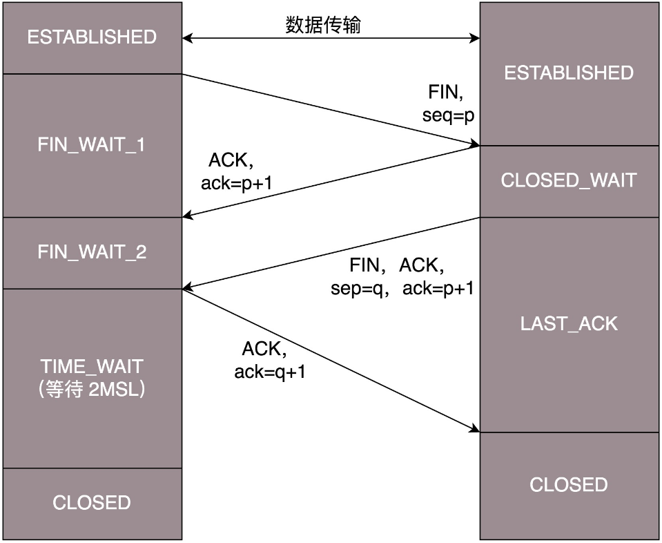

- 第一次挥手：Client将FIN置为1，发送一个序列号seq给Server；进入FIN_WAIT_1状态；
- 第二次挥手：Server收到FIN之后，发送一个ACK=1，acknowledge number=收到的序列号+1；进入CLOSE_WAIT状态。此时客户端已经没有要发送的数据了，但仍可以接受服务器发来的数据。
- 第三次挥手：Server将FIN置1，发送一个序列号给Client；进入LAST_ACK状态；
- 第四次挥手：Client收到服务器的FIN后，进入TIME_WAIT状态；接着将ACK置1，发送一个acknowledge number=序列号+1给服务器；服务器收到后，确认acknowledge number后，变为CLOSED状态，不再向客户端发送数据。客户端等待2*MSL（报文段最长寿命）时间后，也进入CLOSED状态。完成四次挥手。

> 如果TIME_WAIT阶段客户端的ACK报文一直丢失没有发送成功，服务端没有收到ACK怎么确认要关闭连接呢（已经过了2个MSL） ?
>
> 第四次挥手时，客户端发送给服务器的ACK有可能丢失，TIME_WAIT状态就是用来重发可能丢失的ACK报文。如果Server没有收到ACK，就会重发FIN，如果Client在2*MSL的时间内收到了FIN，就会重新发送ACK并再次等待2MSL，防止Server没有收到ACK而不断重发FIN。
>
> MSL(Maximum Segment Lifetime)，指一个片段在网络中最大的存活时间，2MSL就是一个发送和一个回复所需的最大时间，超过这个时间报文将被丢弃。如果直到2MSL，Client都没有再次收到FIN，那么Client推断ACK已经被成功接收，则结束TCP连接。

##### 窗口

为了保证**顺序性**，每一个包都有一个 ID。在建立连接的时候，会商定起始的 ID 是什么，然后按照 ID 一个个发送。为了保证不丢包，对于发送的包都要进行应答，但是这个应答也不是一个一个来的，而是**会应答某个之前的 ID**，表示都收到了，这种模式称为**累计确认**或者**累计应答**（cumulative acknowledgment）。 

为了记录所有发送的包和接收的包，TCP 也需要发送端和接收端分别都有缓存来保存这些记录。

- 发送端

  发送端的缓存里是按照包的 ID 一个个排列，根据处理的情况分成四个部分：

  1. 发送了并且已经确认的。
  2. 发送了并且尚未确认的。
  3. 没有发送，但是已经等待发送的。
  4. 没有发送，并且暂时还不会发送的。

  在 TCP 里，接收端会给发送端报一个窗口的大小，叫 **Advertised window**。这个窗口的大小应该等于上面的**第二部分加上第三部分**，就是已经交代了没做完的加上马上要交代的。超过这个窗口的，接收端做不过来，就不能发送了。

  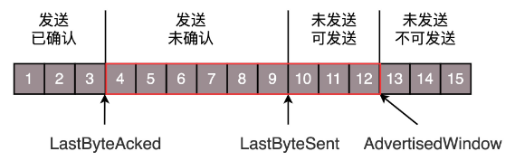

  - LastByteAcked：第一部分和第二部分的分界线
  - LastByteSent：第二部分和第三部分的分界线
  - LastByteAcked + AdvertisedWindow：第三部分和第四部分的分界线

- 接收端

  1. 接受并且确认过的。
  2. 还没接收，但是马上就能接收的。
  3. 第三部分：还没接收，也没法接收的。也即超过工作量的部分，实在做不完。

  对应的数据结构如下：

  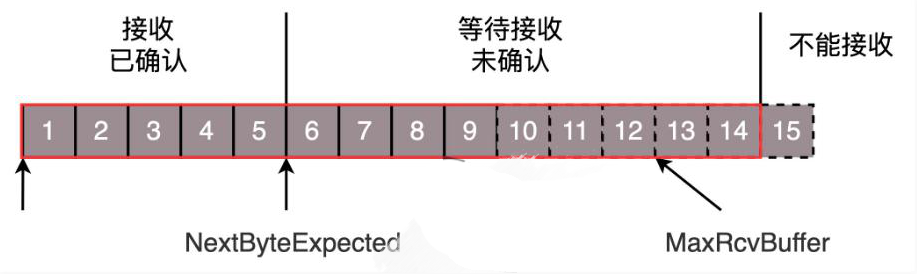

  - MaxRcvBuffer：最大缓存的量；
  - LastByteRead 之后是已经接收了，但是还没被应用层读取的；
  - NextByteExpected 是第一部分和第二部分的分界线。

  第二部分的窗口大小：

  NextByteExpected 和 LastByteRead 的差其实是还**没被应用层读取的部分**占用掉的 MaxRcvBuffer 的量，我们定义为 A。AdvertisedWindow 其实是 MaxRcvBuffer 减去 A。

  **AdvertisedWindow=MaxRcvBuffer-((NextByteExpected-1)-LastByteRead)。**

  那第二部分和第三部分的分界线在哪里：

  NextByteExpected 加 AdvertisedWindow 就是第二部分和第三部分的分界线，其实也就是 LastByteRead 加上 MaxRcvBuffer。

  第二部分里面，由于受到的包可能不是顺序的，会出现空档，只有和第一部分连续的，可以马上进行回复，中间空着的部分需要等待，哪怕后面的已经来了。 

##### 顺序问题与丢包问题

- 在发送端来看，

  1、2、3 已经发送并确认；

  4、5、6、7、8、9 都是发送了还没确认；

  10、11、12 是还没发出的；

  13、14、15 是接收方没有空间，不准备发的。

- 在接收端来看，

  1、2、3、4、5 是已经完成 ACK，但是没读取的；

  6、7 是等待接收的；

  8、9 是已经接收，但是没有 ACK 的。

- 发送端和接收端当前的状态如下：

  1、2、3 没有问题，双方达成了一致。

  4、5 接收方说 ACK 了，但是发送方还没收到，有可能丢了，有可能在路上。

  6、7、8、9 肯定都发了，但是 8、9 已经到了，但是 6、7 没到，出现了乱序，缓存着但是没办法 ACK。

> 1.  假设 4 的确认到了，不幸的是，5 的 ACK 丢了，6、7 的数据包丢了，这该怎么办呢？ 
>
>    - 一种方法就是**超时重试**，也即**对每一个发送了，但是没有 ACK 的包，都有设一个定时器，超过了一定的时间，就重新尝试**。但是这个超时的时间如何评估呢？这个时间不宜过短，**时间必须大于往返时间 RTT**，否则会引起不必要的重传。也不宜过长，这样超时时间变长，访问就变慢了。
>
>      TCP 的策略是超时间隔加倍。每当遇到一次超时重传的时候，都会将下一次超时时间间隔设为先前值的两倍。两次超时，就说明网络环境差，不宜频繁反复发送。
>
>    - **快速重传**的机制，当接收方收到一个序号大于下一个所期望的报文段时，就会检测到数据流中的一个间隔，于是它就会发送冗余的 ACK，仍然 ACK 的是期望接收的报文段。而**当客户端收到三个冗余的 ACK 后，就会在定时器过期之前，重传丢失的报文段（然后执行拥塞控制的快恢复算法）**。

> **流量控制**是照顾**通信对象**
> **拥塞控制**是照顾**通信环境** 

##### 流量控制

**在对于包的确认中，同时会携带一个窗口的大小。**

- 发送端

  我们先假设窗口不变的情况，窗口始终为 9。4 的确认来的时候，会右移一个，这个时候第 13 个包也可以发送了。

  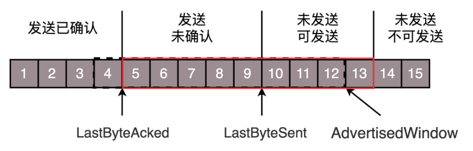

  这个时候，假设发送端发送过猛，会将第三部分的 10、11、12、13 全部发送完毕，之后就停止发送了，未发送可发送部分为 0。

  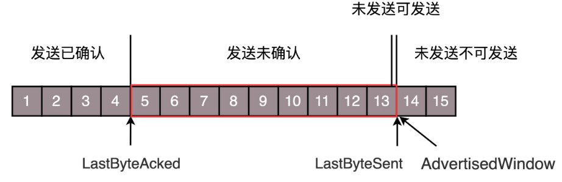

  当对于包 5 的确认到达的时候，在客户端相当于窗口再滑动了一格，这个时候，才可以有更多的包可以发送了，例如第 14 个包才可以发送。

  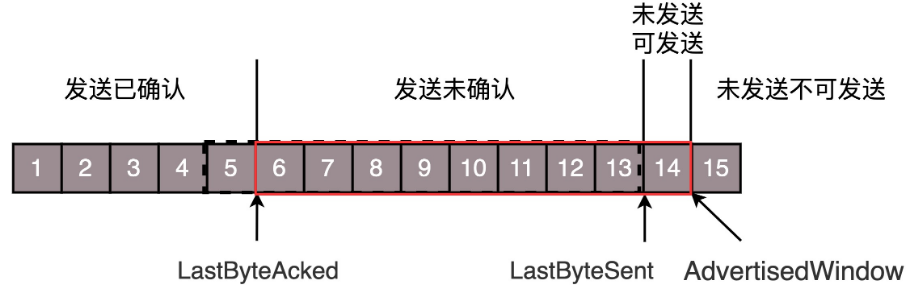

  如果接收方实在处理的太慢，导致缓存中没有空间了，可以通过确认信息修改窗口的大小，甚至可以设置为 0，则发送方将暂时停止发送。

- 接收端

  假设一个极端情况，接收端的应用一直不读取缓存中的数据，当数据包 6 确认后，窗口大小就不能再是 9 了，就要缩小一个变为 8。

  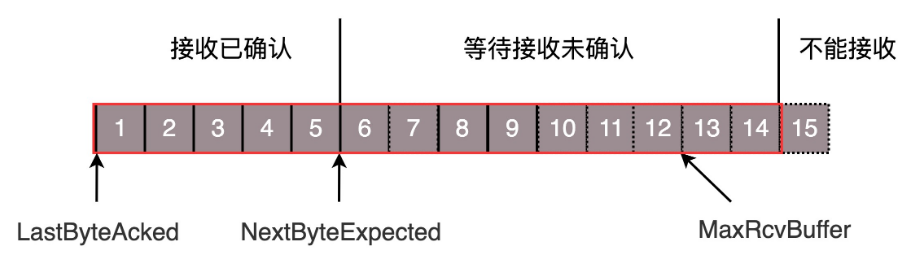

  这个新的窗口 8 通过 6 的确认消息到达发送端的时候，你会发现窗口没有平行右移，而是仅仅左面的边右移了，窗口的大小从 9 改成了 8。

  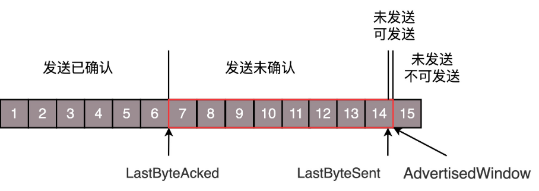

  如果接收端还是一直不处理数据，则随着确认的包越来越多，窗口越来越小，直到为 0。

  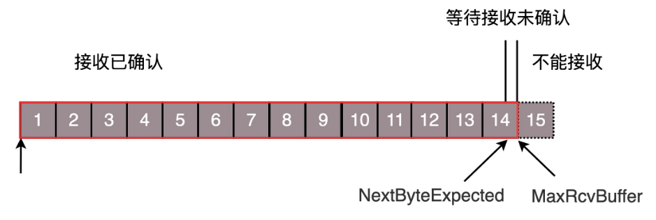

  当这个窗口通过包 14 的确认到达发送端的时候，发送端的窗口也调整为 0，停止发送。

  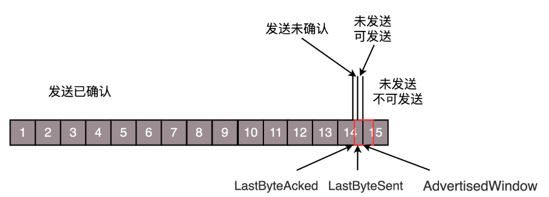

  这样的话，发送方会定时发送窗口探测数据包，看是否有机会调整窗口的大小。当接收方比较慢的时候，要防止低能窗口综合征，别空出一个字节来就赶快告诉发送方，然后马上又填满了，可以当窗口太小的时候，不更新窗口，直到达到一定大小，或者缓冲区一半为空，才更新窗口。

  > 接收窗口为0时会怎样？
  >
  > 如果接收方没有能力接收数据，就会将接收窗口设置为0，这时发送方必须暂停发送数据，但是会启动一个持续计时器(persistence timer)，到期后发送一个大小为1字节的探测数据包，以查看接收窗口状态。如果接收方能够接收数据，就会在返回的报文中更新接收窗口大小，恢复数据传送。 

##### 拥塞控制

拥塞控制的问题，也是通过窗口的大小来控制的，前面的**滑动窗口 rwnd( receiver window，接收方滑动窗口 ) 是怕发送方把接收方缓存塞满**，而**拥塞窗口 cwnd( congestion window. 拥塞窗口 )，是怕把网络塞满**。

有一个公式 **LastByteSent - LastByteAcked <= min {cwnd, rwnd} ，是拥塞窗口和滑动窗口共同控制发送的速度**。

如果我们设置发送窗口，使得发送但未确认的包为为通道的容量，就能够撑满整个管道。

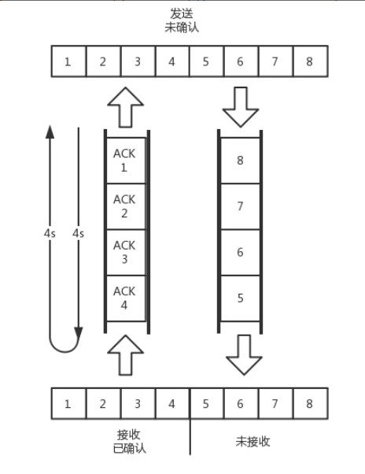

TCP 的拥塞控制主要来避免两种现象，**包丢失**和**超时重传**。一旦出现了这些现象就说明，发送速度太快了，要慢一点。

 拥塞控制主要由四个算法组成：**慢启动（Slow Start）、拥塞避免（Congestion voidance）、快重传 （Fast Retransmit）、快恢复（Fast Recovery）** 

1. 慢启动（Slow Start）

   **刚开始发送数据时，先把拥塞窗口（congestion window）设置为一个最大报文段MSS的数值，每收到一个新的确认报文之后，就把拥塞窗口加1个MSS**。这样每经过一个传输轮次（或者说是每经过一个往返时间RTT），**拥塞窗口的大小就翻一倍**。

   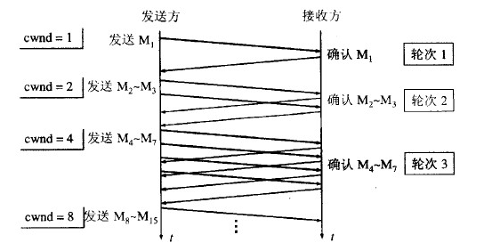

2. 拥塞避免（Congestion voidance）

   **当拥塞窗口的大小达到满开始门限（slow start threshold）时，开始执行拥塞避免算法，拥塞窗口大小不再指数增加，而是线性增加，即每经过一个传输轮次子增加1MSS**。

   > 无论在慢开始阶段还是在拥塞避免阶段，只要发送方判断网络出现拥塞（其根据就是没有收到确认），就要把慢开始门限ssthresh设置为出现拥塞时发送方窗口至的一半（但不能小于2）。然后把拥塞窗口cwnd重新设置为1，执行慢开始算法。（这是不使用快重传的情况）

   

3. 快重传 （Fast Retransmit）

   快重传要求接收方在收到一个失序的报文段后立即发出重复确认（为的是使发送方及早知道有报文段没有到达对方）而不要等到自己发送数据时捎带确认。快重传算法规定，**发送方只要一连收到三个重复确认就应当立即重传对方尚未收到的报文段**，而不必继续等待设置的重传计时器时间到期。

   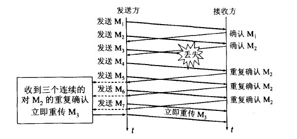

4. 快恢复（Fast Recovery）

   **当发送方连续收到三个重复确认时，就把慢开始门限减半，然后执行拥塞避免算法**。不执行慢开始算法的原因是：应为如果网络出现拥塞的话就不会收到好几个重复的确认，所以发送方认为网络可能没有出现拥塞。

   也有的快重传是把开始时的拥塞窗口cwnd值再增大一点，即等于 ssthresh + 3*MSS 。这样做的理由是：既然发送方收到三个重复的确认，就表明有三个分组已经离开了网络。这三个分组不再消耗网络的资源而是停留在接收方的缓存中。可见现在网络中减少了三个分组。因此可以适当把拥塞窗口扩大些。 

> TCP与UDP的区别：
>
> 1. TCP是面向连接的，UDP是无连接的（UDP发送数据之前是不需要建立连接的）；
> 2. TCP是可靠的，UDP不可靠（UDP接收方收到报文后，不需要给出任何确认）；
> 3. TCP只支持点对点通信，UDP支持一对一、一对多、多对一、多对多；
> 4. TCP是面向字节流的，UDP是面向报文的（面向字节流是指发送数据时十一字节为单位，一个数据包可以拆分成若干组进行发送，而UDP一个报文只能一次发完）；
> 5. TCP有拥塞控制机制，UDP没有。网络出现拥塞不会时源主机的发送频率降低，这对某些实时应用很重要，比如媒体通信、游戏等；
> 6. TCP首部开销（20字节）比UDP首部开销（8字节）要大；
> 7. UDP的主机不需要为此复杂的连接状态表。