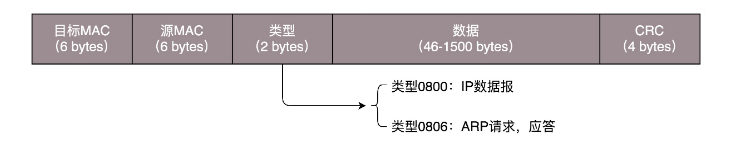
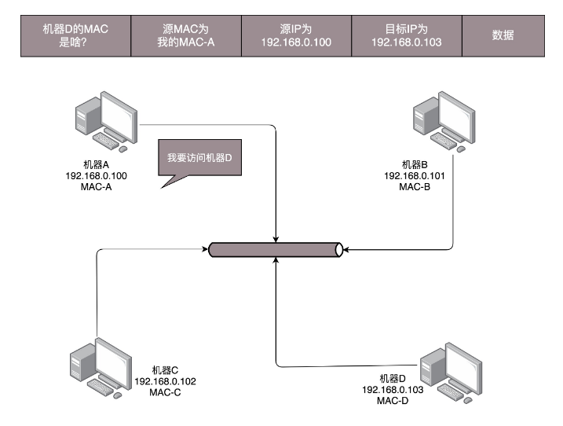
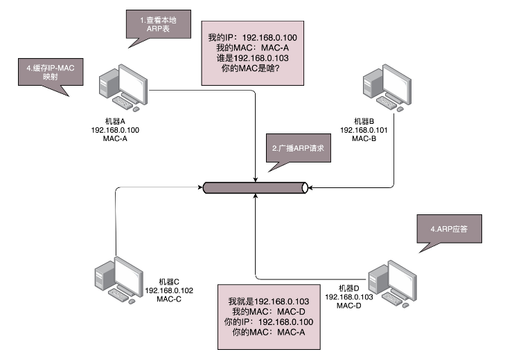
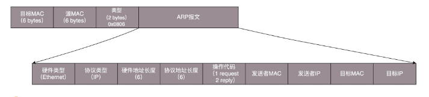

#### 第一层（物理层）

有一个叫做 Hub 的东西，也就是**集线器**。这种设备有多个口，可以将宿舍里的多台电脑连接起来。但是，和**交换机**不同，集线器没有大脑，它完全在物理层工作。它会将自己收到的每一个字节，都复制到其他端口上去。这是第一层物理层联通的方案。

#### 第二层（数据链路层）

Hub 采取的是广播的模式，如果每一台电脑发出的包，宿舍的每个电脑都能收到，那就麻烦了。这就需要解决几个问题： 

1.  这个包是发给谁的？谁应该接收？ 
2.  大家都在发，会不会产生混乱？有没有谁先发、谁后发的规则？ 
3.  如果发送的时候出现了错误，怎么办？ 

这几个问题，都是第二层，数据链路层，也即 MAC 层要解决的问题 。

**MAC** 的全称是 **Medium Access Control**，即媒体访问控制。

- 控制什么呢？其实就是控制在往媒体上发数据的时候，**谁先发、谁后发**的问题。防止发生混乱。这解决的是第二个问题。这个问题中的规则，学名叫多路访问。

  有很多算法可以解决这个问题。其中，不管三七二十一，有事儿先出门，发现特堵，就回去。错过高峰再出。我们叫作随机接入协议。著名的以太网，用的就是这个方式。 

- 接下来要解决第一个问题：**发给谁，谁接收**？这里用到一个物理地址，叫作链路层地址。但是因为第二层主要解决媒体接入控制的问题，所以它常被称为MAC 地址。 解决第一个问题就牵扯到第二层的网络包格式。对于以太网，第二层的最开始，就是**目标的 MAC 地址和源的 MAC 地址**。

  

  接下来是**类型**，大部分的类型是IP数据包。

  有了这个**目标 MAC 地址**，数据包在链路上广播，MAC 的网卡才能发现，这个包是给它的。MAC 的网卡把包收进来，然后打开 IP 包，发现 IP 地址也是自己的，再打开 TCP 包，发现端口是自己，也就是 80，而 nginx 就是监听 80。于是将请求提交给 nginx，nginx 返回一个网页。然后将网页需要发回请求的机器。然后层层封装，最后到 MAC 层。因为来的时候有源 MAC 地址，返回的时候，**源 MAC 就变成了目标 MAC**，再返给请求的机器。

- 第二层的最后面是 CRC，也就是循环冗余检测。通过 XOR 异或的算法，来计算整个包是否在发送的过程中出现了错误，主要解决第三个问题。

当源机器知道目标机器的时候，可以将目标地址放入包里面，如果不知道呢？一个广播的网络里面接入了 N 台机器，我怎么知道每个 MAC 地址是谁呢？这就是 **ARP 协议**，也就是**已知 IP 地址，求 MAC 地址的协议**。 

在一个局域网里面，当知道了 IP 地址，不知道 MAC 怎么办呢？靠“吼”。**ARP请求是通过广播的方式来实现的**。 

广而告之，发送一个广播包，谁是这个 IP 谁来回答。具体询问和回答的报文就像下面这样： 

为了避免每次都用 ARP 请求，机器本地也会进行 **ARP 缓存**。当然机器会不断地上线下线，IP 也可能会变，所以 ARP 的 MAC 地址缓存过一段时间就会过期。 