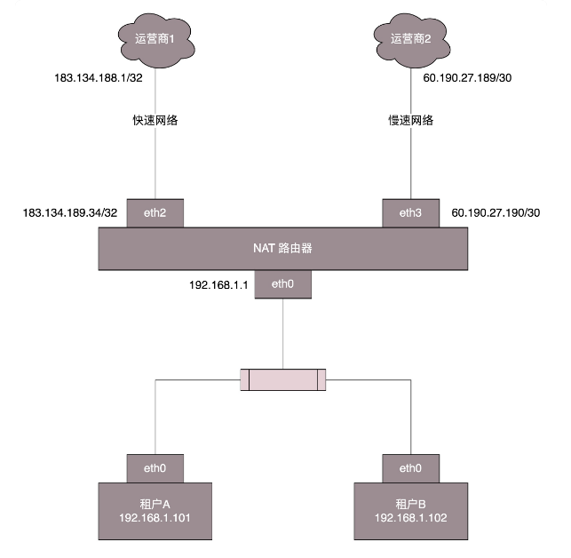
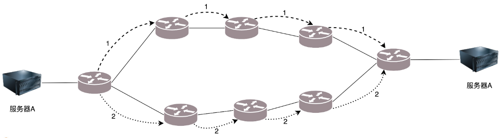
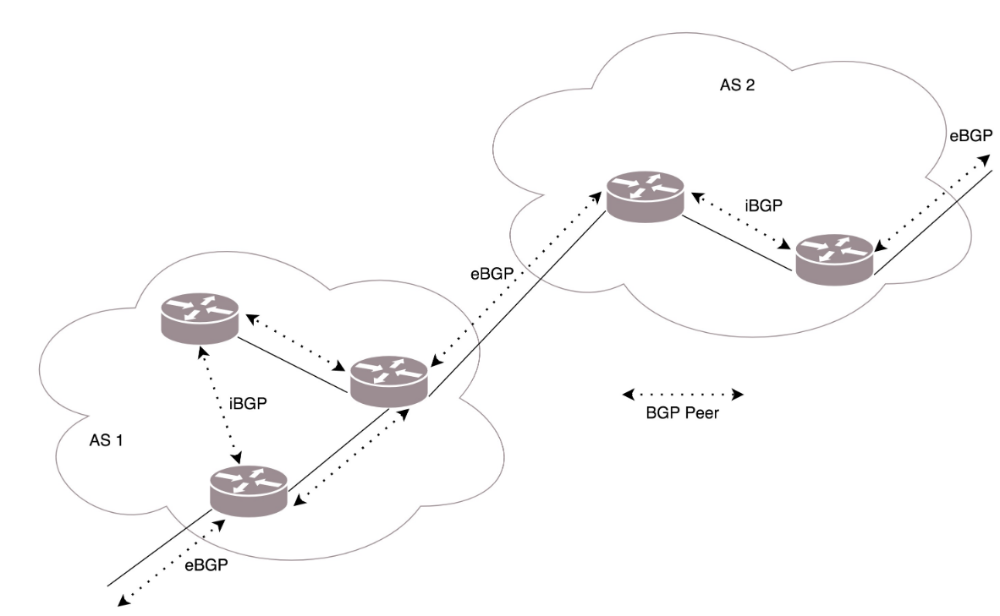

#### 如何配置路由

路由器就是一台网络设备，它有多张网卡。当一个入口的网络包送到路由器时，它会根据一个本地的转发信息库，来决定如何正确地转发流量。这个转发信息库通常被称为**路由表**。 

一张路由表中会有多条路由规则。每一条规则至少包含这三项信息：

- 目的网络：这个包想去哪儿？ 
- 出口设备：将包从哪个口扔出去？ 
- 下一跳网关：下一个路由器的IP地址。 

通过 route 命令和 ip route 命令都可以进行查询或者配置：

```shell
ip route add 10.176.48.0/20 via 10.173.32.1 dev eth0
1.表示要去 10.176.48.0/20 这个目标网络
2.要从 eth0 端口出去
3.经过 10.173.32.1
```

网关上的路由策略就是按照这三项配置信息进行配置的。这种配置方式的一个核心思想是：**根据目的 IP 地址来配置路由**。

#####  如何配置策略路由？ 

在真实的复杂的网络环境中，除了可以根据目的 ip 地址配置路由外，还可以根据多个参数来配置路由，这就称为**策略路由**。 

- 可以配置多个路由表，可以**根据源 IP 地址、入口设备、TOS 等选择路由表**，然后在路由表中查找路由。这样可以使得来自不同来源的包走不同的路由。 例如：

  ```shell
  //表示从 192.168.1.10/24 这个网段来的，使用 table 10 中的路由表
  ip rule add from 192.168.1.0/24 table 10 
  //从 192.168.2.0/24 网段来的，使用 table20 的路由表
  ip rule add from 192.168.2.0/24 table 20
  ```

- 在一条路由规则中，也可以走多条路径。例如，在下面的路由规则中： 

  ```shell
  //下一跳有两个地方，分别是 100.100.100.1 和 200.200.200.1，权重分别为 1 比 2。
  ip route add default scope global nexthop via 100.100.100.1 weight 1 nexthop via 200.200.200.1 weight 2
  ```

  在什么情况下会用到如此复杂的配置呢？我来举一个现实中的例子。 

  我是房东，家里从运营商那儿拉了**两根网线**。这两根网线分别属于**两个运行商。一个带宽大一些，一个带宽小一些**。这个时候，我就不能买普通的家用路由器了，得买个高级点的，可以接两个外网的。

  家里的网络呢，就是普通的家用网段 **192.168.1.x/24**。家里有两个租户，分别把线连到路由器上。IP 地址为 **192.168.1.101/24** 和 **192.168.1.102/24**，网关都是 **192.168.1.1/24**，网关在路由器上。 

  家里的网段是私有网段，**出去的包需要 NAT 成公网的 IP 地址**，因而路由器是一个 NAT 路由器。两个运营商都要为这个网关配置一个公网的 IP 地址。

  

  运行商里面也有一个 IP 地址，在运营商网络里面的网关。不同的运营商方法不一样，有的是 /32 的，也即一个一对一连接。 

  例如，运营商 1 给路由器分配的地址是 183.134.189.34/32，而运营商网络里面的网关是 183.134.188.1/32。有的是 /30 的，也就是分了一个特别小的网段。运营商 2 给路由器分配的地址是 60.190.27.190/30，运营商网络里面的网关是 60.190.27.189/30。

  根据这个网络拓扑图，可以将路由配置成这样：

  ```shell
  $ ip route list table main 
  //如果去运营商二，就走 eth3；
  60.190.27.189/30 dev eth3  proto kernel  scope link  src 60.190.27.190
  //如果去运营商一呢，就走 eth2；
  183.134.188.1 dev eth2  proto kernel  scope link  src 183.134.189.34
  //如果访问内网，就走 eth1；
  192.168.1.0/24 dev eth1  proto kernel  scope link  src 192.168.1.1
  127.0.0.0/8 dev lo  scope link
  //如果所有的规则都匹配不上，默认走运营商一，也即走快的网络。
  default via 183.134.188.1 dev eth2
  ```

  但是问题来了，租户 A 不想多付钱，他说我就上上网页，从不看电影，凭什么收我同样贵的网费啊？没关系，咱有技术可以解决。

  ```shell
  //添加一个 Table，名字叫 chao。 
  # echo 200 chao >> /etc/iproute2/rt_tables
  //添加一条规则：从 192.168.1.101 来的包都查看个 chao 这个新的路由表。
  # ip rule add from 192.168.1.101 table chao
  # ip rule ls
  0:  from all lookup local 
  32765:  from 10.0.0.10 lookup chao
  32766:  from all lookup main 
  32767:  from all lookup default
  //在 chao 路由表中添加规则：
  # ip route add default via 60.190.27.189 dev eth3 table chao
  # ip route flush cache
  ```

   默认的路由走慢的，谁让你不付钱。 

上面说的都是**静态的路由**，一般来说网络环境简单的时候，在自己的可控范围之内，自己捣鼓还是可以的。但是有时候网络环境复杂并且多变，如果总是用静态路由，一旦网络结构发生变化，让网络管理员手工修改路由太复杂了，因而需要**动态路由算法**。 


#### 动态路由算法

使用**动态路由路由器**，可以**根据路由协议算法生成动态路由表**，随网络运行状况的变化而变化。 

#####  1. 距离矢量路由算法 

距离矢量路由（**distance vector routing**）。

这种算法的基本思路是，**每个路由器都保存一个路由表，包含多行，每行对应网络中的一个路由器，每一行包含两部分信息，一个是要到目标路由器，从那条线出去，另一个是到目标路由器的距离**。 

缺点：

1.  好消息传得快，坏消息传得慢；
2.  每次发送的时候，要发送整个全局路由表。

##### 2. 链路状态路由算法 

链路状态路由（**link state routing**），基于 Dijkstra 算法。 

这种算法的基本思路是：当**一个路由器启动的时候，首先是发现邻居，向邻居 say hello，邻居都回复。然后计算和邻居的距离，发送一个 echo，要求马上返回，除以二就是距离。然后将自己和邻居之间的链路状态包广播出去，发送到整个网络的每个路由器。这样每个路由器都能够收到它和邻居之间的关系的信息。因而，每个路由器都能在自己本地构建一个完整的图，然后针对这个图使用 Dijkstra 算法，找到两点之间的最短路径**。 


####  动态路由协议 

#####  1. 基于链路状态路由算法的 OSPF 

**OSPF（Open Shortest Path First，开放式最短路径优先）**就是这样一个基于链路状态路由协议，广泛应用在数据中心中的协议。由于主要用在**数据中心**内部，用于路由决策，因而称为**内部网关协议（Interior Gateway Protocol，简称 IGP）**。 

内部网关协议的重点就是找到**最短的路径**。在一个组织内部，路径最短往往最优。当然有时候 OSPF 可以发现**多个最短的路径**，可以在这多个路径中进行**负载均衡**，这常常被称为**等价路由**。 



这一点非常重要。有了等价路由，到一个地方去可以有相同的两个路线，可以**分摊流量**，还可以当一条路不通的时候，走另外一条路。这个在后面我们讲**数据中心**的网络的时候，一般应用的接入层会有负载均衡 LVS。它可以和 OSPF 一起，实现高吞吐量的接入层设计。 

##### 2. 基于距离矢量路由算法的 BGP 

外网的路由协议，也即国家之间的，又有所不同。我们称为**外网路由协议（Border Gateway Protocol，简称 BGP）**。 

在网络世界，这一个个国家成为**自治系统 AS（Autonomous System）**。自治系统分几种类型。 

- Stub AS：对外只有一个连接。这类 AS 不会传输其他 AS 的包。例如，个人或者小公司的网络。 
- Multihomed AS：可能有多个连接连到其他的 AS，但是大多拒绝帮其他的 AS 传输包。例如一些大公司的网络。
- Transit AS：有多个连接连到其他的 AS，并且可以帮助其他的 AS 传输包。例如主干网。 



BGP 又分为两类，**eBGP** 和 **iBGP**。

- 自治系统间，边界路由器之间使用 eBGP 广播路由。

- 内部网络也需要访问其他的自治系统。边界路由器如何将 BGP 学习到的路由导入到内部网络呢？就是通过运行 iBGP，使得内部的路由器能够找到到达外网目的地的最好的边界路由器。 

BGP 协议使用的算法是**路径矢量路由协议（path-vector protocol）**。它是距离矢量路由协议的升级版。 

前面说了距离矢量路由协议的缺点。其中一个是**收敛慢**。在 BGP 里面，除了下一跳 hop 之外，还包括了自治系统 AS 的路径，从而可以避免坏消息传得慢的问题，也即上面所描述的，B 知道 C 原来能够到达 A，是因为通过自己，一旦自己都到达不了 A 了，就不用假设 C 还能到达 A 了。 

#### 小结

- 路由分静态路由和动态路由，**静态路由可以配置复杂的策略路由，控制转发策略** ；
- 动态路由主流算法有两种，**距离矢量算法**和**链路状态算法**。基于两种算法产生两种协议，**BGP 协议**和 **OSPF 协议**。 