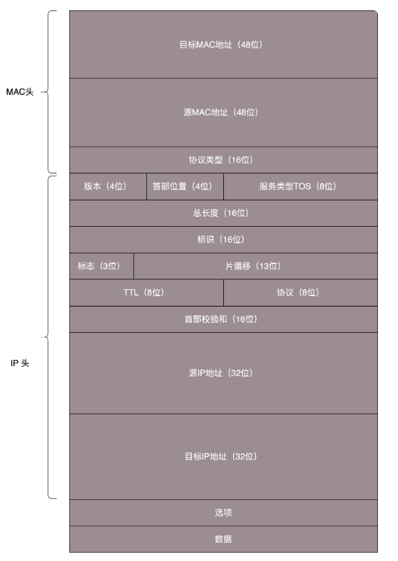
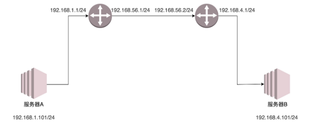
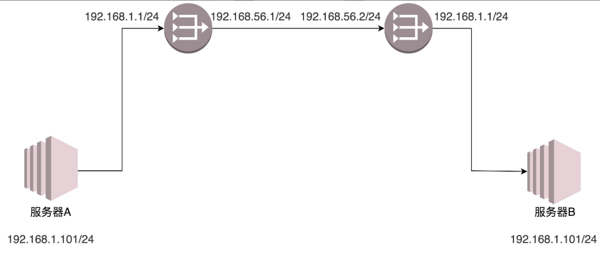

##### MAC头和IP头的细节

- 在 MAC 头里面，先是**目标 MAC 地址**，然后是**源 MAC 地址**，然后有一个**协议类型，用来说明里面是 IP 协议**。 
- IP 头里面的版本号，目前主流的还是 IPv4，服务类型 TOS 在讲 ip addr 命令的时候讲过，TTL 在 ICMP 协议的时候讲过。另外，还有 8 位标识**协议**，也就是，**是 TCP 还是 UDP**。最重要的就是**源 IP 和目标 IP**。先是源 IP 地址，然后是目标 IP 地址。

在任何一台机器上，当要访问另一个 IP 地址的时候，都会先判断，这个目标 IP 地址，和当前机器的 IP 地址，是否在同一个网段。怎么判断同一个网段呢？需要 **CIDR** 和**子网掩码**。（ 将IP与子网掩码按位与，可获得网络号。 CIDR确定网络号长度，如192.168.0.1/24，24表示网络号是24位，意味着子网掩码应该为255.255.255.0 即前三个字节全1，最后字节全0。与IP做与操作，就可以去掉主机号，得到网络号。）

- **如果是同一个网段**，例如，你访问你旁边的兄弟的电脑，那就没网关什么事情，直接将源地址和目标地址放入 IP 头中，然后通过 ARP 获得 MAC 地址，将源 MAC 和目的 MAC 放入 MAC 头中，发出去就可以了。 

- **如果不是同一网段**，这就需要发往默认网关 Gateway。Gateway 的地址一定是和源 IP 地址是一个网段的。往往不是第一个，就是第二个。例如 192.168.1.0/24 这个网段，Gateway 往往会是 192.168.1.1/24 或者 192.168.1.2/24。

  将源地址和目标 IP 地址放入 IP 头中，通过 **ARP 获得网关的 MAC 地址**，将源 MAC 和网关的 MAC 放入 MAC 头中，发送出去。网关所在的端口，例如 192.168.1.1/24 将网络包收进来，然后接下来怎么做，就完全看网关的了。 

**网关往往是一个路由器，是一个三层转发的设备**。

路由器是一台设备，它有五个网口或者网卡，相当于有五只手，分别连着五个局域网。每只手的 IP 地址都和局域网的 IP 地址相同的网段，每只手都是它握住的那个局域网的网关。 

任何一个想发往其他局域网的包，都会到达其中一只手，被拿进来，拿下 MAC 头和 IP 头，看看，根据自己的路由算法，选择另一只手，加上 IP 头和 MAC 头，然后扔出去。 

这个时候，问题来了，该选择哪一只手？IP 头和 MAC 头加什么内容，哪些变、哪些不变呢？这个问题比较复杂，大致可以分为两类：一个是**静态路由**，一个是**动态路由** 。

##### 静态路由

**静态路由，其实就是在路由器上，配置一条一条规则**。

##### 动态路由

[动态路由协议](./动态路由协议.md)

#####  IP 头和 MAC 头哪些变、哪些不变？ 

**MAC 地址**是一个**局域网**内才**有效**的地址。因而，MAC 地址只要过网关，就必定会改变，因为已经换了局域网。两者主要的区别在于 IP 地址是否改变。**不改变 IP 地址的网关，我们称为转发网关；改变 IP 地址的网关，我们称为NAT 网关**。 

- **"欧洲十国游"型** 

  

  1. 服务器 A 要访问服务器 B。首先，服务器 A 会思考，**192.168.4.101** 和我不是一个网段的，因而需要先发给网关。那网关是谁呢？已经**静态配置**好了，网关是 **192.168.1.1**。网关的 MAC 地址是多少呢？**发送 ARP 获取网关的 MAC 地址**，然后发送包。包的内容是这样的： 

     - 源 MAC：服务器 A 的 MAC 
     - 目标 MAC：192.168.1.1 这个网口的 MAC 
     - 源 IP：192.168.1.101 
     - 目标 IP：192.168.4.101 

  2. 包到达 192.168.1.1 这个网口，发现 MAC 一致，将包收进来，开始思考往哪里转发。在**路由器 A 中配置了静态路由**之后，要想访问 **192.168.4.0/24**，要从 **192.168.56.1** 这个口出去，下一跳为 **192.168.56.2**。

     路由器 A 思考的时候，匹配上了这条路由，要从 192.168.56.1 这个口发出去，发给 192.168.56.2，那 192.168.56.2 的 MAC 地址是多少呢？路由器 A 发送 ARP 获取 192.168.56.2 的 MAC 地址，然后发送包。包的内容是这样的：

     - 源 MAC：192.168.56.1 的 MAC 地址 
     - 目标 MAC：192.168.56.2 的 MAC 地址 
     - 源 IP：192.168.1.101 
     - 目标 IP：192.168.4.101

  3. 包到达 192.168.56.2 这个网口，发现 MAC 一致，将包收进来，开始思考往哪里转发。 在**路由器 B 中配置了静态路由**，要想访问 **192.168.4.0/24**，要从 **192.168.4.1** 这个口出去，没有下一跳了。因为我右手这个网卡，就是这个网段的，我是最后一跳了。 

     - 源 MAC：192.168.4.1 的 MAC 地址 

     - 目标 MAC：192.168.4.101 的 MAC 地址 
     
     - 源 IP：192.168.1.101 
     
     - 目标 IP：192.168.4.101
     
  
  包到达服务器 B，MAC 地址匹配，将包收进来。 
  
  通过这个过程可以看出，**每到一个新的局域网，MAC 都是要变的，但是 IP 地址都不变**。在 IP 头里面，不会保存任何网关的 IP 地址。**所谓的下一跳是，某个 IP 要将这个 IP 地址转换为 MAC 放入 MAC 头**。 
  
- **玄奘西行**型 (**NAT**)

  

  问题是，局域网之间没有商量过，各定各的网段，因而 **IP 段冲突**了。最左面大唐的地址是 192.168.1.101，最右面印度的地址也是 192.168.1.101，如果单从 IP 地址上看，简直是自己访问自己，其实是大唐的 192.168.1.101 要访问印度的 192.168.1.101。

  1. 首先，目标服务器 B 在国际上要有一个国际的身份，我们给它一个 192.168.56.2。在网关 B 上，我们记下来，国际身份 192.168.56.2 对应国内身份 192.168.1.101。凡是要访问 192.168.56.2，都转成 192.168.1.101。

  2. 于是，源服务器 A 要访问目标服务器 B，要指定的目标地址为 192.168.56.2。这是它的国际身份。服务器 A 想，192.168.56.2 和我不是一个网段的，因而需要发给网关，网关是谁？已经静态配置好了，网关是 192.168.1.1，网关的 MAC 地址是多少？发送 ARP 获取网关的 MAC 地址，然后发送包。包的内容是这样的：

     - 源 MAC：服务器 A 的 MAC 
     - 目标 MAC：192.168.1.1 这个网口的 MAC 
     - 源 IP：192.168.1.101 
     - 目标 IP：192.168.56.2 

  3. 包到达 192.168.1.1 这个网口，发现 MAC 一致，将包收进来，开始思考往哪里转发。在**路由器 A 中配置了静态路由**：要想访问 **192.168.56.2/24**，要从 **192.168.56.1** 这个口出去，没有下一跳了，因为我右手这个网卡，就是这个网段的，我是最后一跳了。

     于是，路由器 A 思考的时候，匹配上了这条路由，要从 **192.168.56.1** 这个口发出去，发给 **192.168.56.2**。那 192.168.56.2 的 MAC 地址是多少呢？路由器 A 发送 **ARP** 获取 192.168.56.2 的 MAC 地址。

     **当网络包发送到中间的局域网的时候，服务器 A 也需要有个国际身份，因而在国际上，源 IP 地址也不能用 192.168.1.101，需要改成 192.168.56.1**。发送包的内容是这样的：

     - 源 MAC：192.168.56.1 的 MAC 地址 
     - 目标 MAC：192.168.56.2 的 MAC 地址 
     - 源 IP：**192.168.56.1** 
     - 目标 IP：**192.168.56.2** 

  4. 包到达 192.168.56.2 这个网口，发现 MAC 一致，将包收进来，开始思考往哪里转发。 

     **路由器 B 是一个 NAT 网关**，它上面配置了，要访问**国际身份 192.168.56.2** 对应**国内身份 192.168.1.101**，于是改为访问 192.168.1.101。

     > 普通的NAT是一台路由器对应一台服务器，如果需要支持 支持一个外网IP对应多个内网IP，则需要**NAPT**协议支持 。协议会维护一张映射表,结构如下: 
     >
     > 内网IP：PORT-->外网IP：空闲PORT 

     

  5. 在**路由器 B 中配置了静态路由**：要想访问 **192.168.1.0/24**，要从 **192.168.1.1** 这个口出去，没有下一跳了，因为我右手这个网卡，就是这个网段的，我是最后一跳了。 于是，路由器 B 思考的时候，匹配上了这条路由，要从 **192.168.1.1** 这个口发出去，发给 **192.168.1.101**。 

     那 192.168.1.101 的 MAC 地址是多少呢？路由器 B 发送 ARP 获取 192.168.1.101 的 MAC 地址，然后发送包。内容是这样的： 

     - 源 MAC：192.168.1.1 的 MAC 地址 
     - 目标 MAC：192.168.1.101 的 MAC 地址 
     - 源 IP：192.168.56.1 
     - 目标 IP：192.168.1.101 

  6. 包到达服务器 B，MAC 地址匹配，将包收进来。

  从服务器 B 接收的包可以看出，**源 IP 为服务器 A 的国际身份，因而发送返回包的时候，也发给这个国际身份，由路由器 A 做 NAT，转换为国内身份**。

  从这个过程可以看出，**IP 地址也会变**。这个过程用英文说就是 **Network Address Translation，简称 NAT**。 

  **第二种方式(NAT)我们经常见**，现在大家每家都有家用路由器，家里的网段都是 192.168.1.x，所以你肯定访问不了你邻居家的这个私网的 IP 地址的。所以，当我们家里的包发出去的时候，都被家用路由器 NAT 成为了运营商的地址了。家里的联通路由器的wan口ip就是**私网IP internet <=> 运营商路由器 <=> 你的路由器 <=> 你的电脑**。 

  > 对于基本 NAT （只进行 IP 地址的转写）来说，你可以说它是运行在第三层上的机制，但是由于基本 NAT 并没有缓解 IP 地址紧张的问题，一般来说我们使用的都是基于端口映射的 **NAPT**。由于 NAPT 同时对 IP 地址和传输层端口进行改写，这时候再说 NAT 路由器充当的是三层设备就不合适了。 对于 NAPT，我们应该区分传出（客户端）和传入（服务器）两种情况。对于传出 NAT 路由器的数据包，NAT 根据源 IP 地址和传输层端口号在尽可能保留源端口号的情况下将其转写为 NAT 可用 IP 地址池里的 IP 地址和可用的 NAT 端口，并用 Session（TCP）或者活跃计时器（UDP）的方法来记忆"**源IP地址+传输层端口号 <=> NAT IP 地址 + NAT 端口号**"的映射。这样，当相应的回复数据包返回 NAT 路由器时，我们可以根据记录信息将 IP 地址和端口号转写回去。 而对于位于 NAT 路由器后面的服务器，它需要通过监听端口来向互联网提供服务，由于服务器并不主动向 NAT 外部建立连接，NAT 也就无从根据传出包建立端口映射，那该怎么办呢？此时，**NAT 路由器需要书写好端口转发或者端口映射规则，从而将传入 NAT 路由器某一个端口的数据段转发给内部网络某一台主机**。 
